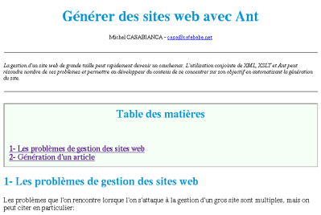
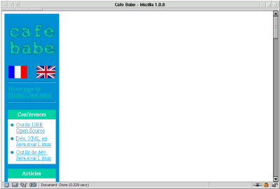
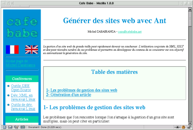
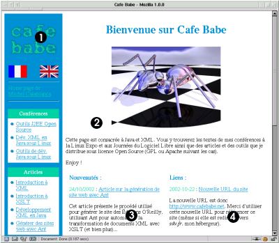
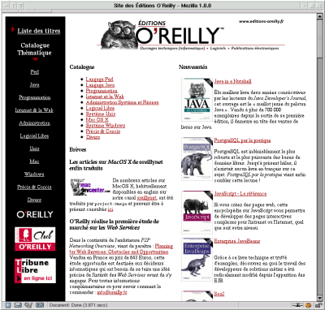

La gestion d'un site web de grande taille peut rapidement devenir un
cauchemar. L'utilisation conjointe de XML, XSLT et Ant peut résoudre
nombre de ces problèmes et permettre au développeur du contenu de se
concentrer sur son objectif en automatisant la génération du site.

<!--more-->

Les problèmes de gestion des sites web
--------------------------------------

Les problèmes que l'on rencontre lorsque l'on s'attaque à la gestion
d'un gros site sont multiples, mais on peut citer en particulier:

- La difficulté à écrire du HTML brut : on doit constamment mélanger
  l'écriture du contenu et sa mise en forme. Ce problème est inhérent
  à la conception même du HTML qui mélange les éléments de mise en
  forme (comme `strong`) et de fond (comme `h1`).
- La difficulté de maintenir une présentation cohérente dans
  l'ensemble du site. Si la présentation vient à changer, on doit
  mettre à jour l'ensemble des pages ce qui peut être un travail
  colossal.
- La difficulté de maintenir la cohérence des liens internes. Rien
  n'est plus exaspérant qu'un lien cassé dans un site.

Toutes ces considérations poussent le développeur de site à chercher une
solution qui permette d'optimiser l'écriture du contenu et d'automatiser
la gestion de la présentation et de la génération des menus et autres
liens internes.

Pour la séparation du fond de la forme, XML est adapté car il permet,
avec XSLT (feuilles de style pour XML), d'écrire un document en se
concentrant uniquement sur le fond et de laisser le soin à XSLT de
mettre en forme les pages HTML. D'autres formats de texte présentent les
mêmes fonctionnalités (comme LaTeX ou SGML), mais ces derniers ne sont
pas adaptés à la génération du HTML (les outils LaTeX génèrent
essentiellement des formats destinés à l'impression, comme DVI ou
PostScript et les outils de génération de HTML à partir du SGML sont
difficiles à mettre en oeuvre parce que trop complexes, reposant sur des
standards lourds et partiellement implémentés, comme DSSSL).

Quant à l'automatisation de la génération des pages, elle peut être
réalisée à l'aide de Ant. Ant est à la base un outil essentiellement
destiné à la génération de projets Java, mais il se trouve être adapté à
la manipulation de documents XML pour plusieurs raisons :

- Il est écrit en Java et donc multi-plateformes, tout comme XML.
- Nombre d'outils XML ont été écrits en Java (parsers, processeurs
  XSLT).
- C'est un langage de script, donc un script de génération de site est
  facilement modifiable et adaptable aux besoins.

Toutes ces raisons m'ont poussé à considérer et mettre en application
cette solution pour le moteur de génération du site des [Éditions
O'Reilly](http://www.oreilly.fr) et de mon site personnel. J'ai ainsi
été amené à développer une suite de tâches Ant dédiées à la manipulation
de fichiers XML (transformation XSLT utilisant le processeur XT de James
Clark, fusion et découpage de fichiers XML, etc). On trouvera ces outils
(sous licence Apache) [sur mon site](sat.html).

Cet article présente en détail l'implémentation de cette solution et
maîtriser XML, XSLT et Ant est nécessaire pour suivre. Pour aborder les
bases de XML, on pourra lire [mon article d'introduction à
XML](intro-xml.html), pour une introduction à XSLT, on trouvera
également sur mon site [un article d'introduction à
XSLT](intro-xslt.html). Enfin, les lecteurs peu familiers avec Ant
pourront consulter la première partie d'une [introduction à
Ant](http://otn.oracle.com/oramag/oracle/02-nov/o62odev_ant.html) que
j'ai écrit (en anglais) pour Oracle Magazine.

Génération d'un article
-----------------------

Le document de base de mon site personnel est l'article. Examinons
comment il est transformé en HTML et intégré dans les pages. Prenons par
exemple l'article que vous êtes en ce moment même en train de lire :

```xml
<?xml version="1.0" encoding="iso-8859-1"?>
<!DOCTYPE article PUBLIC "-//CAFEBABE//DTD article 1.0//EN"
                         "../dtd/article.dtd">

<article author="Michel CASABIANCA"
         email="casa@sweetohm.net"
         date="2002-10-23"
         id="ant-web"
         lang="fr">

 <title>Générer des sites web avec Ant</title>

 <abstract>
  <p>La gestion d'un site web de grande taille peut rapidement devenir
   un cauchemar. L'utilisation conjointe de XML, XSLT et Ant peut
   résoudre nombre de ces problèmes et permettre au développeur du
   contenu de se concentrer sur son objectif en automatisant la
   génération du site.</p>
 </abstract>

 <text>

  <sect><title>Les problèmes de gestion des sites web</title>

   <p>Les problèmes que l'on rencontre lorsque l'on s'attaque à la
    gestion d'un gros site sont multiples, mais on peut citer en
    particulier:</p>

   ...

  </sect>

 </text>

</article>
```

Pour transformer un tel document en page HTML, j'utilise la target
suivante dans le script Ant de génération :

```xml
<target name="html" depends="dir,valid"
        description="Transform XML files to HTML">
 <xtask dir="xml"
        todir="${root}/html"
        style="xsl/document.xsl">
  <arg name="draft"     value="${draft}"/>
  <arg name="numbering" value="${numbering}"/>
  <arg name="toc"       value="${toc}"/>
  <arg name="img-dir"   value="${img-dir}"/>
  <arg name="version"   value="${version}"/>
  <arg name="fragment"  value="no"/>
  <arg name="version"   value=""/>
 </xtask>
</target>
```

Cette target est constitueé d'une unique tâche, `xtask` qui opère une
transformation XSLT sur les fichiers du répertoire *xml* (qui contient
l'ensemble des documents du site) en utilisant la feuille de style
*document.xsl* du répertoire *xsl* (qui contient, comme on pourrait s'y
attendre, les feuilles de style pour les transformations XSLT). Le
répertoire de destination étant spécifié dans l'attribut `todir` qui
contient une référence à la propriété `root` qui pointe vers le
répertoire où est généré le site.

L'élément de cette tâche contient des paramètres passés à ma feuille de
style. Ce sont essentiellement des paramètres qui précisent le formatage
du document. Par exemple, le paramètre `img-dir` indique le répertoire
où se trouvent les images du site (ce chemin est ajouté devant le nom
des fichiers des figures).

Le paramètre intéressant est ici `fragment` qui indique si le fichier
HTML généré est une page (avec des tags `<HTML>` et `<BODY>` en début de
document) ou simplement un fragment. La valeur *yes* indique ici que
nous générons un fragment. En effet, la feuille de style ne génère que
le document proprement dit, sans le cadre qui l'entoure (qui est
constitué du menu et des tables dans lesquels il est inséré). On génère
donc le document suivant (qui est affiché par le navigateur qui est très
laxiste, puisqu'il accepte d'afficher une page sans les tags
d'ouverture) :



Reste maintenant à générer le menu. Pour ce faire, on pourrait bien sûr
le coder **en dur** dans la feuille de style qui génère la page. Mais
cette solution manque de souplesse puisqu'elle oblige à éditer un
fichier XSLT (donc contenant du HTML) pour y inclure une entrée dans le
menu à chaque fois que l'on ajoute un document au site. Il est
préférable de représenter le menu par un autre document XML. Par
exemple, le menu de mon site ressemble à :

```xml
<?xml version="1.0" encoding="iso-8859-1"?>
<!DOCTYPE menu PUBLIC "-//CAFEBABE//DTD menu 1.0//EN"
                      "../dtd/menu.dtd">

<menu>

 <submenu title="Conférences">
  <menu-item title="Outils J2EE Open Source" url="j2ee-os.html"/>
  <menu-item title="Dév. XML en Java sous Linux" url="java-xml.html"/>
  <menu-item title="Outils de dév. Java sous Linux" url="java-linux.html"/>
 </submenu>

 ...

</menu>
```

On génère le menu HTML en transformant ce fichier à l'aide d'une feuille
de style qui insère les images du haut et génère les tables HTML
contenant les rubriques et les liens vers les pages. Cette opération est
effectuée par une target Ant dédiée :

```xml
<target name="menu" depends="dir,valid"
        description="Build menus for pages">
 <xtask file="menu.xml"
        tofile="tmp/menu.html"
        style="xsl/menu.xsl">
  <arg name="root" value=".."/>
  <arg name="html" value="."/>
  <arg name="img"  value="../img"/>
  <arg name="lang" value="fr"/>
 </xtask>
</target>
```

On génère ainsi un fragment de document HTML qui constitue le menu des
pages du site :


Il nous faut maintenant un cadre où insérer le menu et le document. En
pratique, ce fichier est aussi généré, mais je vous épargnerai la target
correspondante qui utilise aussi la tâche `xtask`. Le fichier résultant
à l'allure suivante :

```xml
<html>
 <head>
  <title>Cafe Babe</title>
 </head>
 <body bgcolor="AAA" text="BBB" link="CCC" vlink="DDD">
  <table border="0" cellpadding="10" cellspacing="0" width="100%">
   <tr>
    <td width="150" bgcolor="EEE" align="left" valign="top">
     <?menu ?>
    </td>
    <td valign="top">
     <?page ?>
    </td>
   </tr>
  </table>
 </body>
</html>
```

C'est une page HTML classique (avec les tags d'ouverture adéquats) qui
comporte une table avec deux cellules. Ces cellules ont pour tout
contenu une processing instruction qui indique le fragment HTML à
insérer (`<?menu ?>` pour indiquer l'emplacement du menu et `<?page ?>`
qui indique l'emplacement de la page).

Pour générer le cadre complet (comportant le menu) à placer autour de
chaque page du site, il nous reste à insérer le menu dans le cadre.
C'est réalisé dans le script Ant à l'aide de la tâche ci-dessous :

```xml
<insert file="tmp/frame.html"
        pattern="menu"
        source="tmp/menu.html"/>
```

L'attribut `file` indique le fichier du cadre, `source` indique le
fragment HTML à insérer et `pattern` la processing instruction à
remplacer par le fragment. On obtient ainsi le cadre complet :



Pour obtenir la page finale, il reste à inclure chacune des pages
(fragments HTML) dans le cadre généré. On réalise l'opération avec la
target suivante :

```xml
<target name="pages" depends="split,frame,index"
        description="Build pages nesting them in the frame">
 <nest pattern="page"
       source="tmp/frame.html">
  <fileset dir="${root}/html" includes="*.html"/>
 </nest>
</target>
```

On obtient ainsi la page complète suivante :



Cette utilisation conjuguée de XML, XSLT et Ant permet ainsi de
construire les pages comme sur une chaîne de production automobile :
chaque pièce est construite séparément puis assemblée sur la chaîne de
production pour donner le produit fini.

Mais la puissance du procédé ne s'arrête pas là : en construisant ainsi
les page HTML il est possible d'agréger du contenu pour obtenir un
document composite, comme nous allons le voir maintenant pour la
construction de la page d'accueil du site.

Construction de la page d'accueil
---------------------------------

La page d'accueil du site est un document composite constitué des
parties suivantes :

1. Un menu (identique à celui construit précédemment).
2. Le haut de page (avec le mot de bienvenue du propriétaire des
   lieux).
3. Une colonne avec les nouveautés du site classées par ordre
   chronologique.
4. Une colonne de liens.



Pour que le site gagne en facilité de maintenance, chaque composante de
cette page d'accueil (le haut de page, les news et les liens) sont
constitués de fichiers séparés. Par exemple, un fichier de news a
l'allure suivante :

```xml
<?xml version="1.0" encoding="iso-8859-1"?>
<!DOCTYPE news PUBLIC "-//CAFEBABE//DTD news 1.0//EN"
                      "../dtd/news.dtd">

<news date="2002-10-24" url="html/ant-web.html">

 <title>Article sur la génération de site web avec Ant</title>

 <text>

  <p>Cet article présente le procédé utilisé pour générer le site des
   Éditions O'Reilly, utilisant Ant pour automatiser la transformation
   de documents XML avec XSLT (et bien plus)...</p>

 </text>

</news>
```

La difficulté vient ici du fait que les processeurs XSLT sont incapables
de prendre plusieurs fichiers en entrée pour générer un unique document.
L'astuce consiste à fusionner tous les documents qui constituent cette
page en un seul. C'est implémenté dans le script Ant à l'aide de la
target suivante :

```xml
<target name="merge"
        description="Merge index files">
 <merge tofile="tmp/index.xml">
  <fileset dir="index" includes="*.xml"/>
 </merge>
</target>
```

Cette target utilise la tâche `merge` de SAT pour fusionner les
documents XML du répertoire index (élément `fileset` inclus dans
l'élément `merge`) en un document *tmp/index.xml*. C'est ce document qui
est alors transformé par une feuille de style pour générer la page sous
forme d'un fragment HTML. Comme précédemment, ce fragment est ensuite
inclus dans le cadre comportant le menu.

Ajouter une news ou un lien est alors extrêmement simple : il suffit
d'écrire le fichier correspondant, de le placer dans le répertoire des
fichiers de la page d'accueil puis de recompiler le site. L'item est
automatiquement inséré à sa place (par ordre chronologique) dans le
site.

Exemple de mise en oeuvre
-------------------------

Ce procédé a été mis en oeuvre pour générer [le site des Éditions
O'Reilly](http://www.oreilly.fr) (en France). En effet, ce site présente
les caractéristiques suivantes :

- Il est pour l'essentiel constitué d'un catalogue des ouvrages.
- Il n'a pas à être mis à jour quotidiennement.
- C'est un site de taille relativement importante (plus de 300 pages)
- La charte graphique peut être modifiée à tout moment (pour coller à
  celle du site de la maison mère).
- Le site comporte de nombreux liens croisés (entre pages d'un même
  livre, entre pages du catalogue et des livres).

Toutes ces raisons nous ont amené à abandonner une gestion en pure HTML
suite à des difficultés de maintenance, de cohérence du site et
d'adaptabilité. Nous en sommes donc venu, début 99 à envisager
l'utilisation massive de XML et XSLT. L'organisation des sources du site
est la suivante :

- Chaque livre est décrit par un fichier XML qui comporte des
  rubriques pour le résumé de l'ouvrage, la bio de l'auteur, etc.
  Chaque livre appartient à une catégorie (Perl, Java, Linux, etc).
- Les news sont écrites dans des fichiers séparés et appartiennent
  aussi à une catégorie.

Le moteur génère ensuite :

- Un ensemble de pages liées pour un même ouvrage (le nombre de pages
  dépend du livre, certains n'ayant pas de page pour les exemples).
- Une page par rubrique du catalogue. Sur cette page sont listés tous
  les ouvrages de cette catégorie ainsi que les news correspondantes.
- Une page d'accueil qui liste les rubriques, les news ainsi que les
  derniers ouvrages parus.



L'automatisation de la génération du site rend la maintenance très
aisée : lors de la parution d'un nouvel ouvrage, il suffit de copier la
fiche XML correspondante dans le répertoire des livres, de recompiler le
tout puis de faire une synchronisation avec le site web. Les entrées
pour l'ouvrage sont automatiquement ajoutées dans les pages où il doit
être référencé (les pages des rubriques, la page d'accueil, etc).

De plus, lors de la production du site, les fichiers XML sont validés
avant toute compilation (garantissant la cohérence des données) et le
site généré est validé : le HTML est conforme à la norme et tous les
liens internes sont vérifiés. On obtient sans effort un site solide
comme le roc. Cerise sur le gâteau : il est aussi possible de valider
automatiquement tous les liens externes (qui pointent vers d'autres
sites) afin de détecter les pages déplacées ou supprimées. Il n'y a pas
de liens brisés chez O'Reilly :o)

Conclusion
----------

Si ce système de génération de site présente de nombreux avantages, il
est clair qu'il n'est pas adapté à toutes les situations :

- Il n'existe pas d'éditeur XML généraliste (adapté à toute DTD)
  utilisable par tout public. Écrire des documents XML demande un
  savoir faire. Pour ma part, je recommande Emacs avec PSGML, un mode
  d'édition SGML/XML (tous les documents et sources de ce site ont été
  écrits avec Emacs, merci Xavier).
- Un site ayant besoin de nombreuses mises à jour quotidiennes doit
  être généré par le serveur (en utilisant des outils comme Cocoon).
- Un site très varié graphiquement n'est pas adapté à ce mode de
  génération.
- Dans la mesure où la mise en place de ce système est coûteuse en
  temps de développement, il n'est pas intéressant de la mettre en
  place pour quelques pages.

Néanmoins, dans nombre de cas, XML, XSLT et Ant forment une combinaison
extrêmement efficace, libérant le développeur du contenu de la corvées
de mettre en forme ses documents, gérer les liens et autres tâches
répétitives que les ordinateurs font bien mieux que nous.
