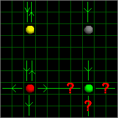
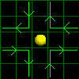
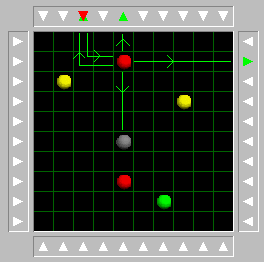
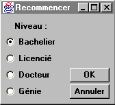
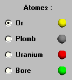
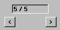

Applet Java
-----------

<applet code="atomx.class" codebase="../java/atomx" width="530" height="350">

Si vous voyez ce texte, c'est que votre navigateur n'est pas compatible Java ou n'a pas été correctement configuré.

</applet>

Règles du jeu
-------------

### But du jeu

Le but du jeu est de découvrir les atomes cachés sur le plateau. Pour ce faire, on doit envoyer des particules par les bords de ce dernier. Le programme indique alors le point d'entrée (flèche entrante rouge) et le ou les points de sortie de la ou des particules (par des flèches vertes sortantes). Il est possible qu'une particule entre et ressorte par la même case, il y a alors une flèche rouge entrante et une verte sortante sur le même bord.

### Types d'atomes

Il existe 4 types d'atomes différents :

- **OR (jaune):** Lorsque la particule le heurte de face, elle repart en sens contraire.
- **PLOMB (gris):** Lorsque la particule le heurte de face, elle est absorbée.
- **URANIUM (rouge):** Il engendre 4 particules qui partent dans les 4 directions.
- **BORE (vert):** Il renvoie une particule aléatoirement dans une des 4 directions possibles.

Voici un récapitulatif des actions des différents atomes, lorsqu'ils sont heurtés de face :

Lorsqu'un atome est heurté de coté, il renvoie la particule à angle droit, quelle que soit sa nature. Voici un exemple des rebonds possibles sur un atome :

Les rebonds sur les différents atomes et les actions de ceux-ci lors d'un choc frontal se combinent lors d'un même tir, ce qui va franchement compliquer votre tâche pour trouver où se trouvent les atomes. Voici un exemple de tir :

### Déroulement d'une partie

On peut :

#### Choisir son niveau de jeu

on clique sur le bouton **[Recommencer]** , il apparaît alors une fenètre pour choisir le niveau :

On clique sur le niveau désiré, puis sur **[OK]**.

- Au niveau *Bachelier*, seuls des atomes d'or sont présents sur le plateau, et ils sont au nombre de 4.
- Au niveau *Licencié*, il peut y avoir sur le plateau des atomes d'or et de plomb, et ils sont au nombre de 4 ou 5.
- Au niveau *Docteur*, des atomes d'uranium peuvent être aussi présents, et il y a entre 4 et 6 atomes en jeu.
- Vient ensuite le niveau *Génie*, tous les atomes peuvent être présents sur le plateau et ils sont entre 4 et 7.

Au lancement du programme, il a automatiquement généré un problème du niveau *Bachelier*.

#### Faire des essais de tir

Il suffit de cliquer sur la flèche du bord sur lequel on désire effectuer le tir. Les flèches rouges indiquent les cases d'entrée des particules, le vertes, les cases de sortie.

#### Construire sa solution

Au fil des tirs successif, on se fait une idée de la localisation des particules.

On peut alors placer des particules sur le scope : il suffit de cliquer sur la particule que l'on désire placer, puis de cliquer sur la case du scope où l'on veut la placer. Si l'on clique sur un atome du plateau, celui-ci est enlevé. On peut nettoyer entièrement le plateau en appuyant sur le bouton **[Effacer]**.

#### Revoir les tirs précédents

Les tirs effectués sont numérotés et stockés en mémoire :

Pour les revoir il suffit de cliquer sur les flèches gauche ou droite, ce qui fait défiler les tirs successifs, avec leur numéro d'ordre.

#### Vérifier sa solution

Lorsqu'on est certain de sa solution, on peut alors la vérifier : cliquer sur le bouton **[Solution]**. La solution s'affiche alors dans une fenètre. Vous pouvez continuer à faire des tirs (sans refermer la fenètre), c'est très utile au début pour se familiariser avec le déplacement des particules. On peut refaire une partie en cliquant sur recommencer.

### Aide

Cliquer sur le bouton **[Aide]** pour faire apparaitre une fenètre d'aide succinte.

Vous en savez assez pour jouer. Cliquez sur le lien *Applet* ci-dessous pour jouer avec l'applet Java.
