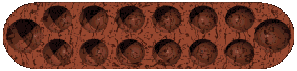

L'awélé est le jeu du continent africain. Ses règles sont presque aussi
nombreuses que les villages en Afrique. En effet, il n'y a pas eu de
soucis de standardisation comme pour nos échecs européens. Les règles
proposées ci-dessous ont été longuement testées et ont le mérite d'être
simples et logiques.

<!--more-->

Applet Java
-----------

Il est fortement conseillé de prendre connaissance des règles du jeu et
de lire la notice ci-dessous avant d'utiliser cette applet...

<applet code="Awele.class" codebase="../java/awele" width="400" height="300">

Si vous voyez ce texte, c'est que votre navigateur n'est 
pas compatible Java ou n'a pas été correctement configuré.

</applet>

### Utilisation de cette applet

Cette applet permet de se familiariser avec le jeu d'Awélé. Son
interface est très simple :

- **Pour jouer un coup :** il suffit de cliquer sur la case à jouer.
  S'il ne se passe rien, c'est que le coup est illégal. **Remarque :**
  Tant que le bouton de la souris n'est pas relâché, la machine ne
  réfléchit pas, on peut ainsi voir la position après le coup joué. La
  machine commence à réfléchir lorsque le bouton de la souris est
  relâché, une ampoule est alors affichée.
- **Pour reprendre la partie au début :** il faut cliquer sur la croix
  rouge.
- **Pour échanger les camps :** il faut cliquer sur les deux flèches
  vertes. Ceci est très utile pour faire commencer la machine (on
  clique sur ce bouton dés le début de la partie, la machine inverse
  les camps et joue son premier coup).
- **Pour changer le niveau de jeu :** cliquer sur la piste en bas de
  l'applet. Chaque niveau (case de la piste) y représente 2 demi-coups
  de profondeur de réflexion, soit une profondeur de 1 coup pour
  chaque camp. Un niveau de 3 semble raisonnable, mais on peut monter
  à 6 sans problèmes avec une machine puissante. Il est judicieux de
  monter le niveau en cours de partie : plus le nombre de graines sur
  le plateau est faible et plus la machine réfléchit vite.

Règles du jeu
-------------

### Le plateau

Le plateau du jeu d'Awélé est constitué de deux rangées de 6 trous. La
rangée du haut forme le camp Nord et celle du bas le Sud. Le plateau est
généralement en bois, mais il est parfois creusé à même le sol. Au début
du jeu, chaque case du plateau est garnie de quatre graines. Les graines
peuvent être remplacées par des coquillages ou tout autre petit objet
rond. Le plateau est, pour les plus beaux, muni de deux trous à ses
extrémités où sont entreposées les graines capturées par chaque camp.

### Notation des coups

Les trous sont repérés par des lettres : les cases de Nord sont notées A
à F (en majuscules) et celles de Sud a à f (en minuscules). Les cases
sont toujours notées dans le sens direct (sens inverse des aiguilles
d'une montre). Donc pour un camp, A ou a est toujours la case la plus à
gauche, et F ou f est celle la plus à droite (voire la figure
ci-dessous, vue du camp Sud). On note les coups par la case qu'ils
vident.

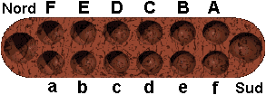

### Le but du jeu

Le but du jeu est de capturer le plus grand nombre de graines. Les
graines n'ayant pas de couleur distincte pour chaque camp, elles
appartiennent aux deux joueurs en cours de partie. Mais chaque joueur
est amené à en capturer, et les place alors dans sa réserve (grand trou
à sa droite).

### Le déroulement de la partie

Chacun son tour, chaque joueur doit prendre toutes les graines d'une des
cases disposées dans son camp et les semer dans les cases suivantes dans
le sens direct (inverse de celui des aiguilles d'une montre), en mettant
une graine par case. Au cours d'un semis, on ne doit jamais remettre de
graine dans le trou de départ, que l'on saute.

### Exemple 1

Sud joue d. Les 4 graines de la case d sont semées dans les 4 cases
suivantes, jusqu'à la case B de nord. Il y a donc maintenant 5 graines
dans les cases e et f de Sud et dans les cases A et B de Nord. La case d
est maintenant vide.

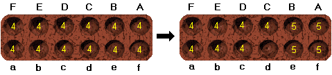

### Exemple 2

Sud joue e. Cette case contient 15 graines, donc le semis fait plus d'un
tour, et on saute la case de départ, donc la case e.

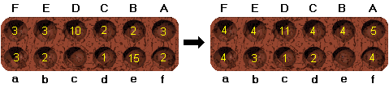

Si la dernière graine semée tombe dans un trou où se trouve 1 ou 2
graines (donc après avoir posé sa graine, il doit y en avoir 2 ou 3), et
si ce trou se trouve dans le camp adverse, alors le joueur ramasse les
graines de ce trou. Il les place dans sa réserve.

### Exemple 3

Sud joue d. Cette case contient 5 graines, donc la dernière de ces
graines arrive dans la case C, où se trouvent déjà 2 graines. La
dernière case du semis en contient maintenant 3, et elle se trouve dans
le camp adverse, donc elle est prise.

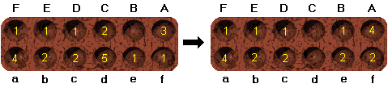

La prise s'étend aux cases précédentes du camp adverse : si la case
précédente de celle où a été posée la dernière graine remplit aussi les
conditions de capture (2 ou 3 graines dans la case qui se trouve dans le
camp adverse), alors elle est prise aussi. La capture se poursuit
jusqu'à ce qu'elle devienne impossible (soit parce que le nombre de
graines est différent de 2 ou 3, soit parce que la case ne se trouve
plus dans le camp adverse).

### Exemple 4

Sud joue d. Il prend donc les 2 graines se trouvant en D, mais aussi les
3 graines de C. sud capture donc 5 graines en tout. La case B ne peut
être prise car elle ne contient qu'une graine.

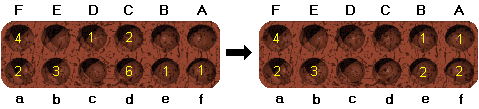

### Exemple 5

Sud joue f. C'est un exemple qui illustre la puissance des greniers :
après avoir fait un premier tour, les cases de Nord sont toutes munies
d'une graine, et le tour suivant permet une belle moisson : 10 graines
sont capturées !

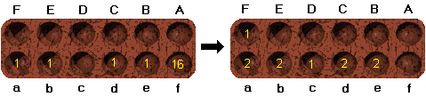

Enfin, lors d'un coup, un joueur est obligé de nourrir son adversaire,
ce qui veut dire qu'il doit jouer un coup de manière à ce que le camp de
son adversaire contienne au moins une graine (après les éventuelles
captures). Si un joueur ne peut nourrir son adversaire ou ne peut plus
jouer de graines, alors la partie s'arrête immédiatement.

### Exemple 6

Sud joue f. En effet, il lui est interdit de jouer d car il prendrait
toutes les graines de Nord, qui ne serait plus nourri.

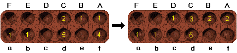

### Exemple 7

Dans cet exemple, la partie est terminée car le seul coup que peut jouer
Sud est f, or ce coup prendrait toutes les graines de Nord. Donc ce coup
est interdit et la partie est finie.

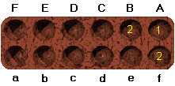

### Fin de partie

Au fur et à mesure que la partie se poursuit, le nombre de graines sur
le plateau diminue du fait des captures, et il arrivera un temps où un
des joueurs ne pourra plus nourrir son adversaire. La partie est alors
terminée. Chaque joueur compte le nombre de graines qu'il a capturées,
celui en ayant le plus est le gagnant, si le nombre de graines est égal
pour les deux joueurs, alors la partie est nulle.

Il peut aussi arriver que la situation soit visiblement bloquée du fait
qu'aucune prise ne sera plus possible, car le nombre de graines est trop
faible (en pratique environ 3 graines ou moins, suivant la configuration
du plateau). Un des joueurs peut alors suggérer d'arrêter la partie. Si
l'adversaire accepte, alors la partie se termine et chacun compte ses
graines. Si l'adversaire refuse, la partie continue.

### Conclusion

L'Awélé peut sembler de prime abord un jeu simple, voire simpliste.
Cette impression vient du fait que ses règles sont triviales. Néanmoins,
les règles du go ou de l'othello ne le sont pas moins, et ces jeux sont
d'une grande richesse.

Après un peu de pratique, le joueur débutant peut être rebuté par
l'aspect calculatoire du jeu (il faut envisager toutes les possibilités
pour ne pas faire de bourdes). C'est vrai que le calcul est
indispensable au début, mais par la suite, on constate qu'au delà du
calcul, il existe une stratégie. Un élément essentiel de cette stratégie
est la notion de *grenier* : un grenier est une case sur laquelle est
accumulée un grand nombre de graines (en pratique entre 12 et 28). Toute
la subtilité du jeu consiste à construire ces greniers, mais surtout, il
faut les vider judicieusement. En fait, on peut même décomposer le jeu
en phases en fonction de la construction de ces greniers (aussi parfois
appelés maisons) :

- **L'ouverture :** on essaie de créer dés les premiers coups des
  conditions favorables à la construction ultérieure de greniers (sur
  les dernières cases d'un camp de préférence, donc e ou f).
- **Le milieu de partie :** on consolide ses greniers et surtout, on
  les vide au bon moment.
- **Fin de partie :** on liquide judicieusement les dernières graines
  du plateau. Il se présente souvent des situations où les coups sont
  forcés, du fait du faible nombre de graines sur le plateau. Il faut
  savoir forcer ces coups et en tirer avantage.

Vous en savez maintenant assez pour jouer à l'Awélé avec l'applet de
cette page (cliquer sur le lien *Applet* ci-dessous).

Bibliographie
-------------

Le jeu d'Awélé étant peu connu en France, le nombre de livres qui s'y
rapporte est donc (très) restreint. Malgré tout, on peut se procurer des
livres intéressants où l'on parle d'Awélé :

### Awélé, Le jeu des semailles africaines (P. Reysset & F. Pingaud) Chiron - Algo

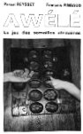

C'est a l'heure actuelle le livre le plus complet sur l'Awélé. Une
première partie se penche sur l'historique et la symbolique du jeu
d'Awélé. La deuxième est consacrée à l'étude du jeu lui même. C'est à ma
connaissance l'étude la plus poussée du jeu disponible en Français.
Enfin, un dernier chapitre est consacré à la programmation du jeu
d'Awélé sur ordinateur. C'est très intéressant, notamment en ce qui
concerne la fonction d'évaluation.

### Le livre de tous les jeux / Solar

C'est un ouvrage très général traitant l'ensemble des jeux. La partie
consacrée aux jeux de semailles Africains présente les règles de
l'Awélé, mais aussi celles de nombreuses autres variantes du jeu :
celles de jeux de semailles avec des plateaux comportant 4 rangées de 8
trous (*chisolmo* et *mweso*), ainsi que celles de l'awélé comme il est
pratiqué en Inde et au Sri-Lanka (le *Pallankuli*), sur un plateau de
deux rangées de 7 trous chacunes. Ce qui m'a le plus intéressé est la
variante de l'awélé à plus de 2 joueurs (3,4 ou 6 joueurs sur un plateau
de 2\* 6 trous), bien que je n'ai pas encore eu l'occasion de la
tester...

### Le guide Marabout des jeux d'intérieur / Marabout

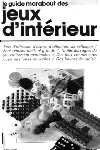

Encore un guide général où l'on aborde les jeux de semailles. La partie
sur l'Awélé est assez fouillée : on y aborde des notions de stratégie,
on a même droit à une partie commentée !

### Stratégies des joueurs d'Awélé (Jean Retschizki) / L'harmatan 1990

Cet ouvrage cherche à expliquer comment le jeu d'Awélé est pratiqué par
des enfants et maîtrisé par des adultes d'un village de côte d'ivoire et
d'Abidjan. Une recherche expérimentale a été entreprise afin de parvenir
à une meilleure connaissance des processus intellectuels et cognitifs de
la population dans laquelle l'étude s'est déroulée. L'étude de cette
activité de jeu est d'autant plus adéquat que le jeu d'Awélé peut être
considéré comme le produit de cette culture et est intimement lié à son
évolution.

### L'Owari et le Songa (Bonaventure) / MVE ondo sépia 1990

L'Owani et le Songa sont deux versions majeures des jeux de calculs
africains plus connus sous les noms de Mankala, Awélé, Wari et Solo.
L'Owani et le Songa appartiennent pour le premier, à l'aire des Obambas
et des Téké et, pour le second, à l'aire Béti, Bulu, Fang et Ntumu. NdR
: Ces deux ethnies étant sur le sol Gabonais. L'une (Téké) étant celle
du Présidant du Gabon, et l'autre (Fang), la plus importante en nombre
du Gabon.

### "WARI et SOLO" Le jeu de calculs africain (A. DELEDICQ A. POPOVA) / CEDIC ISBN 2-7124-0603-6 (1977)

Les auteurs, un mathématicien et un sethnologue, étudient la famille des
jeux du type "Mankala" ( mot arabe qui dériverait du verbe : bouger
déplacer). Sous ce nom se cachent tous les jeux où le terrain est
partagé et les pions indifférentiés, ( par opposition les échecs ou le
go par exemple font partie des anti mankala). A l'intérieur ils
distinguent les Wari (comme l'awélé) ou les pièces décrivent un boucle
simple (un cercle) et les Solo où les pièces décrivent une boucle double
(un 8).

Compléter cette bibliographie
-----------------------------

Si vous connaissez un livre traitant de l'awélé qui ne figure pas dans
cette brève bibliographie, ce serait sympathique de m'envoyer un court
résumé, afin que je puisse l'inclure dans cette bibliographie. Merci
d'avance.

Merci à **Richard NOYER** et **Jean Rouquette** pour leur participation
à cette rubrique (pour les trois derniers titres).
