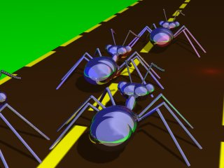
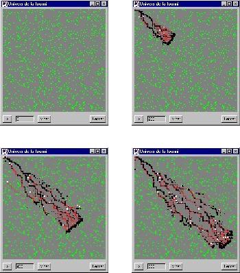
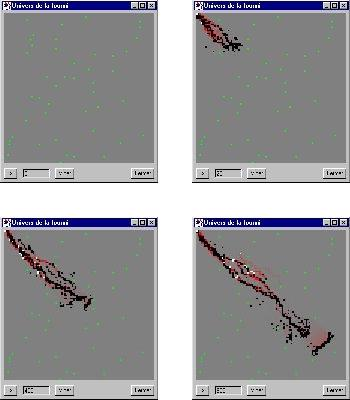

Cette Applet Java permet de modéliser le comportement des fourmis lorsqu'elles partent en chasse.

<!--more-->



Applet Java
-----------

<applet code="PisteFourmi.class" codebase="../java/chasse" width="300" height="250">
<p class="applet-error">Si vous voyez ce texte, c'est que votre navigateur n'est pas compatible Java ou n'a pas été correctement configuré.</p>
</applet>

### Conventions graphiques de la simulation

Un **carré noir** représente une fourmi en quête de proies, elle devient **blanche** au retour à la fourmilière (après avoir trouvé une proie). Un **carré vert** représente une proie. Les **carrés rouges** sont les pistes de phéromone, plus le carré est rouge, et plus la quantité de phéromone sur cette case est importante.

### Paramètres de la simulation

#### Modèle

Permet de choisir un modèle de dispersion des proies (faible ou forte). Ces deux possibilités sont des paramétrages préétablis permettant de simplifier l'utilisation de l'applet. On peut entrer les mêmes paramètres "manuellement".

#### Terrain

Cet onglet permet de paramétrer les valeurs pour le terrain et les
proies :

- **Coté du terrain :** C'est le coté de la grille sur laquelle se déroule la simulation.
- **Coté d'une case :** Coté d'une case de la grille en pixels.
- **Proba nourriture :** C'est la probabilité qu'il se trouve de la nourriture sur une case (0 : aucune, 1 : 100 %).
- **Quantité :** Nombre de points de nourriture par case en contenant.

#### Phéromone

Cet onglet paramètre les dépots de phéromone :

- **Dépot aller :** Quantité de phéromone déposée par la fourmi à l'aller.
- **Dépot retour :** Idem pour le retour de la fourmi.
- **Décroissance :** Facteur par lequel la quantité de phéromone de chaque case est multiplié chaque tour pour simuler la décroissance de la concentration de phéromone en chaque case.
- **Seuil zéro :** Seuil à partir duquel la quantité de phéromone est considérée comme négligeable. N'est pas réellement un paramètre de la simulation, mais permet d'accélérer grandement les temps de calcul.
- **Maximum :** Quantité maximale de phéromone pouvant se trouver sur une case.

#### Fourmis

Cet onglet paramètre les grandeurs relatives aux fourmis :

- **Nombre fourmis :** Nombre de fourmis apparaissant à chaque tour.
- **Proba. fourmi :** Probabilité pour qu'une fourmi apparaisse.
- **Max. par case :** Nombre maximum de fourmis par case de la grille.

Les fourmis à la chasse
-----------------------

Les fourmis semblent adapter leur stratégie de chasse à la dispersion de leurs proies : si les proies sont dispersées, elles "ratissent large" et se déploient en éventail, au contraire, si leurs proies sont concentrées, leur piste est moins ramifiée. Ce comportement peut sembler évident, mais c'est un raisonnement analytique typiquement humain : nous avons une perception globale de l'environnement (les proies) et nous en déduisons une stratégie à adopter. Ce type de raisonnement est hors de portée des fourmis pour plusieurs raisons : tout d'abord, les fourmis ont une perception très limitée de leur environnement, ensuite, elles sont bien incapables d'élaborer une stratégie. Alors comment peuvent-elles adapter leur comportement au degré de dispersion de leurs proies ? En fait, ce ne sont pas les fourmis qui adaptent leur comportement, mais le comportement des fourmis qui conduit à une adaptation aux proies.

Lorsque les fourmis partent en chasse, elles laissent derrière elles une piste de phéromones. Les phéromones sont des molécules chimiques que les fourmis peuvent émettre et capter. La quantité de phéromone en un lieu va guider les fourmis lors de leurs déplacements. Si une fourmi trouve une proie, elle retourne à la fourmilière en laissant derrière elle une piste de phéromone très marquée. Les autres fourmis vont donc être guidées vers cette source de nourriture. C'est ce que l'on appelle le *recrutement de masse*.

Ce comportement simple permet d'expliquer certaines caractéristiques de la piste de chasse des fourmis. Par exemple, cette méthode explique l'optimisation du chemin suivi par les fourmis vers leurs proies : si deux pistes de longueur différente mènent vers une même proie, la piste la plus longue sera moins marquée en phéromone car elle est parcourue en un temps plus long, donc les phéromones se sont plus évaporées.

On peut schématiser ce comportement des fourmis par un modèle informatique. On suppose que les fourmis se déplacent sur une grille et y laissent une unité de phéromone à l' aller et 100 lorsqu'elle retournent à la fourmilière avec une proie. Chaque tour, toutes les fourmis de la grille peuvent ou non avancer (à droite ou vers le bas à l'aller, vers la gauche ou vers le haut lors du retour à la fourmilière), suivant la concentration en phéromone sur les cases qui se trouvent devant elle (s'il n'y a pas de phéromone, elle a une chance sur deux d'avancer, ce qui simule le comportement hésitant des fourmis de tête de la colonne). Si la fourmi avance, elle ira de préférence sur la piste qui est la plus marquée en phéromone. Pour déterminer si une fourmi avance et où elle avance, on utilise une formule donnant la probabilité pour que la fourmi avance et sur quelle case. Voir la page des formules.

Vous en savez maintenant assez pour expérimenter avec l'applet Java modélisant la piste de chasse des fourmis.

En utilisant cette modélisation, on s'aperçoit que, le comportement des fourmis étant le même, les fourmis suivent des pistes de chasse différentes suivant le degré de dispersion des proies :

### Faible concentration de nourriture

Les proies sont nombreuses mais de petite taille :



Lorsque la concentration des proies est faible, les fourmis se déploient sur un large front.

### Forte concentration de nourriture

Les proies sont peu nombreuses mais de grande taille :



Lorsque la concentration des proies est forte, les fourmis suivent des pistes plus concentrées.

Cet article a été rédigé sur la base des travaux de : Guy THERAULAZ, Eric BONABEAU, Simon GOSS et Jean-Louis DENEUBOURG.

Formules
--------

Pour modéliser le comportement des fourmis sur ordinateur, il est nécessaire de traduire leur comportement par des formules mathématiques (qui est le seul langage que comprenne un ordinateur).

### Probabilité que la fourmi avance

Chaque tour, la fourmi peut avancer ou rester sur place. La probabilité que la fourmi avance est la suivante :

```
p = 0,5 + 0,5*tanh[((G+D)/100)-1]
```

Où G et D sont les concentrations en phéromone des cases gauche et droite.

### Direction de déplacement de la fourmi

Si la fourmi avance, reste à savoir dans quelle direction. Il y a deux possibilités : Gauche ou Droite. La probabilité pour que la fourmi aille à gauche est la suivante :

```
p' = (5+G)²/[(5+G)²+(5+D)²]
```

Où G et D sont les concentrations en phéromone des cases gauche et droite. La probabilité que la fourmi choisisse la droite est 1-p'.

Lorsqu'on parle de droite ou de gauche, il faut adapter aux circonstances : à l'aller, les fourmis peuvent se déplacer vers la droite ou vers le bas (qui deviennent Gauche et Droite, vu "de la fourmi"), au retour, les directions possibles sont Gauche et Haut (qui deviennent Droite et Gauche).

On limite la quantité de phéromone que peut contenir une case (la valeur par défaut de l'applet est de 100). Chaque tour, une fourmi quitte la fourmilière.

Tous les paramètres de la simulation sont paramétrables dans l'applet, alors il ne faut pas hésiter à expérimenter !
