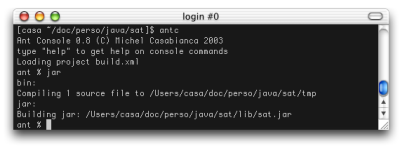
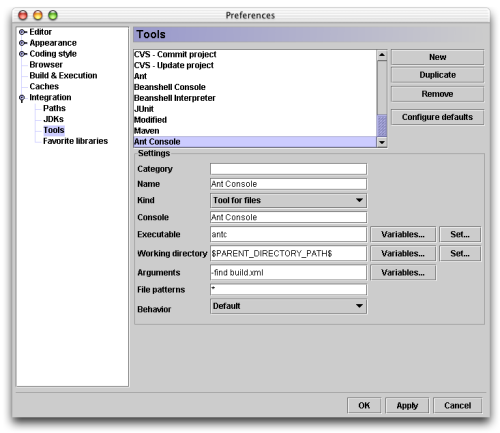
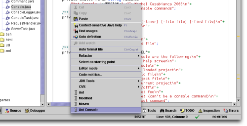

This article presents the integration of the Ant Console within
CodeGuide to boost significantly build times. For Ant integration and
other CodeGuide tips, see [this article](codeguide-tips.en.html).

<!--more-->

Ant Console
-----------

This tool runs Ant in a console (in a terminal or within your favorite
IDE) and lets you type commands to run targets of the loaded build file.
This method runs much faster than Ant because it saves time to launch
the Java Virtual Machine, JIT compilation time and build file loading.
You can run builds up to 5 times faster than running Ant on the command
line. It is obvious than you save more time on small builds (when time
spent in usefull code is small compared to startup time).

### Installation

Download SAT that you can get for free [on my web site](http://sweetohm.net/article/sat.en.html).

Go in the *bin* directory of your Ant installation, copy the *ant*
script (or *ant.bat* for OS disabled people) to file *antc* (or
*antc.bat*). Replace `org.apache.tools.ant.Main` with
`net.cafebabe.sat.ant.Console`. This script will launch the Ant console
instead of traditional Ant. Make sure that this script is in your
`PATH`.

You must, of course, install SAT by dropping the file *sat.jar* in the
*lib* directory of your Ant installation.

### Usage

To run the Ant console, go in the directory of your project (where is
living your *build.xml* file) ant type `antc`. You will display an help
screen typing `antc -help` on the command line :

```bash
Ant Console 0.8 (C) Michel Casabianca 2003
type "help" to get help on console commands
Usage: antc [-help] [-version] [-timer] [-file file] [-find file]
-help    Print this help screen
-version Print the version
-timer   Print build times
-file    To set the build file
-find    To search for the build file
```

When you launch the Ant console, you will be promped as following :



To display an help screen about the console commands, type `help` in the
console :

```bash
Commands you can run in the console are the following:
  help          To display this help screen
  exit          To quit the console                                     
  desc          To describe the loaded project
  load file     To load the build file
  find file     To find the project file
  reload        To reload the current project
  timer on/off  To set timer on/off
  target foo    To run the target foo
  targetname    To run the target (can't be a console command)
  <empty>       To repeat the last command
```

Note that you can launch a given target by typing its name (this is a
shortcut for the `target` command) provided that this target hasn't the
same name than a console command. You can repeat the last command by
typing `ENTER`.

You can load a build file using the `load` command (the path is then
relative to the current directory) and search for a build file
recursively in the file system with the `find` command (that behaves
like the `-find` command line argument for Ant). You can also reload the
current project with `reload`. This may be necessary when the build file
changes on disk or when the project is corrupted (which happens
sometimes after a build error because some tasks don't work after an
error).

The `desc` command describes the current project (behaves like the
`-projecthelp` command line parameter for Ant).

I have also implemented a timer (to display execution time for builds)
that you can switch *on* or *off* using the `timer` command. The result
is in milliseconds (because the builds are so fast :o)

Integration in CodeGuide
------------------------

I have [already said](codeguide-tips.en.html) that this IDE is fast and
probably the most powerful for real world Java development, Ant is very
slow compared to this tool. The goal of this integration is to make Ant
run at light speed in CodeGuide.

First, make sure that the Ant Console runs properly from the command
line (by typing `antc` in a terminal). Then we will integrate it as an
external tool. To do so, open **Tools/Configure tools...** in the menu.
The following window opens to let you configure an external tool:



Click on the **New** button and fill fields with the following values:

Field                    | Value                     | Comment
:----------------------- | :------------------------ | :-----------------------
Category                 |                           | Leave this field empty (or the Ant Concole item would appear in a submenu, which is useless in this case).
Name                     | Ant Console               | Logical
Kind                     | Tool for files            | To run the console searching for the build file recursively in the file system
Console                  | Ant Console               | As the tool is running in the background, it should run in its own console (don't run it in the Ant console for instance because you would have to stop it to launch a regular build)
Executable               | antc                      | We launch the `antc` command
Working directory        | $PARENT\_DIRECTORY\_PATH$ | To launch the console it the directory of the file
Arguments                | -find build.xml           | The console look for the build file in the file system (so that if we launch the console on Java source file, it Java source file, it will search for the build file in a parent directory)
File pattern             | \*                        | We can launch the console on any file (I use it to perform my XSLT transformations for instance, so I run it onXML files for instance)
Behavior                 | Default                   | Why not...

To run the console, right click on a file (in the ditor pane or in the
**Project** bar) and select the item **Ant Console**.



This will open a dedicated console where Ant is waiting for your
commands. Take a look at the build times (in milliseconds), it screams!


The same build using Ant takes about 6 seconds (about 4 times more).
Using the latest PowerMac dual G5 2GHz, you could probably compete for
the fastest Ant builds on earth :o)

Thanks Frédéric for his corrections

Enjoy!
