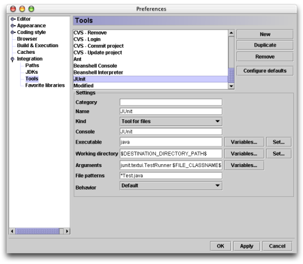
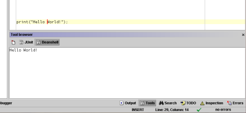

This article presents CodeGuide extensions to launch JUnit tests, open a
BeanShell console and Ant builds within this IDE.

<!--more-->

The Code Guide IDE
==================

CodeGuide (which evaluation version can be downloaded on [Omnicore's web
site](http://www.omnicore.com)) is, in my humble opinion, the most
efficient Java developement environment. It includes the most useful
features of better Java tools (such as on the fly syntax checks,
efficient code completion and a fast debugger), but without unnecessary
fat, with makes it very fast (some of my colleagues though it was a
native tool :o)

It is possible to extend CodeGuide features using external tools. CVS is
integrated this way in the IDE for instance. In this article, I show how
you can integrate JUnit, Beanshell and Ant as external tools.

JUnit integration
=================

JUnit is a well known unit test framework. Using this tool, developing
and running these tests is a piece of cake. A dedicated Ant task may
also generate test reports. JUnit is an Open Source tool that you can
download for free at <http://www.junit.org>. I have written an
introduction to JUnit, in the May/June issue of [Oracle
Magazine](http://otn.oracle.com/oramag/oracle/03-may/o33junit.html).

The goal of this integration is to run a unit test, within CodeGuide,
with a single click and see the result in the tools console.

Open the `Tools/Configure Tools...` menu. The following dialog box will
open:

Click on the **New** button and fill fields with the following values:

Champ                | Valeur                                                    | Commentaire
:------------------- | :-------------------------------------------------------- | :----------------------------------------
Category             |                                                           | Leave this field empty (or the JUnit item would appear in a JUnit submenu, which is useless in this case).
Name                 | JUnit                                                     | Logical
Kind                 | Tool for files                                            | To launch a Java source file as a JUnit test
Console              | JUnit                                                     | This is the name of the console which will display the result of the test
Executable           | java                                                      | We launch the `java` command
Working directory    | $DESTINATION\_DIRECTORY\_PATH$                            | To launch JUnit in the compilation destination directory
Arguments            | -cp $CLASSPATH$ junit.textui.TestRunner $FILE\_CLASSNAME$ | So that the launcher runs the Java class generated from the edited Java source file
File pattern         | \*Test.java                                               | We filter JUnit test cases
Behavior             | Default                                                   | Why not...

Close the tool configuration dialog box clicking the `OK` button. You
can now launch a test with a right click on a Java source file (in the
**project** pane or in the editor itself) and selecting the **JUnit**
item in the menu.

The test result appears in the tools console:

Note that you must click on the **Build Project** button in the tool bar
(or press key **F9**) before running a test, in order to build the
corresponding class file. Furthermore, it is possible to launch a unit
test using a `main()` method and changing the starting point of the
project, but it is more convenient using the JUnit launcher (especially
for web application where starting point is a bit weird).

Beanshell integration
=====================

Beanshell is a Java interpreter (with some scripting features). You can
download it for free at <http://www.beanshell.org>. Integration in an
IDE is useful when developing scripts or to test code fragments using
the Beanshell interpreter as a scrap book.

Thus, the goal of this integration is to run scripts from the editor and
launch a Beanshell console.

Beanshell interpreter
---------------------

To integrate the script interpreter, open the tool configuration dialog
box, click on the **New** button and fill the fields with the following
values:

Champ              | Valeur                                                                       | Commentaire
:----------------- | :--------------------------------------------------------------------------- | :-----------------------
Category           |                                                                              | Leave this field empty
Name               | Beanshell Interpreter                                                        | Logical
Kind               | Tool for files                                                               | To interpret Beanshell sources
Console            | Beanshell                                                                    | The name of this concole
Executable         | java                                                                         | We run the `java` command
Working directory  | $PARENT\_DIRECTORY\_PATH$                                                    | We run a script within its directory
Arguments          | -cp /opt/java/bsh/lib/bsh-1.2b7.jar:$CLASSPATH$ bsh.Interpreter $FILE\_PATH$ | We include the Beanshell's jar file in the CLASSPATH (change this path for your Beanshell installation directory) and we add the project's CLASSPATH, we pass the file to interpret as parameter
File pattern       | \*.bsh                                                                       | To select Beanshell source files
Behavior           | Default                                                                      | Why not...

We can now run the interpreter with a single right click on a script
source and see the output in the Beanshell console.

Beanshell console
-----------------

To run the interpreter in a console, open the tool configuration dialog
box, click on the **New** button, and fill the fields with the following
values:

Champ              | Valeur                                                          | Commentaire
:----------------- | :-------------------------------------------------------------- | :-----------------------
Category           |                                                                 | Leave this field empty
Name               | Beanshell Console                                               | Logical
Kind               | Tool in menu                                                    | To lauch the interpreter from the **Tools** menu
Console            | Beanshell                                                       | The name of the console
Executable         | java                                                            | We run the Java virtual machine
Working directory  |                                                                 | Leave empty (except if you want to work in a given directory)
Arguments          | -cp /opt/java/bsh/lib/bsh-1.2b7.jar:$CLASSPATH$ bsh.Interpreter | We add the Beanshell's jar file to the CLASSPATH (replace with the path for your Beanshell installation directory) and we append the CLASSPATH of the project. No file is passed on the command line so that the interpreter runs the user's inputs.
File pattern       |                                                                 | Leave empty, has no meaning in this context
Behavior           | Default                                                         | Why not...

To open the Beanshell console, select the
`Tools/Beanshell       Console` item of the menu, the following window
appears:

We can evaluate Java expressions and see the result in the console. This
is an handy way to quickly test a piece of code and paste it in the
editor.

Ant integration
===============

Ant is a build tool (that may be compared to make) dedicated to build
Java projects. I have written a series of articles on Ant in the
November/December and January/February issues of [Oracle
Magazine](http://otn.oracle.com/oramag/oracle/02-nov/o62odev_ant.html).
Ant is integrated to CodeGuide out of the box, but if you chose ant
builds, on the fly code generation is not running, which is a key
feature of CodeGuide.

The goal of this integration is to launch an Ant build from within the
interface using on the fly code compilation.

Open the tool configuration dialog box and fill the fields as following:

Champ              | Valeur                            | Commentaire
:----------------- | :-------------------------------- | :---------------------------------------------------------------------------
Category           |                                   | Leave this field empty
Name               | Ant                               | No comment
Kind               | Tool for files                    | So that Ant looks in parents directories of the file you click (this works great if the build file is in the root directory of the project)
Console            | Ant                               | The name of the console
Executable         | ant                               | We run Ant
Working directory  | $PARENT\_DIRECTORY\_PATH$         | We run Ant in the directory of the file
Arguments          | -find build.xml $USER\_ARGUMENTS$ | We ask Ant to look for a build file named *build.xml* recursively in parent directories. The value *$USER\_ARGUMENTS$* gives the user a chance to type an Ant target to run
File pattern       | \*                                | We can click on any file to launch an Ant build (useful to transform XML files using Ant builds for instance)
Behavior           | Default                           | Why not...

You can now open a file context menu (with a right click) and launch the
build choosing the Ant item. I genrally choose **Use internal
incremental compiler** in my projects preferences and launch Ant builds
when necessary (to generate a jar file for instance).

Conclusion
==========

Even if CodeGuide's customization can't compete with Emacs, it is very
useful to integrate in this IDE your favorite tools. We could wonder
what is missing to CodeGuide (when you'll have tested classes *Hot Swap*
or Tomcat integration). Maybe a plugin API so that any developer could
send Omnicore their own extensions. Please Omnicore developers, think
about that!

Thanks Frédéric for his corrections!
