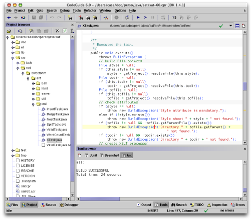
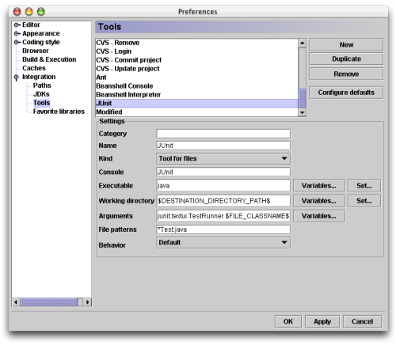
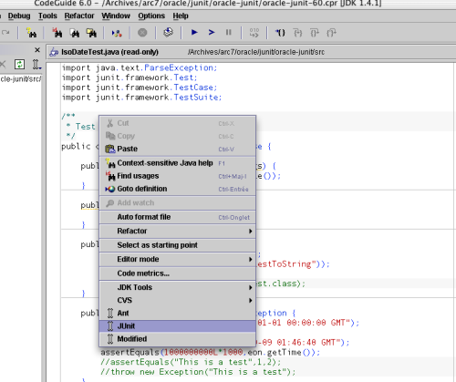
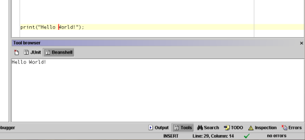
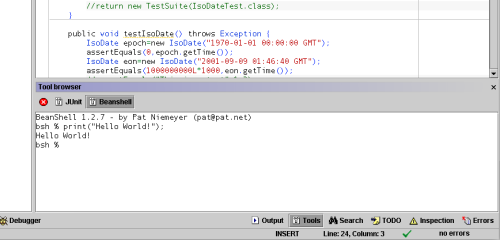
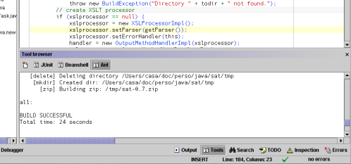

Cet article présente des extensions de CodeGuide y pour lancer des tests
JUnit, ouvrir une console Beanshell et lancer des builds Ant depuis
l'interface.

<!--more-->

Présentation de Code Guide
--------------------------

CodeGuide (que l'on peut télécharger en version d'évaluation sur le
[site d'OmniCore](http://www.omnicore.com)) est à mon sens
l'environnement de développement le plus efficace pour travailler avec
Java. Il incorpore les fonctionnalités les plus utiles des meilleurs
IDEs (comme la vérification de la syntaxe de tout un projet en temps
réel, une complétion du code efficace et un débugger rapide), mais sans
en embarquer les moins utiles (comme la construction des interfaces
graphiques), ce qui le rend extrèmement rapide (à tel point que nombre
de mes collègues pensent que c'est un programme natif :o)

Code Guide permet d'étendre ses fonctionnalités en incorporant des
outils externes. C'est ainsi que CVS est intégré à l'IDE par exemple.
Dans la suite de cet article, je présente l'intégration de JUnit,
Beanshell et Ant dans cet IDE.

Intégrer JUnit
--------------

JUnit est un framework de test unitaire. Il en facilite le développement
ainsi que l'exécution et permet la génération de rapports (par
l'interédiaire de tâches Ant dédiées). C'est un outil Open Source que
l'on peut télécharger à l'adresse <http://www.junit.org>. On trouvera
une introduction à Junit (écrite par votre serviteur) sur le site
d'[Oracle
Magazine](http://otn.oracle.com/oramag/oracle/03-may/o33junit.html),
dans le numéro de Mai/Juin 2003.

Le but de cette intégration est de lancer l'exécution de tests JUnit
d'un simple clic et d'en visualiser le résultat dans la console de
sortie des outils.

Ouvrir le menu `Tools/Configure Tools...`. La fenêtre suivante
apparaît :

Cliquer sur le bouton **New**, puis renseigner les champs suivants :

Champ                | Valeur                                                    | Commentaire
:------------------- | :-------------------------------------------------------- | :----------------------------------------
Category             |                                                           | Laisser ce champ vide (sans quoi l'item JUnit est placé dans un sous-menu JUnit, ce qui ajoute un niveau de profondeur inutile dans le menu).
Name                 | JUnit                                                     | Logique
Kind                 | Tool for files                                            | Pour lancer les fichiers Java en tant que tests JUnit
Console              | JUnit                                                     | C'est le nom de la console dans laquelle sera affiché le résultat du test
Executable           | java                                                      | On lance java
Working directory    | $DESTINATION\_DIRECTORY\_PATH$                            | Pour lancer JUnit dans le répertoire de destination de la compilation
Arguments            | -cp $CLASSPATH$ junit.textui.TestRunner $FILE\_CLASSNAME$ | De manière à ce que le lanceur de test lance la classe générée à partir du source
File pattern         | \*Test.java                                               | On filtre les tests JUnit
Behavior             | Default                                                   | Pourquoi pas...

Fermer la boite de configuration des outils en cliquant sur **OK**. On
pourra maintenant lancer un test d'un clic droit sur le fichier (dans la
section **Project** ou dans la zone d'édition elle même) et en
sélectionnant l'item **JUnit** du menu :

Le résultat du test est affiché dans la zone de sortie des outils, comme
suit :

On notera qu'il faut cliquer sur le bouton **Build Project** de la barre
d'outil (ou appuyer sur la touche **F9**), avant de lancer le test, de
manière à regénérer la classe du test. D'autre part, il serait possible
de lancer un test en le munissant d'une méthode `main()` et en faisant
le **Starting Point** du projet, mais il est plus simple de lancer un
test en passant par le lanceur JUnit (et c'est même parfois très
ennuyeux d'avoir à changer le starting point, en particulier pour les
applications web).

Intégration de Beanshell
------------------------

Beanshell est un interpréteur Java (ou du moins de Java muni de quelques
extensions et restrictions rendant les scripts plus efficaces). On peut
le télécharger à l'adresse <http://www.beanshell.org>. L'intégrer dans
CodeGuide est utile lorsqu'on souhaite développer des scripts ou encore
se servir de l'interpréteur comme une sorte de cahier de brouillon pour
y tester des expressions Java avant de les intégrer dans le code.

Le but de cette intégration est donc double : il serait utile de pouvoir
lancer l'interprétation d'un script en cours d'édition et de lancer
l'interpréteur dans la console.

Interpréter un script
---------------------

Pour intégrer l'interpréteur de script, ouvrir la boite de configuration
des outils, cliquer sur **New** pour y créer une nouvelle entrée, puis
la configurer comme suit :

Champ              | Valeur                                                                       | Commentaire
:----------------- | :--------------------------------------------------------------------------- | :-----------------------
Category           |                                                                              | Laisser ce champ vide
Name               | Beanshell Interpreter                                                        | Logique
Kind               | Tool for files                                                               | Pour interprèter des sources Beanshell
Console            | Beanshell                                                                    | Le nom de la console
Executable         | java                                                                         | On lance java
Working directory  | $PARENT\_DIRECTORY\_PATH$                                                    | On lance le script depuis son répertoire
Arguments          | -cp /opt/java/bsh/lib/bsh-1.2b7.jar:$CLASSPATH$ bsh.Interpreter $FILE\_PATH$ | On définit le CLASSPATH avec le jar de Beanshell (à remplacer par le chemin de votre installation) et on complète avec le CLASSPATH du projet, on passe le fichier à interprèter en paramètre
File pattern       | \*.bsh                                                                       | On sélectionne les sources Beanshell
Behavior           | Default                                                                      | Pourquoi pas...

On peut maintenant lancer l'interpréteur d'un clic droit de la souris
sur le source d'un script et l'on voit le résultat dans la console
Beanshell.

Lancer la console Beanshell
---------------------------

Pour lancer la console, ouvrir la boite de dialogue de configuration des
outils, cliquer sur **New**, puis saisir les champs suivants :

Champ              | Valeur                                                          | Commentaire
:----------------- | :-------------------------------------------------------------- | :-----------------------
Category           |                                                                 | Laisser ce champ vide
Name               | Beanshell Console                                               | Logique
Kind               | Tool in menu                                                    | Pour interprèter lancer la console depuis le menu **Tools**
Console            | Beanshell                                                       | Le nom de la console
Executable         | java                                                            | On lance la JVM
Working directory  |                                                                 | Laisser vide (à moins que vous ne souhaitiez travailler dans un répertoire particulier)
Arguments          | -cp /opt/java/bsh/lib/bsh-1.2b7.jar:$CLASSPATH$ bsh.Interpreter | On définit le CLASSPATH avec le jar de Beanshell (à remplacer par le chemin de votre installation) et on complète avec le CLASSPATH du projet, on ne passe aucun fichier à l'interpréteur pour qu'il interprète les entrées de l'utilisateur
File pattern       |                                                                 | Laisser vide, n'a pas de sens dans ce contexte
Behavior           | Default                                                         | Pourquoi pas...

Pour ouvrir la console Beanshell, ouvrir le menu
`Tools/Beanshell Console`. La console Beanshell suivante apparaît :

On peut y évaluer des expressions Java et en voir immédiatement le
résultat dans la console. C'est très pratique pour tester rapidement des
bouts de code Java, que l'on peut ensuite copier/coller dans l'éditeur.

Intégration de Ant
------------------

Ant est un système de build (comparable à make) dédié à Java. On pourra
trouver une série d'articles d'introduction à Ant (écrite par votre
serviteur) sur le site de [Oracle
Magazine](http://otn.oracle.com/oramag/oracle/02-nov/o62odev_ant.html).
Ant est intégré à CodeGuide, mais si l'on active la compilation
utilisant Ant, on ne peut profiter la compilation et validation temps
réel de CodeGuide (une fonctionnalité vite indispensable).

Le but de cette intégration est donc de pouvoir lancer facilement un
build Ant tout en utilisant la compilation temps réel de CodeGuide.

Dans la boite de configuration des outils, on remplira les champs comme
suit :

Champ              | Valeur                            | Commentaire
:----------------- | :-------------------------------- | :---------------------------------------------------------------------------
Category           |                                   | Laisser ce champ vide
Name               | Ant                               | Se passe de commentaires
Kind               | Tool for files                    | De manière à rechercher le build file dans un répertoire parent du fichier (cela fonctionne bien si le build file est à la racine des projets)
Console            | Ant                               | Le nom de la console
Executable         | ant                               | On lance lance Ant
Working directory  | $PARENT\_DIRECTORY\_PATH$         | On se place dans le répertoire parent du fichier
Arguments          | -find build.xml $USER\_ARGUMENTS$ | On demande à Ant de rechercher le build file (nommé *build.xml*) récursivement dans les répertoires parents. La valeur $USER\_ARGUMENTS$ donne à l'utilisateur l'occasion de saisir le nom de la target à lancer.
File pattern       | \*                                | On peut cliquer sur tout fichier pour lancer la build Ant (utile si l'on transforme des documents XML de la sorte, par exemple)
Behavior           | Default                           | Pourquoi pas...

On peut maintenant ouvrir le menu contextuel d'un fichier (d'un clic
droit) et lancer le build en sélectionnant Ant. Pour ma part, je
sélectionne **Use internal incremental compiler** dans mes préférences
de projet et je lance les builds Ant lorsque c'est nécessaire (pour
générer une release par exemple).

Conclusion
----------

Même si les possibilités de personnalisation de CodeGuide ne peuvent
égaler celles d'un Emacs, elles sont très utiles pour rendre cet IDE
encore plus efficace. On peut se demander ce que pourrait faire de plus
CodeGuide (surtout lorsqu'on connaît ses capacité de *Hot Swap* de
classe en cours de débuggage ou son intégration de Tomcat), si ce n'est
de fournir une API pour développer des extensions. Messieurs les
développeurs d'OmniCore, à vous de jouer !

Un grand merci à Frédéric pour ses corrections.
