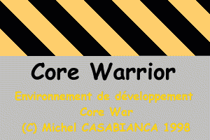
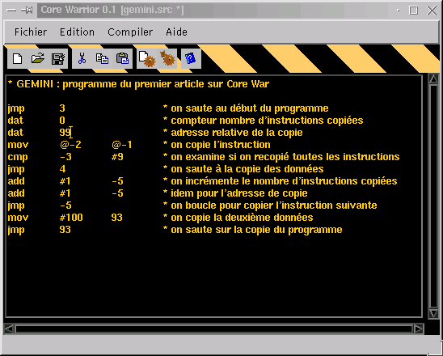
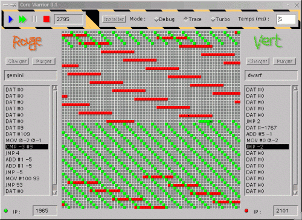
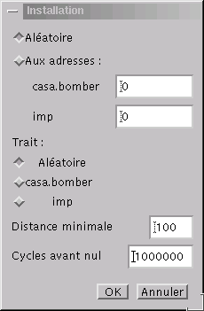

Core Warrior est un environnement de développement pour Core War écrit
en Java (100 %, n'en déplaise à Bill), il peut donc fonctionner sur
toute plateforme munie d'une machine virtuelle Java 1.1 (donc Linux,
Windows, Macintosh, Solaris, etc...). Il comporte un éditeur, un
compilateur et une machine virtuelle Core War. Le compilateur et la
machine virtuelle peuvent être utilisés en mode graphique ou en ligne de
commande.

<!--more-->

Histoire de Core War
--------------------

C'est un article de A.K. Dewdney ("Deux programmes ennemis s'affrontent
à coups de chiffres binaires" paru dans "Pour la science") qui est à
l'origine de CoreWar. Cet article (comme beaucoup d'autres du même
auteur pour lequel j'ai le plus grand respect) a provoqué un véritable
engouement pour cette forme contemporaine des jeux du cirque où les
gladiateurs sont des programmes informatiques.

L'idée de ce jeu est venue à l'auteur après qu'il aie entendu une
anecdote (fausse, mais c'est un détail) qui parlait d'un programme
(Creeper) se dupliquant lui même lorsqu'il était exécuté. Ce programme
envahissant progressivement le réseau de la société où il avait été
développé n'a pu être éradiqué qu'à l'aide d'un autre programme (Reaper)
dont la mission était de traquer et détruire les exemplaires de Creeper
qu'il rencontrait puis de se détruire lui même.

L'auteur propose dans cet article un langage informatique simple (proche
de l'assembleur) pour coder de petits programmes belliqueux : le Red
Code. Pour une description détaillée de ce langage, voir la rubrique
"Red Code" du menu ci-dessus. Les programmes s'exécutent dans la mémoire
d'un ordinateur "virtuel" constituée de 8000 cases. Chaque case peut
contenir une instruction. Les deux programmes sont installés
aléatoirement dans une case de la mémoire, puis une instruction de
chacun est exécutée successivement jusqu'à ce qu'un des deux programmes
plante (par exemple si le pointeur de l'instruction à exécuter pointe
sur une case contenant une donnée) ou que la partie soit nulle (après un
nombre de cycles déterminé sans plantages d'un des concurrents). Le
dernier programme opérationnel étant le vainqueur.

De nombreux programmeurs se sont pris au jeu, et rapidement des tournois
se sont organisé. Il a été écrit de nombreuses versions de machines
virtuelles pour faire tourner ces programmes Red Code (dont la plus
célèbre est sans aucun doute Mars) et encore maintenant des compétitions
permanentes ont lieu sur des sites où les concurrents déposent leurs
programmes. Les versions du langage Red Code se sont succédées (84, 86
et 88), et la dernière en date est la version 94.

Ce que Dewdney n'avait pas prévu, c'est que des esprits perfides ont eu
l'idée de programmer des gladiateurs en langage machine pour infecter de
vrais systèmes. C'était la naissance des virus informatiques qui
allaient se répandre comme une traînée de poudre. Il explique les
conséquences de son idée dans un autre articles "Virus, parasites et
autres maladies des ordinateurs", mais il était un peu tard... C'est le
propre des grands esprits de provoquer des mouvements qui les dépassent,
et Core War allait engendrer une descendance nombreuse et
particulièrement virulente !

Red Code
--------

Le langage Red Code permet de programmer les adversaires qui vont
s'affronter dans la mémoire de l'ordinateur. Il est très simple et
proche d'un langage d'assemblage (il ressemble beaucoup à l'assembleur
des microprocesseurs de la famille x86 d'Intel).

La mémoire de l'ordinateur est constituée de 4096 cases (8000 dans la
version originale de Dewdne, ce nombre a été diminué pour une raison
expliquée par la suite). La mémoire est "bouclée" : la case après la
dernière (d'adresse 4095) est la première case (d'adresse 0). Ainsi,
l'adresse 4100 est équivalente à l'adresse 4 (4100 - 4096 = 4) et -3 est
équivalente à 4093.

Trois méthodes d'adressage de la mémoire sont possibles dans une
instruction :

1. **Relatif :** C'est le mode par défaut. Il est relatif à la case de
   l'instruction en cours d'exécution. Par exemple, 3 pointe vers la
   troisième case après la case de l'instruction en cours d'exécution.
2. **Indirect :** Est indiqué par un signe **@**. L'adresse après le
   signe @ n'est pas l'adresse pointée mais l'adresse de l'adresse
   pointée. Par exemple @3 pointe vers la case dont l'adresse est 3
   cases après celle de l'instruction en cours. Attention, la case
   contenant l'adresse doit être du type DAT (cf plus loin) sans quoi,
   le programme s'arrête sur une erreur d'indirection.
3. **Immédiat :** Est indiqué par un signe **\#** avant l'argument.
   Indique une valeur numérique, sans référence d'adresse. Donc \#3 est
   la valeur numérique 3.

Un programme est constitué d'une suite d'instructions contiguës en
mémoire. Chaque instruction occupant une case mémoire. Après l'exécution
d'une instruction, la suivante dans la mémoire est exécutée (sauf si
l'instruction est une instruction de saut). Les instructions sont au
nombre de 9 :

Instruction       | Description
:---------------- | :---------------------------------------------------------------------------------------------------------------------------------------------------------------------------------------------------------------------------------------------------------------------------------------------------------------------------------------------------------------------------------------------------------------------------------------------------------------------------------
DAT A             | C'est une déclaration de donnée. DAT 5 représente la valeur 5. Cette instruction n'est pas exécutable (si un programme doit l'exécuter, il est arrêté). Elle ne comporte qu'un seul argument (la valeur) qui n'a pas de type (ni relatif, ni indirect ni immédiat).
MOV A B           | Copie la case mémoire d'adresse A vers la case d'adresse B. Par exemple, MOV 0 1 copie l'adresse relative 0 (donc la case en cours d'exécution, soit l'instruction MOV 0 1 elle même) vers la case suivante (la prochaine exécutée). Cette seule instruction constitue un programme très court qui se recopie indéfiniment en mémoire. Son premier argument peut être de tout type (relatif, indirect ou immédiat) alors que son second ne peut être que relatif ou indirect.
ADD A B           | Ajoute le contenu de la case d'adresse A vers la case d'adresse B. Son premier argument A peut être de tout type (relatif, indirect ou immédiat) alors que le second, B, ne peut être que relatif ou indirect. Cependant, les cases pointées doivent être du type DAT car on ne peut ajouter que des valeurs numériques entre elles (on ne peut ajouter une valeur à une instruction ou inversement). Si ce n'est pas le cas, le programme s'arrête sur une erreur arithmétique.
JMP A             | Saut à l'adresse A. La prochaine instruction exécutée le sera à cette adresse. L'argument A peut être relatif ou indirect, mais pas immédiat.
JMZ A B           | Saut à l'adresse A si le contenu de B est nul. Les arguments A et B doivent être relatifs ou indirects, mais pas immédiat.
JMG A B           | Saut à l'adresse A si le contenu de B est supérieur à zéro. Les arguments A et B doivent être relatifs ou indirects, mais pas immédiat.
DJZ A B           | Décrémente (soustrait 1) le contenu de A puis saute vers la case B si le résultat est zéro. Les arguments A et B doivent être relatifs ou indirects, mais pas immédiat.
CMP A B           | Comparaison de A et B et saut de l'instruction suivante s'ils sont différents. Les arguments peuvent être de tous type.

### Exemples de programmes

Un exemple valant mieux qu'un long discours, voici quelques programmes
simples permettant de se faire une idée plus claire du langage Red Code
:

#### IMP

IMP est un programme très simple, il ne comporte qu'une seule
instruction !

```bash
MOV  0  1
```

Il se recopie à la case mémoire suivante qui est exécutée après cette
instruction. On obtient donc un programme auto-répliquant très simple
qui se comporte comme un rouleau compresseur et qui écrase toutes les
cases de la mémoire. Cependant ce programme est très primaire et ne peut
pour ainsi dire pas planter son adversaire dans la mesure où si son
adversaire est amené à exécuter une de ses instructions, il se
transforme lui même en IMP !

#### DWARF

Ce programme (comme le précédent d'ailleurs) a été proposé par Dewdney
dans son premier article sur Core War (il est donc en quelque sorte
d'intérêt historique). Il est aussi très simple, mais toutefois plus
efficace que le précédent, dans la mesure ou il peut effectivement
planter l'adversaire.

```bash
JMP  2 
DAT  -1 
ADD  #5  -1 
MOV  #0  @-2 
JMP  -2
```

Ce programme est une sorte de bombardier : il boucle indéfiniment et
écrase une case de la mémoire avec un `DAT       0` à chaque itération
(pour planter un programme qui serait amené à exécuter cette
instruction) . L'adresse est incrémentée à chaque boucle de 5 cases
(`ADD #5 -1`) de manière à balayer la mémoire. `DAT -1` est le compteur
de l'adresse de la case visée par le projectile, l'instruction
`MOV #0       @-2` y fait référence comme adresse de destination.

#### GEMINI

Ce programme est aussi un exemple tiré du premier article de Dewdney.
Son intérêt est qu'il se reproduit (de manière plus efficace que IMP).
Il doit être vu comme une partie de code d'un programme plus vaste (qui
comporterait entre autre une fonction vraiment offensive) ayant la
possibilité de se reproduire en mémoire.

```bash
JMP  3 
DAT  0 
DAT  99 
MOV  @-2 @-1 
CMP  -3  #9 
JMP  4 
ADD  #1  -5 
ADD  #1  -5 
JMP  -5 
MOV  #99 93 
JMP  93
```

Dans un premier temps, il se reproduit par copie des cases mémoire de
son propre code, puis il saute à sa copie.

Le plus simple pour étudier ces programmes est de les charger dans le
moteur de Core Warrior et de les exécuter pas à pas pour voir l'effet de
chaque instruction.

Vous en savez maintenant assez pour créer vos premiers guerriers ! Pour
ce faire, je ne saurait que vous recommander d'installer et lancer
l'éditeur de Core Warrior (lancé par le script moteur ou moteur.bat).

Installation
------------

Ce programme nécéssite une machine virtuelle (VM) java 1.1 pour
fonctionner. Sun met gratuitement à disposition des utilisateurs une VM
pour Windows, Solaris et Linux. On peut les télécharger sur leur page :
http://java.sun.com/products. Des VM existent pour quasiment toutes les
plateformes, pour plus de détails voire le site de Sun.

[corewarrior-0.2.zip](http://sweetohm.net/arc/corewarrior-0.2.zip)

Pour installer le programme, dézipper les archives dans un répertoire
(par exemple `/usr/local/corewarrior` ou `c:\corewarrior`), puis changer
le répertoire du programme dans les scripts de lancement (editer,
compiler et moteur, ou les mêmes fichiers avec l'extension `.bat` sous
Windows). C'est tout !

Pour une mise à jour, dézipper l'archive dans le répertoire du programme
déja installé. Pour désinstaller le programme, il suffit d'effacer le
répertoire.

La documentation est incluse dans l'archive du programme.

Editeur
-------

Permet d'éditer le Red Code et de lancer, sans sortir de l'EDI, le
compilateur et la machine virtuelle (le moteur Red Code).



### Le menu Fichier

Permet de créer un nouveau document, d'ouvrir un programme existant,
d'enregistrer le programme en cours d'édition, de l'enregistrer sous un
autre nom et de quitter le programme. Les fichiers des programmes Red
Code ont l'extension .src.

### Le menu Edition

Permet de couper, copier, coller et rechercher une chaîne dans le code.

### Le menu Compiler

Permet de compiler le programme en cours d'édition et de l'exécuter dans
le moteur. Les fichiers compilés ont le même nom que le fichier source
du programme, avec une extension .bin. Les fichiers compilés sont
indépendants de la plateforme et peuvent donc être copiés d'un
ordinateur à un autre (même de système différent) sans avoir à les
recompiler.

### Le menu Aide

Permet d'afficher une aide rapide sur le langage Red Code (résumant les
différentes instructions du langage et les modes d'adressage). Il permet
aussi d'afficher la boite de configuration de la fonte et des couleurs
de l'éditeur (désolé, je ne savais pas trop où caser cette option).

Les icônes de la barre sous le menu sont des raccourcis pour les
principales fonctions de l'EDI.

Je pense que ces fonctions sont suffisamment explicites pour se passer
d'explications plus poussées.

### Moteur

Le moteur de Core Warrior est l'arène des combats de programmes. On peut
y tester des programmes en cours de développement dans l'éditeur (le
moteur est alors invoqué à partir de l'éditeur et le programme en cours
est automatiquement chargé). On peut aussi le lancer indépendemment de
l'éditeur pour faire un combat entre deux programmes.



### Charger un programme

Pour faire tourner des programmes, il faut commencer par les charger.
Pour ce faire, cliquer sur le bouton **[Charger]** et sélectionner le
programme désiré (les programmes chargés doivent être compilés, donc
avec une extension .bin). Le programme est alors affiché dans la fenêtre
de core dump. On peut enlever un programme chargé avec le bouton
**[Purger]**.

### Installer les programmes dans le core

Lorsque les programmes ont été chargés, il faut les installer dans le
core (l'arène de combat). Cliquer sur le bouton **[Installer]**. Il
apparaît alors la fenêtre suivante :



Cette boite de dialogue permet de choisir l'adresse où l'on doit
installer chaque programme. On peut aussi les installer aléatoirement
(c'est l'option à choisir pour des combats ordinaires).

La *distance minimale* est celle séparant deux programmes (utile
lorsqu'on choisit une installation à des adresses aléatoires).

*Cycles avant nul* indique le nombre de cycles avant que la partie soit
déclarée nulle si aucun programme n'a planté. Une valeur de 1.000.000
peut sembler démesurée, mais la puissance des machines actuelles le
permet amplement.

Après avoir cliqué sur **[OK]**, les programmes apparaissent dans la
représentation graphique du core. Le programme vert est représenté par
des cases vertes, et le rouge par des cases rouges (original, je
sais...).

### Exécuter les programmes

Pour exécuter les programmes, il y a 2 méthodes :

**Pas à pas :** Cliquer sur la flèche bleue dans la barre du haut. Une
instruction du programme ayant le trait est exécutée. Cette instruction
est surlignée en noir dans la barre de core dump. L'adresse de la
prochaine instruction à exécuter est indiquée dans le champ de texte
*IP* (pour "Instruction Pointer", un registre des processeurs x86). Le
programme ayant le trait a un feu de couleur verte, celui ne l'ayant pas
par un feu rouge.

**En continu :** Il faut alors cliquer sur la double flèche verte. On
peut alors arrêter le programme en cliquant sur la double barre orange
ou désinstaller les programmes du core par un clic sur le carré rouge.
On peut lancer les programmes avec 3 modes (que l'on peut choisir avec
les cases à cocher de la barre du haut) :

- **Debug :** les instructions sont alors tracées dans la fenêtre de
  core dump et sur le core. C'est le mode le plus lent, mais aussi le
  plus intéressant à suivre.
- **Trace :** les instructions ne sont tracées que sur le core.
- **Turbo :** aucune représentation graphique des programmes en cours
  d'exécution n'est proposée, mais ce mode est de loin le plus rapide.

Le champ de texte *temps* indique le temps entre chaque instruction. Il
faut l'adapter à la vitesse de sa configuration de manière à ce que le
rafraîchissement graphique de la fenêtre de core puisse se faire entre
deux instructions. Si le temps est trop court, plusieurs instructions
sont tracées en même temps sur le core, ce qui donne un affichage
saccadé. N'est pas pris en compte pour le mode turbo.

### Outils en ligne de commande

Afin de satisfaire les Ayatollahs de la ligne de commande, le
compilateur et le moteur peuvent être invoqués en ligne de commande.
L'intérêt est d'automatiser des tournois pour lesquels un grand nombre
de matchs est nécessaire.

#### Compilateur

Il faut se placer dans le répertoire du programme et taper en ligne de
commande :

```bash
$ java casa.corewarrior.compilateur.Compilateur fichier.src
```

L'archive du programme (`bin.jar`) doit se trouver dans le `CLASSPATH`
du programme.

Où `fichier.src` est le nom du fichier à compiler. Le programme compilé
sera placé dans le fichier `fichier.bin` du même répertoire.

Il faut noter que si une erreur de compilation se produit, le fichier
binaire est tout de même écrit (jusqu'à l'instruction ayant provoqué
l'erreur de compilation).

#### Moteur

On lance le moteur en mode texte en tapant sur la ligne de commande
(dans le répertoire du programme) :

```bash
$ java casa.corewarrior.moteur.Moteur -option prog1.bin prog2.bin
```

L'archive du programme (`bin.jar`) doit se trouver dans le `CLASSPATH`
du programme.

Les options disponibles sont :

- **trace :** trace l'exécution des programmes.
- **état :** affiche un core dump des programmes à l'issu du combat.

Les programmes sont chargés aléatoirement en mémoire et peuvent être
plus de deux (on peut ainsi organiser des combats entre 10 programmes
simultanément :).

#### Format des binaires

Les fichiers binaires générés sont constitués d'une suite d'instructions
de 4 octets chacune. Une instruction a le format suivant :

**Instruction :** codée sur 4 bits (ce qui laisse 16 possibilités dont 9
sont utilisées). Les codes sont les suivants : DAT=0, MOV=1, ADD=2,
SUB=3, JMP=4, JMZ=5, JMG=6, DJZ=7, CMP=8.

**Premier argument :** composé

- du mode d'adressage sur 2 bits (immédiat=0, relatif=1 et
  indirect=2).
- de la valeur sur 12 bits (soit possibilité d'adresser 4096 cases
  mémoire).

**Deuxième argument :** comme le premier.

J'ai choisi de coder la valeur de l'argument sur 12 bits de manière à
avoir un terrain de jeu le plus vaste possible. De plus, 4096 cases sont
représentables par un carré, ce qui colle mieux avec une représentation
graphique du core.

Liens Core War
--------------

La référence absolue de Core War est la série d'articles parus dans
Scientific American (et traduits dans "Pour la Science"). Ces articles
sont disponibles (sous forme d'images JPG, longues à télécharger...) à
l'adresse :

<http://www.koth.org/info/sciam>

Le site internet de référence me semble être King Of The Hill (koth pour
les intimes) à l'adresse :

[http://www.koth.org](http://www.koth.org%20)

On peut y télécharger les instructions pour réaliser une Machine
Virtuelle Core War (il y est fait référence dans le premier article de
Dewdney), les standards Core War (88 et 94) ainsi que de nombreux
tutorials et exemples de Guerriers.

Enfin, il faut noter une série d'articles dans le "Virus informatique" (
à partir du numéro 8) avec le code d'un compilo et d'un VM en Basic. Le
site du Virus est à l'adresse :

<http://www.acbm.com>

Pour finir, un site qui organise une championnat de Core War :

<http://kinux.ifrance.com/>
