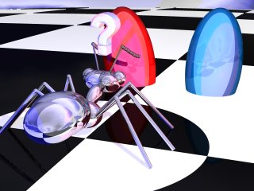

On constate expérimentalement, en renversant sur une planche le contenu
du couvain d'une fourmilière, que les fourmis trient spontanément les
oeufs par stades d'évolution : elles font de petits tas d'oeufs, de
larves et de nymphes. Elles sont même capables de distinguer plusieurs
stades d'évolution pour les oeufs. Comment peut-on expliquer ce
comportement complexe alors qu'une fourmi est un être très simple ? Nous
allons voir dans cet article que l'on peut modéliser par ordinateur ce
comportement observé par les anthomologistes.

<!--more-->

Applet Java
-----------

<applet code="TriFourmi.class" codebase="../java/couvain" width="200" height="250">
<font color="red">
Si vous voyez ce texte, c'est que votre navigateur n'est 
pas compatible Java ou n'a pas &eacute;t&eacute; correctement configur&eacute;.
</font>
</applet>

### Réglages de l'applet

#### Panneau DEPART

Permet de déterminer la disposition de la position de départ : le nombre
de fourmis et d'oeufs de chaque type (A et B ou Rouge et Bleus).

#### Panneau Règles

On y détermine le comportement d'une fourmi : les constantes K+ et K-,
le type de perception (spatiale ou temporelle) et la taille de la
mémoire (dans le cas de la perception temporelle) ou le rayon de
recherche (dans le cas de la perception spatiale).

**Attention !**

Lorsqu'on change le type de perception, il ne faut pas oublier de
modifier la taille de la mémoire ou le rayon de la recherche : ces
valeurs sont conservées lors du changement de mode et ont des ordres de
grandeur différents.

#### Panneau Terrain

Détermine les dimensions du terrain et du coté d'une case de la grille
(en pixels). On peut aussi y régler le temps entre deux mouvements (en
ms). Cette dernière options est utile pour étudier le comportement des
fourmis en détail.

### Lancement de la simulation

Lorsque tous les paramètres sont convenablement règlés, on lance la
simulation en cliquant sur le bouton **[Lancer]**.

Dans la fenètre de simulation, les boutons **[\>]** et **[||]**
permettent de lancer ou arrèter la simulation. Le compteur suivant
indique le temps dans le monde de la fourmi, le bouton **[Vider]**
réinitialise la grille et le dernier bouton permet de fermer cette
fenètre.

Bonne simulation...

Le tri du couvain
-----------------

### Données dont dispose une fourmi sur son environnement

Les fourmis sont capables d'émettre et de capter des molécules appelées
phéromones. Un oeuf de fourmi émet des phéromones différentes suivant
son stade d'évolution. On peut donc légitimement supposer qu'une fourmi
est capable d'estimer la concentration en oeufs du même stade au point
où elle se trouve en "reniflant" les phéromones (qu'elles captent avec
leurs antennes). Par contre, la myopie des fourmis leur interdit d'avoir
une vue d'ensemble du couvain. On peut aussi supposer qu'une fourmi
dispose d'une mémoire à court terme des oeufs qu'elle a rencontré durant
les denières secondes de son déplacement.

On peut donc réaliser deux modèles de comportement : le premier suppose
que la fourmi a une perception spatiale de la concentration en oeufs
d'un type donné, le deuxième fait intervenir la mémoire à court terme de
la fourmi.

### Modélisation du comportement des fourmis

Pour modéliser le comportement de la fourmi, il nous faut simplifier
l'environnement de nos fourmis virtuelles. Nous supposerons que nos
fourmis se déplacent sur une grille. Sur cette grille seront disposés au
début de la simulation des oeufs de 2 types : des Rouges et de Bleus.

La simulation est découpées en tours. A chaque tour, la fourmi se
déplace aléatoirement sur une case adjacente (au nord, au sud, à l'est
ou à l'ouest mais pas en diagonale). Lorsqu'une fourmi arrive sur une
case contenant un oeuf, elle peut décider de l'emporter ou de le
laisser.

Quel que soit le modèle de la perception de la concentration des oeufs,
on peut établir un ensemble de règles régissant les fourmis lors du tri
du couvain :

1. Si une fourmi ne portant rien rencontre un oeuf et que la
   concentration locale de ce type d'oeufs est faible, la fourmi aura
   tendance à l'emporter. Au contraire, si la concentration est forte,
   elle aura tendance à le laisser sur place et a continuer sa route.
2. Si une fourmi porte un oeuf et qu'elle arrive sur une case vide,
   elle aura tendance à déposer cet oeuf si la concentration locale de
   ce type est forte et à le garder si la concentration est faible.

L'applet Java présentée dans cette page modélise ce comportement et
implémente les deux modèles de perception (spatial et temporelle). Vous
en savez maintenant assez pour expérimenter avec cette applet. Je vous
suggère de le faire par vous même avant d'étudier les résultats
présentés ci-dessous.

### Résultats de la simulation informatique

Les résultats de la simulation sont assez convaincants :

#### Perception spatiale (aux temps 0, 1000 et 10 000)


#### Perception temporelle (aux temps 0, 1000, 10 000)


On constate bien que les oeufs sont regroupés par tas d'ouefs
semblables. La méthode semble plus efficace avec une perception spatiale
qu'avec la temporelle.

### Conclusion

Cette simulation permet de valider les modèles du comportement de la
fourmi par simulation. Même si cela ne prouve pas que ces modèles sont
juste, cela permet de penser qu'ils sont efficaces et conduisent à des
résultats semblables à ceux que l'on observe chez les fourmis.

Cette étude est intéressante pour les enthomologistes, mais intéresse
aussi les informaticiens. En effet, cette simulation met en oeuvre une
intelligence collective : à partir de comportements simples, l'ensemble
des fourmis tri les oeufs, alors qu'une fourmi en est incapable seule.
Cette situation de travail collectif se présente en informatique
lorsqu'on fait travailler ensemble plusieurs processeurs. Chaque
processeur est simple mais doit travailler avec ses voisins de manière à
ce que la tâche qu'on leur a confié avance. Les avantages d'une
architecture parallèle sont multiples : tout d'abord, à puissance égale,
plusieurs petits processeurs coutent moins cher qu'un unique processeur
plus perfectionné (c'est ce qui est mis en oeuvre dans la BeBox),
d'autre part, si un processeur vient à tomber en panne, les autres
peuvent continuer à fonctionner, ce qui augmente fortement la tolérance
à la panne.

De toute façon, même si c'est totalement inutile, on s'amuse bien quand
même ;-)

### Pour en savoir plus

Cet article a été rédigé sur la base des travaux de : Guy THERAULAZ,
Eric BONABEAU, Simon GOSS et Jean-Louis DENEUBOURG.

- Pour la science N°198 avril 1994, page 90.

Formules
--------

Pour modéliser le comportement des fourmis sur ordinateur, on doit
passer par un modèle mathématique (l'ordinateur ne comprend pas "la
fourmi aura tendance à ramasser l'oeuf"). Pour le modèle du couvain, on
doit définir 3 formules :

### Concentration en oeufs d'un type

La fourmi ramasse ou dépose un oeuf en fonction de la concentration
locale en oeufs du même type (Rouge ou Bleu dans le modèle). On doit
donc fournir un moyen mathématique pour estimer cette concentration.
Nous avons distinguer deux méthodes possibles :

### Perception spatiale

Dans ce modèle, on estime la concentration en oeufs en déterminant le
nombre d'oeufs du type à évaluer par rapport au nombre de cases autour
de la fourmi. Dans un premier temps, il nous faut donc compter le nombre
d'oeufs du type désiré dans le périmètre de recherche (on peut prendre
les 8 cases entourant la fourmi plus la case sur laquelle elle se
trouve), on appelle ce nombre N. M sera le nombre total de cases dans le
périmètre. La concentration, notée f, sera alors le rapport :

```
f = N / M
```

Il est possible d'étendre le périmètre à un plus grand nombre de cases
(par exemple les 25 cases autour de la fourmi, soit un périmètre de
rayon 2).

### Perception temporelle

Dans ce cas, la concentration d'oeufs est fonction du nombre d'oeufs du
type recherché sur lesquels la fourmi est passé au cours de ses derniers
déplacements. Pour ce faire, on rempli un tableau avec le contenu des
dernières cases sur lesquelles est passée la fourmi : si elle passe sur
une case vide, on note 0, si elle passe sur une case contenant un oeuf
rouge, on note 1, si elle passe sur un bleu, on note 2. A chaque
nouvelle case rencontrée, la nouvelle valeur chasse la plus ancienne. La
taille du tableau est fonction de la mémoire de la fourmi. Une valeur de
15 est raisonnable.

On appelle alors N le nombre d'oeufs du type dont on veut estimer la
concentration et M le nombre de cases dont la fourmi peut se rappeler le
contenu (soit la taille du tableau). Alors, la concentration f sera :

```
f = N / M
```

### Probabilité pour que la fourmi ramasse un oeuf

Lorsqu'une fourmi arrive sur une case comportant un oeuf et qu'elle a
les "mains libres", elle peut ramasser l'oeuf avec une probabilité P+.
Cette probabilité est fonction de la concentration en oeufs du même
type, calculée ci-dessus, f. La formule est :

```
P+ = (K+ / (K+ + f))²
```

K+ est une constante que l'on peut prendre égale à 0,1.

Cette fonction est faite de telle manière à ce que plus la concentration
des oeufs (soit f) est faible, et plus la probabilité que la fourmi
ramasse l'oeuf (soit P+) est voisine de 1.

### Probabilité pour que la fourmi dépose un oeuf

Lorsqu'une fourmi portant un oeuf arrive sur une case vide, elle peut le
déposer avec une probabilité P-. Cette probabilité est fonction de la
concentration en oeufs du même type, calculée ci-dessus, f. La formule
est :

```
P- = (f / (K- + f))²
```

K- est une constante que l'on peut prendre égale à 0,1.

Cette fonction est faite de telle manière à ce que plus la concentration
des oeufs (soit f) est grande, et plus la probabilité que la fourmi
dépose l'oeuf (soit P-) est voisine de 1.

Lorsque la fourmi arrive sur une nouvelle case, on estime la probabilité
qu'elle ramasse un oeuf ou le dépose, puis on tire un nombre aléatoire
réel compris entre 0 et 1, noté x. Si x est inférieur à P+ ou P-, alors
la fourmi ramassera ou déposera son oeuf.
