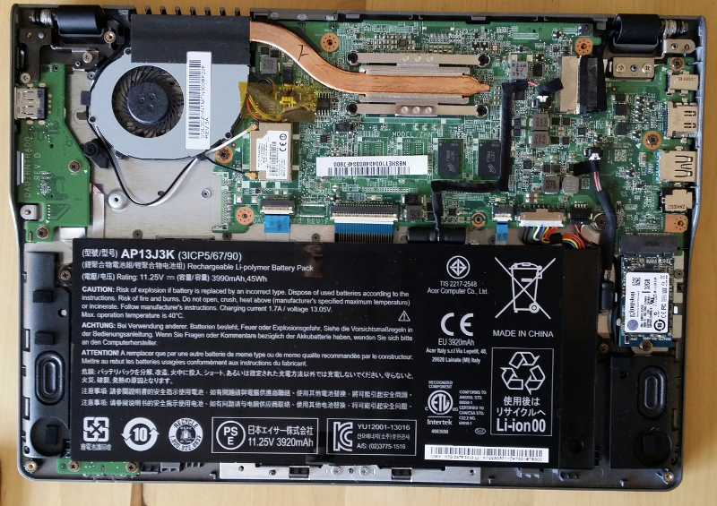
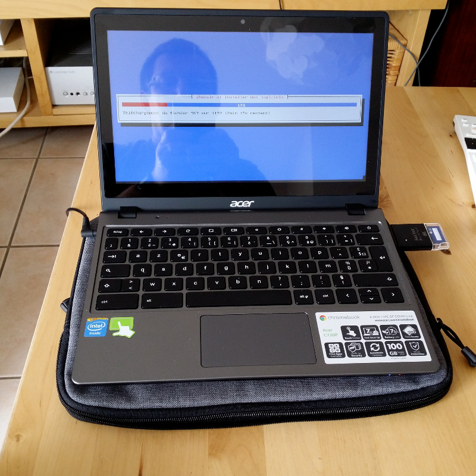

The Acer C720 is a chromebook on which you can install a Linux distribution. This is a cheap solution to get a very mobile device (11.6" display in 1 kg, running more than 7 hours for around 250$). This article gathers my sources to install and run Debian Jessie on this machine.

<!--more-->


Flashing firmware
-----------------

To flash the firmware (and boot straight on Linux):

- Open the case to make the firmware writable unscrewing the write-protect screw : [http://www.chromium.org/chromium-os/developer-information-for-chrome-os-devices/acer-c720-chromebook](http://www.chromium.org/chromium-os/developer-information-for-chrome-os-devices/acer-c720-chromebook).
- Flashing procedure : 
  [https://johnlewis.ie/mediawiki/index.php?title=Flashing\_stock\_firmware\_to\_a\_coreboot\_build\_on\_Acer\_C7\_%28C710%29](https://johnlewis.ie/mediawiki/index.php?title=Flashing_stock_firmware_to_a_coreboot_build_on_Acer_C7_%28C710%29).

**CAUTION!** Opening the chromebook will void the warranty. Furthermore, you can brick your device if flashing fails.

You should backup your firmware before installing the new one. Before you can perform this copy, you **MUST** unprotect it or the copy would be corrupted.

Note that you may see a NORMAL error message while copying the firmware.



Installing Debian
-----------------



To install Testing (which is currently Jessie) for XFCE, take CD 1 at: [http://cdimage.debian.org/cdimage/weekly-builds/amd64/iso-cd/debian-testing-amd64-xfce-CD-1.iso](http://cdimage.debian.org/cdimage/weekly-builds/amd64/iso-cd/debian-testing-amd64-xfce-CD-1.iso).

Then copy this ISO on an USB key with following command:

```sh
dd if=debian-testing-amd64-xfce-CD-1.iso of=/dev/sdX
```

To install Debian on your chromebook, you have to enable developer mode. You can follow [the procedure described on this page](http://www.linux.com/learn/tutorials/764181-how-to-install-linux-on-an-acer-c720-chromebook).

Reboot then start installation from the USB key. You should connect an USB mouse as the trackpad is not recognized out of the box.

Issues during installation:

- netinst didn't work for me (BusyBox wouldn't install).
- I had to disable Wifi security to be able to connect during installation.

Configure trackpad
==================

Trackpad is now managed by latest kernels and can be configured as follows:

- Create a directory for configuration file:

    ```
    $ sudo mkdir /etc/X11/xorg.conf.d
    ```

- Copy default configuration file:

    ```
    $ sudo cp /usr/share/X11/xorg.conf.d/50-synaptics.conf /etc/X11/xorg.conf.d/50-c720-touchpad.conf
    ```

- Add following configuration:

    ```
    Section "InputClass" 
        Identifier      "touchpad peppy cyapa" 
        MatchIsTouchpad "on" 
        MatchDevicePath "/dev/input/event*" 
        MatchProduct    "cyapa" 
        Option          "FingerLow" "5" 
        Option          "FingerHigh" "5"
        Option          "VertEdgeScroll" "0"
        Option          "VertTwoFingerScroll" "1"
        Option          "HorizTwoFingerScroll" "1"
        Option          "AreaRightEdge" "850"
        Option          "AreaLeftEdge" "50"
        Option          "TapButton1" "1"
        Option          "TapButton2" "3"
        Option          "TapButton3" "2"
    EndSection
    ```

Enable special keys
-------------------

### Control sound volume with keyboard

In XFCE, in section **Parameters / Keyboard / Application Shortcuts**, define following entries:

```
<F8>  amixer set Master toggle
<F9>  amixer set Master 5%-
<F10> amixer set Master 5%+
```

### Control LCD Brightness

Install xbacklight:

```sh
sudo apt-get install xbacklight
```

Then define following entries in XFCE keyboards shortcuts:

```
<F6> xbacklight -5
<F7> xbacklight +5
```

### Handle windows with keyboard

In **Parameters / Window Manager / Keyboard** of XFCE, make following associations:

```
Left Desktop                <F1>
Right Desktop               <F2>
Minimize Window             <F3>
Full Screen                 <F4>
Navigate Previous Window    <F5>
```

### Xmodmap Configuration

You can also configure these keys with an Xmodmap configuration. Put following *.xinitrc* file in your home:

```
# ~/.xinitrc
# Configuration file to configure Acer C720 keyboard.

xmodmap .Xmodmap
```

The *.Xmodmap* file would be the following:

```
! ~/.Xmodmap
! Configuration file to map special keys of the Acer C720.

keycode 72 = XF86MonBrightnessDown
keycode 73 = XF86MonBrightnessUp
keycode 74 = XF86AudioMute
keycode 75 = XF86AudioLowerVolume
keycode 76 = XF86AudioRaiseVolume
```

Nevertheless, this works for LCD Brightness but not for sound volume...

To get `Delete` key pressing `Shift-Backspace`, use following *.Xmodmap* configuration file:

```
! ~/.Xmodmap
! Configuration file to get Delete key with Shift-Backspace on the Acer C720.

keycode 22 = BackSpace Delete BackSpace BackSpace
```

### Handle Power key under XFCE

After a Jessie update, hitting Power key result in a shutdown whatever your XFCE preferences regarding Power key management. To solve this issue, edit file */etc/systemd/logind.conf* and add following line:

```
HandlePowerKey=ignore
```

Configure Swappiness
--------------------

SSD discs dont like repeated writings and thus you should limit swapping usage as follows:

- Print current swappiness (that should have default value of *60*):

    ```
    $ cat /proc/sys/vm/swappiness
    ```
    
- Change this value editing file */etc/sysctl.conf* and adding following line:

    ```
    vm.swappiness=1
    ```

Disable Bluetooth
-----------------

Edit file */etc/bluetooth/main.conf* and replace the line `InitialyPowered` with the following one:

```
InitiallyPowered = false
```

To disable bluetooth service (so that it doesn't start on boot), type following line:

```sh
sudo update-rc.d bluetooth disable
```

You can check that bluetooth was disabled typing:

```sh
sudo service bluetooth status
```

Links
-----

Here are links dealing with Linux on Acer C720 :

- [Chromebook to Jessiebook](https://www.circuidipity.com/c720-chromebook-to-jessiebook/).
- [Howto Linux on Acer C720 Chromebook](http://www.linux.com/learn/tutorials/764181-how-to-install-linux-on-an-acer-c720-chromebook).
- [Another new Free Software machine: the Acer C720](http://blogs.fsfe.org/the_unconventional/2014/04/20/acer-c720-chromebook-debian-gnu-linux/).
- [Archlinux on Acer C720](https://wiki.archlinux.org/index.php/Acer_C720_Chromebook).
- [Debian on Acer C720 (German)](http://blog.mdosch.de/2013/12/04/debian-gnulinux-auf-dem-chromebook-acer-c720-installieren/).
- [Fedora sur Acer C720 (French)](http://forums.fedora-fr.org/viewtopic.php?id=61252).

Updates
-------

- **2018-02-06** : Latest kernels versions manage the trackpad. Thus it's not necessary to install a patched kernel anymore. Furthermore, touch screen is also managed.
- **2014-10-11**: Added Xmodmap configuration to get Delete key.
- **2014-06-25**: Since last system update, when I press *Power* button, it prints a menu, as before update, but it shuts down immediately. I'm investigating...
- **2014-08-09**: After last system update the menu does't even appear when I press *Power* button and machine shutdowns immediately.
- **2014-09-11**: The Power key issue was fixed editing file */etc/systemd/logind.conf* (see above).

Unsolved Issues
---------------

- Suspending the machine reboots.
- Mic and cam management?


*Enjoy!*
