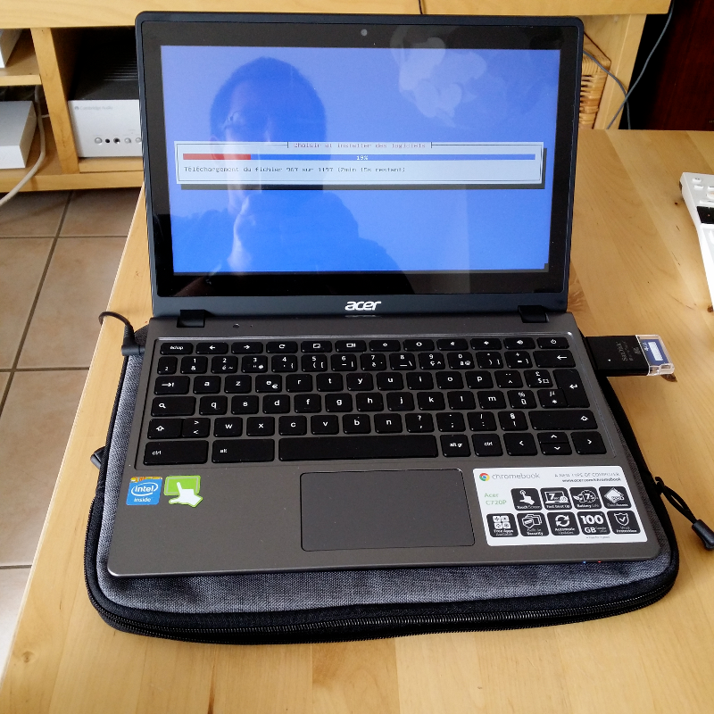

Le Acer C720 est un chromebook sur lequel il est possible d'installer Linux. On peut ainsi réaliser une machine nomade (écran 11,6 pouces pour 1kg environ, autonomie de plus de 7h) pour un prix raisonnable (on le trouve à moins de 270 €). Cet article détaille l'installation de la distribution Linux Debian sur cette machine.

<!--more-->


Flashage du firmware
====================

Pour flasher le firmware (et booter directement sous Linux) :

- Ouvrir la machine pour déverrouiller le firmware (en dévissant une vis) :
  [http://www.chromium.org/chromium-os/developer-information-for-chrome-os-devices/acer-c720-chromebook](http://www.chromium.org/chromium-os/developer-information-for-chrome-os-devices/acer-c720-chromebook).
- Procédure de flashage : 
  [https://johnlewis.ie/mediawiki/index.php?title=Flashing\_stock\_firmware\_to\_a\_coreboot\_build\_on\_Acer\_C7\_%28C710%29](https://johnlewis.ie/mediawiki/index.php?title=Flashing_stock_firmware_to_a_coreboot_build_on_Acer_C7_%28C710%29).

**ATTENTION !** Ouvrir le chromebook annule la garantie. D'autre part, si le flashage est raté, on peut briquer sa machine.

Il est conseillé de sauvegarder son firmware avant d'installer le nouveau. Pour sauvegarder le firmware, il faut qu'il ai été auparavent déverrouillé, sinon l'image sauvegardée sera corrompue.

J'ai eu droit au message d'erreur NORMAL lors du flashage (sueurs froides garanties :o)


Installation de Debian
======================



Installation de la Testing (Jessie) XFCE, images CD (ne prendre que le CD 1): [http://cdimage.debian.org/cdimage/weekly-builds/amd64/iso-cd/debian-testing-amd64-xfce-CD-1.iso](http://cdimage.debian.org/cdimage/weekly-builds/amd64/iso-cd/debian-testing-amd64-xfce-CD-1.iso).

Copier l'ISO sur une clef USB avec la commande :

```bash
dd if=debian-testing-amd64-xfce-CD-1.iso of=/dev/sdX
```

Passer le chromebook en mode développeur. On pourra suivre [la procédure décrite sur cette page](http://www.linux.com/learn/tutorials/764181-how-to-install-linux-on-an-acer-c720-chromebook).

Rebooter puis lancer l'installation à partir de la clef USB. Prévoir une souris USB car le pavé tactile ne fonctionne pas.

Problèmes recontrés lors de l'installation :

- La netinst n'a pas fonctionné dans mon cas (impossible d'installer BusyBox).
- J'ai dû désactiver la sécurité du Wifi pour pouvoir m'y connecter.

Activer le pavé tactile
=======================

Il faut recompiler le kernel. Heureusement d'autres l'ont fait pour nous : on trouve des kernels pour la Jessie avec support du pavé tactile à l'adresse : <http://files.mdosch.de/acer-c720-kernel/>.

Activation des touches spéciales du clavier
===========================================

Contrôle du volume par le clavier
---------------------------------

Sous XFCE, dans **Paramètres / Clavier / Raccourcis d'applications**, définir les raccourcis suivants :

```
<F8>  amixer set Master toggle
<F9>  amixer set Master 5%-
<F10> amixer set Master 5%+
```

Contrôle de la luminosité par le clavier
----------------------------------------

Installer xbacklight :

```bash
sudo apt-get install xbacklight
```

Puis définir les raccourcis suivants dans les raccourcis clavier de XFCE :

```
<F6> xbacklight -5
<F7> xbacklight +5
```

Manipuler les fenêtres avec le clavier
--------------------------------------

Dans **Paramètres / Gestionnaire de fenêtres / Clavier** de XFCE, faire les associations suivantes :

```
Bureau à gauche             <F1>
Bureau à droite             <F2>
Réduire la fenêtre          <F3>
Plein écran                 <F4>
Naviguer fenêtre précédente <F5>
```

Configuration Xmodmap
---------------------

On peut aussi configurer ces touches par une configuration Xmodmap. Placer dans son home le fichier *.xinitrc* suivant :

```
# ~/.xinitrc
# Configuration file to configure Acer C720 keyboard.

xmodmap .Xmodmap
```

Le fichier *.Xmodmap* sera le suivant :

```
! ~/.Xmodmap
! Configuration file to map special keys of the Acer C720.

keycode 72 = XF86MonBrightnessDown
keycode 73 = XF86MonBrightnessUp
keycode 74 = XF86AudioMute
keycode 75 = XF86AudioLowerVolume
keycode 76 = XF86AudioRaiseVolume
```

Cependant, cela fonctionne pour la luminosité de l'écran LCD mais pas pour le volume du son... 

Pour que la combinaison `Shift-Backspace` effectue un `Delete`, on configurera son fichier *.Xmodmap* de la manière suivante :

```
! ~/.Xmodmap
! Configuration file to get Delete key with Shift-Backspace on the Acer C720.

keycode 22 = BackSpace Delete BackSpace BackSpace
```

Gestion de la touche Power sous XFCE
------------------------------------

Suite à une mise à jour de la Jessie, une pressions sur la touche Power du clavier (en haut à droite) provoque un arrêt de la machine, même si l'on a sélectionné une autre option sous XFCE.

Pour corriger le problème, éditer le fichier */etc/systemd/logind.conf* pour ajouter la ligne :

```
HandlePowerKey=ignore
```

Désactiver bluetooth
====================

Editer la configuration */etc/bluetooth/main.conf* et éditer la ligne `InitialyPowered` pour la remplacer par :

```
InitiallyPowered = false
```

Pour que le service bluetooth ne démarre plus taper la commande :

```bash
sudo update-rc.d bluetooth disable
```

On pourra vérifier que ce service n'est pas démarré avec la commande :

```bash
sudo service bluetooth status
```

Liens
=====

Voici des liens utiles traitant de Linux sur Acer C720 :

- [Howto Linux on Acer C720 Chromebook](http://www.linux.com/learn/tutorials/764181-how-to-install-linux-on-an-acer-c720-chromebook).
- [Another new Free Software machine: the Acer C720](http://blogs.fsfe.org/the_unconventional/2014/04/20/acer-c720-chromebook-debian-gnu-linux/).
- [Archlinux on Acer C720](https://wiki.archlinux.org/index.php/Acer_C720_Chromebook).
- [Debian on Acer C720 (German)](http://blog.mdosch.de/2013/12/04/debian-gnulinux-auf-dem-chromebook-acer-c720-installieren/).
- [Fedora sur Acer C720 (Français)](http://forums.fedora-fr.org/viewtopic.php?id=61252).

Mises à jour
============

- **2014-10-11** : Ajout d'une configuration Xmodmap pour ajouter la touche Delete.
- **2014-06-25** : Depuis la dernière mise à jour du système, lorsque je presse le bouton *Power* de la machine, elle affiche le menu, comme avant la mise à jour, mais part en shutdown immédiatement. J'enquête...
- **2014-08-09** : Suite à une mise à jour, le menu ne s'affiche même plus lorsque j'appuie sur le bouton *Power* et la machine s'arrête immédiatement.
- **2014-09-11** : Le problème de bouton power a été résolu en modifiant le fichier de configuration */etc/systemd/logind.conf* (voir ci-dessus).

Problèmes non résolus
=====================

- Suspendre la machine provoque un reboot.
- Gestion de l'écran tactile ?
- Gestion micro et caméra ?


*Enjoy!*
