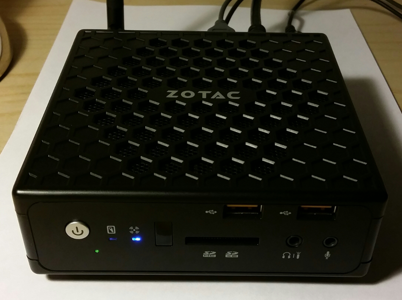
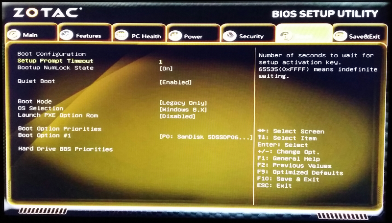
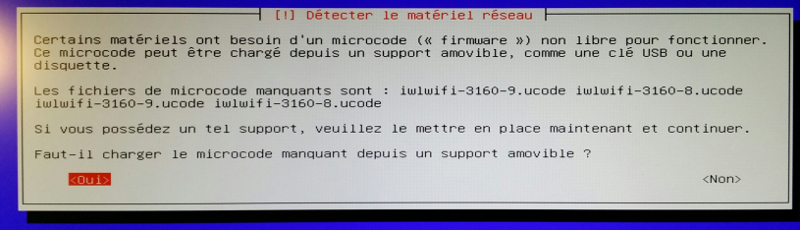
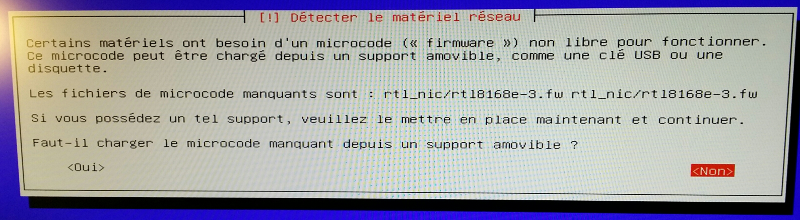

This article details the latest [Debian](http://debian.org) Linux installation on a [Zotac Nano CI320](http://www.zotac.com/products/mini-pcs/zbox-c-series/product/zbox-c-series/detail/zbox-ci320-nano.html).

<!--more-->


I enjoy the silence, low power consumption and processing power of my laptop ([Acer C720P] (http://sweetohm.net/article/debian-jessie-acer-c720p.en.html)) which integrates a *Celeron* CPU so I looked for a desktop machine with this type of processor.

After careful consideration, I pulled the trigger for a [Zotac Nano CI320](http://www.zotac.com/products/mini-pcs/zbox-c-series/product/zbox-c-series/detail/zbox-ci320-nano.html) which integrates a [Celeron N2930] (http://www.cpubenchmark.net/cpu.php?cpu=Intel+Celeron+N2930+%40+1.83GHz). I also considered the *Intel NUC Machines*, but their broken firmware (that you have to upgrade before installing Linux) as well as uncertainty about the chipset some machines embed, dissuaded me to buy one. I also studied the *Gigabyte* machines, but I preferred *Zotac* for its processor having a better power over consumption ratio.

This machine is a *fanless* *barebone PC* (so that you must add memory and a hard drive that are not in the box), ridiculously small (*12.5* x *12.5* x *5* cm). Furthermore, it is well supplied in terms of connectivity (2 USB 2, 4 USB 3, SD Card, HDMI and DisplayPort, SATA, Ethernet, Audio In and Out, IR port).

I added 4 GB of RAM and a 64 GB SSD. I paid *€ 235* for this configuration and added an *Iiyama ProLite E2283HS-B1* monitor for *€ 125*. So I have a *€ 360* configuration, compared to my previous *€ 2,400* PowerBook!

Note that the machine is guaranteed for two years but Zotac extends this period to 5 years **if you register** the machine at this URL: <http://www.zotac.com/support/warranty-manager.html> . Don't forget to do it before 28 days after your purchase date!



Here are my notes while installing a *Debian 8 Jessie* on this machine.

BIOS Configuration
------------------

To install Debian, you must first ensure that the machine boots on the USB port in *legacy* mode. So we must press *ESC* at boot time to go to the boot configuration screen and set the following settings:



Debian Installation
-------------------

Install *Debian 8 Jessie XFCE* with following CD image (take only CD 1):[http://cdimage.debian.org/cdimage/weekly-builds/amd64/iso-cd/debian-testing-amd64-xfce-CD-1.iso](http://cdimage.debian.org/cdimage/weekly-builds/amd64/iso-cd/debian-testing-amd64-xfce-CD-1.iso).

Copy the ISO on a USB stick with following command:

```sh
dd if=debian-testing-amd64-xfce-CD-1.iso of=/dev/sdX
```

Problems encountered during installation:

- Installation aborts if asked to install *Gnome* (that said, this CD image is an *XFCE* version...).
- You must provide firmwares during installation process (see below).

Firmware for Wifi and Ethernet Cards
------------------------------------

This machine embeds WiFi and Ethernet cards that are not supported by Debian without installing non-free firmware (and thus not embedded in the installation disk). And as this firmware if for network cards, it is not possible to download them. The installer then displays the following popups (in French):





Thus you must:

- Download the firmware. You will find [an archive containing all firmwares here](http://sweetohm.net/arc/debian-jessie-zotac-nano-ci320-firmware.tar.gz).
- Format a USB stick in *FAT32* format and create a directory named *firmware*.
- Put the firmware files in the *firmware* directory.

Plug this stick in one of the USB ports of the machine before starting the installation process.

Pages to download the firmware are:

- For those of Wifi card: <http://wireless.kernel.org/en/users/Drivers/iwlwifi>.
- For those of Ethernet card: <https://github.com/mdamt/linux-firmware/tree/master/rtl_nic>.

Conclusion
----------

Given this setup, we can say that Linux support is good (the hardware is supported, sometimes with proprietary code). The only concern, that I know of, are:

- The sound will not switch on the headphones when they are plugged in (it goes on the HDMI port).
- I read in the forums that the IR connector for remote controls (on the front of the machine) is not supported under Linux, but I have not experienced it myself.

After a week in use, I am very satisfied with this machine:

- It is absolutely silent (no moving parts).
- It barely warms.
- Its dimensions make it almost invisible on the desktop. A provided VESA support enables to mount the machine behind the monitor.
- The connectivity is exceptional. I appreciate both USB and SD port on the front.
- The CPU power is not crazy, but it is more than enough for office and web usage.

Thus, I highly recommend this machine with the mother of (almost) all distributions, namely Debian!


*Enjoy!*
