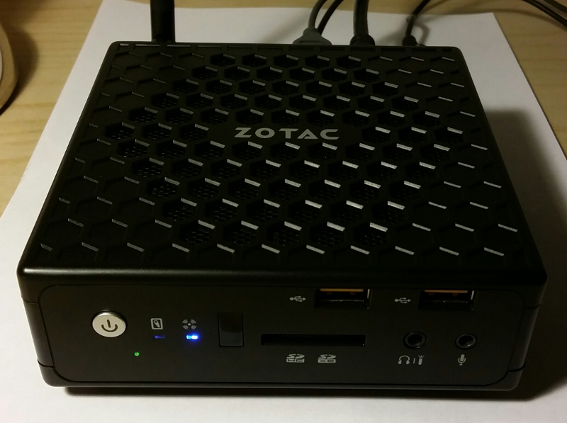
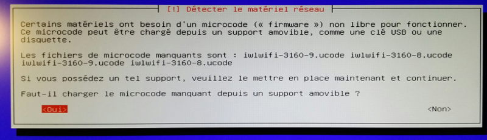

Cet article détaille l'installation de la dernière version de la distribution Linux [Debian](http://debian.org), la Jessie, sur une machine [Zotac Nano CI320](http://www.zotac.com/products/mini-pcs/zbox-c-series/product/zbox-c-series/detail/zbox-ci320-nano.html).

<!--more-->


J'avais apprécié le silence, la basse consommation et la puissance de mon portable ([un Acer C720P](http://sweetohm.net/article/debian-jessie-acer-c720p.html)) qui embarque un processeur *Celeron* et j'ai donc cherché une machine de bureau avec ce type de processeur peu gourmand.

Après mûres réflexions, je me suis décidé pour un [Zotac Nano CI320](http://www.zotac.com/products/mini-pcs/zbox-c-series/product/zbox-c-series/detail/zbox-ci320-nano.html) qui embarque un [Celeron N2930](http://www.cpubenchmark.net/cpu.php?cpu=Intel+Celeron+N2930+%40+1.83GHz). J'ai aussi considéré les machine *NUC Intel*, mais leur firmware moisi (qu'il faut mettre impérativement à jour avant d'installer Linux), ainsi que l'incertitude concernant le chipset de certaines machines m'ont dissuadé. J'ai aussi étudié les machines *Gigabyte*, mais j'ai préféré la *Zotac* pour son processeur ayant un meilleur rapport *puissance / consommation*.

Cette machine est un *barebone* auquel il faut ajouter mémoire et disque dur, *fanless*, donc sans ventilateur, de petites dimensions (*12,5* x *12,5* x *5* cm). Il est bien fourni en termes de connectique (2 USB 2, 4 USB 3, Carte SD, Ports DisplayPort et HDMI, DD SATA, Ethernet, Audio In et Out, Port IR).

J'ai ajouté 4 Go de RAM et un disque SSD de 64 Go. La machine m'est revenu à *235 €*. J'y ai ajouté un moniteur *Iiyama ProLite E2283HS-B1* qui m'a coûté *125 €*. J'ai donc une configuration à *360 €*, à comparer aux *2400 €* de la configuration précédente !

A noter que la machine est garantie deux ans mais que Zotac étend cette durée à 5 ans **si on enregistre** la machine à cette URL : <http://www.zotac.com/support/warranty-manager.html>. Ne pas oublier de le faire, on a 28 jours après la date d'achat !



Voici mes notes prises lors de l'installation d'une *Debian 8 Jessie* sur cette machine.

Configuration du BIOS
---------------------

Pour installer la Debian, il faut commencer par faire en sorte que la machine démarre sur le port USB en mode *legacy*. On doit donc appuyer sur *ESC* au démarrage de la machine pour se rendre dans la configuration du boot et effectuer les réglages suivants :


Installation de Debian
----------------------

Installation de la *Debian 8 Jessie* XFCE, images CD (ne prendre que le CD 1): [http://cdimage.debian.org/cdimage/weekly-builds/amd64/iso-cd/debian-testing-amd64-xfce-CD-1.iso](http://cdimage.debian.org/cdimage/weekly-builds/amd64/iso-cd/debian-testing-amd64-xfce-CD-1.iso).

Copier l'ISO sur une clef USB avec la commande :

```sh
dd if=debian-testing-amd64-xfce-CD-1.iso of=/dev/sdX
```

Problèmes rencontrés lors de l'installation :

- Si on demande l'installation de *Gnome* l'installation plante (ceci dit, on installe un version *XFCE*...).
- Il faut fournir à l'installeur des microcodes pour les cartes réseau (voir ci-dessous).

Microcode pour les cartes Wifi et Ethernet
------------------------------------------

Cette machine embarque des cartes réseau Wifi et Ethernet qui ne sont pas prises en charge par Debian sans installer du microcode spécifique non libre (et donc qui n'est pas embarqué dans le disque d'installation). D'autre par, puisqu'il s'agit des cartes réseau, il n'est pas possible de les télécharger. L'installeur affiche donc les popups suivantes :




Il faut donc :

- Télécharger le microcode. Vous trouverez [une archive contenant tous les firmwares ici](http://sweetohm.net/arc/debian-jessie-zotac-nano-ci320-firmware.tar.gz).
- Formater une clef USB en FAT32 et y créer un répertoire *firmware*.
- Placer les fichiers des firmwares dans le répertoire *firmware*.

On placera cette clef dans un des ports USB de la machine avant de lancer la procédure d'installation.

Les pages pour télécharger les firmwares sont les suivantes :

- Pour ceux de la carte Wifi : <http://wireless.kernel.org/en/users/Drivers/iwlwifi>.
- Pour ceux de la carte Ethernet : <https://github.com/mdamt/linux-firmware/tree/master/rtl_nic>.

Conclusion
----------

Au vu de cette installation, on peut dire que le support de Linux est bon (le matériel est pris en charge, parfois avec du code propriétaire). Les seuls soucis dont j'ai connaissance sont les suivants :

- Le son ne bascule pas sur les écouteurs lorsqu'ils sont branchés.
- J'ai lu dans des forums que le connecteur IR pour les télécommandes (en façade) n'est pas supporté sous Linux, mais je ne l'ai pas expérimenté moi-même.

A l'utilisation, je suis très satisfait de cette machine :

- Elle est absolument silencieuse (aucune pièce mobile).
- Elle ne chauffe pratiquement pas.
- Ses dimensions la font oublier sur le bureau. Un support livré permet de la fixer derrière le moniteur.
- La connectique est exceptionnelle. J'apprécie les deux USB et le port SD en façade.
- La puissance n'est pas fofolle, mais c'est largement suffisant pour de la bureautique et du web.

Vous l'aurez compris, je vous recommande chaudement cette machine avec la mère de toutes les distributions (ou presque), à savoir la Debian !


*Enjoy!*
