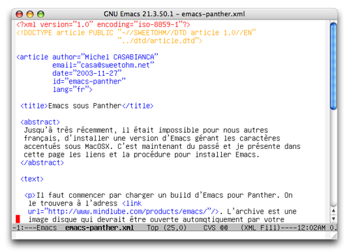

Jusqu'à très récemment, il était impossible, pour nous autres français,
d'installer une version d'Emacs gérant les caractères accentués sous
MacOSX. C'est maintenant du passé et je présente dans cette page les
liens et la procédure pour installer Emacs avec le support de l'encodage
ISO-8859-1.

<!--more-->

Il faut commencer par télécharger un build d'Emacs pour Panther. On le
trouvera à l'adresse <http://www.mindlube.com/products/emacs/>.
L'archive est une image disque qui devrait être montée automatiquement
sur votre bureau par votre navigateur. Il suffit alors de déplacer
l'application dans votre répertoire */Applications*.

Il faut ensuite télécharger les fontes appropriées. On pourra les
trouver à l'adresse
<http://members.shaw.ca/akochoi-emacs/stories/Resources/GNU-Fonts.smi.bin>.
Cette archive est aussi une image disque et il suffit de déplacer les
fontes qu'elle contient dans votre répertoire *\~/Library/Fonts* (ou
encore dans */Library/Fonts* pour en faire profiter tous les
utilisateurs de votre Mac).

Pour finir, il faut encore indiquer à Emacs la méthode de saisie du
texte (pour être capable de saisir des caractères en ISO-8859-1). Pour
ce faire, on ajoutera la ligne suivante dans son *.emacs* :

```lisp
(setq mac-keyboard-text-encoding kTextEncodingISOLatin1)
```

Vous pouvez maintenant lancer Emacs et profiter des caractères accentués
:



L'Emacs ainsi installé est aussi celui qui sera lancé dans le terminal
et remplacera avantageusement celui livré avec l'OS, en apportant la
colorisation syntaxique et une meilleure gestion du clavier. On pourra
ajouter les lignes suivantes dans son *.emacs* pour enlever la ligne de
menu, inutile en mode terminal :

```lisp
(if (eq window-system nil)
    ;; Terminal
    (progn
      (menu-bar-mode nil)
      )
  ;; Aqua
  (progn 
    (setq mac-keyboard-text-encoding kTextEncodingISOLatin1)
    (set-screen-width 93)
    (set-screen-height 60)
    (set-cursor-color "red")
    ))
```


La colorisation en mode terminal nécessite un terminal supportant les
codes couleur. Pour ce faire, les utilisateurs de iTerm (un terminal
évolué pour MacOSX) pourront ouvrir la boîte de dialogue des préférences
(en cliquant sur **iTerm/Préférences**), puis en cliquant sur le bouton
**Session par défaut** et en sélectionnant l'item **xterm-color** dans
la liste déroulante.


Pour finir, je trouve pour ma part la taille de la police par défaut
trop grande et j'ai trouvé le moyen de la réduire avec la ligne suivante
dans mon *.emacs* :

```lisp
(set-default-font "-etl-fixed-medium-r-normal--12-120-75-75-m-120-iso8859-1")
```

Cependant, ce paramétrage n'est pas parfait car il ne change pas la
taille de toutes les fontes utilisées par Emacs (par exemple, la fonte
utilisée par la speedbar reste inchangée). Toute amélioration
bienvenue !

Enjoy!
