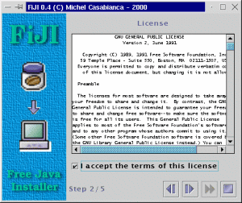
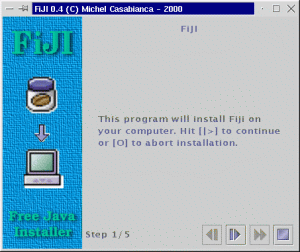
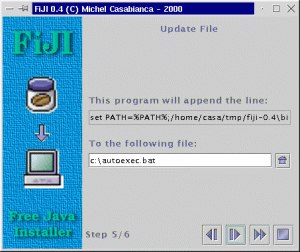

FiJI is a Free Java Installer released under GPL. It enables you to
distribute your applications with easy installation : the user doesn't
have to edit lauching scripts (to modify a `CLASSPATH` for instance).

<!--more-->



Installing FiJI
---------------

Auto installer [fiji-1.0-1.jar](../arc/fiji-1.0-1.jar)

To install FiJI, you must first install a 1.2 or 1.3 Java Virtual
Machine. You can download one for free on [Sun's web
site](http://java.sun.com/products/jdk/1.2).

The latest version of FiJI is on [my web
page](http://sweetohm.net/article/fiji.html). To install it, go to the
directory where you saved the archive and type `java -jar fiji-0.4.jar`.
Windows and Solaris users can simply double-click the file. FiJI is
delivered with himself has a self extracting installer, so you should
have an idea of what it can do.

**Note:** Windows may complain that it doesn't have enough environment
space. In this case, add the line `shell=command.com      /E:8000 /P` to
your *config.sys* file and reboot. Furthermore, the environment should
not alter file names, there is an option under Windows NT to work with
case sensitive file names.

Building FiJI
-------------

To build FiJI, you will need Ant version 1.2. You can download it on
[Apache web site](http://jakarta.apache.org/ant). Simply type `ant` in
the install directory to rebuild.

Using FiJI
----------

Let's have a look on the *install.xml* file in the install directory of
FiJI :

```xml
<?xml version="1.0" encoding="iso-8859-1"?>

<install jar="/tmp/fiji-0.4.jar"
         logo="lib/logo.gif">
    <text title="FiJI"
          text="This program will install Fiji on\
                your computer. Hit [|>] to continue\
                or [O] to abort installation."/>
    <license file="lib/LICENSE"/>
    <copy dir="tmp"
          property="fiji.home"
          defaults="Windows=c:\Fiji,Unix=/usr/local/fiji">
          <filter file="bin/fiji" from="@HOME@" to="${fiji.home}"/>
          <filter file="bin/fiji.bat" from="@HOME@" to="${fiji.home}"/>
    </copy>
    <link from="${fiji.home}/bin/fiji"
          to="/usr/local/bin"
          mandatory="no"/>
    <append file="c:\autoexec.bat"
            line="set PATH=%PATH%;${fiji.home}\bin"
            os="Windows"
            mandatory="no"/>
    <text title="Congratulation !"
          text="FiJI have been installed succesfully.\
                Hit [O] to terminate this program."/>
</install>
```

This XML file is a script for the installation. Each element is a screen
of the installer:

1. The first screen (*text* element) shows a welcome message. This
   message is written in the *text* attribute of this element.
2. Then the user must agree the license (in the *license* element). The
   path to the license file is in the *file* attribute.
3. The third screen (*copy* element) asks for an installation directory
   and copies files in that directory.
4. Then, if the user is running a Unix box, it will be prompt for a
   destination directory (in his *PATH*) for a link to the script
   launching the application.
5. If the user is installing the program on Windows, the next screen
   will append a line to his *autoexec.bat* file (to put the *bin*
   directory in the *PATH*).
6. The program ends the installation with another message that informs
   the user that the installation was successful.

As you can see, this script is quite simple and easy to code (few
minutes when you know the syntax of these elements). To produce the
installation Jar file, simply go the directory of the script and type
`fiji`. You can indicate the location of the script on the command line
and specify a verbosity argument (`-v`). Type `fiji -help` for a short
help on the command line arguments.

To run the installer, the user will have to go the the directory where
he saved the Jar file, and type : `java -jar      archive-name.jar`, or
double click it (on Windows or Solaris).

FiJI Tasks
----------

The elements of the install file are tasks (except for the root element
and filters). The root element, *install* can accept two attributes :

```xml
<install jar="../fiji-0.3.jar"
         logo="lib/logo.gif">
...
</install>
```

The first one, *jar* names the produced Jar installer. The second gives
the URL of the logo (the picture on the left of the frame). This
attribute is not mandatory (no image is dispayed if this attribute is
missing).

You can customize the installer interface with the *theme* element (that
comes just after *install* one). It may have up to six attributes
(*primary1*, *primary2*, *primary3*, *secondary1*, *secondary2* and
*secondary3*) that define a hexadecimal coded color. Those six colors
define a theme for Swing(Metal look & feel), as defined [on this page
page](http://java.sun.com/products/jlf/dg/higg.htm). For instance, the
following element defines the theme for the FiJI installer:

```xml
<theme primary2="6eb2ce"
       primary3="d5fedc"/>
```

In order the install script to be fully portable, the paths must be
written in the URL notation (Unix paths). Just replace under Windows the
antislash with slash. Thus, you would write *foo/bar.txt* instead of
*foo\\bar.txt*. Furthermore, relative paths are relative to the
directory of the *install.xml* script.

Each screen of the installer is processed by a specific task. Those
tasks are :

### Text

This task shows a simple text (in the *text* attribute) with a title (in
the *title* attribute). For instance:

```xml
<text title="FiJI"
      text="This program will install Fiji on\
            your computer. Hit [>] to continue\
            or [O] to abort installation."/>
```

Produces the screen:



This is the first screen of the installer for FiJI itself. Those two
attributes are mandatory. A new line is indicated with an antislash.

### License

This task displays a license for agreement. The user must agree (by
clicking on the message *I accept the terms of this License*) this
license or abort installation. For instance:

```xml
<license file="lib/LICENSE"/>
```

Displays the screen:


This element displays the license in the text file *LICENSE* in the
*lib* subdirectory (all paths are relative to the directory of the
*install.xml* script, except for absolute ones, starting with "/").

### Copy

This task installs the content of a directory (the one of the
application to install) in a directory chosen by the user. This
directory is ziped when the archive is being built.

```xml
<copy dir="tmp"
      property="fiji.home"
      defaults="Windows=c:\Fiji,Unix=/usr/local/fiji">
      <filter file="bin/fiji" from="@HOME@"
              to="${fiji.home}"/>
      <filter file="bin/fiji.bat" from="@HOME@"
              to="${fiji.home}"/>
</copy>
```

Displays the following screen:


The *dir* attribute indicates the source directory to copy. *property*
gives to the program the property name for the installation directory.
You can use this property in other tasks. For instance, the attribute
*to* of the element *filter* is *\${fiji.home}*, so it will be replaced
with the installation directory. The last attribute, *defaults*
indicates a list of default install dirs with their targeted plateform.

The *filter* elements can be nested within *copy* ones. They are usefull
to filter some given files. For instance, the element :

```xml
<filter file="bin/fiji" from="@HOME@"
        to="${fiji.home}"/>
```

Will filter the file *bin/fiji* (of the directory, *after*
installation), replacing the string `@HOME@` with `${fiji.home}`, which
is the installation directory (which name is given by the *property*
attribute of the *copy* element). Thus, the following script:

```bash
#!/bin/sh
java -jar @HOME@/fiji.jar -v "$@"
```

Will be replaced (after the filter applies) by:

```bash
#!/bin/sh
java -jar /usr/local/fiji/fiji.jar -v "$@"
```

On the user's hard disk, if he chosed */usr/local/fiji* as installation
directory (the default install dir for Unix).

When the user clicks on the **[\>]** button, the files will be copied
and the progress bar shows the progression.

### Link

This task is specific to Unix systems (and won't be processed on other
systems). Let's consider the following element:

```xml
<link from="${fiji.home}/bin/fiji" to="/usr/local/bin"/>
```

It will display the screen:


This task will perform two things :

1. It will make the file *\${fiji.home}/bin/fiji* (the launching
   script) runnable (with `chmod a+rx ${fiji.home}/bin/fiji`).
2. It will make a symlink from this file to the directory the user
   choosed (the default value is */usr/local/bin*), that is supposed to
   be in the *PATH* of the user, with
   `ln -sf ${fiji.home}/bin/fiji /usr/local/bin`.

The user can now type `fiji` on the command line to launch FiJI.

### KDE Desktop

This task is for Unix systems running the KDE window manager (and will
not be processed on other systems). Let's consider the following
element:

```xml
<kdeDesktop exec="fiji"
            icon="${fiji.home}/prj/fiji/lib/fiji.gif"
            term="1"/>
```

It will display the screen:


This task prompts for adding an icon on the desktop of the user to
launch the application. The *exec* attribute indicates the command line
to launch the application. *icon* is the path to the icon file (on the
system where the program have been installed). *term* indicates if the
program must be launched in a terminal (*1* value) or not (*0* value).

### File update

This task append a line to a given file. It is useful to update a
configuration file (such as *autoexec.bat* or */etc/profile*). The
corresponding element is:

```xml
<append file="c:\autoexec.bat"
        line="set PATH=%PATH%;${fiji.home}\bin"
        os="Windows"/>
```

This element will display the following screen:



This task displays the line (in the attribute *line*) to append to a
file which default name is in *file* attribute. The *os* attribute
indicates the target OS.

### Common attributes for all tasks

All tasks accept the following attributes:

- **mandatory** (*yes* or *no* values) indicates if this task is
  mandatory (any task defaults to mandatory). If it is not, the user
  can click on the [\>\>] button to skip this task. If a task is
  mandatory, this button is disabled.
- **title** gives the title for the task (see the *text* task for more
  details).
- **text** is the same than *title* but for the text of the task. For
  the *license* task, it indicates the text to accept the license. The
  *link* tasks can take a second text for the second line of the
  screen. This text is set with the *text2* attribute.
- **error** is used to set the error text for some tasks that may
  display some. This is the case for *license* task (if the user did
  not accept the license) and *kdeDesktop* (error when creating the
  shortcut). Some tasks can have two error messages: *copy* (error
  creating the installation directory and copying files) and *link*
  (error changing mode and making the link). The second error message
  is set using the *error2* attribute.

Those attributes make it possible to customize the interface but also to
translate the installer.

How it works
------------

To explain the principles of this program, we must consider two stages :
the generation of the Jar installer and the extraction performed by the
installer.

The builder generates the installer (that is a Jar file) this way :

1. The xml builder (class *casa.fiji.builder.XmlBuilder*) reads the XML
   file (*install.xml*) and builds an object tree while processing
   elements. It uses reflection (and doesn't know anything about the
   generated objects). When it encounters a *foo* element, it
   instanciates a *Foo* object. When it encounters a *bar* attribute,
   it calls a method named *setBar()* with the value of the attribute
   on the parent element. When an element *bar* is nested within an
   element *foo*, it calls a method *add* on the object *Foo* with
   *Bar* as argument.
2. The main class of the builder (*casa.fiji.builder.Main*) collects
   the resources needed by the classes involved in the installer and
   put them in the Jar file (that will be the installer itself).
3. Then the *casa.fiji.installer.Install* class (the main class of the
   installer, generated by the XML builder) is serialized and placed in
   the Jar installer. It coutains references to the other classes of
   the installer, that are this way serialized too.

This method is a simple way to configure the classes of the installer.
Their configuration is performed by the XML builder by calling their
methods *setFoo()*. Furthermore, this methods is light : the serialized
classes weight less than 1000 compressed bytes, that is far less than
the weight of the XML file itself (and if I used an XML parser to
configure the installer, I would have to carry the parser in the
archive).

I have been told that there could be problems between versions of
serialized classes, but I had no problems during my tests (with 1.1, 1.2
and 1.3 virtual machines).

The second stage (extraction of the archive) works this way :

1. When you lauch the Jar file, the *main()* method of the main class
   of the installer (*casa.fiji.installer.Install*) is called. This
   class deserializes itself, obtaining the serialized data in the Jar
   file. The object tree of the installer is then rebuilt.
2. This class selects the apropriate tasks (calling the methods
   *isValid()* of each task in the stack). A task can be valid for a
   given OS or if a given directory exists for instance.
3. Then the installer calls the *init()* and *done()* method of the
   tasks as the user view them.
4. A task performs its work in the *done()* method that is called by
   the installer when the user clicks the **[\>]** button. If it does
   something quick (that doesn't cause CPU starvation), it return
   *true*, indicating to the installer that the work is done. If a task
   takes a long time (such as copying many files), it returns *false*.
   When the work is done, it calls the method *update()* of the
   installer to indicate that to work is done.

This text is a rapid overview of the builder and the installer, dig the
code for more details (without comments, sorry ;o).

How to develop new tasks for FiJI
---------------------------------

FiJI is an extensible system: it is possible to develop new tasks to
meet your specific needs. I will take as example the `Link` task that
makes a link (for Unix systems) from a script to a directory in the
*PATH*.

### XML element

To make such a link, you must know the source file and target directory.
Thus, the element for this task will be the following:

```xml
<link from="${fiji.home}/bin/fiji" to="/usr/local/bin"/>
```

The *link* element gives the name of the class to develop (`Link` with
an uppercase in order to follow the Java naming conventions). The *from*
attribute gives the name of the source file while *to* indicates the
target directory for the link.

### Initialisation de l'installeur

When the FiJI XML parser encounters such an element, it tries to
instantiate the `Link` class, the invokes the `setFrom()` and `setTo()`
methods on it. The FiJI task system is extensible because the program
knows nothing about the tasks it builds, but uses reflexion instead.
Thus, it is not necessary to modify FiJI's source code to add new tasks.

Furthermore, hour class must extend the abstract class
`casa.fiji.installer.Task` in order to be a valid task. It must also
live in the `casa.fiji.installer` package.

To finish about tasks, I have to talk about the resources and classes to
add in the installer file. Because this file must contain all the
necessary classes and resources to run, you must indicate those in the
*install.xml* file.

Task classes are automatically added (using reflexion) by the `Task`
class: it adds the class for the task and the GUI (which name is the one
of the class plus *UI*, so if the class for the task is called `Link`,
the class for the GUI is called `LinkUI`) in the list of files to add in
the archive. If your code uses another class, it must do so using the
`addClass()` method in it's contructor and passing the list of qualified
class names (with package) to this method. In our example, adding new
classes in the archive is not necessary, so we don't have to call this
method.

If your task uses resources (such as an icon file), you declare it
invoking the `addResources()` method, passing the list of files as
argument. Note that the GUI reference is marqued *transient* because
this GUI must not be serialized (as it is dangerous and useless to
serialize this object).

You know enought now to anderstand the first part of the class `Task`
that is following:

```java
/*
 * This program is free software; you can redistribute it and/or
 * modify it under the terms of the GNU General Public License
 * as published by the Free Software Foundation; either version 2
 * of the License, or any later version.
 *
 * This program is distributed in the hope that it will be useful,
 * but WITHOUT ANY WARRANTY; without even the implied warranty of
 * MERCHANTABILITY or FITNESS FOR A PARTICULAR PURPOSE.  See the
 * GNU General Public License for more details.
 *
 * You should have received a copy of the GNU General Public License
 * along with this program; if not, write to the Free Software
 * Foundation, Inc., 59 Temple Place - Suite 330, Boston, MA  02111-1307, USA.
 */

package casa.fiji.installer;

import casa.fiji.util.Misc;
import java.awt.*;
import javax.swing.*;
import java.io.*;
import java.util.*;

/**
 * The link  task. It creates a link from a script (or executable) to a
 * directory in the PATH. For Unix systems only.
 */
public class Link extends Task {

    /**
     * The from part of the link.
     */
    String from=null;
    /**
     * The from part of the link, expanded.
     */
    String fromExpanded=null;
    /**
     * The to part of the link.
     */
    String to=null;
    /**
     * The to part of the link, expanded.
     */
    String toExpanded=null;
    /**
     * The reference to the GUI.
     */
    transient LinkUI ui=null;
    /**
     * The resources used by this task.
     */
    static final String[] resources={"lib/home.gif"};

    /**
     * Constructor. Adds resources to the jar installer.
     */
    public Link() {
        super();
        addResources(resources);
    }

    /**
     *Sets the from part of the link.
     */
    public void setFrom(String from) {this.from=from;}

    /**
     * Sets the to part of the link.
     */
    public void setTo(String to) {this.to=to;}

```

This first part is called when the installer archive is built (to
initialize the `Link` task). All the tasks rely in a `Vector` in the
`casa.fiji.install.Install` class (that is the main class of the
installer). This object (and other tasks it contains) is serialized in
the installer file. When running the installer, this object is
deserialized and launched, which launches the install procedure.

### Installer initialization

We will now study the part of the code running at installation time.

First, that installer must know if the task is to be runned on the host
sytem (some tasks run only on given systems and/or configurations). To
do so, it calls the `isValid()` method that returns a boolean. In our
task, we simply return *true* if the system is Unix.

Then, the installer must retrieve the task's GUI. It is done by calling
the `getUI()` method. Our method simply instantiates a `LinkUI` object
and returns it.

Those methods are called during installer initialization. The following
ones are called when the task is processed:

The `init()` method is called when the task's GUI is shown. It evaluates
the *from* and *to* expressions, that is, it replaces property
references with their value. For instance, it will replace
*\${fiji.home}/bin/fiji* with */usr/local/fiji/bin/fiji* if the
installation directory is */usr/local/fiji*. Note that the expanded
values are stored in fields suffixed with *Expanded* in order another
evaluation to remain possible if the user come back to a previous task.

When the user clicks on the **[\>]** button (to call the next task), the
installer calls the `next()` method of the current task. This method
returns *true* if everything is OK and *false* if something went wrong
during the operation. In this case, the next task is not shown.

Here is the code for this part of the task:

```java
    /**
     * Indicates if the system running the installer should run this task.
     * That is if it is a Unix like system.
     */
    public boolean isValid() {
        return isUnix();
    }

    /**
     * Returns the GUI for this task.
     */
    public Component getUI() {
        ui=new LinkUI(this);
        return ui;
    }

    /**
     * Init is called when the task is shown in the installer. It expands
     * the from and to parts of the link (evaluating expressions).
     */
    public void init() {
        fromExpanded=Misc.expand(from);
        toExpanded=Misc.expand(to);
        ui.setFrom(fromExpanded);
        ui.setTo(toExpanded);
    }

    /**
     * Creates the link (when the user clicks on the next button).
     */
    public boolean next() {
        // build the chmod command
        toExpanded=ui.getTo();
        String command="chmod a+x "+fromExpanded;
        String error=Misc.execute(command);
        // if error, display an error message
        if(error!=null) {
            JOptionPane.showMessageDialog(ui,
                "Unbable to change the mode:\n"+command+'\n'+error,
                "Error",JOptionPane.ERROR_MESSAGE);
            return false;
        }
        // build the ln command
        command="ln -sf "+fromExpanded+" "+toExpanded;
        error=Misc.execute(command);
        // if error, display an error message
        if(error!=null) {
            JOptionPane.showMessageDialog(ui,
                "Unbable to make the link:\n"+command+'\n'+error,
                "Error",JOptionPane.ERROR_MESSAGE);
            return false;
        }
        return true;
    }
}
```

### Graphic Interface

We must code a GUI for our task. This interface is implemented in the
`LinkUI` class which source code is:

```java
/*
 * This program is free software; you can redistribute it and/or
 * modify it under the terms of the GNU General Public License
 * as published by the Free Software Foundation; either version 2
 * of the License, or any later version.
 *
 * This program is distributed in the hope that it will be useful,
 * but WITHOUT ANY WARRANTY; without even the implied warranty of
 * MERCHANTABILITY or FITNESS FOR A PARTICULAR PURPOSE.  See the
 * GNU General Public License for more details.
 *
 * You should have received a copy of the GNU General Public License
 * along with this program; if not, write to the Free Software
 * Foundation, Inc., 59 Temple Place - Suite 330, Boston, MA  02111-1307, USA.
 */

package casa.fiji.installer;

import casa.fiji.util.Misc;
import java.io.*;
import java.awt.*;
import java.awt.event.*;
import javax.swing.*;

/**
 * The GUI for the link task.
 */
public class LinkUI extends JPanel implements ActionListener {

    /**
     * The refernce to the task.
     */
    Link link=null;
    /**
     * The text field for the directory.
     */
    JTextField field=new JTextField();
    /**
     * The label for the from part of the link.
     */
    JTextField label=new JTextField();
    /**
     * Home button.
     */
    JButton buttonHome=new JButton(new
        ImageIcon(ClassLoader.getSystemResource("lib/home.gif")));

    /**
     * The constructor. GUI initialization.
     */
    public LinkUI(Link link) {
        this.link=link;
        ui();
    }

    /**
     * GUI initialization.
     */
    void ui() {
        setLayout(new GridBagLayout());
        Misc.add(this,new JLabel("Link"), 0, 0, 2, 1, 0.0, 0.0,
            GridBagConstraints.NORTH, GridBagConstraints.NONE,
            new Insets(10, 10, 10, 10));
        Misc.add(this,new JLabel("This program will make a link from:"),
            0, 1, 2, 1, 0.0, 1.0,GridBagConstraints.SOUTHWEST,
            GridBagConstraints.NONE,new Insets(10, 10, 5, 10));
        Misc.add(this,label, 0, 2, 2, 1, 1.0, 0.0,
            GridBagConstraints.SOUTHWEST, GridBagConstraints.HORIZONTAL,
            new Insets(0, 10, 10, 10));
        Misc.add(this,new JLabel("to a directory in your PATH:"),
            0, 3, 2, 1, 0.0, 0.0,GridBagConstraints.NORTHWEST,
            GridBagConstraints.NONE,new Insets(10, 10, 5, 10));
        Misc.add(this,field, 0, 4, 1, 1, 1.0, 1.0,
            GridBagConstraints.NORTHWEST, GridBagConstraints.HORIZONTAL,
            new Insets(0, 10, 10, 5));
        Misc.add(this,buttonHome, 1, 4, 1, 1, 0.0, 1.0,
            GridBagConstraints.NORTHEAST, GridBagConstraints.NONE,
            new Insets(0, 0, 10, 10));
        buttonHome.addActionListener(this);
        buttonHome.setMargin(new Insets(0,0,0,0));
        label.setEditable(false);
    }

    /**
     * User actions processing.
     */
    public void actionPerformed(ActionEvent e) {
        if(e.getSource()==buttonHome) {
            JFileChooser chooser=new
                JFileChooser(System.getProperty("user.home"));
            chooser.setDialogType(JFileChooser.OPEN_DIALOG|
                JFileChooser.DIRECTORIES_ONLY);
            int returnVal=chooser.showOpenDialog(this);
            File dir=chooser.getCurrentDirectory();
            if(dir.isDirectory()) field.setText(dir.getAbsolutePath());
        }
    }

    /**
     * Sets the to part of the link.
     */
    public void setTo(String to) {field.setText(to);}

    /**
     * Returns the to part of the link.
     */
    public String getTo() {return field.getText();}

    /**
     * Sets the from part of the link.
     */
    public void setFrom(String from) {label.setText(from);}
}
```

This class is quite obvious except that it must extend (directly or not)
`JPanel`. Note that it uses the `add()` method of `casa.fiji.util.Misc`
class that adds a component to a `GridBagLayout`. Please don't code
graphic interfaces using absolute coordinates for components (your code
would not be portable).

To use a task in FiJI, you must put the classes in the *CLASSPATH* to
use it.

I hope this overview is sufficient to start coding tasks. I think the
best way to do so is to modify the example source code. Please feel free
to contact me for any question.

### Tasks License

This program is under GPL, so any task should have the same license.
Anyway, you might use this installer to distribute a program under any
license (including commercial ones).

Ant task
--------

To use this task in a build file, you must drop the archive *fiji.jar*
in the *lib* directory of your Ant installation.

### Description

Using this task, you can generate FiJI installers from within an Ant
build file.

The declarative element (after the *\<project\>* one) is the following:

```xml
<taskdef name="fiji" classname="net.cafebabe.fiji.builder.FijiTask"/>
```

### Parameters

Attribute       | Description                                                    | Required
:-------------- | :------------------------------------------------------------- | :----------------------
file            | Installer definition file.                                     | Yes
verbose         | If *true*, messages are printed during installer generation.   | No (defaults to *no*)

### Nested elements

This task accepts no nested element or text.

### Examples

To generate an installer which definition file is *fiji/install.xml* in
verbose mode, you might write :

```xml
<fiji file="fiji/install.xml"
      verbose="true"/>
```

License
-------

This software is free and released under the
[GPL](http://www.gnu.org/copyleft/gpl.html). You can find a copy of this
license in the file *LICENSE* in the installation directory.

History
-------

### Version 1.0-1 (2003-01-12)

This version fixes a bug when loading XML configuration file (with a
message "String index out of range: 1"). Many thanks to Daphné
Costantini for this bug report. Also fixes a bug in the installer of the
application.

### Version 1.0 (2002-11-16)

- New Ant task to generate FiJI installers.
- New package name (`net.cafebabe.fiji`).

### Version 0.4 (2000-12-31)

- New *title*, *text* and *mandatory* for all elements.
- New *append* task that enable to update a configuration file.
- The [\>\>] button (to skip a task) and the task counter have been
  added to the interface.
- The installer interface may be customized using theme.

### Version 0.3 (2000-12-27)

- This version have been heavily tested on Windows.
- Error management have been improved (exception stack traces have
  been replaced with clear messages, for instance, the program clearly
  indicates that it doesn't find the configuration file).
- Some attribute names have been changed for clarity. The attribute
  `src` of the element *copy* have been renamed to *dir*, *prop* have
  been renamed to *property*. The *target* attribute of the *filter*
  element have been renamed *file*.
- The `Task` interface have been simplified (the `done()` method,
  quite tricky to implement, have been replaced by `next()` much
  simpler). Task writing should be much easier.
- The source code is commented and API docs rely in the *api*
  subdirectory of the docs.
- UML diagrams rely in the *uml* subdirectory.

### Version 0.2 (2000-06-11)

- The documentation have been translated in French.
- A bug in the launching script for Windows have been corrected
  (thanks to Romain Guy).
- A bug related to Windows platform detection have been corrected.
- The jar file for the Sun's XML parser have been included.

### Version 0.1 (2000-06-07)

- The entire architecture have been improved.
- First fully functionnal version.
- First distributed version.

### Version 0.0 (2000-06-01)

- Demo version to validate the concept.

*Enjoy !*
