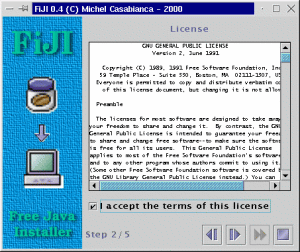
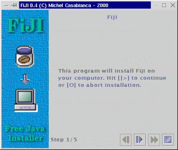
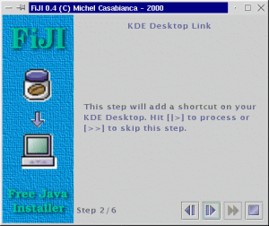

FiJI est un installeur Java sous licence GPL. Il permet de distribuer
simplement des applications sans que l'utilisateur ait à modifier des
scripts de lancements (pour modifier un `CLASSPATH` par exemple).

<!--more-->



Installer FiJI
--------------

Auto installeur [fiji-1.0-1.jar](../arc/fiji-1.0-1.jar).

Pour installer FiJI, vous devez au préalable installer une machine
virtuelle Java 1.2 or 1.3. On peut en télécharger une gratuitement sur
le [site web de Sun](http://java.sun.com/products/jdk/1.2).

La dernière version de FiJI est disponible sur [ma page
personnelle](http://sweetohm.net/article/fiji.html). Pour l'installer,
se rendre dans le répertoire de l'archive Jar et taper
`java -jar fiji-0.4.jar`. Les utilisateurs de Windows et Solaris peuvent
se contenter de cliquer sur le fichier pour lancer l'installation. FiJI
étant distribué avec lui-même, sous forme d'archive Jar
auto-extractible, vous pouvez vous faire une idée de ses capacités lors
de son installation.

**Note:** Sous Windows, le système peut se plaindre de ne pas disposer
d'assez d'espace d'environnement. Dans ce cas, ajouter la ligne
`shell=command.com /E:8000 /P` à votre fichier *config.sys* puis
rebooter le système. D'autre part, il est préférable de ne pas altérer
la casse des noms de fichiers (il existe une option sous Windows NT pour
travailler avec des noms de fichier distinguant la casse).

Compiler FiJI
-------------

Pour compiler FiJI, vous devez installer Ant version 1.2. Vous pouvez le
télécharger sur [le site d'Apache](http://jakarta.apache.org/ant). Taper
simplement `ant` dans le répertoire d'installation de FiJI pour le
recompiler.

Utiliser FiJI
-------------

Examinons le fichier *install.xml* du répertoire de FiJI (qui permet de
générer l'archive d'installation de FiJI) :

```xml
<?xml version="1.0" encoding="iso-8859-1"?>

<install jar="/tmp/fiji-0.4.jar"
         logo="lib/logo.gif">
    <text title="FiJI"
          text="This program will install Fiji on\
                your computer. Hit [|>] to continue\
                or [O] to abort installation."/>
    <license file="lib/LICENSE"/>
    <copy dir="tmp"
          property="fiji.home"
          defaults="Windows=c:\Fiji,Unix=/usr/local/fiji">
          <filter file="bin/fiji" from="@HOME@" to="${fiji.home}"/>
          <filter file="bin/fiji.bat" from="@HOME@" to="${fiji.home}"/>
    </copy>
    <link from="${fiji.home}/bin/fiji"
          to="/usr/local/bin"
          mandatory="no"/>
    <append file="c:\autoexec.bat"
            line="set PATH=%PATH%;${fiji.home}\bin"
            os="Windows"
            mandatory="no"/>
    <text title="Congratulation !"
          text="FiJI have been installed succesfully.\
                Hit [O] to terminate this program."/>
</install>
```

Ce fichier XML est un script pour la procédure d'installation. Chaque
élément y représente un écran.

1. Le premier (élément *text*) affiche un message de bienvenue. Ce
   message est écrit dans l'attribut *text* de cet élément.
2. Ensuite l'utilisateur doit accepter la licence (dans l'élément
   *license*, dont le fichier est indiqué par l'attribut *file*).
3. Le troisième écran (élément *copy*) demande à l'utilisateur d'entrer
   le répertoire d'installation et y recopie les fichiers.
4. Ensuite si l'utilisateur tourne sous Unix, il lui est demandé un
   répertoire de son *PATH* pour qu'un lien vers le script de lancement
   du programme y soit tiré.
5. Si l'utilisateur installe le programme sous Windows, il lui est
   proposé d'ajouter une ligne à son fichier *autoexec.bat* (qui place
   le répertoire *bin* du programme dans le *PATH*).
6. Pour finir, le programme se termine sur un dernier message indiquant
   que l'installation s'est bien déroulée.

Comme vous pouvez le constater, ce script est assez simple et facile à
coder (quelques minutes lorsqu'on connaît la syntaxe des les éléments).
Pour produire le fichier Jar d'installation, se placer dans le
répertoire du script et taper *fiji*. Il est aussi possible de passer le
chemin du script sur la ligne de commande. On peut aussi indiquer au
programme que l'on souhaite être tenu au courant de l'avancement des
opérations avec l'option *-v*. On obtient de l'aide avec *-?*.

Pour lancer l'installeur Jar produit, l'utilisateur doit se placer dans
le répertoire de l'archive et taper *java -jar nom-archive.jar* sur la
ligne de commande, ou bien double cliquer ce fichier (sous Windows ou
Solaris).

Les tâches de FiJI
------------------

Les éléments du fichier *install.xml* correspondent à des tâches (sauf
pour l'élément racine et les filtres). L'élément racine *install*
accepte deux attributs :

```xml
<install jar="../fiji-0.3.jar"
         logo="lib/logo.gif">
...
</install>
```

Le premier, *jar*, donne le nom du fichier Jar produit. Le second
indique l'URL du logo (l'image à gauche de la fenêtre). Ce dernier
attribut n'est pas obligatoire (aucune image n'est affichée s'il est
absent).

Il est possible de personnaliser l'interface de l'installeur avec
l'élément *theme* (qui doit venir juste après *install*). Il peut
comporter 6 attributs (*primary1*, *primary2*, *primary3*, *secondary1*,
*secondary2* et *secondary3*) représentant chacun une couleur codée en
hexadecimal. Ces six couleurs permettent de définir un thème pour Swing
(look & feel Metal), comme indiqué [sur cette
page](http://java.sun.com/products/jlf/dg/higg.htm). Par exemple,
l'élément suivant définit le thème de l'installeur de FiJI:

```xml
<theme primary2="6eb2ce"
       primary3="d5fedc"/>
```

Afin que les scripts d'installation soient portables, les chemins des
fichiers doivent être écrits avec une notation URL (chemins Unix). En
pratique, cela consiste à remplacer, sous Windows, les antislashs par
des slashs. Donc on écrira *foo/bar.txt* à la place de *foo\\bar.txt*.
D'autre part, les chemins relatifs le sont par rapport au répertoire du
script *install.xml*.

Chaque écran de l'installeur est traité par une tâche donnée. Ces tâches
sont :

### Text

Cette tâche affiche un simple texte (dans l'attribut *text*) précédé
d'un titre (dans l'attribut *title*). Par exemple :

```xml
<text title="FiJI"
      text="This program will install Fiji on\
            your computer. Hit [>] to continue\
            or [O] to abort installation."/>
```

Produit l'écran suivant :



Cet écran est le premier de l'installeur de FiJI lui-même. Ces deux
attributs sont obligatoires. Un retour à la ligne est indiqué par un
anti-slash.

### License

Cette tâche affiche une licence pour agrément. L'utilisateur doit
l'accepter (en cliquant sur le message *I accept the terms of this
License*) ou arrêter l'installation. Par exemple :

```xml
<license file="lib/LICENSE"/>
```

Affiche l'écran :


Cet élément affiche le fichier *LICENSE* du sous répertoire *lib* (tous
les chemins sont relatifs au répertoire du script *install.xml*, sauf
s'ils sont absolus, donc s'ils commencent par "/").

### Copy

Cette tâche copie le contenu d'un répertoire (celui de l'application à
installer) dans un répertoire choisi par l'utilisateur. Ce répertoire a
été zippé lors de la génération de l'archive Jar.

```xml
<copy dir="tmp"
      property="fiji.home"
      defaults="Windows=c:\Fiji,Unix=/usr/local/fiji">
      <filter file="bin/fiji" from="@HOME@"
              to="${fiji.home}"/>
      <filter file="bin/fiji.bat" from="@HOME@"
              to="${fiji.home}"/>
</copy>
```

Affiche l'écran suivant :


L'attribut *dir* indique le répertoire source à copier. *property*
communique au programme le nom de la propriété par laquelle on peut
récupérer le répertoire d'installation. Il est possible d'utiliser cette
propriété dans une autre tâche. Par exemple, l'attribut *to* de
l'élément *filter* est *\${fiji.home}*, qui sera remplacé par le
répertoire d'installation. Le dernier attribut, *defaults* indique une
liste des répertoires d'installation par défaut suivant les plateformes
(séparés par des virgules).

Des éléments *filter* peuvent être inclus dans l'élément *copy*. Ils
permettent de filtrer certains fichiers. Par exemple, l'élément suivant
:

```xml
<filter file="bin/fiji" from="@HOME@"
        to="${fiji.home}"/>
```

Va filtrer le fichier *bin/fiji* (du répertoies *après* installation) en
remplaçant la chaîne `@HOME@` par `${fiji.home}` qui est le répertoire
d'installation (dont le nom est extrait de la propriété indiquée par
l'attribut *property* de l'élément *copy*). Par conséquent, le script
suivant :

```bash
#!/bin/sh
java -jar @HOME@/fiji.jar -v "$@"
```

Donnera, après application du filtre :

```bash
#!/bin/sh
java -jar /usr/local/fiji/fiji.jar -v "$@"
```

Sur le disque de l'utilisateur, si ce dernier a choisi */usr/local/fiji*
comme répertoire d'installation (celui par défaut pour les systèmes
Unix).

Lorsque l'utilisateur clique sur le bouton **[\>]**, les fichiers sont
recopiés et la barre de progression indique l'avancement de la copie.

### Link

Cette tâche est spécifique aux système Unix (elle ne sera pas exécutée
sur d'autres systèmes). Considérons l'élément suivant :

```xml
<link from="${fiji.home}/bin/fiji" to="/usr/local/bin"/>
```

Il donnera l'écran :


Cette tâche réalise deux choses :

1. Elle rend le fichier *\${fiji.home}/bin/fiji* (le script de
   lancement) exécutable (avec la commande
   `chmod a+rx ${fiji.home}/bin/fiji`).
2. Elle tire un lien de ce fichier vers le répertoire choisi par
   l'utilisateur (dont la valeur par défaut est */usr/local/bin*), qui
   est supposé être dans le *PATH* de l'utilisateur, avec la commande
   `ln       -sf ${fiji.home}/bin/fiji /usr/local/bin`.

L'utilisateur peut alors taper `fiji` sur la ligne de commande pour
lancer l'application.

### KDE Desktop

Cette tâche est spécifique aux système Unix sous gestionnaire de fenêtre
KDE (elle ne sera pas exécutée sur d'autres systèmes). Considérons
l'élément suivant :

```xml
<kdeDesktop exec="fiji"
            icon="${fiji.home}/prj/fiji/lib/fiji.gif"
            term="1"/>
```

Il donnera l'écran :



Cette tâche propose d'ajouter une icône pour lancer l'application sur le
bureau de l'utilisateur. L'attribut *exec* indique l'exécutable à lancer
lorsqu'on clique sur l'icône. *icon* indique le chemin (sur le système
sur lequel le programme est installé) vers l'icône. *term* indique si
l'on doit lancer le programme dans un terminal (valeur *1*) ou non
(*0*).

### Mise à jour d'un fichier

Cette tâche ajoute une ligne à un fichier. Elle permet par exemple de
mettre à jour un fichier de configuration (comme *autoexec.bat* ou
*/etc/profile*). L'élément correspondant est le suivant:

```xml
<append file="c:\autoexec.bat"
        line="set PATH=%PATH%;${fiji.home}\bin"
        os="Windows"/>
```

Cet élément affichera l'écran suivant:


Cette tâche affiche la ligne (dans l'attribut *line*) ajoutée à un
fichier dont la valeur par défaut est dans *file*. L'attribut *os*
indique l'OS ciblé.

### Attributs communs à toutes les tâches

Toutes les tâches comportent des attributs communs:

- **mandatory** (valeur *yes* ou *no*) indique si cette tâche est
  obligatoire (toute tâche l'est par défaut). Si une tâche n'est pas
  obligatoire, l'utilisateur peut la passer en cliquant sur le bouton
  [\>\>], sinon ce bouton est désactivé pour la tâche.
- **title** donne le titre de la tâche (voir la tâche *text* pour plus
  de précisions).
- **text** idem pour le texte d'une tâche. Pour la tâche *license*,
  cela indique le texte d'acceptation de la licence. La tâche *link*
  comporte un deuxième texte (pour la deuxième ligne de l'écran) que
  l'on détermine par l'attribut *text2*.
- **error** est utilisé par certaines tâches pour leur texte d'erreur.
  C'est le cas de *license* (si l'utilisateur n'a pas accepté la
  licence), et *kdeDesktop* (erreur lors de la création du raccourci).
  D'autres en ont deux: *copy* (erreur de création du répertoire
  d'installation et de copie des fichiers) et *Link* (erreur de
  changement du mode et de création du lien). Le deuxième message
  d'erreur est indiqué avec l'attribut *error2*.

Ces attributs permettent de personnaliser l'interface, mais surtout de
la traduire.

Fonctionnement de FiJI
----------------------

Pour expliquer le fonctionnement de ce programme, il nous faut examiner
deux étapes : la génération de l'installeur Jar et l'extraction réalisée
par l'installeur.

### Génération de l'installeur

L'installeur (qui est un fichier Jar) est généré de la manière suivante
:

1. Le générateur XML (dont la classe est
   *casa.fiji.builder.XmlBuilder*) lit le script XML (fichier
   *install.xml*) et construit un arbre d'objets lors du parsing. Il
   utilise l'introspection (et ne connaît rien des objets générés).
   Lorsqu'il rencontre un élément *foo*, il instancie un objet *foo*.
   Lorsqu'il rencontre un attribut *bar*, il appelle la méthode
   *setBar()* de l'élément parent en lui passant la valeur de
   l'attribut en paramètre. Lorsqu'un élément *bar* est inclus dans un
   élément *foo*, il appelle la méthode *add()* de l'objet *foo* en
   passant *bar* en argument.
2. La classe principale du générateur (*casa.fiji.builder.Main*)
   collecte les ressources (images, fichiers ou autre) demandées par
   les classes de l'installeur et les place dans le fichier Jar (qui
   constitue l'installeur).
3. Ensuite la classe *casa.fiji.installer.Install* (qui est la classe
   principale de l'installeur, générée par le générateur) est
   sérialisée et placée dans l'installeur Jar. Cette classe contient
   les références des autres classes de l'installeur qui sont donc
   sérialisées par la même occasion.

Cette méthode utilisant la sérialisation a le mérite d'être simple. La
configuration des classes de l'installeur est réalisée lors de la
construction de l'arbre des objets (lors du parsing XML) par appel des
méthodes *setFoo()*. De plus, cette méthode est légère : les classes
sérialisées pèsent moins de 700 octets compressés, ce qui est moins que
le fichier XML lui-même (et si l'on utilisait un parser XML, il faudrait
l'inclure dans l'archive, ce qui l'alourdirait).

Je me suis laissé dire que l'on peut rencontrer des problèmes lors de la
désérialisation de classes issues de VMs de différentes versions, mais
aucune classe de l'API Java n'est sérialisée et je n'ai pas rencontré de
problèmes lors de mes tests (avec des machines virtuelles 1.1, 1.2 et
1.3).

### Extraction de l'archive

La deuxième étape (extraction de l'archive) fonctionne de la manière
suivante :

1. Lorsqu'on lance le fichier Jar, la méthode *main()* de la classe
   principale de l'installeur (*casa.fiji.installer.Install*) est
   appelée. Elle désérialise l'instance de l'objet, en extrayant sa
   forme sérialisée du fichier Jar. L'arbre des objets de l'installeur
   est alors reconstruit.
2. Cette classe sélectionne les tâches appropriées (en appelant la
   méthode *isValid()* pour toutes les tâches de la pile). Une tâche
   peut n'être valide que pour un système d'exploitation donné ou si un
   répertoire donné existe par exemple (la condition est codée dans la
   méthode *isValid()* de la tâche en question).
3. L'installeur récupère ensuite les interfaces graphiques des tâches
   avec la méthode *getUI()*.
4. Ensuite, l'installeur appelle la méthode *init()* d'une tâche
   lorsque celle-ci est affichée et sa méthode *done()* lorsque
   l'utilisateur clique sur le bouton **[\>]**.
5. Une tâche réalise son travail dans la méthode *done()*. Si cette
   tâche consomme peu de temps machine (en ne tirant qu'un simple lien
   par exemple), elle renvoie *true*, indiquant à l'installeur que la
   tâche est terminée. Si par contre elle prend du temps (en recopient
   de nombreux fichiers par exemple), elle renvoie *false*. Lorsque le
   travail est terminé, elle appelle la méthode *update()* de
   l'installeur pour indiquer qu'elle a fini son travail.

Ce texte n'est qu'un simple survol du fonctionnement de FiJI, et je vous
invite à examiner le code de plus près pour plus de détails (le code
n'est cependant pas encore commenté).

Développer de nouvelles tâches pour FiJI
----------------------------------------

FiJI est un système extensible: il est possible de développer ses
propres tâches pour répondre à des besoins spécifiques. Je prendrai
comme exemple la tâche *Link* qui crée un lien (pour les système Unix)
d'un script de lancement vers un répertoire du *PATH*.

### Element XML

Pour créer un tel lien, il nous faut connaître les fichiers source et
destination de ce lien. L'élément pour cette tâche aura donc l'allure
suivante:

```xml
<link from="${fiji.home}/bin/fiji" to="/usr/local/bin"/>
```

L'élément *Link* donne le nom de la classe à développer (`Link` avec une
majuscule, pour se conformer aux conventions de nommage Java).
L'attribut *from* indique le fichier source alors que *to* indique le
répertoire de destination du lien.

### Initialisation de l'installeur

Lorsque le parser XML de FiJI rencontre cet élément, il tente
d'instancier la classe `Link` puis invoque les méthodes `setFrom()` et
`setTo()` sur cet objet. Le système des tâches de FiJI est extensible
dans la mesure où le programme ne sait rien des tâches qu'il construit,
mais procède par introspection pour construire l'installeur. Il n'est
donc pas nécessaire de modifier le code de FiJI pour y ajouter de
nouvelles tâches.

D'autre part, notre classe doit étendre le classe abstraite
`casa.fiji.installer.Task` pour être une tâche valide. Elle doit aussi
appartenir au paquet `casa.fiji.installer`.

Pour finir, il me faut encore parler des ressources et classes à ajouter
au jar de l'installeur. En effet, ce fichier est construit par FiJI et
doit contenir toutes les classes et ressources nécessaires à
l'installeur généré, on doit donc lui indiquer.

En ce qui concerne les classes, cela est fait automatiquement (par
introspection) par la classe parente `Task`: elle ajoute aux fichiers à
placer dans l'installeur la classe de la tâche et son interface
graphique (dont le nom est, par convention, celui de la classe auquel on
ajoute `UI`, donc si notre tâche s'appelle `Link`, son interface
graphique doit être codée dans une classe s'appelant `LinkUI`). Si l'on
doit ajouter une autre classe, on doit le faire dans le constructeur de
notre tâche avec la méthode `addClasses()` à laquelle on passe un
tableau de chaînes contenant le nom qualifié des classes (avec leur
paquet). Dans notre exemple, il n'est pas nécessaire d'ajouter des
classes, donc cette méthode n'est pas appelée.

Par contre, on doit ajouter un fichier de ressource pour une icône, ce
que l'on fait avec la méthode `addResources()` à laquelle on passe un
tableau des fichiers à ajouter. On notera que la référence à l'interface
graphique de notre tâche est marquée `transient` car elle ne doit être
sérialisée (il est inutile et dangereux de sérialiser des éléments
d'interface graphique).

Nous en savons assez pour comprendre la première partie du source de la
classe `Link` que voici:

```java
/*
 * This program is free software; you can redistribute it and/or
 * modify it under the terms of the GNU General Public License
 * as published by the Free Software Foundation; either version 2
 * of the License, or any later version.
 *
 * This program is distributed in the hope that it will be useful,
 * but WITHOUT ANY WARRANTY; without even the implied warranty of
 * MERCHANTABILITY or FITNESS FOR A PARTICULAR PURPOSE.  See the
 * GNU General Public License for more details.
 *
 * You should have received a copy of the GNU General Public License
 * along with this program; if not, write to the Free Software
 * Foundation, Inc., 59 Temple Place - Suite 330, Boston, MA  02111-1307, USA.
 */

package casa.fiji.installer;

import casa.fiji.util.Misc;
import java.awt.*;
import javax.swing.*;
import java.io.*;
import java.util.*;

/**
 * The link  task. It creates a link from a script (or executable) to a
 * directory in the PATH. For Unix systems only.
 */
public class Link extends Task {

    /**
     * The from part of the link.
     */
    String from=null;
    /**
     * The from part of the link, expanded.
     */
    String fromExpanded=null;
    /**
     * The to part of the link.
     */
    String to=null;
    /**
     * The to part of the link, expanded.
     */
    String toExpanded=null;
    /**
     * The reference to the GUI.
     */
    transient LinkUI ui=null;
    /**
     * The resources used by this task.
     */
    static final String[] resources={"lib/home.gif"};

    /**
     * Constructor. Adds resources to the jar installer.
     */
    public Link() {
        super();
        addResources(resources);
    }

    /**
     *Sets the from part of the link.
     */
    public void setFrom(String from) {this.from=from;}

    /**
     * Sets the to part of the link.
     */
    public void setTo(String to) {this.to=to;}

```

Cette première partie du code est appelée lors de la constuction de
l'archive de l'installeur (pour intialiser la tâche `Link`). Toutes les
tâches sont contenues dans un vecteur de la classe
`casa.fiji.install.Install` qui est la classe principale de
l'installeur. Cet objet (et les tâches intialisées qu'il contient) est
sérialisé dans l'archive de l'installeur. Lors de l'exécution de
l'installeur, cet objet est désérialisé puis exécuté, ce qui lancera la
procédure d'installation.

### Exécution de l'installeur

Nous allons maintenant voir la partie du code exécutée lors de
l'installation.

Pour commencer, l'installeur doit savoir si la tâche doit être exécutée
(certaines sont spécifiques à des plateformes ou configurations). Il
appelle donc la méthode `isValid()` qui renvoie un booléen. Dans notre
cas, nous renvoyons `true` si la plateforme est un Unix.

Ensuite, l'installeur doit récupérer l'interface graphique de la tâche.
Pour ce faire, il appelle la méthode `getUI()`. Notre méthode instancie
un objet `LinkUI` et le renvoie.

Les méthodes ci-dessus sont invoquées lors du lancement de l'installeur.
Les suivantes le sont lors de l'exécution d'une tâche:

La méthode `init()` est appelée lorsque l'interface graphique de la
tâche est affichée. Elle se contente d'évaluer les expressions pour
*from* et *to*, c'est à dire, remplacer les références à des propriétés
par leur valeur. Par exemple, *\${fiji.home}/bin/fiji* sera remplacé par
*/usr/local/fiji/bin/fiji* si le répertoire d'installation est
*/usr/local/fiji*. On notera qu'après évaluation, on enregistre ces
valeurs dans des variables suffixées par *Expanded*, de manière à ce que
si l'utilisateur revient en arrière, ces expressions soient réévaluées.

Pour finir, l'installeur appelle la méthode `next()` lorsque
l'utilisateur clique sur le bouton **[\>]** pour passer à l'étape
suivante. Cette méthode crée le lien et renvoie une valeur booléenne
indiquant que l'opération s'est bien déroulée. Si c'est le cas,
l'installeur passe à l'étape suivante, sinon, un message d'erreur est
affiché et l'on reste à l'étape courante.

Voici le source de cette partie du code:

```java
/**
 * Indicates if the system running the installer should run this task.
 * That is if it is a Unix like system.
 */
public boolean isValid() {
    return isUnix();
}

/**
 * Returns the GUI for this task.
 */
public Component getUI() {
    ui=new LinkUI(this);
    return ui;
}

/**
 * Init is called when the task is shown in the installer. It expands
 * the from and to parts of the link (evaluating expressions).
 */
public void init() {
    fromExpanded=Misc.expand(from);
    toExpanded=Misc.expand(to);
    ui.setFrom(fromExpanded);
    ui.setTo(toExpanded);
}

/**
 * Creates the link (when the user clicks on the next button).
 */
public boolean next() {
    // build the chmod command
    toExpanded=ui.getTo();
    String command="chmod a+x "+fromExpanded;
    String error=Misc.execute(command);
    // if error, display an error message
    if(error!=null) {
        JOptionPane.showMessageDialog(ui,
            "Unbable to change the mode:\n"+command+'\n'+error,
            "Error",JOptionPane.ERROR_MESSAGE);
        return false;
    }
    // build the ln command
    command="ln -sf "+fromExpanded+" "+toExpanded;
    error=Misc.execute(command);
    // if error, display an error message
    if(error!=null) {
        JOptionPane.showMessageDialog(ui,
            "Unbable to make the link:\n"+command+'\n'+error,
            "Error",JOptionPane.ERROR_MESSAGE);
        return false;
    }
    return true;
}
```

### Interface graphique

Pour finir, il nous faut fournir une interface graphique pour notre
tâche. Cette interface est implémentée dans la classe `LinkUI` dont
voici le source:

```java
/*
 * This program is free software; you can redistribute it and/or
 * modify it under the terms of the GNU General Public License
 * as published by the Free Software Foundation; either version 2
 * of the License, or any later version.
 *
 * This program is distributed in the hope that it will be useful,
 * but WITHOUT ANY WARRANTY; without even the implied warranty of
 * MERCHANTABILITY or FITNESS FOR A PARTICULAR PURPOSE.  See the
 * GNU General Public License for more details.
 *
 * You should have received a copy of the GNU General Public License
 * along with this program; if not, write to the Free Software
 * Foundation, Inc., 59 Temple Place - Suite 330, Boston, MA  02111-1307, USA.
 */

package casa.fiji.installer;

import casa.fiji.util.Misc;
import java.io.*;
import java.awt.*;
import java.awt.event.*;
import javax.swing.*;

/**
 * The GUI for the link task.
 */
public class LinkUI extends JPanel implements ActionListener {

    /**
     * The refernce to the task.
     */
    Link link=null;
    /**
     * The text field for the directory.
     */
    JTextField field=new JTextField();
    /**
     * The label for the from part of the link.
     */
    JTextField label=new JTextField();
    /**
     * Home button.
     */
    JButton buttonHome=new JButton(new
        ImageIcon(ClassLoader.getSystemResource("lib/home.gif")));

    /**
     * The constructor. GUI initialization.
     */
    public LinkUI(Link link) {
        this.link=link;
        ui();
    }

    /**
     * GUI initialization.
     */
    void ui() {
        setLayout(new GridBagLayout());
        Misc.add(this,new JLabel("Link"), 0, 0, 2, 1, 0.0, 0.0,
            GridBagConstraints.NORTH, GridBagConstraints.NONE,
            new Insets(10, 10, 10, 10));
        Misc.add(this,new JLabel("This program will make a link from:"),
            0, 1, 2, 1, 0.0, 1.0,GridBagConstraints.SOUTHWEST,
            GridBagConstraints.NONE,new Insets(10, 10, 5, 10));
        Misc.add(this,label, 0, 2, 2, 1, 1.0, 0.0,
            GridBagConstraints.SOUTHWEST, GridBagConstraints.HORIZONTAL,
            new Insets(0, 10, 10, 10));
        Misc.add(this,new JLabel("to a directory in your PATH:"),
            0, 3, 2, 1, 0.0, 0.0,GridBagConstraints.NORTHWEST,
            GridBagConstraints.NONE,new Insets(10, 10, 5, 10));
        Misc.add(this,field, 0, 4, 1, 1, 1.0, 1.0,
            GridBagConstraints.NORTHWEST, GridBagConstraints.HORIZONTAL,
            new Insets(0, 10, 10, 5));
        Misc.add(this,buttonHome, 1, 4, 1, 1, 0.0, 1.0,
            GridBagConstraints.NORTHEAST, GridBagConstraints.NONE,
            new Insets(0, 0, 10, 10));
        buttonHome.addActionListener(this);
        buttonHome.setMargin(new Insets(0,0,0,0));
        label.setEditable(false);
    }

    /**
     * User actions processing.
     */
    public void actionPerformed(ActionEvent e) {
        if(e.getSource()==buttonHome) {
            JFileChooser chooser=new
                JFileChooser(System.getProperty("user.home"));
            chooser.setDialogType(JFileChooser.OPEN_DIALOG|
                JFileChooser.DIRECTORIES_ONLY);
            int returnVal=chooser.showOpenDialog(this);
            File dir=chooser.getCurrentDirectory();
            if(dir.isDirectory()) field.setText(dir.getAbsolutePath());
        }
    }

    /**
     * Sets the to part of the link.
     */
    public void setTo(String to) {field.setText(to);}

    /**
     * Returns the to part of the link.
     */
    public String getTo() {return field.getText();}

    /**
     * Sets the from part of the link.
     */
    public void setFrom(String from) {label.setText(from);}
}
```

Cette classe est assez classique si ce n'est qu'elle doit dériver
(directement ou non) de `JPanel`. D'autre part, on notera qu'elle
utilise `add()` de la classe `casa.fiji.util.Misc` qui permet d'ajouter
un composant à un `GridBagLayout`. On prendra soin de ne pas coder des
interfaces avec des coordonnées en dur sans quoi elles ne sont pas
portables (pas même entre systèmes identiques).

Lorsqu'une tâche a été codée, les classes correspondantes doivent être
placée dans le *CLASSPATH* de FiJI pour être prise en compte.

J'espère que cet apperçu sera suffisant pour vous mettre le pied à
l'étrier. Pour ma part, je pense que la meilleure solution pour
commencer est de partir de cet exemple et de le modifier pour vos
besoins. Si vous avez des questions, n'hésitez pas à me les envoyer par
mail.

### License des tâches

Ce programme étant sous licence GPL, toute tâche doit l'être également.
Cependant, il est tout à fait possible d'utiliser FiJI pour distribuer
tout programme (même commercial).

Tâche Ant
---------

Pour utiliser cette tâche dans un build file, il est nécessaire de
placer l'archive *fiji.jar* dans le répertoire *lib* de son installation
de Ant.

### Description

Cette tâche permet de générer des installeurs FiJI depuis un build file
Ant.

La déclaration de la tâche (sous l'élément `<project>`) est la suivante:

```xml
<taskdef name="fiji" classname="net.cafebabe.fiji.builder.FijiTask"/>
```

### Paramètres

Attribut       | Description                                                                                           | Requis
:------------- | :---------------------------------------------------------------------------------------------------- | :------------------------------------
file           | Fichier de définition de l'installeur à générer.                                                      | Oui
verbose        | La valeur *yes* affiche à l'écran des messages d'information pendant la génération de l'installeur.   | Non (la valeur est *no* par défaut)

### Éléments encapsulés

Cette tâche n'accepte ni élément ni texte encapsulés.

### Exemples

Pour générer un installeur dont le fichier de définition est
*fiji/install.xml* en mode verbeux, on pourra écrire la tâche suivante :

```xml
<fiji file="fiji/install.xml"
      verbose="true"/>
```

Licence
-------

Ce logiciel est distribué sous licence
[GPL](http://www.gnu.org/copyleft/gpl.html). Vous trouverez une copie de
cette licence dans le répertoire d'installation de FiJI, dans le fichier
*LICENSE*.

Historique
----------

### Version 1.0-1 (2003-01-12)

Cette version corrige un bug dans le chargement du fichier de
configuration (avec un message "String index out of range: 1"). Merci à
Daphné Costantini pour ce bug report. Corrige aussi un bug de
l'installeur de l'appli.

### Version 1.0 (2002-11-16)

- Nouvelle tâche Ant pour générer des installeurs FiJI.
- Nouveau nom de package (`net.cafebabe.fiji`).

### Version 0.4 (2000-12-31)

- Nouveaux attributs *title*, *text* et *mandatory* pour tous les
  éléments.
- Nouvelle tâche *append* permettant la mise à jour de fichiers de
  configuration.
- Ajout du bouton [\>\>], pour passer une tâche sans l'exécuter, et du
  compteur de tâches (en bas à gauche).
- L'interface de l'installeur peut être personnalisée avec des thèmes.

### Version 0.3 (2000-12-27)

- Cette version a été testée intensivement sous Windows.
- Le traitement des erreurs a été amélioré (les traces des exceptions
  ont été remplacées par des messages plus explicites, par exemple, le
  programme l'indique clairement s'il ne trouve pas le fichier de
  configuration).
- Certains attributs ont changé de nom pour une question de clarté.
  L'attribut `src` de l'élément `copy` a été renommé `dir`, `prop` a
  été renommé `property`. L'attribut `target` de l'élément `filter` a
  été renommé `file`.
- Simplification de l'interface `Task` (la méthode `done()`, assez
  complexe à implémenter, a été remplacée par `next()` dont le
  principe est beaucoup plus simple. L'écriture de nouvelles tâches
  devrait en être grandement simplifié.
- Le code est comenté et les docs de l'API se trouvent dans le
  répertoire *api* du répertoire *doc*.
- Les diagrammes UML se trouvent dans le répertoire *uml* du
  répertoire *doc*.

### Version 0.2 (2000-06-11)

- Traduction de la documentation en français.
- Correction d'un bug du script de lancement sous Windows (merci à
  Romain Guy).
- Correction d'un bug de détection de la plateforme Windows.
- Inclusion du fichier Jar du parser de Sun.

### Version 0.1 (2000-06-07)

- Refonte complète de l'architecture.
- Première version vraiment opérationnelle.
- Première version diffusée.

### Version 0.0 (2000-06-01)

- Version de démonstration de la faisabilité de la méthode.

*Enjoy!*
