J'ai le plaisir de vous convier à un voyage extraordinaire dans l'ensemble de Mandelbrot. Cet ensemble mathématique est d'une incroyable beauté, et sa complexité est quasi infinie. Son nom vient de celui du mathématicien Benoit Mandelbrot, inventeur de la notion de Fractale. Plutôt qu'un long discours, je pense qu'il est préférable de se plonger dans l'exploration intensive de ce joyau des maths ! Pour ce faire, je vous suggère de tester l'applet de cette page sans plus tarder.

<!--more-->

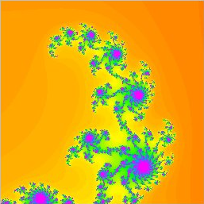

Applet Java
-----------

<applet code="MandelScope.class" codebase="../java/fractales" width="405" height="294">

Si vous voyez ce texte, c'est que votre navigateur n'est pas compatible Java ou n'a pas été correctement configuré.

</applet>

### Utilisation du programme

J'ai conçu ce programme Java pour qu'il soit particulièrement simple d'utilisation. Il ne saurait donc en aucun cas rivaliser avec des programmes plus complets comme l'excellent FractInt, que je vous recommande chaudement pour aller plus loin.

La fenêtre principale du programme est représentée ci dessous :

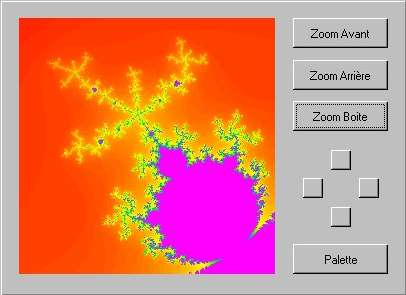

#### Les boutons zoom Avant et Arrière

Permettent, comme leur nom le laisse supposer, de zoomer sur l'image. Le facteur de zoom est de 2 (c'est à dire que le côté de l'image est multiplié ou divisé par un facteur 2).

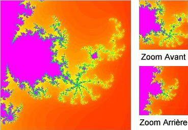

#### Le bouton zoom boite

Permet de zoomer sur la boite sélectionnée à la souris sur la fenêtre de visualisation. Cette boite de sélection est toujours carrée (ce qui peut surprendre lorsqu'on essaie d'étirer la boite en une forme rectangulaire).

#### Les 4 boutons vers les points cardinaux

Permettent de déplacer la fenêtre de vue. Le déplacement est d'un quart de la totalité de la fenêtre.

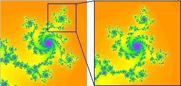

#### Le bouton Palette

Fait apparaître la fenêtre d'édition de la palette. La palette actuellement en usage est affichée et il est possible de la modifier :

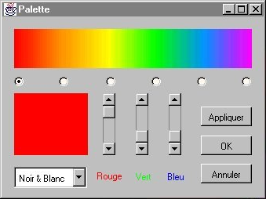

En cliquant sur un bouton radio, on choisit le repère de la palette que l'on modifie. Il y a 6 repères dans la palette. Entre deux repères, le programme calcule les dégradés pour relier les deux couleurs.

Les 3 ascenseurs permettent de modifier la couleur du repère choisi (un ascenseur pour chaque composante Rouge, Vert et Bleu).

La couleur ainsi modifiée apparaît dans la zone rectangulaire de gauche. Elle est aussi modifiée en temps réel dans la palette.

Le bouton **[Appliquer]** permet de voir le résultat de la modification de la palette sur l'image sans refermer la fenêtre.

Le bouton **[OK]** permet d'appliquer la nouvelle palette et de refermer la fenêtre.

Le bouton **[Annuler]** referme la fenêtre sans prendre en compte la nouvelle palette.

Une boite de sélection propose 3 palettes prédéterminées :

1. **Noir et Blanc :** une palette en dégradé de gris.
2. **Arc en Ciel :** les couleurs de l'arc en ciel.
3. **Chaos :** c'est la plus intéressante : elle génère une palette aléatoire, ce qui donne des résultats inattendus et souvent intéressants. J'ai chaîné les images obtenues en changeant
   simplement le palette avec l'option "Chaos" pour une même image :

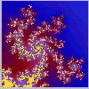

#### Sauvegarder une image

Il n'est malheureusement pas possible de sauvegarder l'image (une applet Java n'a pas le droit d'écrire sur disque pour raison de sécurité). Cependant, sur PC (et probablement aussi sur MAC), on peut faire une capture d'écran (touche "impr. écran"), ce qui copie l'image à l'écran dans le presse-papiers. Il suffit alors d'ouvrir son logiciel de dessin favori et de "coller" le contenu du presse-papiers.

Je vous souhaite à tous et toutes autant de plaisir à utiliser ce programme que j'en ai eu à l'écrire :-)

Les fractales
-------------

Sa construction demande quelques connaissances en mathématiques (nombres complexes), donc je ne rentrerai pas dans les détails. Cependant, sans aucune notion mathématique, on peut constater une propriété intéressante des fractales : à toutes les échelles d'observation, les mêmes motifs semblent se répéter (sans toutefois être exactement semblables). C'est là une caractéristique fondamentale des fractales. Cette propriété est illustrée ci-dessous : les images semblent quasiment identiques, alors que celle de droite est un agrandissement d'une partie de celle de gauche (fonction "zoom boite" de l'applet) :

Les fractales présentent bien d'autres propriétés intéressantes, et sont utilisées pour modéliser de nombreux phénomènes naturels (cours d'eau, poumons, fractures...). Pour plus de détails, on pourra se référer aux sources ci-dessous :

- Article de "Pour la Science", repris dans "Récréations informatiques" (bibliothèque pour la science).
- Le livre de Benoit Mandelbrot : "Les objets fractals" (Champs Flammarion).

Galerie
-------

J'ai extrait de ma vaste collection de curiosités de l'ensemble quelques images particulièrement réussies (à mon goût !) :

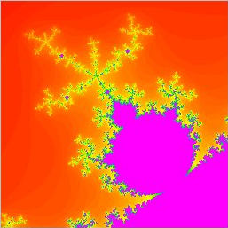 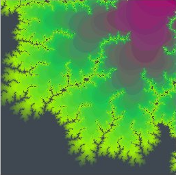
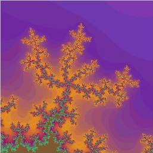 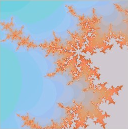
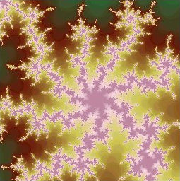 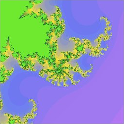
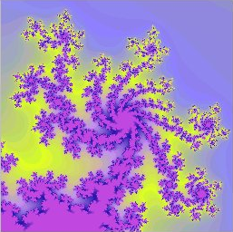 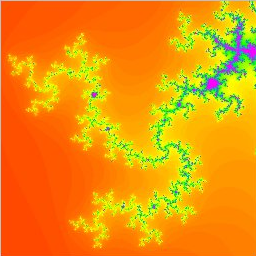
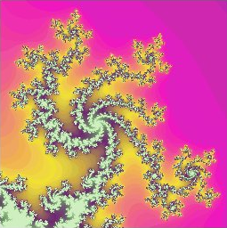 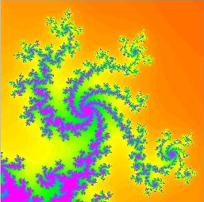
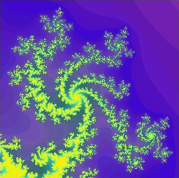 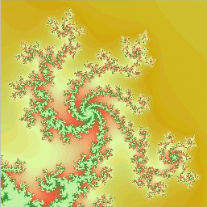

J'espère que vous prendrez autant plaisir que moi à flâner dans cette merveille des mathématiques contemporaines...
