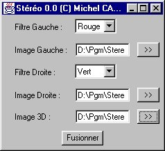
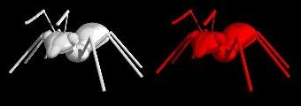
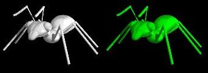
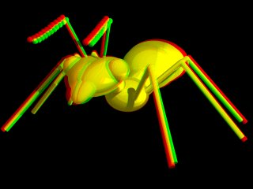

Le principe des images 3D rouge/vert est très simple : on mélange deux
images en ne prenant de chaque que les composantes rouge (pour l'image
de gauche par exemple) ou verte (pour celle de droite). On obtient ainsi
une image qui combine les 2 vues. Ces 2 vues sont légèrement décalées
(de manière à simuler la différence des images perçues par les 2 yeux,
distants de 7 cm environ). Ces images peuvent être des photographies
(prises en décalant l'objectif entre les 2 prises de vues) ou des images
de synthèse pour lesquelles la caméra a été décalée.

J'ai réalisé un petit programme pour réaliser le mélange de 2 images.
Pour télécharger ce programme, [cliquer ici](../arc/stereo-0.1.zip).

Utilisation du programme
------------------------



Pour lancer le programme, se placer dans son répertoire, et taper sur la
ligne de commande :

```bash
java Stereo
```

Avant de fusionner les 2 images, il faut remplir les champs suivants :

**Filtres :** La couleur des filtres pour l'oeil gauche et droit sont
paramétrables. Elles peuvent être : rouge, vert ou bleu. Le programme
est réglé par défaut sur rouge pour l'oeil gauche et vert pour le droit.

**Images sources :** On doit entrer dans ces champs les images pour
l'oeil gauche et l'oeil droit. Ces images doivent être au format .gif ou
.jpg.

**Image 3D :** Ce champ permet d'entrer le nom de l'image 3D résultant
de la fusion des images pour l'oeil gauche et droit. Cette image est au
format `.bmp`. Les avantages de ce format sont :

- Facilité de codage (mais c'est une mauvaise raison :).
- 16 millions de couleurs (contrairement au gif qui n'en comporte que
  256 au maximum).
- Pas de dégradation de l'image (contrairement au jpg qui compresse en
  dégradant plus ou moins l'image suivant le taux de compression).

On peut ensuite lancer le calcul de l'image en cliquant sur
**[Fusionner]**.

Principe de fonctionnement
--------------------------

Le principe de fonctionnement du programme est très simple : on ne garde
que la composante rouge de l'image de gauche (si le filtre pour l'oeil
gauche est rouge) et la verte pour l'image de droite (si filtre vert sur
l'oeil droit). Voici ce que cela donne pour chaque oeil :

Pour l'oeil gauche :



Pour l'oeil droit :



On réalise ensuite la fusion des 2 images en superposant les composantes
rouge et verte. Ce qui donne l'image finale :



Lorsqu'on regarde cette image avec des verres de couleur, le cerveau
restitue le relief par *fusion* des images.
