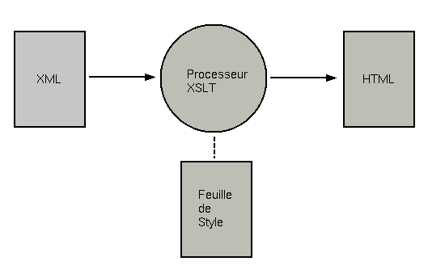
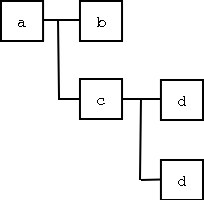

Cet article est le premier d'une série de trois consacrés à XML, XSLT et
le développement d'application XML en Java. Il traite de la syntaxe XML
et des applications de ce langage de balises.

<!--more-->

Présentation de XML
===================

Origines
--------

XML (eXtensible Markup Language) est né du constat que le HTML n'est pas
adapté aux futures exigences de l'internet. Des ingénieurs ont alors eu
l'idée de remplacer le HTML par SGML (Standard Generalized Markup
Language), seul système capable à l'époque de succéder au HTML.

Jon Bosak, qui travaillait pour Sun, a alors été chargé par le W3C de
"mettre le SGML sur le web". Le travail de définition de ce qui allait
devenir le XML (suggestion du gourou SGML James Clark) a duré onze
semaines (de la fin août 1996 à novembre de la même année, date de
publication du premier draft). Les finitions ont pris encore une année
et la version 1.0 de la norme a été publiée en février 1998.

L'idée du groupe de travail du W3C était de créer un langage de balisage
hypertexte aussi simple à apprendre et utiliser que le HTML et aussi
puissant que le SGML. C'est une démarche similaire qui a conduit Sun à
développer Java (simplification du C++).

Comparaison avec HTML
---------------------

Comme nous l'avons vu plus haut, HTML est le petit neveu du XML et
présente avec lui de nombreux points commun; de plus, il présente
l'avantage d'être connu de tous. Nous allons donc maintenant comparer
les deux langages avec un petit exemple de carnet d'adresse:

La version HTML est la suivante:

```xml
<html>
 <head><title>R&#233;pertoire</title></head>
 <body>
  <center><h1>Mon r&#233;pertoire</h1></center>
  <h2>Michel Casabianca</h2>
  <p>Expert Java et XML (In-Fusio)</p>
  <p><bf>Adresse:</bf></p>
  <p>48 rue Binaud
   33300 Bordeaux</p>
  <p>T&#233;l&#233;phone: 05.57.87.13.27</p>
  <p>Mobile: 06.81.71.72.44</p>
  <p>email: casa@sweetohm.net</p>
  <p>www: www.sweetohm.net</p>
 </body>
</html>
```

Cette page se passe de commentaires. Voyons maintenant la version XML:

```xml
<?xml version="1.0" encoding="iso-8859-1"?>
<!DOCTYPE repertoire PUBLIC "-//CASA//DTD repertoire//FR" "repertoire.dtd">
<repertoire>
 <personne>
  <prenom>Michel</prenom>
  <nom>Casabianca</nom>
  <qualite>Expert Java &amp; XML</qualite>
  <entreprise>In-Fusio</entreprise>
  <adresse lieu="domicile">
   <rue>48 rue Binaud</rue>
   <cp>33300</cp>
   <ville>Bordeaux</ville>
   <pays>France</pays>
   <telephone type="fixe">05.57.87.13.27</telephone>
   <telephone type="mobile">06.81.71.72.44</telephone>
   <email>casa@sweetohm.net</email>
   <www>www.sweetohm.net</www>
  </adresse>
 </personne>
</repertoire>
```

Nous pouvons noter les points suivants:

- Le fichier XML comporte des éléments définis par l'utilisateur
  (comme `<adresse>`) alors qu'un document HTML ne peut comporter que
  des balises définies dans la norme.
- Le fichier HTML comporte des éléments qui se rapportent au formatage
  du document (comme par exemple le tag `<bf>`) alors que le document
  XML ne comporte que des éléments relatifs à la signification du
  contenu.
- Les valeurs des attributs doivent toujours être placées entre
  guillemets (ce qui n'est pas nécessaire en HTML sauf si cette valeur
  comporte des blancs).
- Les éléments vides doivent être fermés. Ils le sont par un élément
  fermant ou par un slash de fermeture en fin d'élément (par exemple
  `<vide/>`, ce qui est équivalent à `<vide>``</vide>`).
- Les balises doivent être emboîtées correctement. Par exemple,
  `<a><b></a></b>` est incorrect en XML (et lèvera une erreur) alors
  qu'il est souvent toléré en HTML par de nombreux navigateurs.

Cette liste met en valeur les caractéristiques essentielles du XML: il
dissocie le fond (les éléments indiquent la nature des données qu'ils
encapsulent) et la forme (la représentation d'un document). D'autre
part, la syntaxe d'un document XML est à la fois plus rigoureuse que
celle d'un document SGML (et par extension, de celle d'un document HTML
qui est une *instance* de SGML) et bien plus simple tout en gardant une
compatibilité avec SGML.

Ces caractéristiques ont fait le succès de XML. La dissociation du fond
et de la forme permet le traitement automatique des données (ce qui est
très difficile avec un document HTML). Sa simplicité permet un
apprentissage rapide (quelques heures suffisent pour acquérir les bases
du XML) et une implémentation facile des parsers. La rigueur du XML
quand à elle, a facilité l'échange des données XML. Pour finir, la
compatibilité avec SGML a permis une adoption rapide par réutilisation
des outils existants (il suffit souvent de paramétrer les outils SGML
pour les rendre compatibles avec XML).

Types de document
-----------------

L'agencement des éléments XML d'un type de fichier peut être contraint
par une *DTD* (pour Document Type Definition). Par exemple, une DTD pour
un répertoire d'adresse pourrait être la suivante:

```xml
<?xml version="1.0" encoding="iso-8859-1"?>

<!ENTITY % lieux "travail | domicile | vacances">

<!ELEMENT repertoire (personne+)>

<!ELEMENT personne (prenom, nom, qualite, entreprise, adresse+)>

<!ELEMENT prenom (#PCDATA)>
<!ELEMENT nom (#PCDATA)>
<!ELEMENT qualite (#PCDATA)>
<!ELEMENT entreprise (#PCDATA)>

<!ELEMENT adresse (rue, cp, ville, pays, telephone, email?, www?)>
<!ATTLIST adresse lieu (%lieux;) "travail">

<!ELEMENT rue (#PCDATA)>
<!ELEMENT cp (#PCDATA)>
<!ELEMENT ville (#PCDATA)>
<!ELEMENT pays (#PCDATA)>
<!ELEMENT telephone (#PCDATA)>
<!ATTLIST telephone type (fixe | mobile) "fixe">
<!ELEMENT email (#PCDATA)>
<!ELEMENT www (#PCDATA)>
```

Cette DTD indique que:

- Un répertoire est composé d'au moins une personne.
- Une personne est composée d'un prénom, d'un nom, d'un qualité, d'un
  entreprise et d'au moins une adresse.
- Une adresse doit être composée d'une rue, d'un cp, d'une ville, d'un
  pays, d'un telephone (de `type` *fixe* ou mobile), d'un email
  (optionnel) et d'un www (optionnel).

Nous verrons plus tard en détail la syntaxe d'une DTD, mais nous pouvons
dors et déjà comprendre son intérêt: elle permet de s'assurer (en
*validant* un document) que ce document est valide pour cette DTD et
donc qu'aucun renseignement n'a été omis. Cette validation intervient au
niveau du programme traitant le fichier XML lors de sa mise en forme ou
de son traitement.

Mise en forme
-------------

Contrairement à un document HTML (qui peut être affiché par un
navigateur), un document XML ne peut à priori pas être affiché par un
programme puisque les éléments qui composent ce document sont à
l'initiative du rédacteur du document (ou de celui de la DTD). Pour
visualiser un document XML, il est donc nécessaire de le transformer en
un document mis en forme. C'est le rôle des *feuilles de style* (ou
style sheets en anglais).

Le standard XML pour les feuilles de style est XSLT pour eXtensible
Stylesheet Language et T pour Transformation. Une feuille de style XSLT
transforme (à l'aide d'un *processeur XSLT*) un document XML en un
document HTML, un autre document XML (conforme à une autre DTD en
général) ou tout autre format. Le principe de fonctionnement est donc le
suivant:



Nous étudierons ces feuilles de style dans un article ultérieur et je ne
m'y attarderai donc pas.

Terminologie XML
----------------

XML comporte une terminologie qui lui est propre.

On appelle *élément* les balises (appelés *tags* en HTML). Par exemple,
`<adresse>` est un élément.

Un élément peut comporter des informations internes qui sont localisées
dans des *attributs*. Par exemple, l'élément adresse
`<adresse lieu="domicile">` comporte un attribut `lieu` dont le contenu
est *domicile*.

Une *entité* est une référence remplacée lors du parsing du document par
une valeur qui leur est assignée.

L'élément le plus extérieur au document (dans lequel sont imbriqués tous
les autres éléments d'un document) est appelé *racine* de ce document.

Un document XML peut être représenté comme un arbre dans lequel les
éléments ou les fragments de texte sont des *noeuds*. Par exemple, le
document suivant:

```xml
<a>
   <b/>
   <c>
     <d/>
     <d/>
   </c>
</a>
```

Peut être représenté par l'arbre ci-dessous:



Un *parser* est un programme capable de parcourir un document XML, de le
valider (vérifier sa syntaxe XML et sa conformité à une DTD) pour en
extraire les données qu'il contient.

Syntaxe XML
===========

Maintenant que nous avons une idée générale de ce qu'est un document
XML, nous allons en étudier la syntaxe en détail.

En tête
-------

Tout document XML doit commencer par un en tête standard de la forme:

```xml
<?xml version="1.0" encoding="iso-8859-1"?>
```

Ceci n'est pas un élément mais une instruction de traitement (ou
*processing instruction* en anglais) car entourée des marques `<?` et
`?>`. Elle indique que c'est un document XML conforme à la
recommandation (c'est ainsi que l'on appelle les standards au W3,
organisation de normalisation du web) en version `1.0`. L'attribut
`encoding` indique l'encodage du document. Un autre attribut
`standalone` (pouvant prendre les valeurs *yes* ou *no*) indique si le
document peut être lu seul (valeur *yes*) ou s'il est muni d'une DTD
(valeur *no*).

Déclaration du type de document
-------------------------------

On peut indiquer le type de document dans une déclaration *DOCTYPE*,
comme suit:

```xml
<!DOCTYPE article SYSTEM "../dtd/article.dtd">
```

Cette déclaration indique que le document est de type *article* (qui est
nécessairement l'élément racine du document) et que l'on peut trouver la
DTD dans le fichier *../dtd/article.dtd* (chemin relatif au fichier XML
lui même). Lors du *parsing* du document, le parser charge ce fichier et
valide le document par rapport à cette DTD.

Cette déclaration est optionnelle: un fichier peut ne pas être associé à
une DTD. Dans ce cas, il n'y a pas de contrainte concernant les éléments
du document, mais la syntaxe XML doit être correcte (on dit alors que le
document est *bien formé*). Un document conforme à une DTD est dit
*valide*.

Il existe une autre forme de déclaration *DOCTYPE*:

```xml
<!DOCTYPE article PUBLIC "-//CASA//DTD article//fr" 
                         "../dtd/article.dtd">
```

Cette déclaration indique que le document est de type *article* et
permet de retrouver la DTD par:

- Un nom symbolique *-//CASA//DTD article//fr* qui sera recherché dans
  un catalogue. Le catalogue associe à ce nom symbolique un fichier
  qui contient la DTD. Cela permet de ne pas lier *en dur* une DTD à
  un fichier (et donc d'avoir à recopier cette DTD avec chaque fichier
  XML, ou de changer cette référence si l'on déplace le fichier de la
  DTD).
- Une URI (qui peut être un nom de fichier ou une URL). Ce fichier est
  chargé si la référence symbolique n'est pas trouvée (en l'absence de
  catalogue par exemple).

Les instructions de traitement
------------------------------

Ces marqueurs ont la forme suivante:

```xml
<?cible attribut1="valeur1" ... attributN="valeurN"?>
```

Ces marqueurs sont destinés aux applications qui vont traiter ce
document et ne font pas à proprement parler partie du document.

Commentaires
------------

Les commentaires sont semblables à ceux du HTML:

```xml
<!-- Ceci est un commentaire -->
```

Ces commentaires sont ignorés lors du parsing du document.

Sections CDATA
--------------

Un telle section ne sera pas interprétée par le parser. Par exemple la
section suivante est parfaitement valide (parce que non parsée par le
parser):

```xml
<![CDATA[<a><b></a></b>]]>
```

En pratique, ces sections CDATA sont très commodes pour écrire un
fragment de XML d'exemple dans un document XML. Il est aussi commode de
s'en servir pour un fragment de code (qui peut comporter des signes \<
qui provoqueront des erreurs de parsing).

Éléments et attributs
---------------------

Un élément peut contenir des attributs, d'autres éléments, du texte ou
une combinaison des deux. Un nom d'élément doit commencer par une lettre
ou un underscore et peut comporter tout nombre de lettres, chiffres,
trait d'union, point, double point ou underscore. Les noms d'éléments
commençant par `xml` sont réservés. Les noms d'éléments sont sensibles à
la casse. Les lettres des noms d'éléments peuvent être de tout alphabet
pourvu que ce soit celui déclaré dans l'encodage du document.

Les noms d'attributs sont sujets aux mêmes restrictions que ceux des
éléments. La valeur de l'attribut doit être encadrée par des guillemets
simples ou doubles. La valeur d'un élément délimitée par des guillemets
simples peut contenir des guillemets doubles et inversement. Par
exemple, on pourra écrire:

```xml
<chapitre titre="Je n'en pense pas moins">
```

Ou encore:

```xml
<chapitre titre='Le "Bidule"'>
```

Il existe deux attributs réservés:

- `xml:lang`: Cet attribut peut être présent dans tout élément et
  indique la langue de celui-ci.
- `xml:space`: Cet attribut peut être présent dans tout élément et
  peut prendre les valeurs *default* ou *préserve*. Indique si les
  blancs (espaces, sauts à la ligne ou tabulations) à l'intérieur de
  l'élément doivent être préservés (valeur *preserve*).

Par défaut, XML se réserve le droit, comme HTML, de remplacer une suite
de blancs (espaces, saut de ligne ou tabulations) par un seul espace.
Ceci s'explique par le fait qu'un saut de ligne n'a pas de signification
de formatage puisque ce dernier dépend du système sur lequel est affiché
le document.

Par exemple, le texte suivant:

```java
while(true) {
  System.out.println("Hello World!");
}
```

Sera affiché de la manière suivante (si on ne demande pas au parser de
préserver les blancs):

```java
while(true) { System.out.println("Hello World!"); }
```

Entités
-------

XML définit cinq entités qui permettent d'éviter les collisions du texte
avec la syntaxe XML:

entité           | Caractère
:--------------- | :---------------------
&amp;            | & (et commercial)
&lt;             | \< (inférieur à)
&gt;             | \> (supérieur à)
&quot;           | " (guillemet double)
&apos;           | ' (guillemet simple)

Pour éviter une collision avec la marque d'ouverture d'un élément, on
pourra écrire dans un document XML le signe inférieur à avec l'entité
suivante:

```html
<p>Ceci est un texte XML valide car le signe
 "inférieur à" a été écrit avec l'entité &lt;.</p>
```

Lors du parsing, la référence à l'entité est remplacée par sa valeur et
le texte devient:

```
Ceci est un texte XML valide car le signe
"inférieur à" a été écrit avec l'entité <.
```

On peut aussi faire référence à tout caractère UNICODE avec une entité
numérique de la forme `&#xxx;` où xxx est la valeur de ce caractère dans
le standard UNICODE (en décimal ou en hexadécimal si cette valeur
commence par un `x`).

On peut ainsi écrire le signe *copyright* (©) avec l'entité `&#xA9;`.

Types de documents
==================

Les types de documents permettent de contraindre les éléments à
respecter une syntaxe donnée. Une DTD peut comporter des déclarations
d'éléments, d'attributs, d'entités ou de notations.

Déclaration d'élément
---------------------

Une déclaration d'élément a la forme suivante:

```xml
<!ELEMENT nom règle>
```

La règle peut être une liste d'éléments. Par exemple, on peut définir un
élément `adresse` par:

```xml
<!ELEMENT adresse (rue,cp,ville)>
```

Cela indique qu'une adresse est composée d'un élément `rue` suivi d'un
élément `cp` puis d'un élément `ville`.

On peut indiquer qu'un élément est optionnel (il peut apparaître 0 ou 1
fois) avec le marqueur `?` après le nom de cet élément. Par exemple,
pour indiquer qu'un élément `cedex` peut être présent à la fin d'une
adresse, on déclarera cet élément `adresse` par:

```xml
<!ELEMENT adresse (rue,cp,ville,cedex?)>
```

De la même manière, on peut indiquer qu'un élément peut être présent en
au moins un exemplaire à l'aide du marqueur `+` (plus) ou en un nombre
quelconque d'exemplaires (y compris 0) avec le marqueur `*` (étoile).

On peut aussi combiner des éléments avec des opérateurs logiques `et` et
`ou`. La virgule (vue ci dessus) est l'opérateur `et` et le trait
vertical (*pipe* UNIX) est l'opérateur `ou`. Par exemple:

```xml
<!ELEMENT adresse ((rue|lieu-dit),cp,ville)>
```

Indique que l'élément `adresse` peut être composé en premier lieu d'un
élément `rue` ou d'un élément `lieu-dit`.

Le marqueur `#PCDATA` (que nous verrons plus loin en détail) peut
apparaître dans une liste, pour indiquer la présence de texte (*mixed
content*), mais:

- L'élément `#PCDATA` doit être le premier dans une liste.
- La liste doit être terminée par le marqueur `*`.

Par exemple, la déclaration:

```xml
<!ELEMENT para (#PCDATA,code,emp)*)>
```

Est valide, mais la suivante ne l'est pas:

```xml
<!ELEMENT sect (titre,#PCDATA)>
```

En effet, le marqueur `#PCDATA` n'est pas en première place dans la
liste et celle ci ne se termine pas par un marqueur `*`. Ces contraintes
impliquent que l'on ne peut pas contraindre un élément à comporter des
sous éléments et du texte dans un ordre et en nombre déterminés.

Un élément peut être déclaré comme devant être vide à l'aide de la règle
`EMPTY`. On peut aussi indiquer qu'il peut contenir tout élément avec le
marqueur `ANY`.

Pour finir, on peut indiquer qu'un élément ne peut contenir que du texte
à l'aide du marqueur `#PCDATA` (pour Parsed Character Data). Par
exemple, un élément `titre` pourrait être déclaré par:

```xml
<!ELEMENT titre (#PCDATA)>
```

Ce qui signifie qu'il ne peut contenir que du texte à l'exclusion de
tout élément.

Déclaration d'une liste d'attributs
-----------------------------------

Un élément peut comporter des attributs que l'on déclare dans une DTD à
l'aide d'une déclaration `ATTLIST` (pour ATTribute LIST). Une telle
déclaration est de la forme:

```xml
<!ATTLIST element
          attribut1 type valeur
          ...
          attributN type valeur>
```

Les types possibles sont les suivants:

Type           | Description
:------------- | :----------------------------------------------------------------------------------------------------------------------------------------------------
CDATA          | Caractères
énumération    | Énumération de valeurs séparées par des caractères | et entourées de parenthèses (la valeur de l'attribut doit être une des valeurs de cette liste)
ENTITY         | Une entité déclarées dans la DTD
ENTITIES       | Une liste d'entités séparées par des blancs
ID             | Un identifiant (unique dans le document)
IDREF          | Une référence à un identifiant (doit être présent dans le document)
IDREFS         | Liste de références d'entités séparées par des blancs
NMTOKEN        | Un token
NMTOKENS       | Une liste de tokens séparés par des blancs
NOTATION       | Une notation déclarée dans la DTD

La valeur de l'attribut peut être une valeur (que l'on note entre
guillemets) ou l'un des mots clef ci-dessous:

Type           | Description
:------------- | :-------------------------------------------------------------------------------
\#REQUIRED     | La valeur de cette attribut doit être présente dans le document
\#IMPLIED      | Cet attribut n'a pas de valeur par défaut mais peut être omis dans le document
\#FIXED        | La valeur est fixe (et déclarée après le mot clef)

Nous allons maintenant étudier des exemples pour clarifier ces
déclarations d'attributs:

```xml
<!ATTLIST prix
          monaie CDATA #IMPLIED>
```

Cette déclaration indique que l'élément `prix` *peut* comporter un
attribut `monaie` qui est de type caractère.

```xml
<!ATTLIST prix
          monaie CDATA "euro">
```

Indique que l'élément `prix` *peut* comporter un attribut `monaie`. Si
ce n'est pas le cas, le parser en insère un avec la valeur *euro*.

```xml
<!ATTLIST prix
          monaie CDATA #REQUIRED>
```

Indique de l'élément `prix` *doit* comporter un attribut *monnaie*. Il
n'y a donc pas de valeur par défaut et si l'on n'indique pas cet
attribut dans le document, il en résulte une erreur de parsing.

```xml
<!ATTLIST prix
          monaie CDATA #FIXED "euro">
```

Indique que l'attribut *monnaie* a toujours la valeur *euro*.

```xml
<!ATTLIST prix
          monaie (franc | euro) "euro">
```

Indique que l'attribut `monaie` peut prendre une des valeurs *franc* ou
*euro*. Si l'attribut est omis, la valeur *euro* lui est donnée par
défaut.

Les exemples ci dessus sont les cas d'utilisation les plus fréquents.
Une autre notion importante est celle d'identifiant:

```xml
<!ATTLIST chapitre
          id ID #IMPLIED>
```

Déclare un attribut `id` de type `ID`. C'est un identifiant unique dans
le document. On peut y faire référence dans un attribut de type `IDREF`:

```xml
<!ATTLIST lien
          idref IDREF #REQUIRED>
```

Lorsque la parser rencontre un attribut de type `IDREF`, il vérifie que
la référence est présente dans le document. On crée ainsi des liens à
l'intérieur d'un même document. Si nous déclarions les attributs `id` et
`idref` comme étant de type `CDATA`, nous ne serions pas assurés que
notre document ne comporte pas de liens cassés (parce que l'unicité et
l'existence des identifiants ne serait pas vérifiés). Le type `IDREFS`
est une liste de références à des identifiants séparés par des espaces.

Un attribut peut aussi être déclaré de type `NMTOKEN`. Dans ce cas, la
valeur de l'attribut doit être un token XML (c'est à dire un nom ayant
les mêmes restrictions que celui d'un élément, sauf qu'il peut commencer
par un chiffre, un tiret ou une virgule). Le type `NMTOKENS` est une
liste de tokens séparés par des espaces.

Pour finir, le type `NOTATION` doit contenir une notation définie au
préalable dans la DTD (voire plus loin).

Déclaration d'une entité
------------------------

Une entité permet d'écrire un caractère ou chaîne de caractères qu'il
serait impossible (parce que l'encodage du document ou le clavier ne le
permettent pas) ou fastidieux d'écrire. Par exemple, la déclaration
suivante (que l'on doit écrire dans une DTD):

```xml
<!ENTITY copyright "&#xa9;">
```

Permet simplement d'insérer le signe de copyright dans un document, à
l'aide de l'écriture suivante:

```xml
&copyright; In Fusio - 2002
```

Lors du parsing du document, on obtiendra:

```
© In Fusio - 2002
```

Il existe des entités dont la portée est réduite à la DTD dans laquelle
elles sont déclarées, ce sont les entités paramètres. Par exemple, la
déclaration suivante:

```xml
<!ENTITY % boolean "(true | false)">
```

Permet de simplifier l'écriture de déclarations d'attributs, comme
celui-ci:

```xml
<!ATTLIST copy
          overwrite (true | false) "false">
```

De la manière suivante:

```xml
<!ATTLIST copy
          overwrite %boolean; "false">
```

On peut voire les entités paramètres comme des macros pour l'écriture de
DTDs.

Les entités externes quand à elles permettent de faire référence à un
document externe. Par exemple, la déclaration suivante:

```xml
<!ENTITY pricelist SYSTEM "http://www.foobar.com/pricelist.xml">
```

Permet d'inclure la liste des prix dans un document XML à l'aide de la
simple référence:

```
&pricelist;
```

Inutile de dire que cela peut poser des problèmes de sécurité de faire
référence à un document externe...

Pour finir, il est possible de déclarer des entités non parsées avec une
déclaration du type:

```xml
<!ENTITY logo SYSTEM "images/logo.gif" NDATA GIF89a>
```

`NDATA` signifie ici Notation DATA. Il faut bien sûr avoir au préalable
déclaré la notation à l'aide d'une déclaration `<!NOTATION ...>`.

Déclaration de notation
-----------------------

Les notations permettent d'identifier par leur nom des entités non XML
(qui ne doivent être parsées). On peut ainsi identifier le type d'image
GIF par la déclaration:

```xml
<!NOTATION GIF89a PUBLIC "-//Compuserve//NOTATION Graphics Interchange Format 89a//EN">
```

On pourra alors faire référence à ce type d'image dans une entité
externe ou un attribut de type `NOTATION`.

Sous DTD internes
-----------------

Un document XML peut incorporer sa propre DTD après la déclaration du
type de document de la manière suivante:

```xml
<!DOCTYPE type [
 <!-- sous DTD interne -->
]>
```

Il est aussi possible de modifier une DTD existante pour un document en
incluant une sous DTD interne dans la déclaration `DOCTYPE` comme suit:

```xml
<!DOCTYPE article SYSTEM "dtd/article" [
 <!ENTITY rec "Recommandation XML du W3">
]>
```

Il faut cependant éviter ce genre de raccourcis car un fragment de cet
`article` (que l'on pourrait insérer dans un autre par copier/coller)
pourrait, s'il inclue une référence à l'entité `rec`, ne plus être
valide hors de ce document.

Sections INCLUDE/IGNORE
-----------------------

Il est possible de marquer une section à inclure dans la DTD avec un
marqueur du type:

```xml
<![INCLUDE[ ... ]]>
```

Une section à ignorer pourra quand à elle être marquée de la manière
suivante:

```xml
<![IGNORE[ ... ]]>
```

Les plus attentifs auront remarqué que ces sections ne servent à rien
utilisées telles-quelles (à quoi sert-il de marquer une section à
inclure alors que c'est le cas par défaut ? À quoi sert-il d'écrire une
section à ignorer ?). L'intérêt vient de l'utilisation des entités
paramètres: on peut remplacer les mots `INCLUDE` et `IGNORE` par des
références à des entités paramètres comme ceci:

```xml
<![%final;[ <!ELEMENT para (#PCDATA,emph,code)*>]]>
<![%draft;[ <!ELEMENT para (#PCDATA,emph,code,note)*>]]>
```

On donne deux définitions pour l'élément `para`: avec ou sans élément
`note` imbriqué suivant les valeurs des entités paramètres `final` et
`draft`. Si `final` vaut *INCLUDE* et `draft` vaut *IGNORE*, alors la
définition de l'élément `para` devient:

```xml
<!ELEMENT para (#PCDATA,emph,code)*>]]>
```

Dans le cas contraire, la définition de l'élément `para` devient:

```xml
<!ELEMENT para (#PCDATA,emph,code,note)*>]]>
```

En modifiant la valeur de l'entité paramètre, on change la DTD du
document et les notes peuvent ou pas être légales dans un paragraphe.
Ces inclusions prennent tous leur sens lorsque les entités paramètres
sont définies dans la sous DTD interne.

Espaces de nommage
==================

Les espaces de nommage (une recommandation du W3 distincte de la
recommandation XML, mais qui lui est maintenant presque indissociable)
permettent d'éviter les collisions entre les DTDs de documents
d'origines diverses (qui peuvent donc déclarer des éléments de même nom
mais ayant des significations différentes).

On déclare un espace de nommage dans un attribut `xmlns` (pour XML Name
Space) d'un élément, de la manière suivante:

```xml
<element xmlns:foo="http://www.bar.com/foo">
```

La valeur *foo* est un préfixe définissant l'espace de nommage
*http://www.bar.com/foo*. Donc l'élément de la déclaration et tout
élément inclus dans cet élément `element` et dont le nom commence par
*foo:* appartient à cet espace. On notera que si un nom d'élément peut
comporter le caractère : (deux points), il est préférable de l'éviter
pour ne pas créer de confusion avec les espaces de nommage. D'autre
part, on placera généralement cette déclaration à la racine du document
de manière à ce que sa portée soit le document entier. Enfin, l'URI
délimitant l'espace de nommage doit comporter un nom de domaine dont on
est propriétaire de manière à garantir l'absence de collision.

Il est aussi possible de définir un espace de nommage par défaut (ce
sera celui de tout élément n'ayant aucun préfixe d'espace de nommage)
avec une déclaration du type:

```xml
<element xmlns="http://www.bar.com/foo">
```

Les espaces de nommage sont par exemple utilisés par le langage de
feuilles de style XSLT dont toute feuille de style comporte l'élément
racine suivant:

```xml
<xsl:stylesheet version="1.0" xmlns:xsl="http://www.w3.org/1999/XSL/Transform">
```

Dans une telle feuille de style, les éléments commençant par *xsl:*
seront reconnus comme des éléments de l'espace unique
*http://www.w3.org/1999/XSL/Transform*. Ainsi, un élément
`<xsl:value-of>` sera distingué de `<value-of>.`

Conclusion
==========

XML a pris ces dernières années une importance croissante au point de
devenir une mode dans laquelle se sont engouffrés nombre de fournisseurs
de logiciel (qui n'a pas aujourd'hui à son catalogue une base de donnée
"XML" ou un système de RPC en XML ,suivez mon regard... ?). Par delà cet
effet de mode, XML reste une technologie extrêmement souple et puissante
qui, à n'en pas douter, vous deviendra vite indispensable.

Bibliographie
=============

Cette bibliographie succincte permet d'approfondir ses connaissances sur
XML (en particulier sur les thèmes non abordés dans ce texte).

Internet
--------

- Recommandation du W3C: <http://www.w3.org/TR/REC-xml>
- Traduction en français:
  <http://babel.alis.com/web_ml/xml/REC-xml.fr.html>
- Naissance de XML: <http://java.sun.com/xml/birth_of_xml.html>

Livres
------

- XML précis et concis: <http://www.oreilly.fr/catalogue/xml_pkt.html>
- Bible XML:
  <http://www.amazon.fr/exec/obidos/ASIN/0764547607/171-9000749-7409836>

