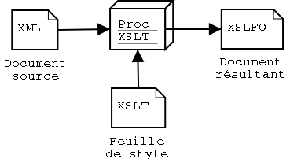
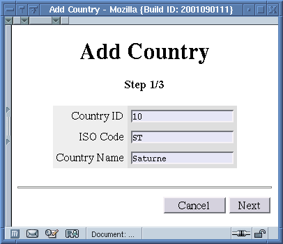
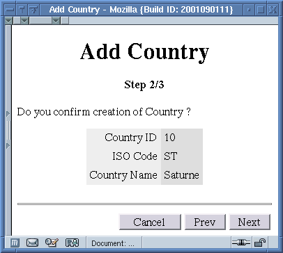
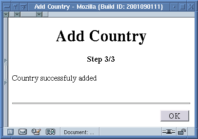

Ce document est une introduction à XSLT et constitue la deuxième partie
d'un cycle de trois tutoriels sur XML. La première partie traite de XML
et la troisième du développement XML en Java. Cet article n'a pas la
prétention d'être exhaustif et s'il permet de se mettre le pied à
l'étrier en moins d'une heure, il ne peut remplacer la lecture
d'ouvrages de référence ou de la recommandation du W3 (voire
bibliographie en fin de l'article). Tout commentaire concernant cet
article (correction ou autre remarque) est le bienvenu.

<!--more-->

Présentation de XSL
===================

Transformations
---------------

XSLT (pour eXtensible Stylesheet Language, Transformation) est un
langage de feuille de style pour XML. Il permet ainsi de transformer un
document XML (avec un *processeur XSLT*) en un autre document, qui peut
être un document XML (conforme à une autre DTD), un document HTML, LaTeX
ou un document de tout autre format texte (par opposition à un format
binaire).

Dans la pratique, XSLT donne la pleine mesure de sa puissance lors de
transformations de XML vers HTML ou XML. On l'utilise ainsi généralement
pour:

- Produire une page HTML à partir d'un document XML
- transformer un document pour le rendre conforme à une autre DTD
  (XSLT sert alors de passerelle vers un autre format).

Formatting Objects
------------------

XSLT n'est en fait qu'une partie d'un standard plus vaste: XSL (pour
eXtensible Stylesheet Language) qui comporte une autre partie qui
définit les *Formating Objects* (cette partie du standard est appelée
*XSLFO*). Comme leurs noms le laisse supposer, XSLT permet de
**transformer** un document alors que XSLFO définit un jeu de balises
pour la définition du formatage d'un document. XSLFO définit donc un
format de documents comme PDF ou PostScript.

Typiquement, le rendu d'un document en XSLFO suivra les étapes
suivantes:



Ce document XSLFO peut alors être visualisé avec un programme
compatible. Si XSLT est largement utilisé pour la transformation vers
HTML et d'autres formats, les formating objects sont encore peu utilisés
car le nombre de programmes permettant de visualiser de tels documents
reste faible du fait de la jeunesse de la norme.

Standards associés
------------------

XSLT fait appel à d'autres standards de la nébuleuse XML:

- **XPath** définit une syntaxe pour la navigation dans des fichiers
  XML. Cette syntaxe apparaît dans le contenu d'éléments XSLT qui
  définissent une expression d'élément à transformer. On pourrait
  comparer cela à un langage de définition d'expressions rationnelles.
- **XPointer** définit une syntaxe pour les liens entre documents XML.
  Cette recommandation du W3C définit un certain nombre d'éléments
  (dont tous les noms commencent par *xlink:*, c'est *l'espace de
  nommage de XLink*). Ces éléments spéciaux sont (ou plutôt seront)
  reconnus par des dispositifs d'affichage de documents XML (ou par
  des feuilles de style les transformant en un format affichable).

XSLT étend XPath par un jeu de fonctions qui lui sont propres. La
connaissance de ces standards est nécessaire à l'écriture de ces
feuilles de style.

Notions de base
===============

Nous allons maintenant définir les notions de base de XSLT sans
prétendre à l'exhautivité (une section de référence des éléments XSLT
suivra).

Notion de Template
------------------

XSLT est un langage dont la syntaxe est XML. Cela signifie qu'une
feuille de style XSLT est un document XML *bien formé*. On ne peut
cependant pas lui associer de DTD dans le cas général (et donc valider
une feuille de style) car elle peut comporter des éléments (générés) qui
ne sont pas définis dans le standard XSL.

Commençons par un exemple simple de document. Soit l'article XML
suivant:

```xml
<?xml version="1.0" encoding="iso-8859-1"?>

<article>

 <title>Introduction à XSLT</title>

 <sect><title>Présentation de XSL</title>
  <p>XSL est un langage de feuilles de style pour XML...</p>
 </sect>

 <sect><title>Syntaxe de XSLT</title>
  <p>XSLT suit une syntaxe XML, c'est à dire qu'une feuille de style
   est un document XML <term>bien formé</term>.</p>
 </sect>

</article>
```

Pour transformer cet article en document HTML, nous pourrions envisager
la feuille de style suivante:

```xml
<?xml version="1.0" encoding="iso-8859-1"?>

<xsl:stylesheet version="1.0"
                encoding="iso-8859-1"
                xmlns:xsl="http://www.w3.org/1999/XSL/Transform">

 <!-- template pour la racine du document -->
 <xsl:template match="/article">
  <html>
   <head><title><xsl:value-of select="title"/></title></head>
   <body>
    <xsl:apply-templates/>
   </body>
  </html>
 </xsl:template>

 <!-- template pour les titres -->
 <xsl:template match="title">
  <center><h1><xsl:value-of select="."/></h1></center>
 </xsl:template>

 <!-- template pour transformer les sections -->
 <xsl:template match="sect">
  <h2><xsl:value-of select="@title"/></h2>
  <xsl:apply-templates/>
 </xsl:template>

 <!-- template pour les paragraphes -->
 <xsl:template match="p">
  <p><xsl:apply-templates/></p>
 </xsl:template>

 <!-- template pour les termes -->
 <xsl:template match="term">
  <i><xsl:apply-templates/></i>
 </xsl:template>

</xsl:stylesheet>
```

Cette feuille de style est très simple dans son principe:

- Elle transforme l'élément racine en un en-tête de fichier HTML (avec
  des éléments `<html>`, `<head>` et `<body>`). Elle place le titre du
  document dans le titre de la page HTML.
- Elle transforme l'élément `<title>` en élément `<h1>`.
- Elle transforme les éléments `<sect>` en éléments `<h2>`.
- Elle transforme les éléments `<p>` en éléments `<p>`.
- Pour finir, elle transforme les éléments `<term>` en éléments HTML
  `<i>`.

Nous aurons retenu de cet exemple que le nom XSL *Transform* est
amplement mérité ! La tache essentielle d'une feuille de style XSLT est
en effet de **transformer** les éléments XML en autres chose (ici des
éléments HTML).

Pour indiquer au processeur XSLT les transformations à effectuer, nous
utilisons des *templates*. Ce sont des déclarations (XSLT est un langage
*déclaratif*) qui indiquent au processeur comment effectuer cette
transformation. Par exemple, le template suivant:

```xml
<xsl:template match="term">
 <i><xsl:apply-templates/></i>
</xsl:template>
```

Déclare les éléments du document source à intercepter dans l'attribut
`match`. Ici nous souhaitons intercepter les éléments *term* que nous
allons remplacer par des éléments HTML `<i>`.

Pour ce faire, nous écrivons directement dans le fichier XSLT les
éléments `<i>`. Comme leur espace de nommage n'appartient pas à celui de
XSLT, le processeur sait qu'il doit les écrire tel quel dans le document
résultant. D'autre part, l'élément `<term>` encadre du texte, donc il
faut demander au processeur XSLT de traiter le contenu de l'élément du
document XML. Cela est fait avec l'élément `<xsl:apply-templates/>`.

`<xsl:apply-templates/>` demande au processeur de traiter les noeuds
inclus (des noeuds texte ou des éléments). Le processeur recherche (dans
l'ordre du document) les éléments qui correspondent à un template et
leur applique. Par défaut, il n'est pas nécessaire de définir de
template pour le texte (il est écrit dans le document produit en
l'absence de template).

Nous avons vu qu'une feuille de style XSLT est essentiellement une liste
de templates et ces templates forment la base de la programmation XSLT.
Cependant, ce type de développement déclaratif est assez inhabituel (on
est plus habitué à des langages impératifs) et c'est la principale
difficulté de XSLT.

Expressions XPath
-----------------

Comme nous l'avons vu ci-dessus, XPath est un standard XML utilisé par
XSLT pour définir des chemins dans un fichier XML. Ces chemins sont en
particulier utilisés dans l'attribut `match` des templates. En effet,
pour déterminer s'il doit traiter un noeud donné, le processeur examine
les expressions des attributs `match` et détermine s'ils s'appliquent à
ces noeuds.

L'expression XPath la plus simple (que nous avons déjà vue sans le
savoir) est un simple nom de noeud. Par exemple, l'expression `sect`
sélectionne les noeuds `sect` fils de l'élément courant.

Il est aussi possible de décrire un chemin vers un noeud de la même
manière que dans un système de fichiers (Unix). Par exemple,
l'expression `foo/bar` sélectionne les éléments `bar` fils d'un noeud
`foo` et petit fils du noeud courant. Dans le document d'exemple,
l'expression `sect/p` appliquée à la racine du document (dans l'élément
article) renvoie un ensemble de noeuds constitué des deux éléments `p`
du document.

Il est aussi possible de faire référence à la racine du document avec un
slash (/) en début d'expression (comme dans un système de fichiers
Unix). Par exemple, l'expression `/article/sect` sélectionne les
éléments `p` du document.

Il est aussi d'indiquer une position d'un élément. Par exemple
l'expression XPath `/article/sect[2]` sélectionne la deuxième section du
document.

La partie entre crochets est appelée *prédicat*. L'exemple précédent est
un cas particulier de prédicat qui porte sur la position, mais il est
possible de placer dans le prédicat une expression logique qui opère une
sélection des noeuds. Par exemple, l'expression
`/article/sect[title='Syntaxe de XSLT']` sélectionne la section par son
élément titre.

Jusqu'à présent, nous avons vu des expressions qui portent sur des
éléments. Il est aussi possible de sélectionner des attributs en faisant
précéder leur nom d'une arobase (@). Par exemple, l'expression `@title`
sélectionne l'attribut `title`. Ainsi, pour sélectionner la section dont
l'attribut `title` a pour valeur *Syntaxe XSLT*, on peut écrire
`sect[@title='Syntaxe      XSLT']`.

Il est possible d'utiliser des opérateurs logiques dans des prédicats.
Ainsi, `sect[position()=1 or      @title='Introduction']` renverra la
section en première position ou dont l'attribut `title` a pour valeur
*Introduction*.

Au passage, nous avons une première *fonction* de XPath (la fonction
`position()` qui renvoie la position d'un noeud). XPath définit un
certain nombre de fonctions. Je ne vais pas les détailler ici, voir la
section **Références** pour une liste exhaustive des fonctions de XPath
(ainsi que des extensions définies par XSLT).

Précisons enfin que certains attributs XSLT (comme l'attribut `match` de
l'élément `<xsl:template>`) doivent contenir une expression XPath alors
que d'autres n'en contiennent pas à priori. Pour forcer le processeur
XSLT à interpréter le contenu d'un attribut comme une expression XPath,
nous devons entourer l'expression d'accolades. Par exemple
`` va placer des l'attribut `src` la
valeur de l'attribut `url` et dans l'attribut `alt` celle de l'attribut
`text`.

Éléments XSLT
=============

Nous allons maintenant passer en revue les principaux éléments XSLT.

Importation de fichiers
-----------------------

Une feuille de style peut parfois devenir complexe et l'on aura intérêt
à la découper modules. Par exemple, on pourra placer dans un même
fichier tous les templates relatifs au formatage du texte et dans une
deuxième, tous ceux relatifs à la structure du document (table des
matières, notes de bas de page). Pour importer une feuille de style dans
une autre, on pourra utiliser une des syntaxes suivantes:

```xml
<xsl:import href="uri"/>
<xsl:include href="uri"/>
```

L'attribut `href` indique l'URI du fichier (qui peut être une URL ou un
chemin dans le système de fichiers). Ces déclarations doivent être les
premières d'une feuille de style.

Les templates des fichiers importés ont une priorité inférieure à ceux
du fichier dans lequel ils sont importés. On peut ainsi **surcharger**
des templates dans le fichier qui importe des définitions. On peut
changer cette règle de priorité dans le corps d'un template avec la
déclaration `<apply-imports>` qui demande au processeur d'utiliser les
définitions importées. Il est aussi possible de définir des priorités
pour les templates avec l'attribut `priority`. Cet attribut doit avoir
une valeur réelle. Une priorité de *+1* assure que ce template sera
toujours prioritaire par rapport aux templates sans priorité et une
valeur de *-1* que ce template ne sera jamais prioritaire.

L'inclusion de template est un mécanisme beaucoup plus simple: tout se
passe comme si le fichier inclus était copié. Les priorités des
templates inclus sont identiques à celles de ceux du fichier ayant
déclaré l'inclusion.

Paramètres et variables
-----------------------

Il est possible de définir des variables dans un fichier XSLT à l'aide
des déclarations suivantes:

```xml
<xsl:variable name="var">...</variable>
<xsl:variable name="var" select="..."/>
```

On peut faire référence à une variable dans une expression XPath à
l'aide de la forme `$var`. La portée d'une variable dépend de l'endroit
où elle a été déclarée: si elle est déclarée dans la racine du document
(sous l'élément `<xsl:stylesheet>`, elle est accessible de tout le
document alors que si elle déclarée dans le corps d'un template, elle
n'est accessible qu'à l'intérieur de celui-ci. On notera que la valeur
d'une variable ne peut être modifiée (elles auraient pu avantageusement
être appelées *constant*).

On déclare un paramètre de la manière suivante:

```xml
<xsl:param name="image-dir">img</xsl:param>
```

On pourra ainsi passer la valeur de ce paramètre au processeur XSLT sur
la ligne de commande. On peut alors faire référence à la valeur de ce
paramètre de la manière suivante:

```xml
<xsl:template match="image">
 
<xsl:template>
```

On pourra aussi appeler un template en lui passant un ou plusieurs
paramètres de la manière suivante:

```xml
<xsl:call-template name="image">
 <xsl:with-param name="image-dir">img</xsl:with-param>
</xsl:call-template>

<xsl:template name="image">
 <xsl:param name="image-dir"/>
 
</xsl:template>
```

On notera que ce template ne comporte par d'attribut `match`, mais un
attribut `name` à la place. Ce template se comporte alors comme une
fonction (à laquelle on passe des paramètres).

Boucles et tests
----------------

Il est possible de boucler sur un ensemble de noeuds avec l'élément
`<for-each>`. Par exemple, pour générer le bloc des notes de bas de
page, on pourrait écrire:

```xml
<xsl:for-each select="note">
 <xsl:text>[</xsl:text>
 <xsl:value-of select="count(preceding-sibling::note)+1"/>
 <xsl:text>]</xsl:text>
 <br/>
 <xsl:apply-templates/>
</xsl:for-each>
```

L'élément `<xsl:for-each>` boucle sur les éléments `note` du document et
les affiche (après avoir écrit leur numéro).

Il est aussi possible d'effectuer des tests. La première possibilité est
d'utiliser l'élément `<xsl:if>`. Par exemple:

```xml
<xsl:if test="abstract">
 <hr noshade="true" size="0"/>
 <font size="-1">
  <i><xsl:apply-templates select="abstract"/></i>
 </font>
 <hr noshade="true" size="0"/>
 <br/>
</xsl:if>
```

Dans ce fragment, on teste l'existence d'un résumer et on l'affiche s'il
existe.

Il existe aussi l'équivalent d'un *switch* avec la forme suivante:

```xml
<xsl:choose>
 <xsl:when test="/article[@lang='fr']">
  <center>Table des matières</center>
 </xsl:when>
 <xsl:otherwise>
  <center>Table of Contents</center>
 </xsl:otherwise>
</xsl:choose>
```

On commence par énumérer les cas possibles dans des éléments `<when>`,
puis le cas par défaut dans un élément `<otherwise>`.

Formats de sortie
-----------------

Il est possible de produire, à l'aide d'une feuille de style, des
formats de sortie XML, HTML ou Texte. On doit déclarer le format de
sortie d'une feuille de style à l'aide de l'élément `<xsl:output>`,
placé sous l'élément `<xsl:stylesheet>`. Chacun de ces traite
différemment les éléments XML ou les blancs:

- **XML** n'opère aucune transformation sur les éléments, par contre,
  il se réserve le droit de réarranger les blancs (espaces,
  tabulations ou retour de ligne) à sa convenance. De plus, il ajoute
  un en-tête XML au début du fichier.
- **HTML** élimine le slash terminal des éléments vides. En effet, une
  feuille de style doit être un document XML bien formé, donc un
  élément vide doit être terminé par un slash terminal. Donc l'élément
  `<hr>` (qui est vide) sera écrit dans une feuille de style `<hr/>`
  et sera transformé en `<hr>` par le processeur XSLT.
- **Text** ne touche ni aux éléments, ni au texte du document.

Il est de plus possible d'indiquer au processeur XSLT de préserver les
blancs à l'aide de l'élément `<xsl:preserve-space elements="liste">`.

Pour finir, il est possible d'indiquer au processeur s'il doit indenter
le document (XML ou HTML) résultant avec l'attribut `indent="yes|no"` de
l'élément `<xsl:output>`.

XPath
=====

XPath propose un jeu de fonctions et d'opérateurs pour exprimer des
chemins dans un document XML. Nous avons déjà vu l'essentiel de la
syntaxe XPath, reste à voir la notion d'axe.

Les axes XPath
--------------

Jusqu'à présent, nous avons vu des expressions XPath de la forme `foo`
dont le slash indique que l'élément `foo` est le *fils* de l'élément
courant. On dit alors que l'on fait une recherche sur l'axe *fils*. On
pourrait aussi vouloir rechercher un élément *père* de `foo`. Pour ce
faire, on utilise une notation plus générale que sont les *axes*. Par
exemple, pour rechercher un élément `foo` père de l'élément courant, on
écrira:

```xml
parent::foo
```

On notera que cette notation est équivalente à:

```xml
../foo
```

Avec une notation de type *système de fichier*.

XPath définit ainsi 13 axes de recherche:

Axe                  | Description
:------------------- | :-------------------------------------------------------------------------------------------
self                 | Noeud courant (noté aussi .)
child                | Noeud fils (par défaut)
descendant           | Noeuds descendant du noeud courant (donc ses fils, les fils de ses fils et ainsi de suite)
descendant-or-self   | Idem, mais inclu aussi le noeud courant (noté //)
parent               | Noeud parent du noeud courant (noté aussi ..)
ancestor             | Ancêtres du noeud courant (parent, parent de ses parents etc.)
ancestor-or-self     | Idem mais inclu aussi le noeud courant
following-sibling    | Noeuds frères (ayant le même parent) se trouvant après le noeud courant
preceding-sibling    | Noeuds frères se trouvant après le noeud courant
following            | Noeuds se trouvant après le noeud courant dans le document
preceding            | Noeuds se trouvant avant le noeud courant dans le document
attribute            | Les attributs du noeud courant (abrégé @)
namespace            | Les noeuds de type *namespace* du noeud courant

Par exemple, pour rechercher les éléments `<chapitre>` après le noeud
courant dans l'ordre du document, on écrira:

```xml
following::chapitre
```

Pour rechercher le noeud ancêtre du noeud courant ayant pour ID *foo*,
on notera:

```xml
ancestor::node()[@id='foo']
```

Fonctions XPath
---------------

XPath définit quatre types de base: les *booléens* (pouvant avoir pour
valeur *true* ou *false*), les *entiers*, les *réels* et les *chaînes*.

Les principales fontions définies sont les suivantes:

Fonction                                | Description
:-------------------------------------- | :-----------------------------------------------------------------------------------------------------------------------------------------------------
last()                                  | Renvoie un booléen indiquant si le noeud est le dernier
position()                              | Renvoie la position du noeud
count(noeuds)                           | Renvoie le nombre de noeuds
concat(chaîne, chaîne, ...)             | Concatène les chaînes passées en argument
starts-with(chaîne1, chaîne2)           | Indique si la chaîne 1 commence avec les caractères de la chaîne 2
contains(chaine1, chaîne2)              | Indique si la chaîne 1 contient la chaîne 2
substring(chaîne, entier1, entier2 ?)   | Renvoie la partie de la chaîne commençant à la position entier1 et d'une longueur entier2 (renvoie la fin de la chaîne si entier2 n'est pas indiqué)
string-length(chaîne)                   | Renvoie la longueur de la chaîne passée en argument
current()                               | Renvoie l'élément courant

Par exemple, l'expression:

```xml
following-sibling::chapitre[position()=last()]
```

Renvoie le dernier élément `chapitre` frère de l'élément courant.

Exemples de mise en oeuvre
==========================

Nous allons voir maintenant des exemples de mise en oeuvre de XSLT (dans
le cadre de projets In Fusio).

Sites des Éditions O'Reilly
---------------------------

### Pourquoi XML et XSLT ?

Le choix de XML nous a semblé le meilleur pour plusieurs raisons :

- Le site est essentiellement un *catalogue* (pas exclusivement
  toutefois, cet article en témoigne). On est donc amené à gérer de
  nombreuses pages donc la mise en forme est identique (les pages des
  livres). Il est alors intéressant de dissocier le fond de la forme,
  afin que les éditeurs n'aient pas à faire du formatage HTML.
- Les pages se doivent de suivre la charte graphique de celles du site
  américain, qui est amenée à changer. Avec un site en HTML, la
  modification de cette charte demanderait à ce que **toutes** les
  pages du site soient modifiées manuellement (soit environ 300 pages
  à l'heure actuelle). Cela donnerait des sueurs froides à tout
  webmestre.
- La possibilité de validation des documents permet d'éviter certaines
  erreurs (d'omission en particulier).
- À chaque compilation, la syntaxe HTML et les liens de toutes les
  pages du site sont vérifiés. Nous avons donc l'assurance que le
  rendu est correct sur tout navigateur et qu'il n'existe aucun lien
  cassé.

### Choix techniques

Les informations pouvant être raisonnablement mises à jour
quotidiennement, nous avons opté pour une solution de **compilation
statique** des pages du site : les pages HTML sont générées à partir des
sources XML puis envoyées au serveur.

Il existe deux autres solutions :

- Génération des pages par *servlets* : les fichiers html sont
  générées lorsqu'ils sont appelés. Cette méthode est indispensable
  lorsque les informations contenues dans les pages changent très
  fréquemment, les pages sont ainsi toujours à jour. Le revers de la
  médaille est que cette méthode est gourmande en ressources CPU côté
  serveur.
- Génération des pages **par le navigateur** : elle a les avantages de
  la méthode précédente sans en avoir les inconvénients. Cependant,
  les navigateurs ne sont pas encore capables de réaliser une
  transformation XSL de manière fiable. Il est donc préférable de s'en
  tenir pour le moment au HTML. Dans un futur plus ou moins proche,
  c'est une solution qui sera probablement envisageable.

### Architecture

Le site est généré entièrement à chaque compilation (pour éviter des
problèmes de dépendances) à partir d'une arborescence de fichiers XML.
Les fichiers de même type sont placés dans le même répertoire. Les types
de fichiers sont au nombre de six :

- **Catalogue :** ces fichiers présentent les ouvrages du catalogue.
  Chaque fichier (décrivant un livre) génère entre trois et six
  fichiers HTML (index, auteur, description, critiques, errata et
  exemples). Ces pages sont liées entre elles et aux pages des
  catégories (Java, Logiciels Libres, Perl, etc.).
- **Article :** génère l'article sous forme HTML et place un résumé
  dans les pages de catégories adéquates.
- **brève :** ces brèves sont intégrées à la page d'accueil du site
  et/ou à des pages de catégories.
- **club :** génèrent les pages du [Club
  O'Reilly](http://www.editions-oreilly.fr/club).
- **infos :** comme les brèves, mais en plus long et sans date.

Les pages d'index (la page d'accueil et les pages des catégories) sont
générées par des fichiers XSL appliqués sur l'index XML du site : un
fichier XML regroupant tous les fichiers XML des sources. Il est ainsi
possible de générer les listes des ouvrages classées par ordre
alphabétique, la liste des brèves classées par date, etc.

Ainsi, la page d'accueil regroupe des fragments de nombre de fichiers
XML :


Les fichiers à l'origine des différentes zones de cette page sont les
suivants :

1. La liste des catégories est codée dans le fichier XSL qui génère la
   page d'accueil.
2. Les brèves proviennent du répertoire *breves* des sources. Seules
   les brèves ayant *index* pour catégorie y sont intégrées.
3. Les articles présentés sur cette page sont ceux marqués de l'élément
   \<nouveau/\>.
4. Suivent des infos issues du répertoire *info* et de la catégorie
   *index*.
5. Pour finir, la liste des nouveautés est générée à partir des
   fichiers du catalogue. Seuls les ouvrages dont les fiches sont
   marquées de l'élément \<nouveau/\> sont intégrées à cette page.

Pour conclure, je dirais que XML permet de gérer un tel site de manière
rationnelle et en préservant les investissements des Éditions O'Reilly
du fait que XML est un standard et donc à l'abri du bon vouloir d'un
unique éditeur de logiciel.

WAP SDK
-------

Le WAP SDK permet aux développeurs de jeux d'accéder aux services de
GameZilla mais aussi de rendre le code du jeu indépendant de la
plateforme cible. En particulier, le WML des pages doit être adapté aux
deux principaux navigateurs WML que l'on trouve sur les téléphones
mobiles (Nokia et Phone.com) et traduites suivant la langue de
l'utilisateur.

Il est bien sûr possible de le faire dynamiquement en PHP mais cela
imbrique la présentation et la logique du jeu (les templates pour les
différentes versions du WML sont noyés dans le code) et est gourmand en
ressources (pour obtenir dynamiquement les messages traduits, il faut
aller les chercher dans une base de données, ce qui peut impliquer
plusieurs requêtes par page).

À cette approche dynamique, nous avons préféré une approche statique:

- Le code PHP est clairement séparé du WML (séparation de la logique
  de jeu et de la présentation).
- On applique une première feuille de style aux sources pour adapter
  le WML au navigateur du client.
- Une deuxième feuille de style traduit les références aux messages
  (de la forme `@{reference}`) en messages dans la langue du client.

Le programme de jeu doit être accompagné d'un fichier XML contenant la
traduction des messages et les noms des fichiers des images suivant leur
taille (fichier de *ressources*). Il doit être aussi accompagné d'un
descripteur indiquant les configurations supportées (navigateurs,
langues et tailles d'images).

Lors de la compilation, le compilateur du SDK génère N répertoires
comportant les fichiers compilés. Un répertoire correspond à une
configuration possible (par exemple, navigateur Nokia, français et
grandes images).

Prenons le cas d'une page d'accueil d'un jeu:

```xml
<?xml version="1.0"?>

<?php
// reset fields
$solution="";
session_register("solution");
$nb_attempts=0;
session_register("nb_attempts");
?>

<wml>
 <head>
  <meta http-equiv="Expires" content="Thu, 01 Dec 1994 16:00:00 GMT"/>
  <meta http-equiv="Cache-Control" content="no-cache, max-age=0"/>
 </head>

 <card id="menu" title="@{title}">
  <p align="center"></p>
  <menu>
   <item href="play.php">@{play}</item>
   <item href="rules.php">@{rules-title}</item>
   <item href="ranking.php">@{ranking}</item>
  </menu>
  <quit>@{quit}</quit>
 </card>
</wml>
```

Cette page comporte les particularités suivantes:

- Les guidelines du SDK imposent une séparation claire du code PHP et
  du WML.
- On remarque le présence de références du type `@{nom}`. Ce sont des
  références à des ressources dont la valeur dépend de la
  configuration.
- Certains éléments de la partie WML ne font pas partie de la norme.
  Ce sont des éléments propres au SDK In-Fusio qui seront ensuite
  transformés suivant le navigateur ciblé. C'est le cas par exemple de
  l'élément \<menu\> qui sera transformé suivant la plateforme cible.

Fichier pour la configuration `Phone.com/fr/petitesimages`:

```php
<?php
include("../lib/gz_configuration.php");
include("../lib/gz_tools.php");
include("../lib/gz_database.mysql.php");
include("../lib/gz_identification.php");
include("../lib/gz_score.php");
header("Content-type: text/vnd.wap.wml");
echo '<?xml version="1.0" encoding="iso-8859-1"?>';
?><!DOCTYPE wml PUBLIC "-//WAPFORUM//DTD WML 1.1//EN"
                     "http://www.wapforum.org/DTD/wml_1.1.xml">


<?php // reset fields
$solution="";
session_register("solution");
$nb_attempts=0;
session_register("nb_attempts");
?><wml>
 <head>
  <meta http-equiv="Expires" content="Thu, 01 Dec 1994 16:00:00 GMT"/>
  <meta http-equiv="Cache-Control" content="no-cache, max-age=0"/>
 </head>

 <card id="menu" title="L'âge du capitaine">
  <p align="center"><b>L'âge du capitaine</b></p>
  <p align="center">
  </p>
  <p><select>
   <option onpick="play.php?<?php echo session_name();?>=
     <?php echo session_id();?>">Jouer</option>
   <option onpick="rules.php?<?php echo session_name();?>=
     <?php echo session_id();?>">Règles du jeu</option>
   <option onpick="ranking.php?<?php echo session_name();?>=
     <?php echo session_id();?>">Scores</option>
  </select></p>
  <do label="Quitter" type="accept"><go href="index.php?
     <?php echo session_name();?>=<?php echo session_id();?>"/>
  </do>
 </card>
</wml>
<?php
//gz_done();
?>
```

Dans ce fichier, l'élément \<menu\> a été remplacé par \<select\> et les
éléments \<item\> par des \<option\>. Les références à des ressources
texte ont été remplacées par les messages en français et les références
à des images par leur valeur pour les petites images.

Le fichier généré pour la configuration
`phone.com/en/grandesimages` est le suivant:

```php
<?php
include("../lib/gz_configuration.php");
include("../lib/gz_tools.php");
include("../lib/gz_database.mysql.php");
include("../lib/gz_identification.php");
include("../lib/gz_score.php");
header("Content-type: text/vnd.wap.wml");
echo '<?xml version="1.0" encoding="iso-8859-1"?>';
?><!DOCTYPE wml PUBLIC "-//WAPFORUM//DTD WML 1.1//EN"
                     "http://www.wapforum.org/DTD/wml_1.1.xml">


<?php // reset fields
$solution="";
session_register("solution");
$nb_attempts=0;
session_register("nb_attempts");
?><wml>
 <head>
  <meta http-equiv="Expires" content="Thu, 01 Dec 1994 16:00:00 GMT"/>
  <meta http-equiv="Cache-Control" content="no-cache, max-age=0"/>
 </head>

 <card id="menu" title="Age Of Captain">
  <p align="center">
    
  </p>

  <p><a href="play.php?<?php echo session_name();?>=
     <?php echo session_id();?>">Play</a></p>
  <p><a href="rules.php?<?php echo session_name();?>=
     <?php echo session_id();?>">Rules of the game</a></p>
  <p><a href="ranking.php?<?php echo session_name();?>=
     <?php echo session_id();?>">High scores</a></p>
  
  <p><a href="index.php?<?php echo session_name();?>=
     <?php echo session_id();?>">Quit</a></p>
 </card>
</wml>
<?php
//gz_done();
?>
```

Dans ce fichier, l'élément \<menu\> a été remplacé par une liste
d'éléments \<a href=""\>, les références à des ressources texte ont été
remplacées par les messages en anglais et les références à des images
par leur valeur pour les grandes images.

Cette approche amène beaucoup de souplesse:

- Si l'on souhaite ajouter une langue, il suffit de rajouter les
  entrées correspondantes dans le fichier de ressources et dans le
  descripteur.
- Si l'on souhaite supporter une nouvelle famille (ou version) de
  navigateur, il faut simplement écrire la feuille de style adéquate.

Administration Tool
-------------------

Cet outil permet d'administrer le serveur de production. Il permet par
exemple de gérer la base sans avoir à connaitre sa structure et se
présente sous la forme d'une application JSP. Afin d'etre simple à
utiliser, nous avons retenu une approche par *wizard*. Un wizard est ici
une succession d'étapes pour réaliser une opération de maintenance sur
le serveur. Par exemple:

```xml
<?xml version="1.0" encoding="iso-8859-1"?>
<!DOCTYPE wizard SYSTEM "wizard.dtd">

<wizard title="Add Country"
        bean="com.infusio.gamezilla.admin.ejb.Country">
   
 <step>
  <input label="Country ID"   param="ID"/>
  <input label="ISO Code"     param="isoCode"/>
  <input label="Country Name" param="name"/>
 </step>
   
 <step message="Do you confirm creation of Country ?">
  <print label="Country ID"   value="$ID"/>
  <print label="ISO Code"     value="$isoCode"/>
  <print label="Country Name" value="$name"/>
 </step>
   
 <step message="Country successfuly added">
  <call method="addCountry($ID,$isoCode,$name)"/>
 </step>

</wizard>
```

Ce wizard XML est compilé en pages JSP avec une feuille de style XSLT.
Par exemple, le wizard ci-dessus génère la page suivante:

```java
<%@ page import="com.infusio.gamezilla.admin.*,com.jspsmart.upload.*" %>
<jsp:useBean id="addCountry" class="com.infusio.gamezilla.admin.AddCountry" scope="session"/>
<jsp:useBean id="smartUpload" class="com.jspsmart.upload.SmartUpload" scope="session"/>
<jsp:setProperty name="addCountry" property="*"/><% 
   Vector list;
   Vector table;
   String selected;
   File file;
   int size;
   byte[] bytes;
   Object object;
   Files files;
   // set the servlet context for the beans
   Wizard.setServletContext(getServletContext());
   if(addCountry.getAction()==null || 
      addCountry.getAction().equals("Reset")) {
     addCountry.reset();
     addCountry.next();
   } else if(addCountry.getAction().equals("Next")) {
     addCountry.next();
   } else if(addCountry.getAction().equals("Prev")) {
     addCountry.prev();
   } else if(addCountry.getAction().equals("Cancel") ||
     addCountry.getAction().equals(" OK ")) {
     addCountry.reset();
   %><jsp:forward page="index.jsp"/><% } %><html>
<head>
<title>Add Country</title>
</head>
<body>
<center>
<h1>Add Country</h1>
<h4>Step <%= addCountry.getStep() %>/3</h4>
</center>
 
 <% 
   if(addCountry.getStep()==1) {
  
   %><form method="post"><center>
<table border="0" cellspacing="0" cellpadding="5">
<tr>
<td align="right" bgcolor="#EEEEEE">ISO Code</td>
<td align="left" bgcolor="#DDDDDD"><input type="text" name="isoCode" value="
<%= addCountry.getIsoCode() %>"/></td>
</tr>
<tr>
<td align="right" bgcolor="#EEEEEE">Country Name</td>
<td align="left" bgcolor="#DDDDDD"><input type="text" name="name" value="
<%= addCountry.getName() %>"/></td>
</tr>
</table>
</center>
<br/>
<hr/>
<table align="right">
<tr>
<td>
<input type="submit" name="action" value="Cancel"/>
</td>
<td>
<input type="submit" name="action" value="Next"/>
</td>
</tr>
</table></form><% 
  }
   %>

 <% 
   if(addCountry.getStep()==2) {
  
   %><p>Do you confirm creation of Country ?</p><form method="post"><center>
<table border="0" cellspacing="0" cellpadding="5">
<tr>
<td align="right" valign="top" bgcolor="#EEEEEE">ISO Code</td>
<td align="left" bgcolor="#DDDDDD"><%= addCountry.getIsoCode()
 %></td>
</tr>
<tr>
<td align="right" valign="top" bgcolor="#EEEEEE">Country Name</td>
<td align="left" bgcolor="#DDDDDD"><%= addCountry.getName()
 %></td>
</tr>
</table>
</center>
<br/>
<hr/>
<table align="right">
<tr>
<td>
<input type="submit" name="action" value="Cancel"/>
</td>
<td>
<input type="submit" name="action" value="Prev"/>
</td>
<td>
<input type="submit" name="action" value="Next"/>
</td>
</tr>
</table></form><% 
  }
   %>

 <% 
   if(addCountry.getStep()==3) {
  
   %><% addCountry.run();
   %><p>Country successfuly added</p><form method="post"><center>
<table border="0" cellspacing="0" cellpadding="5">
<tr>
<td align="right" valign="top" bgcolor="#EEEEEE">Country ID</td>
<td align="left" bgcolor="#DDDDDD"><%= addCountry.getId()
 %></td>
</tr>
</table>
</center>
<br/>
<hr/>
<table align="right">
<tr>
<td>
<input type="submit" name="action" value=" OK "/>
</td>
</tr>
</table></form><% 
  }
   %>

<%
  if(addCountry.getStep()
  <=0 ||
  addCountry.getStep()
  >3) {
    out.print("<p>Wizard in inconsistent state (step="+addCountry.getStep()+" out of range)</p>");
    addCountry.reset();
   %><br/>
<hr/>
<table align="right">
<tr>
<td>
<input type="submit" name="action" value=" OK "/>
</td>
</tr>
</table><% } %></body>
</html>
```

Les écrans générés pour ce wizard sont les suivants:

**Step 1**



**Step 2**



**Step 3**



Cette compilation XSLT permet ici de gagner en temps de développement
des wizards. En effet, l'écriture de ces pages JSP serait très
répétitive et propice aux erreurs. De plus, pour modifier l'interface ou
une fontionnalité des JSPs, il suffit de modifier la feuille de style et
de recompiler, les modifications sont alors automatiquement prises en
compte dans toutes les pages.
