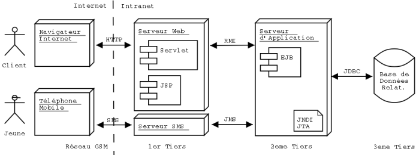
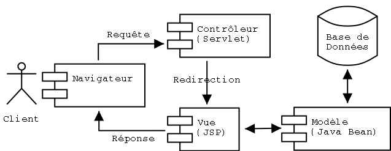

Après une brève présentation de Java 2 Enterprise Edition (J2EE), ce
document entreprend de brosser un panorama des outils J2EE sous licence
Open Source puis se penche sur la question de la certification de ces
logiciels. Ce texte a été présenté en conférence à la Linux Expo Paris
de janvier 2002.

<!--more-->

Je tiens ici à remercier mes collègues à In Fusio et en particulier
**Laurent Lecigne** dont le retour d'expérience sur JBoss m'a été très
précieux.

Présentation de J2EE
--------------------

- Site J2EE de Sun:<http://java.sun.com/j2ee>
- Downloads J2EE (SDK, Tutorial, BluePrints, Spécifications, tout ce
  qu'il faut pour commencer):
  <http://java.sun.com/j2ee/download.html>.

J2EE (pour Java 2 Enterprise Edition) est un ensemble d'APIs dédiées au
développement d'applications d'entreprise. Certaines de ces APIs sont
incluses dans Java 2 Standard Edition (la version "standard" de Java),
comme par exemple JDBC (pour Java DataBase Connectivity, dont le package
est `java.sql`) ou encore RMI (pour Remote Methods Invocation, dont le
package est `java.rmi`). D'autres ne sont pas distribuées avec le JDK ou
JRE standard mais avec le SDK J2EE. C'est le cas par exemple des EJBs
(pour Enterprise Java Beans).

On entend par "applications d'entreprise" des applications distribuées,
donc qui interagissent par l'intermédiaire d'un réseau. Avec la
croissance exponentielle de l'usage des réseaux en entreprise, ces
applications sont amenées à se développer et les plus grands
fournisseurs de logiciel proposent leur propre solution. J2EE est la
réponse de Sun en la matière. La simplicité du langage Java permettent à
tout développeur (au prix de quelques efforts tout de même) de se mettre
au développement d'applications distribuées. D'autre part, l'étendue des
APIs J2EE de Sun permet de couvrir l'ensemble des besoins en la matière.

Les spécifications J2EE en sont actuellement à la version 1.3 et la 1.4
est en cours de définition.

### Les APIs fournies par J2EE

Nous allons maintenant entreprendre un tour d'horizon des APIs couvertes
par l'API "entreprise" de Sun.

#### JDBC

JDBC (Java Database Connectivity) est une API permettant de travailler
avec des bases de données relationnelles. Elle permet d'envoyer des
requêtes SQL à une base, de récupérer et d'exploiter le résultat ainsi
que d'obtenir des information sur la base elle même et les tables
qu'elle comporte.

Le code Java utilisant l'API JDBC est indépendant de la base elle même
grâce à l'utilisation de drivers spécifiques fournis par les vendeurs.
Bien sûr, les requêtes JDBC utilisées doivent être standards (et ne pas
exploiter des fonctionnalités spécifiques à la base utilisée) pour que
l'ensemble reste portable.

L'API JDBC est fournie en standard avec le JDK depuis la version 1.1 de
Java. Les versions ultérieures fournissent de nouvelles fonctionnalités
(comme la manipulation de résultats de requêtes comme des Java Beans, la
gestion de pools de connections, les traitements par batchs ou la
sérialisation d'objets Java en base).

#### RMI

RMI (Remote Method Invocation) est une API fournissant une approche de
haut niveau de la programmation distribuée. On peut ainsi invoquer des
méthodes d'un objet distant (résidant sur un serveur) de la même manière
que l'on appelle les méthodes d'un objet local. Cette API est présente
dans le JDK standard depuis la version 1.1 et a été améliorée dans la
version 1.2.

Si cette API est simple à mettre en oeuvre pour le développeur, elle
implique que le serveur (dans lequel résident les objets distribués) et
les clients soient écrits en Java. Cette situation est cependant
maintenant assez commune pour que la mise en oeuvre de RMI soit
envisageable. Si ce n'est pas le cas, on préférera se tourner vers une
solution qui puisse être implémentée dans d'autres langages, comme
CORBA.

#### Java IDL

Comme nous l'avons vu ci-dessus, l'utilisation de RMI ne peut
s'envisager que si le client et le serveur sont écrits en Java. Si ce
n'est pas le cas, il est possible d'appeler des méthodes sur un objet
distant en utilisant une solution basée sur CORBA (Common Object Request
Broker Architecture), standard défini par l'OMG. La plateforme Java 2
inclue un ORB (Object Request Broker) permettant à un programme Java de
communiquer avec d'autres ORBs et donc avec d'autres objets CORBA.

L'interface d'un objet CORBA est décrite dans un langage indépendant de
la plateforme et du langage d'implémentation appelé IDL (pour Interface
Description Language). Sun fournit un compilateur IDL permettant de
générer les classes nécessaires à un objet Java pour communiquer avec un
ORB.

#### JNDI

JNDI (pour Java Naming and Directory Interface) est une API pour
communiquer avec les services de nommage et d'annuaire en réseau. On
peut ainsi y chercher des objets Java par un chemin ou des valeurs
d'attributs. Il existe des ponts avec les principaux services
d'annuaires (comme LDAP, NIS ou NDS) et avec les registry de RMI ou
CORBA.

Dans la pratique, JNDI est utilisé couramment dans la plateforme J2EE
pour récupérer des objets par un nom symbolique (on peut ainsi récupérer
une connexion à une base de données, une instance d'une interface
distante, etc.).

#### EJB

Les EJB (pour Enterprise Java Beans) sont des composants (au même titre
que des Java Beans) destinés à tourner dans un serveur d'application EJB
pour encapsuler des services de données ou logique métier. Il est en
effet souvent intéressant de déporter la logique métier du client vers
le tiers du milieu d'une application distribuée.

La valeur ajoutée des EJBs réside dans les services fournis par le
serveur. Le framework EJB est ainsi tenu d'assurer, de manière
transparente, la sécurité, la persistance, le support réseau et la
gestion des transactions aux composants. On enlève ainsi une épine du
pied du développeur qui peut se consacrer pleinement à l'implémentation
de la logique métier.

L'API EJB et les services assurés par le serveur sont décrits dans des
spécifications (dont la version 2.0 vient de paraître). Les EJBs sont
donc plus qu'une simple API, ils forment aussi un framework pour objets
métiers. Ils forment une pièce maîtresse de la plateforme J2EE à tel
point qu'on identifie parfois J2EE aux EJBs.

#### Servlets

Les Servlets peuvent être comparées à des Applets côté serveur: ce sont
des objets tournant sur un serveur pour répondre aux requêtes du client
de manière dynamique. Les Servlets sont appelées à remplacer les scripts
CGI.

Les avantages des Servlets par rapport à d'autres technologies sont: la
portabilité (entre systèmes d'exploitation et serveurs), la persistance
entre les requêtes qui leur donne un avantage en termes de performance
par rapport à d'autres technologies comme les CGI, et enfin l'accès à
l'ensemble de la plateforme Java (qui leur permet ainsi d'accéder
aisément à des bases de données avec JDBC).

#### JSP

Les JSPs (pour Java Server Pages) sont comparables aux ASP de Microsoft:
ce sont des pages HTML comportant du code imbriqué. Elles rendent les
mêmes services que des Servlets mais elles présentent l'avantage d'être
beaucoup plus proche du document HTML que du code Java. On peut ainsi en
confier l'écriture à des designer web puis envoyer le résultat à des
développeurs pour y insérer les appels au code Java.

Les JSP sont compilées automatiquement, lors du premier appel, en
Servlets. De plus, les serveur gérant les Servlets sont souvent capables
de servir des JSPs.

#### JMS

JMS (pour Java Message Service) est une API d'échange asynchrone de
message ou d'évènements critiques entre applications. Comme JNDI et
JDBC, JMS est une API construite pour reposer sur des services de
messagerie existants fournis par divers vendeurs.

JMS permet maintenant de gérer les transactions et est utilisée pour la
communication asynchrone entre EJBs (des EJBs pilotés par messages ou
*message driven beans*, nouveauté de la version 2.0 des spécifications
EJB).

#### JTA

JTA (pour Java Transaction API) est une API permettant de gérer les
transactions distribuées. Elle utilise un service de gestion des
transactions distribuées avec lequel elle communique au travers de l'API
XA (standard défini par l'Open Group).

L'utilisation directe de l'API JTA reste cependant complexe, et les
serveurs d'application gèrent les transactions de manière transparente
pour l'utilisateur. JTA peut donc être vue comme une API bas niveau
utilisée par les développeurs de serveurs d'applications plutôt que par
les développeurs d'applications d'entreprise.

#### Autres APIs

Les implémentations J2EE doivent aussi fournir un certain nombre
d'autres APIs, parmi lesquelles:

- **JavaMail**: Permet d'envoyer des emails. Doit inclure aussi Java
  Activation Framework (JAF).
- **JAXP**: Java API for XML Parsing est une API qui unifie les
  différentes implémentations de parsers XML (parsers SAX, DOM et
  processeurs XSLT).
- **JCA**: Java Connector Architecture permet l'interconnexion d'une
  application J2EE avec un système d'information d'entreprise par la
  gestion de pools, des transactions et de la sécurité.
- **JAAS**: Java Authentication and Authorization Service fournit une
  implémentation Java du standard PAM (Plugable Authentication
  Module).

### Topologie d'une application distribuée typique

Pour illustrer l'utilisation des APIs présentées ci-dessus, nous allons
imaginer l'architecture logicielle d'une entreprise (hypothétique) de
vente de pommes de terre sur internet.

Les clients commandent des sacs de pomme de terre en utilisant un
navigateur internet (le client) et remplissent un panier virtuel en
ligne. Les commandes sont traitées par un serveur d'application qui
communique avec une base de données relationnelle.

Notre fournisseur de pommes de terre décide de s'ouvrir à une clientèle
plus jeune en proposant un service d'achat de pommes de terre par SMS
(asynchrone). Une implémentation J2EE de son système pourrait ressembler
à ceci:



Ce schéma indique où sont utilisées les différents composants de J2EE.
Il est clair que ceci n'est qu'un exemple d'architecture classique, dans
la réalité, le nombre de tiers peut être différent (par exemple, les
deux derniers tiers peuvent résider sur la même machine).

Outils J2EE Open Source
-----------------------

Après cette brève présentation de J2EE, nous allons passer en revue les
outils sous licence Open Source.

### Serveurs de Servlets

#### Tomcat

- <http://jakarta.apache.org/tomcat>
- Licence <http://www.apache.org/LICENSE.txt>

Tomcat est l'implémentation de référence pour les Servlets et les JSPs.
Il existe (au moment de l'écriture de cet article) deux versions
disponibles du serveur:

- **La version 3.3**: elle implémente les spécifications des Servlets
  en version 2.2 et celles des JSPs en version 1.1. Cette version est
  recommandée pour un environnement de production. Les versions 3 ont
  hérité des implémentations données par Sun au projet Apache.
- **La version 4.0.1**: implémente quand à elle les versions 2.3 et
  1.2 des spécifications des Servlet et JSPs respectivement. Cette
  version résulte d'une réécriture complète du moteur de Servlets.

Tomcat est d'une installation extrêmement simple (il suffit de détarer
l'archive dans le répertoire de destination et de renseigner les
variables d'environnement `JAVA_HOME` et `TOMCAT_HOME`) et la prise en
main est rapide. Il est possible de coupler Tomcat avec un autre serveur
Web (comme Apache) pour servir les pages statiques. Cependant, lorsque
le trafic est faible, il est plus simple de faire travailler Tomcat en
solo (il est aussi capable de servir des pages statiques).

Pour le développement, Tomcat présente des fonctionnalités
particulièrement intéressantes (comme le rechargement des classes ou des
fichiers `war` lors de leur modification ou l'utilisation de Jikes pour
la compilation des JSPs). Cependant, il est clairement indiqué dans la
documentation que la configuration par défaut est faite pour faciliter
une première expérience et doit être adaptée pour une utilisation en
production. Par exemple le port par défaut est le 8080 (pour ne pas
avoir à lancer Tomcat en tant que *root*). On pourra aussi ajouter des
paramètres pour le lancement de la machine virtuelle Java (un paramètre
`-server` par exemple). Pour finir, sur un environnement de production,
on prendra garde à mettre à jour le serveur pour corriger des trous de
sécurité connus.

Ces fonctionnalité, son respect des spécifications ainsi que sa gratuité
font de Tomcat un outil de développement idéal. Il est de plus tout à
fait utilisable en production et est utilisé sur nombre de sites à
travers le monde.

#### Jetty

- <http://jetty.mortbay.org/jetty/index.html>
- Licence <http://jetty.mortbay.org/jetty/LICENSE.html> (dérivée de la
  licence artistique)

Jetty est un serveur web et moteur de Servlets 100% Java, performant,
léger, extensible et flexible (dixit la documentation !). Il implémente
les spécifications HTTP 1.1 et Servlet 2.3 (dans la version 4 du
serveur). Il est aussi capable de servir des JSPs (par l'utilisation du
moteur Jasper de Apache). Il implémente le protocole SSL par
l'utilisation de l'implémentation de référence de Sun. Il est aussi
possible de lui plugger une implémentation commerciale (de la société
<http://www.forge.com.au>).

L'architecture modulaire de Jetty permet de lui adjoindre des modules
(des modules optionnels sont ainsi disponibles pour la configuration
avec JMX ou bien encore l'authentification SASL). Il est bien sûr
possible de développer ses propres `Request Listeners` et
`Request Handlers` pour gérer d'autres protocoles. D'autre part, sa
petite taille permet de l'embarquer dans d'autres applications (pour
fournir leur propre interface d'administration par exemple).

Pour finir, il faut indiquer que Jetty est proposé packagé avec JBoss
(voir plus loin) pour une intégration plus aisée des deux serveurs.

#### Enhydra

- <http://www.enhydra.org/>
- Licence <http://enhydra.enhydra.org/software/license/index.html>

Enhydra est un conteneur de Servlets Open Source de la société
<http://www.lutris.com> (qui propose un support commercial pour son
produit). Il permet de servir des Servlets (implémente les specs en
version 2.2) , des JSPs (en version 1.1) et des applications Enhydra.
Mais Enhydra est plus qu'un serveur, c'est aussi un framework pour le
développement d'applications web et des outils de développement (Jolt,
XMLC et DODS).

Une application Enhydra comporte:

- La partie présentation (Presentation Objects)
- La partie application (Business Objects)
- La partie accès aux données (Data Objects)

Le code gérant la partie représentation est généré en grande partie à
partir d'un fichier HTML (avec l'outil XMLC) comportant des tags que le
serveur substitue par les résultats du traitement. Le Data Object Design
Studio (DODS) permet de modéliser graphiquement des Data Objects
(l'outil génère alors le code SQL pour créer les tables et du code Java
pour créer, récupérer et rechercher des informations).

Enhydra propose des plugins pour les environnements de développement les
plus répandus (comme JBuilder de Borland ou JDeveloper d'Oracle) qui
permettent de générer le squelette d'applications et de faire tourner
les applications dans l'environnement de développement. On notera de
plus que Multiserver propose un débugger de servlets.

L'installation du serveur est triviale et ce dernier dispose d'une
console web d'administration (on peut administrer le serveur sans avoir
à éditer de fichier de configuration).

La version 4 (commerciale) propose un support des EJBs (voir la dernière
partie concernant les problèmes de licence).

#### JServ

- <http://java.apache.org/jserv/>
- Licence <http://www.apache.org/LICENSE.txt>

JServ est un projet de serveur de Servlet maintenant obsolète que je ne
cite que pour mémoire. Il est passé en mode *maintenance* et on lui
préférera Tomcat (ou un autre moteur de Servlets).

### Serveurs d'EJBs

#### JBoss

- <http://www.jboss.org>
- Licence <http://www.gnu.org/copyleft/lesser.html>

JBoss est un serveur d'EJBs sous licence LGPL (ou Lesser GPL). Il est (à
l'heure où j'écris ces lignes) disponible en deux versions:

- **Version 2.4.4**: c'est la version stable recommandée pour la
  production. Elle implémente la version 1.1 des spécifications EJB.
- **Version 3.0.0**: c'est la version de développement (en stade
  alpha). Elle implémente la version 2.0 des spécifications EJB.

La prise en main de JBoss est exemplaire: l'installation se réalise en
quelques secondes (il suffit de détarer l'archive dans le répertoire de
son choix). JBoss ne contient pas de moteur de Servlet ou de JSP et est
donc de taille réduite: il ne demande que 64 Mo de RAM et 22 Mo sur
disque. Pour cette taille, on dispose même d'une base de données
(HypersonicSQL) !

La <http://jboss.org/online-manual/HTML/index.html> est volumineuse et
bien organisée. Elle permet de prendre en main le logiciel en quelques
heures. Un support commercial est proposé par la société
<http://jboss.org/jbossgroup/services.jsp>.

JBoss a de nombreux atouts pour séduire les développeurs et
administrateurs. Le déploiement des EJBs est un jeu d'enfant: il suffit
de copier le fichier jar dans le répertoire *deploy* et le serveur
installe *à chaud* les EJBs. Lors du déploiement, les *stubs* et
*skeletons* sont générés, ce qui économise les compilations EJB (souvent
interminables) des jars. D'autre part, le fichier de déploiement
standard (*ejb-jar.xml*) est parfois suffisant et l'on peut se passer du
fichier spécifique à JBoss (appelé *jboss.xml*). L'arrêt du serveur est
tout aussi trivial puisque JBoss intercepte une interruption par CTRL-C
et lance la procédure de shutdown.

D'autre part, JBoss est très respectueux des spécifications et indique
même la page où se trouve "l'infraction" lorsque le code du développeur
s'en écarte ! Son implémentation de la sécurité est tout aussi
rigoureuse et il est bien difficile de le prendre à défaut. Cette
rigueur permet de *valider* ses EJBs par rapport au standard et l'on
peut ainsi (même si l'on souhaite utiliser en production un autre
serveur) garder un code sans spécificités qui nous empêcheraient de
migrer si nécessaire.

Pour finir, son architecture (basée sur JMX) est extensible ce qui
autorise le remplacement d'un composant par une autre implémentation ou
l'utilisation de composants seuls (comme par exemple JMX ou JMS). On
notera aussi la présence des bibliothèques nécessaires pour exécuter un
client (sans avoir à ajouter tout le serveur au `CLASSPATH`).

Toutes ces qualités (sans parler de son prix) font de JBoss un
concurrent redoutable pour les outils commerciaux qui souvent ne
proposent pas même des fonctionnalités aussi avancées. Il ne serait pas
étonnant qu'il soit amené à jouer pour J2EE le rôle d'un Apache pour les
serveurs HTTP. Cette vision du futur de JBoss est bien exposée dans
l'article <http://jboss.org/vision.jsp> (dont le ton aurait cependant
gagné à être plus modeste).

#### JOnAS

- <http://www.objectweb.org/jonas/>
- Licence <http://www.objectweb.org/jonas/license.html>

JOnAS est un projet de serveur EJB faisant partie de l'initiative
<http://www.objectweb.org> (créée par France Télécom R&D, Bull/Evidian
et l'INRIA) qui vise à fournir des outils Open Source pour le
middleware. Il est actuellement livré en version 2.4 qui implémente la
version 1.1 de la spécifications des EJB, avec le support des *message
driven beans* (que l'on trouve dans la version 2.0 des spécifications).

JOnAS dispose d'une interface web d'administration basée sur JMX et d'un
jeu d'outils pour le développement, le déploiement et la gestion des
EJBs. On notera que JOnAS peut utiliser une implémentation de RMI
optimisée pour les appels locaux (appelée Jeremi).

L'installation de Jonas est très simple (il suffit de détarer l'archive
et de renseigner deux variables d'environnement). Si l'on doit encore
compiler les jars (avec l'outil GenIC), les prochaines versions
devraient proposer une compilation automatique lors du chargement des
EJBs, qu'il est dors et déjà possible de déployer *à chaud*. On
regrettera que la documentation, succincte mais claire, ne soit pas
toujours à jour.

Contrairement à JBoss, le site de JOnAS propose
<http://www.objectweb.org/jonas/success.html> présentant des exemples
concrets de mise en oeuvre dans des applications critiques d'entreprise.
En particulier, JOnAS est utilisé par Lutris dans son serveur
d'application J2EE qui serait, avec Websphere (d'IBM) et Weblogic (de
BEA) dans le peloton de tête des serveurs les plus utilisés.

Si la communication de l'équipe JOnAS est moins agressive que celle de
JBoss, ce serveur n'en est pas moins digne d'intérêt et des benchmarks,
comme
<http://www.cs.rice.edu/CS/Systems/DynaServer/perf_scalability_ejb.pdf>
(qui compare les performances en charge de JBoss et JoNAS) semblent
prêter de meilleures performances à JoNAS.

#### OpenEJB

- <http://openejb.sourceforge.net>
- Licence de type Open Source

OpenEJB est un serveur EJB conforme à la version 2.0 des spécifications
développé initialement avec le soutien de la société
<http://www.intalio.com>. Il est maintenant hébergé par Sourceforge. Ses
géniteurs sont Richard Monson-Haefel (auteur de "Enterprise Java Beans"
chez O'Reilly) et David Blevins (auteur de "Understanding J2EE" chez
Addison-Wesley). Il est dors et déjà utilisé dans des produits comme
WebObjects (Apple), OpenCCM et OpenORB (Exolab) et doit être intégré à
n3 (serveur d'application de la société Intalio), Apache Tomcat et
Avalon Phoenix (deux projets hébergés par Jakarta, sous projet de la
fondation Apache).

### Outils divers

#### Tag Libs

- <http://jakarta.apache.org/taglibs>
- Licence <http://www.apache.org/LICENSE.txt>

Les tags JSP sont des éléments XML interprétés, lors de la compilation
d'une JSP en Servlet, comme des appels à du code Java. Ils remplacent
avantageusement des *scriplets* (fragments de code Java que l'on peut
insérer dans une JSP) du fait de leur syntaxe claire. Ils peuvent de ce
fait être manipulés par des non-développeurs (comme par exemple des web
designers) et facilitent de ce fait la séparation entre la présentation
(le code HTML) et l'implémentation (code appelé par les tags). Enfin,
ils améliorent la réutilisabilité et facilitent la maintenance du code.
Par exemple, pour afficher la date courante au format ISO, il suffit
d'insérer dans une JSP:

```xml
<dt:format pattern="yyyy-MM-dd"><dt:currenttime/></dt:format>
```

Les tags développés dans le cadre de ce projet sont trop nombreux pour
qu'il soit possible de tous les citer ici, je bornerai donc dans la
liste suivante à donner un bref aperçu des fonctionnalités fournies:

- Benchmark (pour des tests de performance de pages JSP)
- Gestion des dates
- Accès à une base de donnée
- Internationalisation
- Envoi d'emails
- Gestion de documents XML et transformations XSLT
- etc...

Ces tags sont répartis dans de nombreux mini-projets (qui regroupent les
tags en relation, par exemple, les tags de manipulation XML), dont le
stade d'avancement est variable (de version bêta à pre-release). Le
nombre de tags est important et il serait dommage de perdre du temps à
réinventer la roue ! De plus, ces *taglibs* forment un projet
intéressant pour s'initier à l'Open Source dans la mesure où le
développement d'un tag n'est pas une tâche qui demande beaucoup
d'investissement.

#### Struts

- <http://jakarta.apache.org/struts>
- Licence <http://www.apache.org/LICENSE.txt>

Struts est un framework pour développer des applications Web utilisant
des Servlets et/ou des JSPs. Il permet d'implémenter simplement le
pattern MVC (pour Model View Controller) ou Model 2. Ce pattern
recommande de décomposer une application en trois parties: le modèle
(qui contient les données et implémente la logique métier), la vue (qui
réalise le rendu graphique de l'application) et le contrôleur (qui gère
les interactions avec l'utilisateur). On peut schématiser une telle
application Web de la manière suivante:



Struts fournir une aide pour l'écriture de chacune des parties du
pattern MVC:

- **Un contrôleur paramétrable**: C'est une Servlet chargeant un
  fichier `struts-config.xml` de configuration à l'initialisation. Ce
  fichier contient les règles pour la redirection de la requête vers
  une `Action` suivant l'URL et les paramètres transmis. Ce contrôleur
  est particulièrement flexible du fait de sa configuration par
  fichier.
- **Des Actions**: Ce sont des classes Java étendant une classe mère
  reconnue par Struts qui est alors capable d'appeler les accesseurs
  pour passer les paramètres envoyés dans la requête. Struts effectue
  des contrôles de type avant de passer les paramètres et est capable
  de gérer les erreurs en réaffichant un formulaire avec un message
  d'erreur (pour les `form beans`, actions particulières dédiées à la
  gestion des formulaires).
- **Des tags JSP**: Ils facilitent l'écriture des pages dynamiques
  pour la localisation par exemple (gestion de plusieurs langues) ou
  l'affichage de formulaires. Ces tags sont interprétés par le moteur
  JSP comme des appels à du code Java.

L'utilisation de Struts se justifie pleinement pour le développement des
grosses applications Web pour lesquelles l'implémentation du pattern MVC
est un gage de réutilisabilité et d'extensibilité (malgré son coût en
termes de temps de développement et de performances).

La prise en main est aisée pour un développeur familiarisé avec
l'utilisation du pattern MVC du fait de nombreux tutoriels sur Struts
(que l'on trouve dans la documentation elle même ou sur nombre de sites
dédiés au développement d'applications côté serveur).

D'autre part, Struts colle bien avec l'esprit J2EE (Sun recommande
l'utilisation du pattern MVC dans ses
<http://java.sun.com/blueprints/patterns/j2ee_patterns/index.html>) et
le portage d'une application existante est possible (et rapide pour peu
qu'elle utilise ce modèle de développement).

Pour finir, bien qu'en version 1.0.1, le code de ce framework est stable
et peut être exploité en production.

#### Turbine

- <http://jakarta.apache.org/turbine>
- Licence <http://www.apache.org/LICENSE.txt>

Turbine est un framework de développement d'applications web basées sur
des Servlets. Il permet à des développeurs Java expérimentés de
développer rapidement des applications sécurisée, comme par exemple des
paniers virtuels pour une application de commerce électronique.

Un exemple de mise en oeuvre est le projet
<http://jakarta.apache.org/jetspeed/> (système de gestion de portails
d'information en entreprise).

Pour exécuter une application écrite avec ce framework, il vous faut un
serveur de Servlets ou JSPs. Des explications sont données pour
l'intégration à <http://jakarta.apache.org/velocity/>,
<http://www.webmacro.org/>, <http://jakarta.apache.org/tomcat>,
<http://freemarker.sourceforge.net> ou encore
<http://xml.apache.org/cocoon/>.

La prise en main de Turbine est plus complexe de celle de Struts et la
documentation (comme des tutoriels de prise en main simples) se font
rares. De plus, le portage d'une application existante sous Turbine
semble compliqué. Pour finir, du fait que le projet turbine ait été
commencé avant l'apparition de J2EE, il s'en écarte.

#### WebMacro

- <http://www.webmacro.org>
- Licence <http://freemarker.sourceforge.net/docs/manual/lgpl.txt>

WebMacro est un projet de framework de développement d'applications web
basées sur le pattern MVC. Ce framework est utilisé par le moteur de
recherche AltaVista depuis janvier 2001.

Une page WebMacro est une page HTML comportant des références à des
objets Java. Par introspection, le moteur extrait de ces objets les
données à afficher. Ces pages sont interprétées par un moteur de Servlet
ordinaire.

#### FreeMarker

- <http://freemarker.sourceforge.net>
- Licence <http://freemarker.sourceforge.net/docs/manual/lgpl.txt>

Free Marker permet d'extraire les pages HTML des Servlets et donc de
séparer la conception graphique de la logique métier. Pour ce faire, on
encapsule le code HTML dans des templates qui sont compilés en objets
template. Ces sont ces objets qui génèrent les pages HTML en utilisant
les données fournies par les servlets.

#### OpenSymphony

- <http://www.opensymphony.com/>
- Licence <http://www.apache.org/LICENSE.txt>

Open Symphony est un ensemble de composants pour serveurs d'applications
J2EE. Il comprend des tags JSP, des EJBs et autres composants à des
stades de développement divers:

- **OSCache** est un cache de pages JSP
- **SiteMesh** se propose d'intégrer aisément des applications web
  existantes dans des applications web J2EE.
- **FormTags** est un jeu de tags JSP pour la connexion de formulaires
  HTML avec des JavaBeans
- **Transformtags** est une librairie de tags JSP de transformation
  (par exemple de XML par XSLT)

Il existe d'autres composants au stade de bêtas.

#### OpenJMX

- <http://openjmx.sourceforge.net/>
- Licence <http://openjmx.sourceforge.net/license.txt>

OpenJMX est une implémentation Open Source de JMX (Java Management
eXtension). Cette API optionnelle de J2EE permet d'administrer des
applications de manière standard. La première version bêta est parue le
17 janvier, il est donc un peu tôt pour en parler.

Le débat de la certification
----------------------------

- La position de Lutris concernant Enhydra:
  <http://enterprise.enhydra.org>
- La position de Marc Fleury concernant JBoss:
  <http://www.jboss.org/licensesun.jsp>
- La position de Sun:
  <http://www.theserverside.com/resources/article.jsp?l=SunInterview>
- Un article sur la question:
  <http://www.onjava.com/pub/a/onjava/2001/10/10/osjava.html>

Le débat a été lancé suite à la décision de Lutris (entreprise ayant
développé le serveur Enhydra) de ne pas distribuer de version Open
Source de son serveur Enterprise (comprenant le support des EJBs) pour
cause de conflit avec la licence J2EE de Sun. Pour sa part, JBoss a
choisi de ne pas être certifié J2EE et semble considérer que cela n'est
pas un problème.

Une autre difficulté vient du prix de la certification qui, si elle ne
constitue pas un problème pour les éditeurs de serveurs J2EE, est
inabordable pour une équipe de développeurs bénévoles. Pour sa part, Sun
ne semble pas prêt à faire cadeau du coût qu'entraine cette
certification aux développeurs de logiciels Open Source.

Il semblerait que la situation ne soit pas très claire et que Sun
préfère ne pas rompre ce statu quo qui lui permet de ne pas se mettre à
dos la communauté des développeurs Open Source ou les vendeurs de
serveurs J2EE. Il semblerait cependant que Sun ait cherché récemment à
se rapprocher de la communauté des développeurs Open Source en amendant
(suite à des discussions avec la communauté Apache) les termes de sa
licence JSPA (voir l'article
<http://java.sun.com/features/2002/03/jcpopensrc.html>).

Conclusion
----------

Alors que la plateforme J2EE gagne en importance (jusqu'à représenter,
selon certaines études, 60% du marché des serveurs d'applications), le
nombre et la qualité des outils sous licence Open Source rendent leur
utilisation réaliste en entreprise. Un bon exemple est Tomcat qui est
maintenant largement utilisé sur des sites d'entreprise et suit les
traces de son aîné Apache. Gageons que JBoss ou JOnAS seront les Apache
des serveurs EJB et rendront l'alternative crédible auprès des
décideurs. Ce choix de passer à une solution Open Source est d'autant
plus facile que la portabilité des Servlets ou EJBs n'est pas une
légende ce qui permet de revenir en arrière en cas de difficultés.

Même si l'on n'ose franchir le pas pour la production, ces outils ont un
rôle à jouer pour le développement: ils sont faciles à mettre en oeuvre,
fiables et respectueux des spécifications. Ce dernier point me semble
fondamental dans la mesure où il permet de *valider* le code par rapport
aux spécification et d'en éliminer toute spécificité qui empêcherait de
changer de serveur si nécessaire. De plus l'économie de licences pour
toute une équipe de développeurs (travaillant sous Linux souvent) n'est
pas à négliger par les temps qui courent.

La seule ombre au tableau me semble être la situation ambiguë de
laquelle Sun semble se satisfaire, mais qui n'est pas pour rassurer les
gens qui sont prêts à adopter une solution libre.
