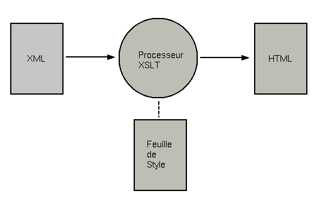
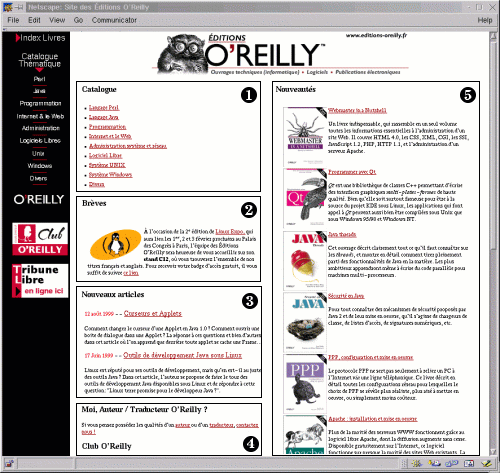
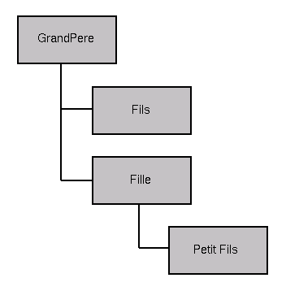
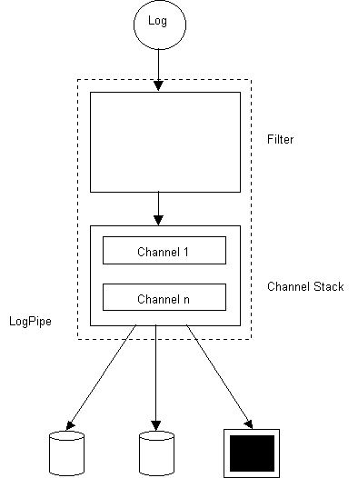
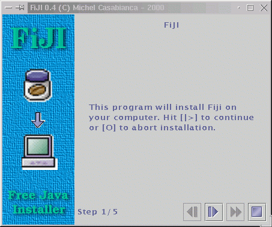
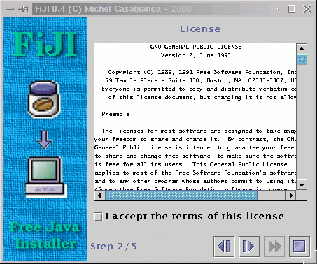

Ce document présente une brève introduction à XML, les outils Java de
développement ainsi que des exemples de mise en oeuvre de XML.

<!--more-->

Introduction à XML
------------------

### Origines

- Recommandation du W3C : <http://www.w3.org/TR/REC-xml>
- Traduction en français :
  <http://babel.alis.com/web_ml/xml/REC-xml.fr.html>
- Naissance de XML : <http://java.sun.com/xml/birth_of_xml.html>

XML (eXtensible Markup Language) est né du constat que le HTML n'est pas
adapté aux futures exigences de l'internet. Des ingénieurs ont alors eu
l'idée de remplacer le HTML par SGML (Standard Generalized Markup
Language), seul système capable à l'époque de succéder au HTML.

Jon Bosak, qui travaillait pour Sun, a alors été chargé par le W3C de
"mettre le SGML sur le web". Le travail de définition de ce qui allait
devenir le XML (suggestion du gourou SGML James Clark) a duré onze
semaines (de la fin août 1996 à novembre de la même année, date de
publication du premier draft). Les finitions ont pris encore une année
et la version 1.0 de la norme a été publiée en février 1998.

L'idée du groupe de travail du W3C était de créer un langage de balisage
hypertexte aussi simple à apprendre et utiliser que le HTML et aussi
puissant que le SGML. C'est une démarche similaire qui a conduit Sun à
développer Java (simplification du C++).

### Caractéristiques de XML

- Introduction à XML :
  <http://www.javaworld.com/javaworld/jw-04-1999/jw-04-xml.html>

XML reprend donc les principales caractéristiques qui font la puissance
de SGML :

- L'utilisateur est libre de créer son propre jeu de balises (ou
  *éléments*).
- Il en définit la syntaxe dans un fichier séparé, appelé *DTD* (pour
  Document Type Definition).
- Il est possible d'inclure la DTD dans l'en tête du fichier XML
  lui-même (document *stand alone*) ou même de créer des documents
  sans DTD.
- Un fichier XML est dit *bien formé* s'il se conforme à la syntaxe
  générale du XML (par exemple, tout élément ouvert doit être
  refermé).
- Un fichier XML sera dit *valide* s'il est *bien formé* et est
  conforme à la syntaxe définie dans sa DTD.

### Comparaison avec HTML

Pour comprendre l'intérêt du XML, on peut le comparer au HTML qui a le
mérite d'être connu de tous. Pour la démonstration, je prendrai
l'exemple d'un répertoire d'adresses.

Voici l'allure du fichier HTML :

```html
<html>

 <head><title>R&#233;pertoire</title></head>

 <body>
  <center><h1>Mon r&#233;pertoire</h1></center>
  <h2>Michel Casabianca</h2>
   <p>Expert Java et XML (In-Fusio)</p>
   <p><bf>Adresse:</bf></p>
   <p>23, parvis des Chartrons<br>
      33074 Bordeaux</p>
   <p>Téléphone: 05.56.79.92.00</p>
   <p>Mobile: 06.81.71.72.44</p>
   <p>email: michelc@in-fusio.com</p>
   <p>www: www.in-fusio.com</p>
  </body>

</html>
```

Le moins que l'on puisse dire est que le source HTML n'est pas
particulièrement clair !

Voici maintenant l'allure du fichier XML :

```xml
<?xml version="1.0" encoding="iso-8859-1"?>

<!DOCTYPE repertoire PUBLIC "-//CASA//DTD repertoire//FR" "repertoire.dtd">

<repertoire>

 <personne>
   <prenom>Michel</prenom>
   <nom>Casabianca</nom>
   <qualite>Expert Java et XML</qualite>
   <entreprise>In-Fusio</entreprise>
   <adresse lieu="travail">
     <rue>23, parvis des Chartrons</rue>
     <cp>33074</cp>
     <ville>Bordeaux</ville>
     <pays>France</pays>
     <telephone>05.56.79.92.00</telephone>
     <mobile>06.81.71.72.44</mobile>
     <email>michelc@in-fusio.com</email>
     <www>www.in-fusio.com</www>
   </adresse>
 </personne>

</repertoire>
```

Ce source XML contient les mêmes informations, mais il présente les
avantages suivants :

- Il ne mélange pas l'*information* contenue dans le document et sa
  *présentation* comme le fait le HTML. Par exemple, l'élément
  \<title\> du HTML contient de l'information exploitable alors que
  l'élément \<center\> ne sert qu'à indiquer une mise en forme. La
  rédaction du contenu et sa mise en forme correspondant à deux
  métiers différents, il n'est pas logique de les mélanger.
- Cette séparation du contenu et de la forme permet d'*extraire* des
  informations du document. Une application peut en effet faire une
  liste des entrées du répertoire (pour les injecter dans une base de
  données par exemple) si elle sait que le nom d'une personne est
  encadré par un élément \<nom\>, son prénom par un élément
  \<prenom\>, etc. Cette tâche peut être réalisée de manière *fiable*
  et *standard* par un *parser* XML.

### Document Type Definitions

On peut fixer la grammaire d'un type de document à l'aide d'une DTD
(pour Document Type Definition). Celle de notre exemple de répertoire
permet d'imposer que toute entrée comporte un nom et un prénom, une
qualité, etc. Pour notre répertoire, cette DTD pourrait ressembler à la
suivante:

```xml
<?xml version="1.0" encoding="iso-8859-1"?>

<!ENTITY % lieux "travail | domicile | vacances">

<!ELEMENT repertoire (personne+)>

<!ELEMENT personne (prenom, nom, qualite, entreprise, adresse+)>

<!ELEMENT prenom (#PCDATA)>
<!ELEMENT nom (#PCDATA)>
<!ELEMENT qualite (#PCDATA)>
<!ELEMENT entreprise (#PCDATA)>

<!ELEMENT adresse (rue, cp, ville, pays, telephone, mobile?, email?, www?)>
<!ATTLIST adresse lieu (%lieux;) "travail">

<!ELEMENT rue (#PCDATA)>
<!ELEMENT cp (#PCDATA)>
<!ELEMENT ville (#PCDATA)>
<!ELEMENT pays (#PCDATA)>
<!ELEMENT telephone (#PCDATA)>
<!ELEMENT mobile (#PCDATA)>
<!ELEMENT email (#PCDATA)>
<!ELEMENT www (#PCDATA)>
```   

Un document muni d'une DTD peut être *validé* ce qui certifie qu'il est
conforme à son type. Les DTDs du standard sont cependant relativement
pauvres (on ne peut par exemple pas imposer qu'un champ soit un nombre
entier). Pour aller plus loin, on peut utiliser *Schema* qui propose des
conditions beaucoup plus fines pour les types de document.

### Feuilles de style

- Introduction à XSL :
  <http://metalab.unc.edu/xml/books/bible/updates/14.html>

Bien sûr, on peut se poser la question de savoir comment on peut
visualiser un fichier XML dans la mesure où les balises ne donnent
aucune indication sur la présentation du document. Pour pouvoir afficher
un fichier XML, il faut donc lui associer une *feuille de style*.
Celle-ci permet de le transformer en un document (HTML ou autre) que
l'on peut afficher.



XSLT (eXtensible Style Language, Transformation) est un standard du W3C
permettant de *transformer* un fichier XML en un autre fichier, XML ou
d'un autre format (HTML, PDF ou Texte par exemple). Un fichier XSL est
lui-même un fichier XML opérant une transformation sur l'*arbre* du
document XML.

Une feuille de style XSLT est essentiellement constituée de *templates*.
Un template transforme un élément XML en un texte quelconque dans le
document résultant (par exemple en un tag HTML). Pour transformer un nom
de notre répertoire en un tag \<h2\>, nous pourrions définir le template
suivant:

```xml
<xsl:template match="nom">
  <h2><xsl:apply-templates/></h2>
</xsl:template>
```

On aura compris que la modification de la *présentation* de la page
n'implique que la modification de la feuille de style (et non de chaque
fichier HTML, ce qui peut devenir un cauchemar pour de gros sites).

XSLT va cependant plus loin que d'autres langages de feuille de style
(comme CSS) car il permet de manipuler la *structure* du document. On
peut ainsi générer automatiquement un index de notre répertoire et le
trier par ordre alphabétique par nom ou entreprise par exemple.

On peut aussi transformer un fichier XML de type *A* en un document de
type *B*, passant ainsi d'une DTD à une autre (si les informations sont
compatibles). XSLT est donc aussi un langage de transformation entre
DTD.

### Échange de données textuelles entre programmes

XML va beaucoup plus loin que HTML car son champ d'application ne se
borne pas aux documents texte. Du fait que l'on peut y extraire des
informations de façon fiable, il permet l'échange d'information entre
programmes.

Cette utilisation de XML a de beaux jours devant elle car un fichier XML
présente de nombreux avantages sur un fichier binaire ou texte "plat":

- Il est indépendant de la plateforme (il utilise l'encodage Unicode
  pour les caractères).
- Il est indépendant du langage de programmation.
- Il est manipulable par un simple éditeur de texte.
- Les outils pour le manipuler sont standards (les parsers XML sont
  légions et on en trouve pour quasiment tous les langages de
  programmation).

Par exemple, XML-RPC permet d'appeler des méthodes sur une machine
distante grâce à un protocole utilisant XML. Il présente, par rapport à
RMI par exemple, l'avantage d'être indépendant du langage (alors que RMI
est lié à Java) et de la plateforme.

XML est très utilisé comme format de données textuelles, voir les
exemples de mise en oeuvre à la fin de cet article pour des applications
concrètes.

### Standards dérivés
-----------------

- Liste de spécifications XML :
  <http://www.xml.org/xmlorg_registry/index.shtml>

Un intérêt de XML est donc l'échange d'informations. Pour que cet
échange soit possible, il faut que les acteurs d'un secteur se mettent
d'accord sur une DTD commune.

On voit donc émerger quotidiennement de nouvelles spécifications pour
toutes sortes de domaines d'activité (allant de la notation musicale au
commerce électronique).

Il a ainsi été définit un standard pour la notation de formules
mathématiques : <http://www.w3.org/TR/REC-MathML/>. IBM propose un
<http://www.software.ibm.com/network/techexplorer/> pour visualiser des
formules écrites dans ce format et Amaya permet de les visualiser depuis
peu.

Cependant, il risque d'apparaître un problème : celui de la
multiplication des DTD concurrentes nuisant à toute standardisation
(voir l'article
<http://www.xmltechno.com/focus/2000_08_28_standards/standards_xml_p1.cfm>).
On peut néanmoins espérer que l'on remédie à cette situation, pour
plusieurs raisons :

- XSLT permet de convertir un document vers une autre DTD. Si les
  informations contenues dans les documents sont semblables, la
  conversion devrait être possible dans la plupart des cas (seule
  l'expérience nous le dira).
- Il est très probable qu'une sélection s'opère rapidement et qu'il ne
  reste qu'un seul format dans chaque domaine d'activité (ou un petit
  nombre de formats inter-opérables).

C'est à mon sens le seul nuage assombrissant l'avenir de XML.

### APIs

Le langage XML étant un standard, il permet l'échange d'informations
entre applications. L'étape suivante est en toute logique la
standardisation de l'API des parsers (composants logiciels permettant
d'accéder facilement aux données contenues dans un document XML). C'est
le but de SAX (Simple API for XML) et de DOM (Document Object Model).

#### SAX

- Norme SAX : <http://www.megginson.com/SAX/index.html>

Le principe du parser SAX est simple : on lui raccorde des objets dont
les méthodes (implantant des interfaces précises) sont appelées par le
parser lorsque certains évènements se produisent au cours du parsing du
fichier XML.

La norme SAX (en version 2) définit ainsi quatre interfaces :

**ContentHandler :** le parser appelle ses méthodes pour rendre compte
des évènements relatifs au document. Elle définit , entre autre, les
méthodes suivantes :

- `startDocument() :` lorsqu'il ouvre un nouveau document
- `startElement() :` lorsqu'il rencontre un nouvel élément
- `characters() :` lorsqu'il rencontre du texte

**ErrorHandler :** ses méthodes sont appelées lorsque le parser
rencontre des warnings ou des erreurs. Elle permet par conséquent au
développeur de décider de l'attitude à adopter en cas d'erreur (arrêter
le parsing ou non).

**DTDHandler :** ses méthodes sont appelées lors du parsing de la DTD du
document.

**EntityResolver :** son unique méthode `resolveEntity()` renvoie une
URL pour une URI donnée. Utile pour la gestion des catalogues par
exemple.

SAX est très rapide et peu gourmand en mémoire, mais il ne permet pas de
manipuler l'arbre du document lors du parsing (il ne fait que
*consommer* les données). La norme permet d'écrire des applications
indépendantes du parser utilisé (en prenant quelques précautions
décrites plus loin dans ce document).

#### DOM

- Standard du W3C : <http://www.w3.org/TR/DOM-Level-2-Core/>

DOM (Document Object Model) permet de représenter un document XML sous
forme d'un arbre d'objets en mémoire. Il définit une API pour parcourir
et modifier l'arborescence.

DOM est donc tout indiqué pour des applications modifiant l'arbre du
document (comme un éditeur graphique de fichiers XML).

Cependant, DOM soufre d'un certain nombre de défauts :

- **Il est lent :** à tel point que la plupart des processeurs XSLT
  (qui pourtant seraient une application toute indiquée du DOM)
  implantent leur propre modèle objet en mémoire.
- **Il est gourmand en mémoire :** chaque noeud (y compris ceux
  d'attributs et de blancs) contient une référence vers le noeud
  parent, suivant, précédent, premier et dernier fils, document le
  contenant, son nom, sa valeur, données utilisateur et quelques
  drapeaux.
- **La norme est incomplète :** elle ne définit pas, entre autre,
  comment on récupère le document. Chaque parser implante donc sa
  propre API. Il est par conséquent impossible d'écrire du code
  indépendant du parser utilisé. On est amené à écrire des classes
  "wrapper" implantant une interface commune pour chaque parser
  supporté (on pourra par exemple consulter le code source du
  processeur XSLT XSL:P).

#### Java API for XML Parsing

- <http://java.sun.com/aboutJava/communityprocess/final/jsr005/index.html>

Sun a mis au point l'API pour le parsing XML afin de résoudre les
problèmes de dépendance du code au parser évoqués ci-dessus. Son API est
une enveloppe pour rendre le code d'une application XML indépendante du
parser utilisé. Elle encapsule la création et le paramétrage des parsers
SAX et DOM.

Par exemple, pour créer un parser SAX validant et implantant les espaces
de nommage, on utilisera le code suivant :

```java
SAXParser parser;
HandlerBase handler = new MyHandlerBase();
SAXParserFactory factory = SAXParserFactory.newInstance();
factory.setNamespaceAware(true);
factory.setValidating(true);
try {
  parser = factory.newSAXParser();
  parser.parse("http://monserveur/mondocument.xml", handler);
} catch(SAXException se) {
  // gestion des erreurs
} catch(IOException ioe) {
  // gestion des erreurs
} catch(ParserConfigurationException pce) {
  // gestion des erreurs
}
```

Ce code est totalement indépendant du parser utilisé et fonctionnera
avec tout parser conforme à l'API JAXP. JAXP définit aussi un mécanisme
semblable pour instancier et paramétrer un parser DOM.

Le parser de Sun et les principaux parsers XML en Java implantent cette
API et il est très probable que tous les autres fournisseurs suivent cet
exemple.

Outils pour XML
---------------

Je vous propose maintenant de faire un tour d'horizon des *principaux*
outils XML tournant sur plateforme Linux (pour l'essentiel des outils
Java). Un tel référencement ne peut prétendre être exhaustif car le
nombre d'outils disponible est très important et augmente sans cesse.
Pour des listes exhaustives et régulièrement mises à jour, on pourra
consulter la page
<http://www.stud.ifi.uio.no/~lmariusg/linker/XMLtools.html> (concernant
exclusivement les outils libres) ou encore le site
<http://www.xml.com/resourceguide> qui recense aussi les outils
propriétaires. D'autre part, l'article
<http://www.xmltechno.com/outils/01_intro_p1.cfm> recense les principaux
outils XML pour l'ensemble des langages de programmation et des
plateformes.

### Le projet xml.apache.org

- <http://xml.apache.org>
- Articles : <http://xml.apache.org/pr/0001.txt> et
  <http://news.cnet.com/news/0-1003-200-1431504.html?tag=st.ne.1002.thed.1003-200-1431504>

Le projet *xml.apache.org* a pour objectif de fournir des solutions XML
de qualité en Open Source, de faire suivre les observations concernant
les standards de l'IETF et du W3C et de regrouper les activités
relatives à XML du projet Apache. Il regroupe de nombreuses entreprises
actives dans le domaine (dont IBM, Lotus, Sun, Exoffice et Bowstreet) et
gère les sous-projets suivants :

- Xerces : Parsers XML en Java, C++ et Perl (anciennement XML4J d'IBM)
- Xalan : Processeurs de feuilles de style XSLT (anciennement LotusXSL
  de Lotus)
- Cocoon : Système de publication sur le web basé sur XML
- FOP : Objets de formatage XSL
- Xang: Serveur d'applications Web écrites en Java utilisant XML, XSLT
  et ECMAScript (Java Script)
- SOAP: (Simple Object Access Protocol) est une implémentation
  <http://www.w3.org/TR/SOAP> du W3 d'un protocole d'appel de méthodes
  sur un objet distant utilisant un protocole basé sur XML.
- Batik: est une boite à outil Java pour la visualisation, la
  manipulation et la génération d'images SVG (Scalable Vector
  Graphics).
- Crimson: est le successeur du parser de Sun Project X. Il devrait à
  terme fusionner avec Xerces pour devenir Xerces Java.

Ce projet est une avancée majeure vers l'acceptation large des logiciels
Open Source. Il concrétise l'engagement de grandes sociétés
informatiques sur la voie du logiciel libre.

Le développement de ces outils est
<http://xml.apache.org/overview.html>. Xml.apache.org met à disposition
des utilisateurs et développeurs des <http://xml.apache.org/mail.html>.

### Parsers XML

Un parser est un composant logiciel (classes Java en l'occurrence)
permettant d'accéder simplement aux données encapsulées dans un fichier
XML. C'est donc le composant de base de toute application XML.

SAX permet de produire du code standard qui s'adapte, sans
recompilation, à tout parser moyennant quelques efforts. En particulier,
on prendra soin de ne pas instancier directement le parser, mais de
passer par la classe dédiée (`XMLReaderFactory`). D'autre part, il est
utile de donner la possibilité de paramétrer le nom de la classe du
parser (sur la ligne de commande ou dans un fichier de configuration).

JAXP (Java API for XML Parsing), API définie par Sun pour les parsers
XML en Java permet d'écrire du code indépendant du parser utilisé pourvu
qu'il soit conforme à l'API. C'est très utile pour instancier les
parsers DOM dont le standard ne définit que l'API pour la manipulation
des documents et non pour obtenir le parser lui même, ce qui conduit à
des codes fortement liés au parser utilisé. Un changement de parser en
cours de projet peut se révéler alors douloureux.

Moyennant ces quelques précautions, on pourra suivre le rythme effréné
du développement des parsers XML et en changer si nécessaire. Tous les
parsers récents respectent l'API du Sun.

#### Project X de Sun

- <http://java.sun.com/xml>
- Gratuit

Ce logiciel est gratuit (même pour un usage commercial), et ses sources
en sont disponibles (dans le répertoire *src*).

Le parser de Sun est conforme à XML 1.0, SAX 1.0 et DOM level 1 et
implante la version actuelle de XML Namespaces. Il peut tourner sur
toute machine virtuelle Java 1.1.6 ou supérieure.

Sun met à notre disposition deux parsers : un parser non validant
*com.sun.xml.parser.Parser* (plus rapide) et un parser validant
*com.sun.xml.parser.ValidatingParser*. Le parser non validant vérifie
que le document est *bien formé* alors que le parser validant vérifie en
plus qu'il est conforme à sa DTD.

En plus des standards SAX et DOM, Sun fournit des classes étendant SAX
pour implanter les *Namespaces*, mais aussi d'autres classes
utilitaires, comme le *TreeWalker* permettant de naviguer aisément dans
l'arbre du document.

Le parser de Sun délivre des messages d'erreur particulièrement clairs.
On notera cependant qu'il faut lui indiquer la *Locale* *en\_US* pour ne
pas obtenir des messages d'erreur incompréhensibles.

Sans préciser la *Locale*, on obtient par exemple :

```bash
com.sun.xml.parser/V-037 fixes
```

En indiquant la *Locale*, on obtient :

```bash
Element "fixes" does not allow text.
```

Ce qui est tout de même plus clair ! Le problème vient du fait que la
méthode d'initialisation du parser (*com.sun.xml.Parser.init()*) choisit
comme *Locale* la *Locale* par défaut de la VM (*fr\_FR* pour une VM
sous nos latitudes) qui n'est pas supportée. On pourra indiquer la
*Locale* *en\_US* avec le code suivant :

```java
try {parser.setLocale(new Locale("en","US"));}
catch(Exception e){}
```

On trouvera <http://sweetohm.net/article/projectx.html> le code pour
corriger ce bug ainsi que la traduction des messages d'erreur en
Français.

La documentation du parser fournit de nombreux exemples d'utilisation
(dans le sous-répertoire *examples*).

Mis à part ce problème, ce parser m'a semblé très fiable à
l'utilisation.

Sun a donné son parser au projet *xml.apache.org*, qui devrait à terme
le faire fusionner avec le parser d'IBM (voir l'
<http://xml.apache.org/pr/0001.txt> pour plus d'informations). Il sera
bientôt disponible à l'URL suivante : <http://xml.apache.org>.

#### Xerces-J (anciennement XML for Java) du projet xml.apache.org

- <http://xml.apache.org/xerces-j> ou
  <http://www.alphaworks.ibm.com/aw.nsf/frame?ReadForm&/aw.nsf/techmain/F62DB5F8684DCF6A8825671B00682F34>
- Licence Apache 1.1 (pour les classes du paquet *org.apache*) et IBM
  XML4J Evaluation Licence (pour les classes du paquet *com.ibm*)

Xerces-J est le nom du projet XML4J depuis qu'IBM en a fait don à
*xml.apache.org*. Il est maintenant géré par ce dernier mais IBM
continue de distribuer une version sur son site
<http://alphaworks.ibm.com/formula>. La version 3 de XML4J est basée sur
le code de Xerces-J mais XML4J fournit en plus une API de compatibilité
avec les versions 2 (contenue dans le fichier `xml4j.jar`).

Xerces-J est distribué sous forme de binaires (fichier JAR) et sous
forme de sources.

Xerces-J supporte *SAX* versions 1 et 2, *DOM* versions 1 et 2, ainsi
que *XML Schema*. Le support de Schema, SAX 2 et DOM 2 est encore en
développement. Il implémente d'autre part l'API JAXP de Sun pour les
parsers XML.

Xerces-J propose deux parsers : *org.apache.xerces.parsers.SAXParser* et
*org.apache.xerces.parsers.DOMParser*. Il est possible de leur passer
des *propriétés* ou des *fonctionnalités* à l'aide de l'interface
*org.xml.sax.Configurable* de SAX2. Par exemple, pour que le parser soit
validant, on pourra écrire :

```java
SAXParser p=new SAXParser();
try {
  p.setFeature("http://xml.org/sax/features/validation",true);
} catch (SAXException e) {
  System.out.println("error in setting up parser feature");
}
```

Xerces-J gère les catalogues au format
<http://www.ccil.org/~cowan/XML/XCatalog.html> (version 0.2) dérivé du
format de catalogue *SGML Open catalog format*. Cette fonctionnalité me
semble quasiment indispensable pour gérer les DTDs. Pour plus de
détails, voir les fichiers *org.apache.xerces.readers.XCatalog.java* et
*org.apache.xerces.readers.XMLCatalog.java* des sources.

Des exemples sont disponibles dans le sous-répertoire *samples*.

Ce parser (dans ses versions 1 et 2) m'a donné entière satisfaction,
mais on peut lui reprocher ses messages d'erreur pas toujours très
clairs.

#### OpenXML

- <http://www.openxml.org>
- <http://www.openxml.org/license.html>

OpenXML (de Exoffice et Assaf Arkin) a longtemps été le seul parser XML
en Open Source. Il a rejoint le projet *xml.apache.org*, mais n'est pas
encore disponible sur le site Apache.

Il supporte XML 1.0, SAX et DOM level 1, ainsi que les catalogues au
format XCatalog (version 0.3) et XML Software Autoupdate.

#### Aelfred

- <http://www.opentext.com/services/content_management_services/xml_sgml_solutions.html#aelfred_and_sax>
- Gratuit

Ælfred est un analyseur très petit (le fichier Jar ne fait que 22 ko),
ce qui le rend très intéressant pour un usage dans les applets par
exemple. De plus, son occupation mémoire est très faible.

#### Choix d'un parser

Le parser étant la pièce maîtresse d'une application XML, faire le bon
choix est primordial. On peut trouver des benchmarks testant les
principaux parsers disponibles :

- <http://developerlife.com/domconformance/default.htm> : teste la
  conformité des parsers aux standards
- <http://developerlife.com/parsertest2/performance.html> : compare
  les performances des trois parsers Java principaux (Xerces, ProjectX
  et OpenXML)
- <http://www.xml.com/lpt/a/Benchmark/exec.html> : teste les
  performances des parsers dans différents langages (C, Java, Perl et
  Python).

*D'après ces benchmarks* il semblerait que :

- Xerces-J soit le plus rapide
- ProjectX soit plus respectueux des standards

**Cependant**, ces tests commencent à dater et j'accorde personnellement
peu de crédit aux benchmarks en général. Il ressort de mon **expérience
personnelle** (ayant utilisé de manière intensive XML4J en versions 1 et
2 et ProjectX) que :

- XML4J est plus rapide sur des machines virtuelles 1.1 alors que
  ProjectX est plus rapide sur 1.2.
- Les messages d'erreur de ProjectX sont plus clairs.

En outre, en produisant du code conforme aux standards, il est possible
de changer de parser de manière simple. La meilleure solution me semble
donc être de tester soi-même les parsers dans l'application.

### Processeurs XSLT

Les processeurs XSL transforment un fichier XML en un fichier d'un autre
format (html, texte ou LaTeX par exemple) à l'aide de feuilles de style
XSL. Ils peuvent donc être invoqués sur la ligne de commande de la
manière suivante :

```java
java classe.du.processeur fichier.xml fichier.xsl fichier.???
```

Lorsqu'on utilise ces programmes pour traiter de petits fichiers sur la
ligne de commande, il peut être utile (pour une question de vitesse
d'exécution) de désactiver le compilateur JIT en ajoutant la ligne
suivante dans le script de lancement :

```java
export JAVA_COMPILER=
```

Il est possible d'intégrer ces programmes dans une application. Il
n'existe pas d'API commune à ces processeurs, mais tous utilisent un
parser SAX ou DOM pour construire une représentation en mémoire du
document. Le document à traiter pourra alors être communiqué au
programme sous forme d'un DOM ou d'une `InputSource` SAX.

#### XT de James Clark

- <http://www.jclark.com/xml/xt.html>
- Licence de type Apache

Ce programme est sous licence de type *Open Source* et donc livré avec
celles-ci. Cependant, l'absence totale de commentaires rend le code
assez imperméable à toute modification ou amélioration.

XT utilise un parser SAX pour lire les fichiers XML et XSL. Tout parser
conforme au standard fait l'affaire. On peut lui passer le nom de la
classe du parser sur la ligne de commande (sous forme d'une propriété
système, `-Dorg.xml.sax.parser=le.nom.du.parser`).

Il est possible de passer des arguments sur la ligne de commande (sous
la forme *nom=valeur*). Ces arguments, de type chaîne de caractères,
peuvent alors être utilisés dans le fichier XSL s'il définit le
paramètre correspondant.

XT peut être utilisé comme Servlet (avec un moteur de Servlet de version
2.1 ou supérieur), la classe correspondante est
`com.jclark.xsl.sax.XSLServlet`.

XT définit une API basée sur SAX (interface
`com.jclark.xsl.sax.XSLProcessor`) et une API basée sur DOM (interface
`com.jclark.xsl.dom.TransformEngine`). Cependant, la classe DOM est bien
plus lente et moins fonctionnelle que celle basée sur SAX mais
indispensable lorsque le document à traiter résulte de la manipulation
d'un document DOM en mémoire. Il est même possible de mélanger ces deux
méthodes.

XT comporte quelques extensions par rapport à la norme, parmi lesquelles
:

- **Appel de méthodes** Java. On pourra par exemple écrire le code
  suivant dans un fichier XSL pour afficher la date :

```xml
<xsl:stylesheet
  version="1.0"
  xmlns:xsl="http://www.w3.org/1999/XSL/Transform"
  xmlns:date="http://www.jclark.com/xt/java/java.util.Date">

  <xsl:template match="/">
    <html>
      <xsl:if test="function-available('date:to-string') and 
                    function-available('date:new')">
        <p><xsl:value-of select="date:to-string(date:new())"/></p>
      </xsl:if>
    </html>
  </xsl:template>

</xsl:stylesheet>
```

- **Documents multiples** : le fragment de document encadré par
  l'élément `<xt:document href="chemin-fichier">` sera enregistré dans
  le fichier dont le chemin relatif (par rapport au document généré)
  est donné par l'attribut `href`. Par exemple, le source suivant
  génère (en plus du document normalement généré par le traitement du
  fichier XML en cours) deux fichiers : *hello.xml* (contenant la
  chaîne *Hello !*) et *world.xml* (contenant le chaîne à laquelle
  vous pensez). Le répertoire *demo* contient des exemples plus
  pertinents de documents multifichiers.

```xml
<xsl:stylesheet xmlns:xsl="http://www.w3.org/1999/XSL/Transform"
  xmlns:xt="http://www.jclark.com/xt"
  extension-element-prefixes="xt">

  <xsl:template match="/">
    <xt:document method="xml" href="hello.xml">
    Hello !
    </xt:document>
    <xt:document method="xml" href="world.xml">
    World !
    </xt:document>
  </xsl:template>

</xsl:stylesheet>
```

- **Méthode de sortie additionnelle :** permet de rajouter un
  caractère d'échappement devant certains caractères.
- **Fonctions additionnelles :** ajoute trois fonctions à celles du
  standard : *xt:node-set* (pour convertir un fragment d'arbre en
  *node-set*), *xt:intersection* (renvoie l'intersection de deux
  *node-sets*) et *xt:difference* (renvoie la différence de deux
  *node-sets*).

Ces extensions à la norme s'avèrent être très utiles (en particulier les
deux premières) et l'on peut s'attendre à ce qu'elles soient un jour
ajoutées au standard (dans la mesure où James Clark est partie prenante
dans la définition de ces standards du W3C). Cependant, comme toute
extension, elles interdisent toute migration vers un autre processeur
XSL.

Malgré quelques limitations (fonctionnalités de la proposition XSLT 1.0
non implantées) et quelques bugs connus, ce programme est très
fonctionnel, respectueux des standards et rapide. On regrettera
cependant le manque de messages d'erreur qui rend le débuggage de
fichiers XSL pénible et l'absence de commentaires dans les sources.

Contre toute attente, son auteur James Clark, en a arrêté le
développement car son implémentation n'avait pour but que de tester la
recommandation du W3 (dont il est l'éditeur). Des utilisateurs de XT ont
cependant mis en place un site de <http://4xt.org>.

#### Xalan-Java (anciennement LotusXSL) du projet xml.apache.org

- <http://xml.apache.org/xalan>
- <http://xml.apache.org/dist/LICENSE.txt>

Xalan fait maintenant partie du projet *xml.apache.org*. Une version C++
est aussi disponible.

Par défaut, Xalan est configuré pour fonctionner avec Xerces, mais il
peut s'accommoder de tout parser DOM.

Xalan peut produire des événements SAX, un DOM ou un document XML.

Les feuilles de style sont lues par un parser SAX puis compilées (les
expressions XPath et les traitements qui peuvent l'être sans connaître
la structure du document XML à traiter).

Il est nécessaire de créer une instance de Xalan par thread (deux
threads ne peuvent partager la même instance). C'est certainement peu
gênant pour la plupart des utilisations, mais je me demande si ce ne
serait pas un problème pour les *Servlets* (on ne peut alors utiliser
une même instance pour toutes les requêtes).

Xalan permet de générer plusieurs fichiers à partir d'un unique fichier
XSL lorsque la méthode de sortie est *html*, *xml* ou *text*.

Xalan permet d'appeler une méthode Java ou JavaScript dans un script
XSL.

Le point fort de Xalan est le débuggage des fichiers XSL :

- On peut tracer les *templates* en cours de génération.
- Une DTD est fournie pour les sorties de type *html*.

Il est possible d'utiliser Xalan de trois manières distinctes :

- **Sur la ligne de commande :** en lançant la classe
  `org.apache.xalan.xslt.Process` et en lui passant le fichier XML, le
  fichier XSL et le fichier de sortie. La liste des options de la
  ligne de commande est très complète : on peut valider les fichiers
  XML et XSL, on peut passer des arguments à la feuille de style, etc.
- **Depuis une autre classe Java :** les fichiers XML et XSL peuvent
  être passés sous forme d'*URL*, de fichier, de flux de caractères ou
  de document DOM. La feuille de style peut être passée sous forme
  compilée. Xalan utilise des *wrappers* pour combler des lacunes de
  DOM concernant l'interface des parsers (le code est ainsi
  indépendant du parser DOM utilisé). La documentation fournit un
  exemple de programme utilisant Xalan.
- **Dans une applet :** permet ainsi d'embarquer le processeur XSL
  dans une applet et de récupérer le document de sortie sous forme
  d'une chaîne de caractères.

Pour finir, Xalan fournit une interface de débuggage.

#### Saxon

- <http://users.iclway.co.uk/mhkay/saxon>
- <http://www.mozilla.org/MPL/>

Saxon est un ensemble d'outils pour traiter les fichiers XML. Il
comporte en particulier un processeur XSLT conforme au standard du W3C,
ainsi qu'une bibliothèque Java rendant un service comparable à XSLT mais
avec la possibilité de programmer - ce qui permet par exemple d'accéder
à une base de données. Il utilise une version modifiée de Ælfred
(passant les commentaires à l'application), mais tout analyseur SAX 2
fait l'affaire.

Le processeur XSLT de Saxon permet de générer plusieurs documents à
partir d'un seul fichier XML, de chaîner les feuilles de style à
appliquer au document XML et de modifier les variables d'une feuille de
style (qui ne peuvent normalement pas être modifiées, contrairement à ce
que laisse supposer leur nom).

#### XSL:P de Keith Visco

- <http://www.clc-marketing.com/xslp/>
- <http://www.clc-marketing.com/xslp/download.html>

XSL:P fait maintenant partie du projet *xml.apache.org*. Il n'implante
que le *draft* du 21.4.1999. (et n'est donc pas à jour par rapport au
standard). Une version C++ est en développement (elle est présente sur
le <http://lxr.mozilla.org/seamonkey/source/extensions/transformiix>).

XSL:P peut utiliser XML4j versions 1.1.16 ou 2.0.x, OpenXML, Oracle XML
Parser ou ProjectX. Il est configuré par défaut pour utiliser XML4J,
mais on peut changer de parser en éditant le fichier *xslp.properties*
dans le fichier JAR.

L'originalité de XSL:P est de disposer de *formatters* permettant des
formats de sortie divers.

XSL:P soufre d'un problème de lenteur du à l'utilisation de DOM comme
format de représentation en mémoire des documents.

L'auteur semble envisager de fusionner XSL:P dans Xalan.

### Éditeurs XML

Il est possible d'éditer un document XML avec tout éditeur de texte.
Cependant, il peut être utile de disposer d'un outil permettant de
valider les documents, de connaître les éléments autorisés, etc.

#### Emacs et PSGML

- <http://www.emacs.org> et
  <http://www.lysator.liu.se/projects/about_psgml.html>
- Licence <http://www.gnu.org/copyleft/gpl.html>

On ne présente plus Emacs, l'éditeur surpuissant. On peut quasiment tout
faire avec (lire son courrier, les forums, éditer du code Java, ou même
des fichiers XML, comme je suis en train de le faire en ce moment même).

Emacs possède par défaut un mode SGML adapté à XML, mais ce mode est
assez limité. Pour un usage intensif, on lui préférera *PSGML*, mode
permettant d'éditer des fichiers SGML et (depuis sa version 1.2.0) des
fichiers XML.

On peut trouver une documentation, en français, sur l'installation de
*PSGML* à l'adresse
<http://www.linux-france.org/article/appli/emacs/psgml-linuxdoc/sgml-tools-1/>
(Attention ! cette documentation n'est plus à jour mais reste utile). La
documentation du programme est assez complète, mais on peut trouver un
livre complet sur l'utilisation de *PSGML* à l'adresse
<http://www.snee.com/bob/sgmlfree>.

On notera qu'il est nécessaire de taper `M-X xml-mode` pour éditer un
fichier XML (sans quoi on l'édite en mode SGML, ce qui peut poser des
problèmes). Il est aussi possible d'ajouter le commentaire suivant en
fin de fichier pour passer au mode XML lors du chargement du fichier :

```xml
<!--
Local Variables:
  mode: xml
  sgml-indent-data: t
  sgml-indent-step: 1
End:
-->
```

#### XED

- <ftp://ftp.cogsci.ed.ac.uk/pub/ht/xed05-freebsd.tar.gz>
- Pour évaluation seulement

XED est un éditeur validant (il lit les DTDs) codé en C, Python et Tk.
Il facilite l'édition des fichiers XML (messages d'erreur, possibilité
d'enlever les instructions et les commentaires, menu contextuel pour les
éléments et attributs, etc.).

La principale limitation de XED vient de l'utilisation de Python qui ne
supporte pas l'UNICODE.

#### Morphon XML Editor

- <http://www.morphon.com>
- Gratuit

XMLEditor est un éditeur XML écrit en Java. Il permet d'éditer
graphiquement un fichier XML (avec une vue de l'arbre et une vue
WYSIWYG). On peut aussi voir le résultat de la page HTML générée.

La version testée utilisait pour le formatage un langage qui était une
*extension* du standard XSL (appelé *EXSL*). La version actuelle utilise
*CSS* et fournit un éditeur adéquat. On peut cependant se demander si le
choix de XSLT n'aurait pas été plus judicieux.

#### XML Pro

- <http://www.vervet.com>
- Commercial (version d'évaluation disponible)

XML Pro est un éditeur XML commercial écrit en Java. Il présente une vue
de l'arborescence du fichier dans laquelle il est possible d'insérer un
élément, d'en supprimer, etc. Une VM 1.2 est nécessaire.

Si la réalisation semble convenable, on regrettera l'absence d'un
visualisateur (vers HTML par exemple) dans cet outil visuel. Les
utilisateurs militants de Linux regretteront aussi que l'on nous impose
le L&F Windows !

L'archive ne fournissant ni documentation, ni script de lancement (même
pour Windows), on est bien embarrassé à l'installation du produit (on ne
connaît pas la classe Java à invoquer !). Voici un script de lancement
pour système UNIX :

```bash
#!/bin/sh
XMLPRO_HOME=/usr/local/xmlpro
export CLASSPATH=$XMLPRO_HOME/xmlpro.jar
cd $XMLPRO_HOME
java XMLPro
```

### Navigateurs et serveurs XML

Un navigateur XML permet de visualiser un fichier XML associé à une
feuille de style (XSL, CSS ou autre). C'est un outil essentiel pour
l'utilisation de XML à grande échelle sur l'internet et pourtant, les
navigateurs XML opérationnels ne sont pas légion.

#### InDelv XML Browser

- <http://www.indelv.com>
- Gratuit

La version de test de ce produit comporte un éditeur en version limitée
dans le temps et un navigateur XML/XSL gratuit.

L'ensemble est intéressant et plutôt stable. Le choix d'AWT peut être
critiqué, mais il donne au programme une vitesse d'exécution très
satisfaisante.

De nombreux fichiers d'exemples (dont les oeuvres de Shakespeare) sont
fournis, et on prend alors conscience de la puissance du concept : le
navigateur charge les fichiers XML qui sont *tous* mis en forme avec la
même feuille de style XSL *spécifique* aux oeuvres de l'auteur.

Si le concept est très intéressant, le rendu graphique (et en
particulier les polices) laissent un peu à désirer et on est encore loin
du rendu d'un navigateur HTML comme Netscape.

#### Amaya

- <http://www.w3.org/Amaya>
- <http://www.w3.org/Consortium/Legal/copyright-software-19980720.html>

Amaya est le navigateur du W3C et permet de tester les nouveaux
protocoles et formats de données. Il est disponible pour Windows et pour
UNIX (un fichier RPM est disponible au téléchargement). Amaya comporte
de plus un éditeur HTML/XHTML/MathML WYSIWYG gérant les feuilles de
style CSS.

En ce qui concerne XML, Amaya est capable d'afficher et d'éditer le
XHTML et MathML. On peut en voir une démonstration sur
<http://www.w3.org/Amaya/MathExamples.html> (mais il faut un navigateur
capable d'afficher le MathML pour en profiter !).

L'affichage des graphiques vectoriels XML SVG (Scalable Vector Graphics)
est prévu pour une prochaine version.

#### Cocoon

- <http://xml.apache.org/cocoon>
- <http://xml.apache.org/cocoon/license.html>

Cocoon est une extension pour gérer le XML côté serveur. In nécessite un
serveur HTTP muni d'un moteur de servlets (comme JServ ou Tomcat). Il
permet :

- Générer du HTML, XHTML, WML ou PDF à partir de fichiers XML.
- De servir du XML à des clients capables de l'afficher (lorsqu'on lui
  fournit une feuille de style adéquate).
- D'appliquer des feuilles de style en cascade.
- De changer la feuille de style en fonction du client.

Le but de Cocoon est de séparer la *création*, le *traitement* et la
*présentation* du contenu XML d'un site, qui correspondent à des métiers
distincts. En effet, le contenu des pages se trouve dans les fichiers
XML, le traitement dans des balises XSP (jeu de balises associées à des
traitements) et la présentation dans des feuilles de style XSL.

Les créateurs de Cocoon voient un certain nombre de limitations à son
utilisation :

- Le langage de feuilles de style XSL est encore méconnu, mais cela
  devrait changer dans un futur proche.
- Les traitements mis en jeu lors du formatage XSL sont lourds et
  consomment donc des ressources importantes côté serveur. La
  résolution de ce problème passe par l'utilisation de navigateurs
  XML/XSL qui déporteront le traitement côté client (c'est déjà le cas
  avec IE5).

Exemples de mise en œuvre
-------------------------

Pour conclure cet exposé, je vous propose l'étude d'exemples de mise en
oeuvre de XML dans divers domaines d'application.

### Génération de pages

#### WAP SDK In-Fusio

<http://www.in-fusio.com> est une société Bordelaise proposant des
services de jeu sur téléphone mobile. Elle développe entre autre des
jeux WAP reposant sur PHP. Pour accélérer le développement de tels jeux
(qui comportent tous une procédure d'identification, de gestion des
scores, etc.) In-Fusio a développé la plateforme serveur GameZilla qui
offre ces services.

Le WAP SDK permet aux développeurs de jeux d'accéder aux services de
GameZilla mais aussi de rendre le code du jeu indépendant de la
plateforme cible. En particulier, le WML des pages doit être adapté aux
deux principaux navigateurs WML que l'on trouve sur les téléphones
mobiles (Nokia et Phone.com) et traduites suivant la langue de
l'utilisateur.

Il est bien sûr possible de le faire dynamiquement en PHP mais cela
imbrique la présentation et la logique du jeu (les templates pour les
différentes versions du WML sont noyés dans le code) et est gourmand en
ressources (pour obtenir dynamiquement les messages traduits, il faut
aller les chercher dans une base de données, ce qui peut impliquer
plusieurs requêtes par page).

À cette approche dynamique, nous avons préféré une approche statique:

- Le code PHP est clairement séparé du WML (séparation de la logique
  de jeu et de la présentation).
- On applique une première feuille de style aux sources pour adapter
  le WML au navigateur du client.
- Une deuxième feuille de style traduit les références aux messages
  (de la forme `@{reference}` en messages dans la langue du client.

Le programme de jeu doit être accompagné d'un fichier XML contenant la
traduction des messages et les noms des fichiers des images suivant leur
taille (fichier de *ressources*). Il doit être aussi accompagné d'un
descripteur indiquant les configurations supportées (navigateurs,
langues et tailles d'images).

Lors de la compilation, le compilateur du SDK génère N répertoires
comportant les fichiers compilés. Un répertoire correspond à une
configuration possible (par exemple, navigateur Nokia, français et
grandes images).

Prenons le cas d'une page d'accueil d'un jeu:

```xml
<?xml version="1.0"?>

<?php
// reset fields
$solution="";
session_register("solution");
$nb_attempts=0;
session_register("nb_attempts");
?>

<wml>
 <head>
  <meta http-equiv="Expires" content="Thu, 01 Dec 1994 16:00:00 GMT"/>
  <meta http-equiv="Cache-Control" content="no-cache, max-age=0"/>
 </head>

 <card id="menu" title="@{title}">
  <p align="center"></p>
  <menu>
   <item href="play.php">@{play}</item>
   <item href="rules.php">@{rules-title}</item>
   <item href="ranking.php">@{ranking}</item>
  </menu>
  <quit>@{quit}</quit>
 </card>
</wml>
```

Cette page comporte les particularités suivantes:

- Les guidelines du SDK imposent une séparation claire du code PHP et
  du WML.
- On remarque le présence de références du type `@{nom}`. Ce sont des
  références à des ressources dont la valeur dépend de la
  configuration.
- Certains éléments de la partie WML ne font pas partie de la norme.
  Ce sont des éléments propres au SDK In-Fusio qui seront ensuite
  transformés suivant le navigateur ciblé. C'est le cas par exemple de
  l'élément \<menu\> qui sera transformé suivant la plateforme cible.

Fichier pour la configuration `Phone.com/fr/petitesimages`:

```xml
<?php
include("../lib/gz_configuration.php");
include("../lib/gz_tools.php");
include("../lib/gz_database.mysql.php");
include("../lib/gz_identification.php");
include("../lib/gz_score.php");
header("Content-type: text/vnd.wap.wml");
echo '<?xml version="1.0" encoding="iso-8859-1"?>';
?><!DOCTYPE wml PUBLIC "-//WAPFORUM//DTD WML 1.1//EN"
                     "http://www.wapforum.org/DTD/wml_1.1.xml">


<?php // reset fields
$solution="";
session_register("solution");
$nb_attempts=0;
session_register("nb_attempts");
?><wml>
 <head>
  <meta http-equiv="Expires" content="Thu, 01 Dec 1994 16:00:00 GMT"/>
  <meta http-equiv="Cache-Control" content="no-cache, max-age=0"/>
 </head>

 <card id="menu" title="L'âge du capitaine">
  <p align="center"><b>L'âge du capitaine</b></p>
  <p align="center">
  </p>
  <p><select>
   <option onpick="play.php?<?php echo session_name();?>=
     <?php echo session_id();?>">Jouer</option>
   <option onpick="rules.php?<?php echo session_name();?>=
     <?php echo session_id();?>">Règles du jeu</option>
   <option onpick="ranking.php?<?php echo session_name();?>=
     <?php echo session_id();?>">Scores</option>
  </select></p>
  <do label="Quitter" type="accept"><go href="index.php?
     <?php echo session_name();?>=<?php echo session_id();?>"/>
  </do>
 </card>
</wml>
<?php
//gz_done();
?>
```

Dans ce fichier, l'élément \<menu\> a été remplacé par \<select\> et les
éléments \<item\> par des \<option\>. Les références à des ressources
texte ont été remplacées par les messages en français et les références
à des images par leur valeur pour les petites images.

Le fichier généré pour la configuration
`phone.com/en/grandesimages` est le suivant:

```java
<?php
include("../lib/gz_configuration.php");
include("../lib/gz_tools.php");
include("../lib/gz_database.mysql.php");
include("../lib/gz_identification.php");
include("../lib/gz_score.php");
header("Content-type: text/vnd.wap.wml");
echo '<?xml version="1.0" encoding="iso-8859-1"?>';
?><!DOCTYPE wml PUBLIC "-//WAPFORUM//DTD WML 1.1//EN"
                     "http://www.wapforum.org/DTD/wml_1.1.xml">


<?php // reset fields
$solution="";
session_register("solution");
$nb_attempts=0;
session_register("nb_attempts");
?><wml>
 <head>
  <meta http-equiv="Expires" content="Thu, 01 Dec 1994 16:00:00 GMT"/>
  <meta http-equiv="Cache-Control" content="no-cache, max-age=0"/>
 </head>

 <card id="menu" title="Age Of Captain">
  <p align="center">
    
  </p>

  <p><a href="play.php?<?php echo session_name();?>=
     <?php echo session_id();?>">Play</a></p>
  <p><a href="rules.php?<?php echo session_name();?>=
     <?php echo session_id();?>">Rules of the game</a></p>
  <p><a href="ranking.php?<?php echo session_name();?>=
     <?php echo session_id();?>">High scores</a></p>
  
  <p><a href="index.php?<?php echo session_name();?>=
     <?php echo session_id();?>">Quit</a></p>
 </card>
</wml>
<?php
//gz_done();
?>
```

Dans ce fichier, l'élément \<menu\> a été remplacé par une liste
d'éléments \<a href=""\>, les références à des ressources texte ont été
remplacées par les messages en anglais et les références à des images
par leur valeur pour les grandes images.

Cette approche amène beaucoup de souplesse:

- Si l'on souhaite ajouter une langue, il suffit de rajouter les
  entrées correspondantes dans le fichier de ressources et dans le
  descripteur.
- Si l'on souhaite supporter une nouvelle famille (ou version) de
  navigateur, il faut simplement écrire la feuille de style adéquate.

#### Sites des Éditions O'Reilly

##### Pourquoi avoir choisi XML ?

Le choix de XML nous a semblé le meilleur pour plusieurs raisons :

- Le site est essentiellement un *catalogue* (pas exclusivement
  toutefois, cet article en témoigne). On est donc amené à gérer de
  nombreuses pages donc la mise en forme est identique (les pages des
  livres). Il est alors intéressant de dissocier le fond de la forme,
  afin que les éditeurs n'aient pas à faire du formatage HTML.
- Les pages se doivent de suivre la charte graphique de celles du site
  américain, qui est amenée à changer. Avec un site en HTML, la
  modification de cette charte demanderait à ce que *toutes* les pages
  du site soient modifiées manuellement (soit environ 300 pages à
  l'heure actuelle). Cela donnerait des sueurs froides à tout
  webmestre.
- La possibilité de validation des documents permet d'éviter certaines
  erreurs (d'omission en particulier).
- À chaque compilation, la syntaxe HTML et les liens de toutes les
  pages du site sont vérifiés. Nous avons donc l'assurance que le
  rendu est correct sur tout navigateur et qu'il n'existe aucun lien
  cassé.

##### Choix techniques

Les informations pouvant être raisonnablement mises à jour
quotidiennement, nous avons opté pour une solution de *compilation
statique* des pages du site : les pages HTML sont générées à partir des
sources XML puis envoyées au serveur.

Il existe deux autres solutions :

- Génération des pages par *servlets* : les fichiers html sont
  générées lorsqu'ils sont appelés. Cette méthode est indispensable
  lorsque les informations contenues dans les pages changent très
  fréquemment, les pages sont ainsi toujours à jour. Le revers de la
  médaille est que cette méthode est gourmande en ressources CPU côté
  serveur.
- Génération des pages *par le navigateur* : elle a les avantages de
  la méthode précédente sans en avoir les inconvénients. Cependant,
  les navigateurs ne sont pas encore capables de réaliser une
  transformation XSL de manière fiable. Il est donc préférable de s'en
  tenir pour le moment au HTML. Dans un futur plus ou moins proche,
  c'est une solution qui sera probablement envisageable.

##### Architecture

Le site est généré entièrement à chaque compilation (pour éviter des
problèmes de dépendances) à partir d'une arborescence de fichiers XML.
Les fichiers de même type sont placés dans le même répertoire. Les types
de fichiers sont au nombre de six :

- **Catalogue :** ces fichiers présentent les ouvrages du catalogue.
  Chaque fichier (décrivant un livre) génère entre trois et six
  fichiers HTML (index, auteur, description, critiques, errata et
  exemples). Ces pages sont liées entre elles et aux pages des
  catégories (Java, Logiciels Libres, Perl, etc.).
- **Article :** génère l'article sous forme HTML et place un résumé
  dans les pages de catégories adéquates.
- **brève :** ces brèves sont intégrées à la page d'accueil du site
  et/ou à des pages de catégories.
- **club :** génèrent les pages du
  <http://www.editions-oreilly.fr/club>.
- **infos :** comme les brèves, mais en plus long et sans date.

Les pages d'index (la page d'accueil et les pages des catégories) sont
générées par des fichiers XSL appliqués sur l'index XML du site : un
fichier XML regroupant tous les fichiers XML des sources. Il est ainsi
possible de générer les listes des ouvrages classées par ordre
alphabétique, la liste des brèves classées par date, etc.

Ainsi, la page d'accueil regroupe des fragments de nombre de fichiers
XML :



Les fichiers à l'origine des différentes zones de cette page sont les
suivants :

1. La liste des catégories est codée dans le fichier XSL qui génère la
   page d'accueil.
2. Les brèves proviennent du répertoire *breves* des sources. Seules
   les brèves ayant *index* pour catégorie y sont intégrées.
3. Les articles présentés sur cette page sont ceux marqués de l'élément
   \<nouveau/\>.
4. Suivent des infos issues du répertoire *info* et de la catégorie
   *index*.
5. Pour finir, la liste des nouveautés est générée à partir des
   fichiers du catalogue. Seuls les ouvrages dont les fiches sont
   marquées de l'élément \<nouveau/\> sont intégrées à cette page.

Pour conclure, je dirais que XML permet de gérer un tel site de manière
rationnelle et en préservant les investissements des Éditions O'Reilly
du fait que XML est un standard et donc à l'abri du bon vouloir d'un
unique éditeur de logiciel.

### Programmation d'applications modulaires

L'idée de cette approche de la programmation est de charger un arbre de
Beans à partir d'un fichier de configuration XML. on peut en effet assez
facilement définir une syntaxe pour "mapper" des beans sur des éléments
XML:

- Lorsque le parser rencontre un élément `Foo`, il instancie (en
  utilisant l'API d'introspection) un objet de la classe `Foo`.
- Le parser appelle ensuite les méthodes `setBar()` sur l'objet
  instancié pour tout attribut `Bar`.
- Tout objet instancié est ajouté à son parent (l'élément qui le
  contient) avec la méthode `add()`.

Par exemple, le fichier XML suivant:

```xml
<?xml version="1.0"?>

<GrandPere Nom="Emile">
  <Fils Nom="Bernard"/>
  <Fille Nom="Louise">
    <PetitFils Nom="Marc" Age="10"/>
  </Fille>
</GrandPere>
```

Lors du parsing de ce fichier, le parser va réaliser les actions
suivantes:

- Instanciation d'un objet `GrandPere`
- Appel de la méthode `setNom("Emile")`
- Instanciation d'un objet `Fils`
- Appel de la méthode `setNom("Bernard")`
- Appel de la méthode `add(Fils)` sur l'objet `GrandPere`
- etc...

On obtient en mémoire une structure du type:



Cette approche est très utile dans la mesure où ce système permet une
configuration simple du programme (il suffit de modifier le fichier XML,
avec un simple éditeur ou un outil graphique dédié). D'autre part, il
est très extensible: pour utiliser un nouveau type de bean, il suffit de
le placer dans le CLASSPATH du programme, de placer son élément associé
dans le fichier de configuration et le tour est joué !

Cette approche commence à prendre une grande importance en programmation
Java et il me semble que c'est maintenant un paradigme incontournable
utilisé dans un nombre croissant d'applications récentes.

Nous allons maintenant voir un certain nombre d'exemples de mise en
oeuvre de cette approche:

#### Système de Log de GameZilla

Les logs sont envoyés (par RMI) au serveur de log qui les empile (pour
rendre la main immédiatement au client). Les logs sont dépilés par un
*Consumer* qui les envoie aux *tuyaux* pour filtrage et sérialisation.
L'architecture d'un tuyau de log est la suivante:



Le filtre permet de sélectionner les logs à sérialiser dans ce canal de
log. Les logs passent ensuite par les channels qui définissent un moyen
de persistance (dans des fichiers, dans une BD, par mail ou sur la
console).

Pour configurer ce système, nous avons mis en oeuvre la technique de
mapping XML/Beans exposée ci-dessus. Voici un exemple de fichier de
configuration d'un tuyau de logs:

```xml
<pipe name="ExenInfos">

 <filter>
  <and>
   <source name="ExenTFTPServerV1.0"/>
   <priority min="0" max="1"/>
   <not>
    <or>
     <type name="Request"/>
     <type name="TransferComplete"/>
    </or>
   </not>
  </and>
 </filter>

 <channels>
  <file name="/home/casa/tmp/exen-infos.xml" formatter="XmlFormatter"/>
 </channels>

</pipe>
```

Ce fichier de configuration indique que:

- On applique un filtre sélectionnant les logs dont la source est
  *ExenTFTPServerV1.0*, dont le priorité est comprise entre 0 et 1 et
  dont le type n'est ni *Request*, ni *TransferComplete*.
- Ils sont envoyés dans un fichier *exen-infos.xml* après avoir été
  formatés en XML.

L'arbre d'objets associés à un tuyau est construit à partir du fichier
de configuration puis les logs y sont envoyés lors du fonctionnement du
serveur. L'avantage de cette solution est que sa mise en oeuvre est
relativement simple et il n'est pas nécessaire de développer un outil
graphique dans la phase de développement.

Pour la configuration à chaud, les fichiers sont envoyés à l'interface
d'administration par RMI. Le serveur stoppe les threads de consommation
de la pile de logs, construit l'arbre des tuyaux puis relance les
threads.

D'autre part, le système est facilement extensible car il suffit, pour
ajouter un channel (SMS par exemple), de développer le bean
correspondant (en implémentant une interface propre aux channels) , de
le placer dans le CLASSPATH puis de changer le fichier de configuration.

#### Free Java Installer

- <http://sweetohm.net/article/fiji.html>
- Licence <http://www.gnu.org/copyleft/gpl.html>

Ce programme est un auto-installeur Java sous licence GPL. Il permet de
construire un jar qui est un programme d'installation. Examinons un
exemple de fichier de configuration:

```xml
<?xml version="1.0" encoding="iso-8859-1"?>

<install jar="/tmp/fiji-0.4.jar"
         logo="lib/logo.gif">

    <text title="FiJI"
          text="This program will install Fiji on\
                your computer. Hit [|>] to continue\
                or [O] to abort installation."/>
    <license file="lib/LICENSE"/>
    <copy dir="tmp"
          property="fiji.home"
          defaults="Windows=c:\Fiji,Unix=/usr/local/fiji">
          <filter file="bin/fiji" from="@HOME@" to="${fiji.home}"/>
          <filter file="bin/fiji.bat" from="@HOME@" to="${fiji.home}"/>
    </copy>
    <link from="${fiji.home}/bin/fiji"
          to="/usr/local/bin"
          mandatory="no"/>
    <append file="c:\autoexec.bat"
            line="set PATH=%PATH%;${fiji.home}\bin"
            os="Windows"
            mandatory="no"/>
    <text title="Congratulation !"
          text="FiJI have been installed succesfully.\
                Hit [O] to terminate this program."/>
</install>
```

Chacun des éléments de ce fichier correspond à une étape de cette
installeur (une tâche):



Cet écran correspond à l'élément XML suivant:

```xml
<text title="FiJI"
      text="This program will install Fiji on\
            your computer. Hit [|>] to continue\
            or [O] to abort installation."/>
```



Celui-ci correspond au suivant:

```xml
<license file="lib/LICENSE"/>
```

Lors de la construction de l'installeur, le fichier XML de configuration
est parsé et l'arbre de beans (qui étendent la classe *Task*) construit.
Cet arbre est ensuite sérialisé dans le fichier jar qui constitue
l'installeur.

Lorsque l'installeur est lancé, il désérialise l'arbre des tâches et
appelle la méthode `process` sur le bean racine. Le fichier XML de
configuration n'est plus nécessaire et n'est donc pas embarqué dans le
fichier jar.

Cette approche permet de rendre le programme extensible du fait que l'on
peut programmer d'autres tâches. Pour les utiliser, il suffit de les
placer dans le *CLASSPATH* et de les invoquer dans le fichier de
configuration.

Cette technique qui me semble extrèmement prometteuse est de plus en
plus utilisée en programmation Java. On pourra en particulier étudier le
fonctionnement du programme <http://jakarta.apache.org/ant> qui repose
sur le même principe.
