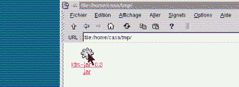

Lancer une application contenue dans un fichier Jar est extrêmement
simple sous Windows ou Solaris : il suffit de cliquer ! Quid de Linux ?
Ce n'est pas possible de manière générale car cela dépend du
gestionnaire de fichier (il doit reconnaître l'extension .jar et lancer
`java -jar`).

<!--more-->

Cependant, le système de types MIME de KFM (gestionnaire de fichiers de
KDE) permet une telle association : il suffit de lui indiquer comment
lancer un fichier Jar. Pour ce faire, il existe deux méthodes :

À la main
---------

- Lancer KFM, puis cliquer sur le menu **Edition/Types MIME**. Changer
  de répertoire pour **application**. Cliquer avec le bouton droit et
  sélectionner **Nouveau/Type MIME**. La fenêtre d'édition d'un
  nouveau type apparaît. Dans le panneau **Général**, entrer
  "x-jar.kdelnk" comme nom du fichier. Dans le panneau **Liaison**,
  indiquer "\*.jar;" comme Filtres et "application/x-jar" comme Type
  MIME. Cliquer sur OK pour fermer la fenêtre d'édition. Nous avons
  ainsi créé un nouveau type MIME pour les fichiers Jar.
- Reste maintenant à lui associer une application. Cliquer sur le menu
  **Edition/Applications** et se rendre dans le répertoire **System**.
  Cliquer avec le bouton droit de la souris et sélectionner
  **Nouveau/Application** pour faire apparaître la fenêtre d'édition
  des applications. Dans le panneau **Général**, indiquer "jar.kdelnk"
  comme Nom du fichier. Dans le panneau **Exécution**, indiquer
  "java -jar" pour Exécuter. Dans le panneau **Application**, indiquer
  "jar;" comme titre de l'exécutable et sélectionner
  "application/x-jar" dans la liste de droite, puis cliquer sur \<-
  pour l'afficher dans la liste de gauche. Cliquer sur OK pour
  refermer la fenêtre.

Tout est maintenant prêt. Quitter X puis le relancer. Lorsque vous
cliquez sur un fichier .jar, KFM le lance dorénavant (à condition que le
fichier MANIFEST contienne une entrée Main-Class).

Auto installeur
---------------

Toute cette procédure peut vous être épargnée en recopiant les fichiers
de définition du type MIME et de l'application dans les répertoires qui
conviennent. C'est le but de l'auto installeur que vous pouvez charger
ci-dessous :

Auto installeur [kfm-jar-0.0.jar](../arc/kfm-jar-0.0.jar) (43 ko environ)

Pour lancer l'installation, se placer dans le répertoire de l'archive et
taper (une dernière fois ;o) `java -jar kfm-jar-0.0.jar`. Relancer X et
cliquer sur l'archive de l'installeur : Il se lance maintenant tout seul
!

Pour lancer l'installeur, il existe deux méthodes :

1. Se logger sur votre compte personnel (pas sous root). Ne pas changer
   le répertoire d'installation.
2. Se logger sous root et changer le répertoire d'installation pour le
   home de vos comptes (par exemple */home/foo* pour installer les
   fichiers pour l'utilisateur foo).

La méthode décrite ci-dessus a été testée sous KDE 1.1.2. Merci de me
faire part de vos expériences sous d'autres versions de KDE (en
particulier la 2.0). Il doit exister une méthode pour lancer les
fichiers Jar sous Gnome, merci de me faire part de la méthode pour que
je mette un installeur au point.
