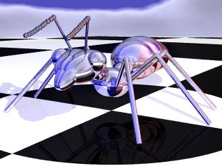

On nomme fourmi de Langton un automate cellulaire (voir machine de Turing) bidimensionnel comportant un jeu de règles très simples. On lui a donné le nom de Chris Langton, son inventeur. Elle constitue l'un des systèmes les plus simples permettant de mettre en évidence un exemple de comportement émergent.

<!--more-->

Applet Java
-----------

<applet code="Fourmi.class" codebase="../java/langton" width="220" height="300">

Si vous voyez ce texte, c'est que votre navigateur n'est 
pas compatible Java ou n'a pas été correctement configuré.

</applet>

### Réglages de l'applet

#### Panneau REGLES

Permet de spécifier les règles de déplacement de la fourmi :

- **Nb. d'états :** règle le nombre d'états de chaque case du plateau.
- **Règles :** permet d'entrer la chaine codant les règles de
  déplacement de la fourmi. Il ne faut y entrer que des G ou des D.
- **Vider :** vide la chaine des règles.
- **Aléatoire :** remplit aléatoirement la chaine de G ou de D. C'est
  intéressant pour expérimenter.

#### Panneau TERRAIN

Donne les caractéristiques du terrain où se déplace la fourmi :

- **Largeur et Hauteur :** indiquent le nombre de cases que comporte
  le plateau.
- **Coté cellule :** précise le coté d'une cellule en pixels.
  ATTENTION : il faut prendre garde à ne pas créer de plateau trop
  grand pour la résolution affichable par votre moniteur, sinon la
  fenètre déborde hors de l'écran (on peut alors avoir des problèmes
  pour la fermer !).
- **Dir. de départ :** c'est la direction prise par la fourmi au début
  du déplacement. Remarque : la fourmi part toujours du centre du
  plateau.

#### Panneau HORLOGE

Donne les caractéristiques de l'horloge rythmant les déplacements de la
fourmi :

- **Pas à pas :** si cette option est cochée, il faut cliquer sur
  **[\>]** à chaque tour pour faire avancer la fourmi. Permet
  d'étudier en détail ses déplacements.
- **Intervalle :** spécifie le temps (en millisecondes) d'attente de
  la fourmi entre chaque déplacement. Si on règle ce temps à 0, la
  machine ne fait pas de pose entre chaque pas, on a alors la vitesse
  maximale pour la fourmi.

### Pour lancer la simulation

Il faut cliquer sur le bouton **[Lancer]**. Il apparait alors la fenètre
du terrain. Cette fenètre comporte les composants suivants :

- **[ \> ] :** permet de lancer les déplacements de la fourmi.
- **[ || ] :** arrète la fourmi. On peut la relancer en cliquant sur
  **[ \> ]**.
- **Le compteur :** indique le nombre de déplacements effectués par la
  fourmi. C'est en quelque sorte le temps dans l'univers de la fourmi
  de Langton.
- **[Quitter] :** permet de refermer la fenètre. Cest indispensable si
  on veut changer les paramétrages.

### Astuce

Il n'est pas nécessaire de rester connecté pour utiliser cet applet : il
est possible de l' utiliser quelque temps, pour que le navigateur charge
tous les objets de l'applet, puis de se déconnecter. L'applet continue à
tourner. Si un objet doit être chargé par le navigateur, celui-ci
essaiera de se reconnecter.

Bonnes expérimentations à tous et toutes.

La fourmi de Langton
--------------------

L'applet présentée dans cette page permet de visualiser le parcours de
la fourmi de Langton généralisée. La fourmi de Langton est une sorte d'
automate cellulaire (comme le jeu de la vie) d'une grande simplicité:
une fourmi se déplace sur un plateau quadrillé initialement rempli de
cases blanches. La fourmi se déplace chaque tour d'une case. Si elle
tombe sur une case blanche, elle la peint en noir et tourne à droite. Si
la case est noire, elle la peint en blanc et tourne à gauche. Elle
répète ainsi ses déplacements jusqu'à ce qu'elle sorte du plateau.

### Règles de déplacement et états

On peut donc dire que les cases du plateau peuvent prendre 2 états :
blanc (0) ou noir (1). La règle de déplacement peut alors être codée
dans une chaine de deux caractères : DG. Cette chaine veut dire que si
la case où arrive la fourmi est dans l'état 0, la fourmi tourne à droite
(D) et peint la case dans l'état suivant, soit 1 (noir). Le caractère
suivant (G) veut dire que si la fourmi arrive sur une case noire (état
1), elle tourne à gauche (G) et peint la case en blanc (0), état suivant
si on considère que la chaine des règles "se mord la queue".

### Fourmi de Langton généralisée

On peut généraliser la fourmi da Langton : les cases du plateau peuvent
prendre N états. La règle de déplacement de la fourmi peut alors se
coder sur une chaine de N caractères. Si la fourmi arrive sur une case à
l'état k, alors la case passe à l'état k+1 et la fourmi change de
direction de déplacement en tournant à droite (si la chaine contient D
en position k) ou à gauche (si la chaine contient G en position k).

La fourmi de Langton n'est plus alors qu'un cas particulier de la fourmi
de Langton généralisée (pour laquelle le nombre d'états est de 2, et la
chaine des règles est DG). Les réglages par défaut de l'applet traitent
ce cas particulier de la fourmi de Langton.

Conclusion
----------

La fourmi de Langton est intéressante pour plusieurs raisons :

Elle montre que des règles simples (celles des déplacements de la fourmi
sont on ne peut plus simples !) peuvent conduire à un comportement
chaotique : lors des 10 000 premiers pas, les déplacements de la fourmi
semblent totalement désordonnés. Cette simple constatation permet de
comprendre que des lois physiques simples qui s'appliquent à des objets
simples (comme les atomes) conduisent à des comportements imprévisibles,
même si ces lois sont parfaitement connues. Certaines fourmis
généralisées semblent ainsi avoir un comportement indéfiniment
chaotique; c'est le cas de la DGG qui ne forme aucun motif régulier
jusqu'au 150 000 000 ème coup au moins (le contraire reste à prouver).

Cependant, si on laisse évoluer le système suffisament longtemps
(environ 11 000 coups), on constate que le comportement de la fourmi DG
change totalement pour devenir parfaitement ordonné : elle part "en
ligne droite" avec un cycle de 104 coups. Du comportement chaotique de
la fourmi émerge une organisation ! Mais n'en est-il pas de même pour
les fourmis (les vraies, celles qui cavalent dans votre jardin, celles
que vous écrasiez quand vous étiez petit) ? Prises individuellement,
elles ont un comportement simple (il ne pourrait en être autrement vu la
taille de leur cerveau), mais quand on les observe, elles cavalent en
tous sens et on a du mal à comprendre la finalité de leurs déplacements,
pourtant, la fourmilière est entretenue, les oeufs sont choyés et les
fourmis prospèrent...

Bref, je pourrais en parler des heures, mais le mieux est de tester par
soi même. Quel plaisir de voir cette petite fourmi cavaler
frénétiquement dans tous les sens, en se demandant si elle va errer
indéfiniment...

Pour en savoir plus
-------------------

- Pour la science N°203 septembre 1994, page 94.

