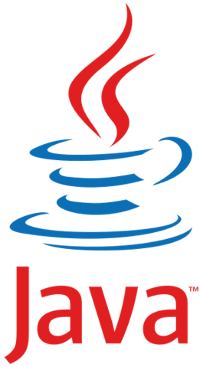

Voici un résumé de mon expérience dans le domaine du Java. Une [version complète de mon CV est disponible ici](http://sweetohm.net/article/michel-casabianca.html).

J'ai commencé le développement logiciel en freelance avec Java en 1996. Je pratique depuis plus de vingt ans ce langage de programmation avec enthousiasme, mais en connais aussi les travers. J'ai eu l'occasion de pratiquer la plupart des principaux frameworks (Spring, Hibernate et autres frameworks web).

Collaboration avec les Éditions O'Reilly
----------------------------------------

J'ai travaillé en freelance pour les Editions O'Reilly, avec du travail de traduction, de relecture technique et d'écriture d'ouvrage Java pour l'essentiel.

- Co-traducteur de *Sécurité en Java*.
- Relecture technique de *Java Examples in a Nutshell*, *Ant précis et concis*, *Java et SOAP* et *Java plus rapide, plus léger*.
- Écriture d’articles Java et brèves sur leur site.

Expert Java et XML pour In-Fusio
--------------------------------

J'ai été expert Java pendant 7 ans chez In-Fusio, société Bordelaise de jeu sur téléphones mobiles. J'y ai développé près de la moitié des logiciels de la plateforme serveur Gamezilla, des applications web pour l’essentiel (Servlets, JSP et PHP, mais aussi Python et Ruby).

Élaboration de l’architecture de Gamezilla, tout d’abord en tant qu’expert (en l’absence d’architecte logiciel), puis au poste d’architecte. J'y ai remplacé les composants EJB par des webservices XML-RPC. Nous avons ainsi gagné un facteur *10* en performances.

J'ai aussi mis en place d’un processus de développement comportant une gestion des dépendances, un nightly build ainsi qu’une suite d’outils de développement, gestion centralisée de la documentation (à l’aide d’un Wiki).

Activités de veille technologique sur les serveurs d’application Java (choix de BEA Weblogic), JMX (management d’applications Java), Maven (build d’applications Java) et JSR 124 (Java Vending Machines).

Formations en interne données aux membres des équipes sur les bases de Java et la programmation objet ainsi que sur XML et XSLT.

Chef de projet en intérim pendant 6 mois pour l’équipe GameZilla (6 développeurs).

