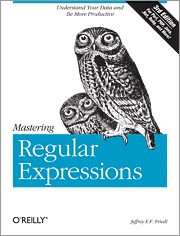

Je suis en train de suivre une formation Perl et voici, en vrac, mes notes qui regroupent les points surprenants de ce langage.

<!--more-->

Contextes d'évaluation
----------------------

Contexte **scalaire** :

- Affectation scalaire.
- Contenu d'un test.

Contexte **liste** :

- Affectation liste.
- Arguments fontion.
- Instruction foreach.

Tableaux
--------

La taille d'un tableau :

```perl
$size = @ARGV;
```

La tranche ne comprend que le premier et le dernier :

```perl
@tranche = @ARGV[0, -1]
```

Indice du dernier élément :

```perl
$lastindex = $#tableau
```

Test si tableau non vide :

```perl
if ( @tableau ) {
```

Test si arguments :

```perl
if ( @ARGV ) {
```

Faire une boucle 10 fois :

```perl
$n = 10
while ( $n--) {
```

Itérer tableau :

```perl
foreach $elt (@tab) {
```

Sans variable d'élément, c'est `$_` qui reçoit la valeur. Si on modifie la variable, on modifie le tableau (c'est une référence vers un élément du tableau).

Tableaux associatifs
--------------------

Changer la valeur d'une map :

```perl
$hash{key} = value
```

Définir une map :

```perl
%hash = (1 => "un", 2 => "deux");
@hash{1, 2, 3} = ("un", "deux", "trois");
%hash = (1, "un", 2, "deux", 3, "trois");
```

Itérer une map :

```perl
foreach (keys(%hash)) {
    ...
}
```

ou

```perl
while(($cle, $val) = each(%hash)) {
    ...
}
```

On récupère la liste des valeurs avec `values()`. On efface une valeur avec :

```perl
$val = delete($tab{$cle});
```

Tester la présence d'une clé :

```perl
if (exists ($hash{$cle})) {
```

**Note**

Deux variables de type différents peuvent avoir le même nom. Par exemple :

```perl
@tab = %tab
```

cet exemple transforme le tableau associatif en un tableau avec éclatement clé-valeur.

Références
----------

Elles permettent des structures de données complexes (des tableaux dans des tableaux par exemple) :

```perl
@tab = (2 , 4 , 6) ;
$reft = \@tab ;
print "\nReference tableau : $reft\n" ;
print "Contenu du tableau \n" ;
for ($i = 0 ; $i < @$reft ; $i++)
{
    print "$reft->[$i] " ;
}
```

On obtient donc une référence avec l'opérateur *\\* (antislash) et cette référence est un scalaire. On obtient la valeur de cette référence avec l'opérateur *$* (dollar). Pour les tableaux, on peut accéder aux valeurs avec l'opérateur *->* (flèche).

On peut directement créer une référence vers une liste avec la notation :

```perl
$liste = [1, 2, 3]
```

On met des crochets à la place des parenthèses.

Expressions Régulières
----------------------

Entre slashs : `/regexp/`. On peut faire un grep en Perl:

```perl
perl -ne 'print if /toto/' monfichier
```

Ou
 
```perl
echo 'totoro' | perl -ne 'print if /toto/'
```

Autres caractères interprètés :

- **\** : banalisation du caractère suivant.
- **$** : valeur d'un scalaire.
- **$+** : dernière mémorisation parenthèse.
- **$&** : partie de la chaîne ayant correspondu à l'expression.
- **$`** : partie de la chaîne avant l'expression.
- **$'** : partie de la chaîne après l'expression.
- **$n** : le contenu de la nième parenthèse.

Substitution :

```perl
$a = "Hello World!";
$a =~ s/Hello/Bye/;
print $a;
```

Ajouter *g* après l'expression pour remplacer toutes les occurences.

Modificateurs d'expression :

- **i** : confondre minuscules et majuscules. Se place après la regexp.
- **m** : changer délimiteur des regexps. Se place avant la regexp. Pratique pour les chemins de fichiers Unix.

Remplacer les chiffres par des *X* dans un fichier :

```perl
perl -pe 's/\d/X/g' exemple
```

### Exemples Regexp en ligne de commande

Trouver les lignes où le 4e caractère est le même que le second :

```sh
perl -ne 'print if /^.(.).\1/' exemple
```

Mettre des parenthèses autour de toutes les lignes :

Trouver les lignes où le 4e caractère est le même que le second :

```sh
perl -pe 's/^(.*)$/\(\1\)/g' exemple
```

Options en ligne de commande :

- **-p** : Lecture des fichiers ligne par ligne (dans `$_`) en affichant celles-ci.
- **-n** : Lecture des fichiers ligne par ligne (dans `$_`) sans les afficher.
- **-a** : *Autosplit* (s'utilise avec les options `-n` ou `-p`). Chaque ligne est transformée en un tableau `@F`.
- **-F exp** : Redéfinition du séparateur pour l'option `-a`.
- **-e 'instr'** : Exécution d'une instruction Perl.
- **-i ext** : Sauvegarde des fichiers de départ en *fichier.ext* pour une modification directe de ces fichiers.

### Split et join

- **split** : le premier argument est la regexp du séparateur de champs et le deuxième la chaîne à éclater.
- **join** : le premier argument est la chaîne du séparateur et le deuxième le tableau à coller.

Bible des regexps :



Fonctions
---------

Les paramètres ne sont pas déclarés dans la signature de la méthode :

```perl
sub mafonction {
   ...
}
```

Les arguments sont accessibles dans `@_`. On peut modifier ces paramètres, mais c'est à éviter. Lors de l'appel à une fonction, on peut faire précéder son nom d'un *&*, mais c'est une survivance de Perl 4. On aura intérêt à passer les tableaux par référence et nom pas par valeur.

On affecte souvent les paramètres dans des variables locales :

```perl
sub fonction {
    my ($p1, $p2) = @_;
    ...
}
```

Une fonction Perl ne peut retourner qu'un **scalaire** ou une **liste**. Pour renvoyer une map, on retournera une référence vers cette map ou on le passera à la fonction qui la modifiera.

La majorité des fonctions Perl modifient leurs arguments **et** renvoient une valeur.

La fonction `wantarray` indique si l'on est en contexte scalaire (*false*) ou liste (*true*).

Variables
---------

Une variable locale dans le bloc où elle est déclarée avec `my`. Le mot clé `local` déclare une variable qui est connue aussi des fonctions appelées (à ne pas utiliser donc).

Documentation
-------------

[Site web Perl](http://www.cpan.org) ou en ligne de commande :

```sh
perldoc -f fonction
```

Entrées / Sorties
-----------------

Ouverture d'un fichier avec :

```perl
open (DESC , "fichier")
```

Le descripteur de fichier est `DESC`.

Les modes d'ouverture de fichiers sont les suivants :

- **< fichier** : Lecture seulement sur un fichier existant (défaut quand on ne précidee rien).
- **> fichier** : Écriture (création ou écrasement)
- **>> fichier** : Écriture en fin de fichier (création éventuelle)
- **+< fichier** : Lecture / Écriture sur fichier existant
- **+> fichier** : Idem ">" avec la lecture en plus
- **+>> fichier** : Idem ">>" avec la lecture en plus

Lecture par l'opérateur **< DESC >** :

- En contexte *scalaire* : on lit une ligne séparée par un *\n*.
- En contexte *liste* : on lit le fichier entier et on éclate en lignes séparées par des *\n*.

Pour passer un descripteur de fichier à une de nos fonctions, il faut lui passer une référence, notée avec une étoile `*`. Par exemple :

```perl
#/usr/bin/perl -w

use strict;

sub myread {
    my ($file) = @_;
    my @lines = <$file>;
    return join("\n", @lines);
}

open(FILE, "/etc/passwd");
print myread(*FILE);
```

L'opérateur diamant `<>` permet de lire tous les fichiers passés sur la ligne de commande. Donc pour lire toutes les lignes de ces fichiers, on fera :

```perl
while ( <> ) { ... }
```

Il existe des opérateurs qui travaillent sur les fichiers comme la fonction Unix test. Par exemple, pour avoir la taille d'un fichier, on écrira :

```perl
$size = -s $filename;
```

On peut avoir des infos sur les fichiers avec la fonction `stat`. Par exemple :

```perl
($mode, $taille) = (stat($fichier))[2,7];
```

A noter que les parenthèses autour de l'appel à `stat` sont nécessaires pour pouvoir prendre une tranche d'une liste retournée par une appel de fonction.

Données littérales
------------------

Pour écrire dans un fichiers, avec évaluation des variables :

```perl
print DESC <<fin;
...
fin
```

Pour faire la même chose sans évaluer les variables :

```perl
print DESC <<'fin';
...
fin
```

On peut ajouter des données en fin de fichier après la déclaration `__END__`. On peut accéder à ces données avec le descripteur de fichier `<DATA>`.

Programmation Orientée Objet
----------------------------

Le constructeur s'appelle souvent `new()` mais ce n'est pas obligatoire.

```perl
use CGI;

$cgi = CGI->new();
...
print $cgi->header();
```

Tris
----

Par défaut, les tris sont lexicographiques :

```perl
@resul = sort (1 , 2 , 4 , 15 , 32);
# On obtient (1 , 15 , 2 , 32 , 4)
```

Pour trier en ordre numérique :

```perl
sub montri { $a <=> $b }

@resul = sort montri (15 , 32 , 4 , 1 , 2);
```


