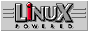
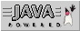
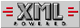

Tout a commencé lorsque j'ai trouvé sur une page ce logo **LinuX
Powered**:

Je l'ai trouvé magnifique, et comme il était possible de le recopier sur
sa page, je me suis empressé de le faire. Problème ! Il me manquait deux
autre logos pour Java et XML (les deux autres technos sur lesquelles
reposent ma page).

J'ai alors décidé de plagier honteusement ce logo pour pondre (dans la
douleur :o) les deux ci-dessous:

 

Il va sans dire que vous pouvez utiliser ces logos sur vos propres
pages.

*Enjoy!*
