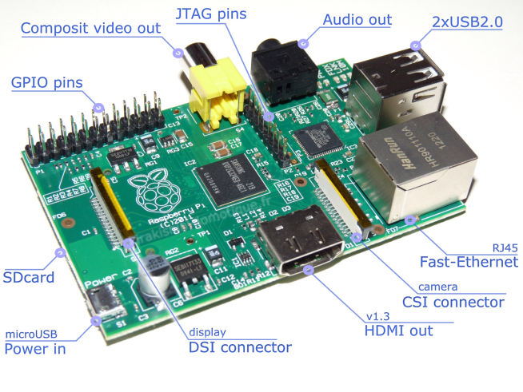
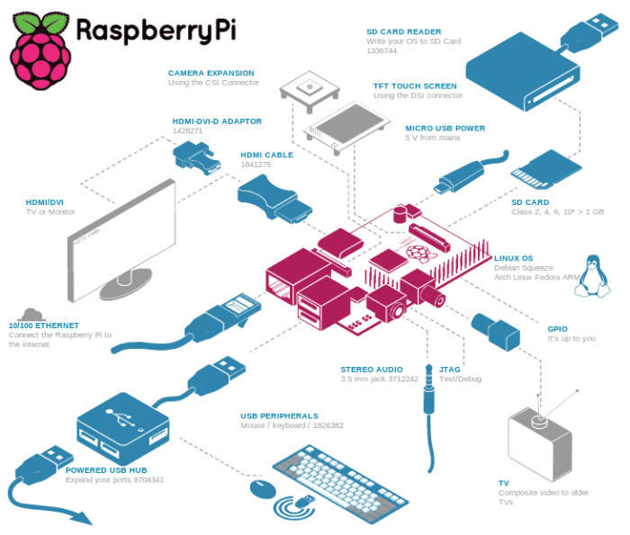
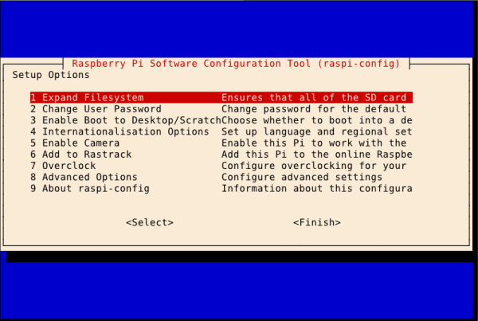
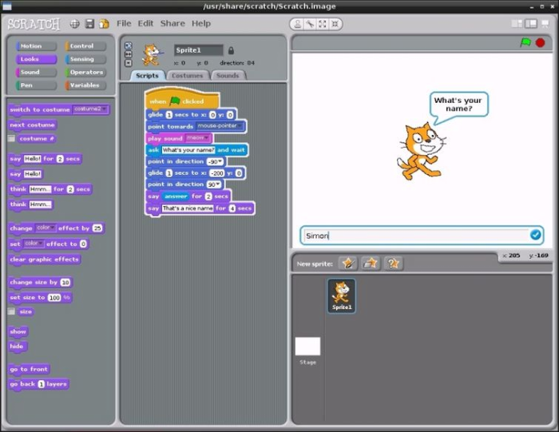

Le Raspberry Pi est un ordinateur de la taille d'une carte de crédit, pas cher et peu gourmand en énergie. Il a été conçu par le créateur de jeux vidéos David Braben (papa du jeu culte des années 80 Elite) dans le cadre de sa fondation Raspberry Pi. Ayant fait l'acquisition d'un Raspberry Pi en janvier 2013, je peux maintenant, après une année d'utilisation intensive, faire un bilan de mon expérience.

<!--more-->

# Origines

A l'origine du Raspi, il y a la constatation que le niveau des élèves dans les cursus en informatique des universités était moins bon qu'il ne l'était dans les années 90.

L'explication proposée est simple : les années 80 ont vu l'émergence de la micro-informatique avec des ordinateurs simples d'accès, ouverts et peu chers. En Angleterre, l'ordinateur personnel de ces années était le BBC Micro, résultant d'un projet éducatif en partenariat avec la BBC.

Pour remédier à cette situation il fallait produire un ordinateur pas cher et ouvert pour que les enfants puissent s'initier à moindre coût à l'informatique et à la programmation en particulier. En effet, même si les ordinateurs sont maintenant omniprésents, ils restent coûteux pour des enfants et sont de plus en plus complexes et fermés (difficiles à ouvrir, sans langage de programmation intégré).

Mais le Raspi a suscité un intérêt hors du cercle des enseignants et les premiers exemplaires se sont arrachés en quelques heures et il fallait être TRÈS patient pour commander un Raspi en 2012 (plusieurs mois d'attente en début d'année). Il s'est vendu plus d'un million de Raspis en 1 an. Nous allons voir que cet ordinateur a intéressé nombre de hackers pour réaliser des projets tous plus loufoques les uns que les autres.

Pour lire une histoire du projet : [http://www.raspberrypi.org/about](http://www.raspberrypi.org/about).

# Hardware

## Spécifications

Sur la carte mère du Raspi, de la taille d'une carte de crédit, on trouve :



- Un SOC (system on chip) Broadcom BCM2835, c'est à dire grosso-modo un CPU (ARM11 700 MHz) et un GPU (Broadcom VideoCore IV) sur la même puce.
- 256 ou 512 Mo de RAM (suivant le modèle, A ou B).
- Deux sorties vidéo : HDMI et composite.
- Une sortie audio jack de 3,5 mm (sortie son 5.1 sur le HDMI).
- Un port pour carte SD.
- 1 ou 2 port(s) USB 2.0 (suivant le modèle).
- 1 port Ethernet 10/100 Mbits/s (sur le modèle B uniquement).
- Une prise d'alimentation micro USB (comme sur les téléphones portables).  L'intensité du courant consommé est de 300 mA pour le modèle A et de 700 mA pour le modèle B (pour une tension de 5 V).


La carte mère comporte aussi des entrées/sorties supplémentaires :

- Connecteur DSI : pour Display Serial Interface, c'est une norme de connexion avec un écran issue de l'industrie des mobiles.
- Connecteur CSI : pour Camera Interface Specification, est une connecteur pour caméra.
- Connecteur GPIO : pour General Purpose Input/Output, sont des ports d'entrée/sortie utilisés dans le monde des micro-contrôleurs pour commander des appareils.


La puce graphique permet de gérer l'OpenGL (ES 2.0) et de décoder des vidéos H.264 en 1080P.

On peut donc dire que le hardware du Raspi est inspiré de celui de nos smart-phones. Cependant, la connectique permet de le brancher à tous les téléviseurs ou moniteurs avec éventuellement un adaptateur.

## Particularités

On notera que la seule mémoire de masse est une carte SD ! Cela limite la taille de celle-ci à 64 Go, mais il est possible de brancher une disque dur en USB. Cette spécificité a ses avantages, par exemple elle permet de changer de système en remplaçant simplement la carte SD.

L'alimentation est au standard USB et l'on pourra donc l'alimenter avec tout transformateur secteur-USB. ATTENTION cependant ! Il faut veiller à alimenter suffisamment la machine, en particulier si on connecte des extensions en USB (comme un disque dur, ou un dongle Wifi) qui peuvent avoir une consommation non négligeable.

Je recommande d'alimenter le Raspi avec une alimentation dédiée (on en trouve qui délivrent 1,5 A). Si on l'alimente avec une transformateur classique, veiller à ce que sa puissance soit suffisante et ne pas utiliser un fil trop long (ce qui a pour effet de faire baisser la tension d'alimentation en dessous des 5 V du standard USB).

Si l'on souhaite brancher au port USB du Raspi des extensions qui consomment beaucoup d'énergie, on aura intérêt à utiliser un hub USB alimenté.

Le Raspi consomme tellement peu d'énergie (le modèle A en particulier) que l'on peut l'alimenter avec des piles (voir l'article [http://www.daveakerman.com/?page_id=1294](http://www.daveakerman.com/?page_id=1294)).

Les problème de puissance d'alimentation sont les soucis les plus communs rencontrés avec le Raspi.

## Ce qu'il manque au Raspi



Lorsqu'on commande un Raspi, on reçoit la carte nue dans un blister. Il faut penser à compléter sa commande avec les accessoires suivants :

- Un boîtier. On en trouve de toutes sortes et à tous les prix, mais pour ma part, je recommande un boîtier aluminium qui permet de dissiper la chaleur dégagée par la bête (par exemple le boîtier Iceberg [http://www.moovika.fr/raspberry-pi.fr/](http://www.moovika.fr/raspberry-pi.fr/)).
- Une alimentation. Une dédiée d'une puissance suffisante de préférence.
- Une carte SD pour installer le système. D'un minimum de 4 Go, il me semble préférable de prévoir au minimum une capacité de 16 Go. D'autre part, mieux vaut choisir une marque car les cartes SD de marque blanche sont réputées peu fiables.
- Un clavier et une souris. Tout matériel PC USB standard fera l'affaire.
- Un écran. Tout écran fera l'affaire, mais de la HD est préférable si l'on souhaite faire autre chose que visualiser de la vidéo (donc HDMI ou DVI). Ne pas oublier le câble de connexion à l'écran !


Au delà de ce minimum, il pourra être utile de se procurer :

- Un dongle Wifi.
- Une carte SD de secours.
- Un disque dur externe.
- Un hub USB alimenté.


ATTENTION : comme pour tout matériel tournant sous Linux, il faut s'assurer que cela fonctionne avec le Raspi. Ne pas se laisser abuser par du soi-disant matériel officiel Raspi (comme un dongle wifi avec la groseille dessus ou autre). C'est pas forcément le mieux et c'est toujours beaucoup plus cher.

On trouvera des listes de compatibilité du matériel aux adresses suivantes :

- Matériel : [http://elinux.org/RPi_VerifiedPeripherals](http://elinux.org/RPi_VerifiedPeripherals).
- Cartes SD : [http://elinux.org/RPi_SD_cards](http://elinux.org/RPi_SD_cards).
- Dongles Wifi: [http://elinux.org/RPi_USB_Wi-Fi_Adapters](http://elinux.org/RPi_USB_Wi-Fi_Adapters).


On pourra aussi farfouiller sur le forum : [http://www.raspberrypi.org/phpBB3/](http://www.raspberrypi.org/phpBB3/).

## Revendeurs spécialisés

Les deux revendeurs officiels (et les moins chers aussi puisqu'ils vendent aux autres revendeurs) des Raspis sont :

- Element 14 : [http://www.farnell.com/pi/](http://www.farnell.com/pi/) (ou Kubii pour la France : [http://www.kubii.fr](http://www.kubii.fr)).
- RS Components : [http://uk.rs-online.com/web/generalDisplay.html?id=raspberrypi](http://uk.rs-online.com/web/generalDisplay.html?id=raspberrypi).


Cependant, d'autres revendeurs se sont spécialisé Raspberry Pi :

- Adafruit : ils sont compétents mais aux États-Unis : [http://www.adafruit.com/category/105](http://www.adafruit.com/category/105).
- The Pi Hut : idem [http://thepihut.com/](http://thepihut.com/).


A noter que peu de hardware est développé spécifiquement pour le Raspi. Donc lorsqu'on aura trouvé le matériel de ses rêves et que l'on se sera assuré qu'il est compatible Raspi, on pourra le commander chez son revendeur préféré.

# Système

La distribution officielle du Raspi est la Raspbian. On pourra la trouver sur la page des téléchargements du site Raspi : [http://www.raspberrypi.org/downloads](http://www.raspberrypi.org/downloads). Un guide de démarrage rapide est disponible à cette adresse : [http://www.raspberrypi.org/quick-start-guide](http://www.raspberrypi.org/quick-start-guide).

Il faut commencer par copier le système sur la carte SD puis booter sur cette carte, tout simplement. Il faudra ensuite penser à redimensionner le système de fichier à la taille du support.

La Raspbian est une distribution dérivée de la Debian et adaptée au Raspi. Elle a une particularité : le menu de configuration que l'on appelle en ligne de commande avec :

```
raspi-config
```

A noter que ce menu est lancé automatiquement au premier boot.



Il est indispensable de parcourir ce menu pour :

- Adapter la taille du système de fichier à celle du support.
- Changer le mot de passe.
- etc...


A noter que l'on peut overclocker le Raspi ! Inutile de dire qu'il vaut mieux qu'il soit bien refroidi.

Le window manager de la Raspbian (que l'on lancera de la ligne de commande avec `startx`) est LXDE qui est particulièrement léger.

On trouvera beaucoup de tutoriels sur la toile. Pour ma part, j'ai trouvé des tutoriels intéressants et concis pour mettre en oeuvre mes Raspis à l'adresse : [http://www.penguintutor.com/linux/raspberrypi-guides](http://www.penguintutor.com/linux/raspberrypi-guides).

Dans la mesure où le système est installé sur une carte SD, il est possible (à l'aide d'une adaptateur SD/USB) de réaliser une image de backup de la carte, avec la commande dd sous Unix. Il est IMPORTANT de réaliser de tels backups régulièrement. En cas de crash de la carte SD ou de remplissage du système de fichiers, ce backup vous permettra de récupérer votre système rapidement. On trouvera des tutoriels sur la procédure de backup à l'adresse [http://raspberrypi.stackexchange.com/questions/311/how-do-i-backup-my-raspberry-pi](http://raspberrypi.stackexchange.com/questions/311/how-do-i-backup-my-raspberry-pi).

A noter qu'il peut être intéressant de disposer de plusieurs cartes SD pour y installer différents systèmes et pouvoir rapidement passer d'un serveur web à une borne d'arcade rétro par exemple.

Il existe d'autres systèmes pour le Raspi, Linux ou non (comme RiscOS). On pourra consulter la liste à l'adresse [http://www.raspberrypi.org/downloads](http://www.raspberrypi.org/downloads).

Il existe un outil pour mettre à jour le firmware du Raspi : [https://github.com/Hexxeh/rpi-update](https://github.com/Hexxeh/rpi-update).

# Usages

## Initiation à la programmation

La distribution Raspbian inclut l'outil d'[initiation à la programmation Scratch](http://scratch.mit.edu/). D'autre part, Python est le langage de programmation préféré sur le Raspi (le Pi de Raspberry Pi est pour Python).



## Un serveur à domicile

Du fait de sa très faible consommation électrique (d'un maximum de 3 W) et de son système d'exploitation sûr, le Raspi fait un très bon serveur à domicile.

- Serveur web : [http://www.penguintutor.com/linux/raspberrypi-webserver](http://www.penguintutor.com/linux/raspberrypi-webserver).
- Serveur SFTP : [http://www.thegeekstuff.com/2012/03/chroot-sftp-setup/](http://www.thegeekstuff.com/2012/03/chroot-sftp-setup/).
- Serveur SVN ou GIT : il n'y a rien à faire si SSH est opérationnel.


A noter que si vous êtes chez Orange, votre IP change (toutes les semaines environ). Si par ailleurs vous avez un nom de domaine chez Gandi, vous pouvez mettre à jour votre IP dans les DNS de Gandi  [avec ce script](http://sweetohm.net/arc/update_gandi_ip.zip).

## Multimédia

La puce graphique du Raspi est capable d'afficher du MPEG4 en 1080P et cela fait du Raspi une solution économique pour afficher et ou distribuer des contenus audio ou vidéo.

- Serveur DLNA : minidlna [http://www.skenderovic.com/2013/06/use-raspberry-pi-as-dlna-server-for.html](http://www.skenderovic.com/2013/06/use-raspberry-pi-as-dlna-server-for.html).
- Client DLNA : XBMC [http://michael.gorven.za.net/raspberrypi/xbmc](http://michael.gorven.za.net/raspberrypi/xbmc).
- Client torrent : deluge [http://www.howtogeek.com/142044/how-to-turn-a-raspberry-pi-into-an-always-on-bittorrent-box/](http://www.howtogeek.com/142044/how-to-turn-a-raspberry-pi-into-an-always-on-bittorrent-box/).


A noter que les téléviseurs récents (comme les Samsung Smart TV) sont capables de lire les contenus distribués par des serveurs DLNA.

## Jeux

Les jeux Linux tournant sous Raspi sont peu intéressants (pas question d'installer Steam sur un Raspi !). Par contre, un Raspi est capable de faire tourner nombre d'émulateurs. Le plus connu est MAME : [http://logiclounge.com/2013/08/19/how-to-play-mame-multiple-arcade-machine-emulator-games-on-the-raspberry-pi/](http://logiclounge.com/2013/08/19/how-to-play-mame-multiple-arcade-machine-emulator-games-on-the-raspberry-pi/).

## Autres projets

Il existe un nombre incalculable de projets pour le Raspi. On pourra en trouver un très grand nombre sur les sites suivants :

- Corben : [http://korben.info/idees-raspberry-pi.html](http://korben.info/idees-raspberry-pi.html).
- raspberrypi.org : [http://www.raspberrypi.org/forums/viewforum.php?f=15](http://www.raspberrypi.org/forums/viewforum.php?f=15).
- google : [https://www.google.fr/search?q=raspberry+pi+projects](https://www.google.fr/search?q=raspberry+pi+projects).


Certains projets sont vraiment intelligents et utiles mais on trouve aussi (surtout ?) tout un tas de projets loufoques et amusants :

- Distributeur de croquettes pour chien : [http://www.youtube.com/watch?feature=player_embedded&v=PAHrBA0jYAo](http://www.youtube.com/watch?feature=player_embedded&v=PAHrBA0jYAo)
- Super-ordinateur en légo : [http://www.southampton.ac.uk/~sjc/raspberrypi/pi_pictures.htm](http://www.southampton.ac.uk/~sjc/raspberrypi/pi_pictures.htm).


## Limites du Raspi

Le facteur limitant du l'usage du Raspi est sa puissance CPU faible. Par exemple, on évitera les tâches suivantes :

- Compilation de grosses applications : compiler une VM Python prend plus d'une heure (contre 3 minutes sur une machine de développement standard), compiler XBMC prend toute une nuit.
- Affichage de vidéos HD qui ne sont pas au format MPEG4.
- Applications web gourmandes en ressources : AWStats met un temps fou à afficher sa page.


# Conclusion

Le Raspi est une machine vraiment intéressante pour bricoler et pour faire un serveur à la maison. De plus, il existe une vaste communauté très active. On pourra trouver de l'actualité sur le Raspi aux adresses suivantes :

- Framboise 314 : [http://www.framboise314.fr/](http://www.framboise314.fr/).
- Site de la fondation : [http://www.raspberrypi.org/](http://www.raspberrypi.org/).
- MagPi : [http://www.themagpi.com/](http://www.themagpi.com/).
- MagPi en Français : [http://thefrenchmagpi.com](http://thefrenchmagpi.com).


# Crédits des illustrations

- Détail de la carte du Raspberry Pi par Kirakishin : [http://www.kirakishin-domotique.fr/raspberry-pi/](http://www.kirakishin-domotique.fr/raspberry-pi/).
- Accessoires Raspberry Pi sur le site Farnell : [http://fr.farnell.com/raspberry-pi-accessories](http://fr.farnell.com/raspberry-pi-accessories).
- Le menu de configuration par votre serviteur.
- Un bout de code de Scratch par Simon Handby : [http://www.expertreviews.co.uk/gadgets/1292536/the-raspberry-pi-foundation-raspberry-pi/2](http://www.expertreviews.co.uk/gadgets/1292536/the-raspberry-pi-foundation-raspberry-pi/2).


