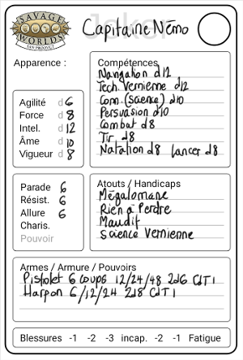
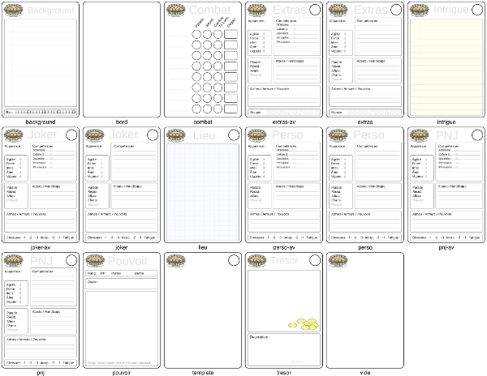
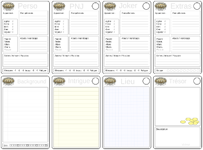

Ayant lu avec beaucoup d'intérêt le livre [Lazy Dungeon Master](http://slyflourish.com/lazydm/), j'ai décidé de mettre en pratique ses recommandations avec [Savage Worlds](https://www.black-book-editions.fr/catalogue.php?id=58).

<!--more-->

Pour résumer, *Lazy Dungeon Master* recommande de préparer ses parties en écrivant des fiches pour les personnages et adversaires, les lieux, les intrigues et les trésors. Il suggère des fiches bristol de couleurs différentes selon le type (par exemple bleues pour les lieux, jaunes pour les trésors, vertes pour les intrigues, etc).

## Cartes Savage Worlds

Je me suis dit qu'il serait bien de faire des mini fiches de personnage pour les PNJs, Extras et Jokers. J'ai donc conçu ces différentes fiches pour préparer mes parties. Voici par exemple une carte pour un *Joker* :

Par la suite, je me suis dit que ce serait une bonne idée de préparer d'autres fiches spécifiques pour les intrigues, lieux et trésors. Et puis j'ai fait d'autres plus spécifiques à Savage Worlds, comme celle pour les pouvoirs.

Ayant de bons yeux, j'ai préféré les imprimer au format *A7*, soit à peu près la taille des cartes à jouer, ce qui permet d'en mettre *8* sur une page au format *A4*. On peut aussi les imprimer en *A6* , on en met alors *4*, ou en *A5*, on passe alors à *2* par page.

On trouvera [dans l'archive](http://sweetohm.net/arc/sawo-cards.zip) les images des cartes au format PNG. Pour les imprimer il faut produire des planches de *2*, *4* ou *8* cartes. On peut le faire avec un logiciel de manipulation d'image, comme Gimp par exemple. On peut aussi le faire en ligne de commande avec un script comme celui fourni dans l'archive, *planches.sh* qui utilise *ImageMagick* pour générer ces planches, mais cela nécessite d'installer cet outil et de l'appeler en ligne de commande.

## Composition des planches

Pour faciliter la réalisation de ses propres planches, j'ai conçu un service web qui permet de générer ces planches sur mon serveur. Pour l'appeler il faut d'abord obtenir une clef en m'envoyant un message à <michel.casabianca@gmail.com> avec votre nom et adresse mail. Vous recevrez alors votre clef à envoyer lors des requêtes.

Pour voir les images des cartes disponibles, on pourra ouvrir dans son navigateur l'URL (où l'on remplacera *CLEF* par la clef reçue par mail) :

- <http://sweetohm.net/sawo/cards/CLEF>

Sous chaque carte est indiqué son nom. Pour générer une planche, appeler l'URL *http://sweetohm.net/sawo/cards/CLEF/* suivie des noms des cartes séparés par des slashs.

Par exemple, pour générer des fiches de personnage et de PNJ accompagnées de leur background au format *A5*, on ajoutera sur l'URL *perso*, *background*, *pnj* et *background* :

- <http://sweetohm.net/sawo/cards/CLEF/perso/background/pnj/background>

Ce qui donnera la planche suivante :

Il est possible de générer des planches *2 x 1*, *2 x 2* et *4 x 2*. On enverra alors sur l'URL *2*, *4* ou *8* noms de cartes. Pour récupérer la planches, faire un clic droit sur l'image et sélectionner dans le menu *Enregistrer l'image sous...*.

Pour faire une planche *4x2* avec les principales cartes, on appellera :

- <http://sweetohm.net/sawo/cards/CLEF/perso/pnj/joker/extras/background/intrigue/lieu/tresor>

Ce qui donne la planche :

En pratique, les cartes les plus utilisées sont *intrigue*, *PNJ*, *Extras*, *Joker*, *lieu* et *tresor*. On prendra soin de les imprimer dans les bonnes proportions sur du bristol pour préparer ses parties.

On peut remplir à la main les planches imprimées ou bien remplir les cartes, sur l'image de la planche, avant de les imprimer.

## A l'usage

J'expérimente l'usage de ces cartes depuis quelques parties et elles s'avèrent très pratiques :

- On n'est pas perdu dans les pages du scénario, on reste concentré sur la carte en cours.
- On peut étaler les fiches des personnages, PNJs ou adversaires devant soi.
- On peut donner aux joueurs des cartes avec des indices ou des trésors.
- On peut mener la partie parmi les joueurs, en tournant autour de la table pour manipuler les figurines ou jeter les dés.

Je remplis les cartes avec mon Galaxy Note puis je les imprime par planches de 8 que je compose avec un script qui appelle ImageMagick en ligne de commande. Je les numérote ensuite après impression pour ne jamais perdre le fil de mes fiches en cours de partie.

Pour les joueurs, J'imprime les fiches de personnage au format A5, avec les blocs de statistiques et une image ou le background. Pour le maître de jeu, je les imprime au format A6.

Un court scénario tient sur une dizaine de cartes :

Pour une campagne, telle que *Irongate* dans le cas de la photo, c'est bien plus conséquent et on arrive vite à des piles de cartes.

Si vous avez des suggestions pour améliorer ces cartes ou en créer de nouvelles, n'hésitez pas à m'envoyer un message à <mailto:michel.casabianca@gmail.com>.

*Enjoy!*
