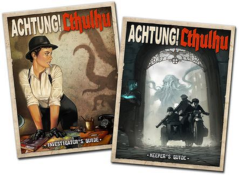
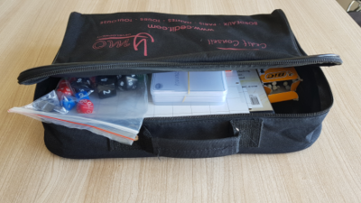

La gamme *Savage Worlds* commence à prendre de l'ampleur en français et [il peut être intimidant de se lancer](https://www.black-book-editions.fr/forums.php?topic_id=20419) pour un meneur de jeu comme pour les joueurs. Entre le livre de base, les compagnons et les univers, on est vite perdu.

<!--more-->

Si on s'en tient à la lecture du [livre de base](https://www.black-book-editions.fr/produit.php?id=9013) et d'un livre d'univers comme [Beasts & Barbarians](https://www.black-book-editions.fr/produit.php?id=4206), cela représente tout de même près de 450 pages. Lire le tout prendra beaucoup de temps avant même de jouer sa première partie. Et si l'on n'est pas certain que le système nous convienne, c'est un investissement très lourd.

Heureusement, il existe un moyen de tester le jeu plus rapidement, en moins de deux heures, et gratuitement en plus.

# Les règles

Heureusement, il existe un moyen de jouer et tester le jeu plus rapidement et gratuitement en plus.

## Pour commencer

Il existe deux moyens rapides de s'initier aux règles de *Savage Worlds* :

- [Les règles en bande dessinée](https://savage.torgan.net/2018/07/savage-worlds-les-regles-en-bd.html)
- [les Règles d'Essai](https://savage.torgan.net/2021/05/bd-et-regles-d-essai.html)

La bande dessinée permet d'aborder simplement les règles en quelques minutes. C'est l'introduction idéale tant pour le futur meneur que pour les joueurs à qui la distribuer avant la partie.

Les règles d'essai sont quant à elles suffisantes pour permettre à un meneur de jeu débutant à *Savage Worlds* de mener ses premières parties. En moins de 10 pages, l'essentiel des règles est abordé. Il peut être aussi utile de les relire entre les parties pour se rafraîchir la mémoire.

Cependant, les règles de création et de progression des personnages n'y sont pas abordées, ainsi que les règles pour gérer plus finement de nombreuses situations, et la liste des pouvoirs est très succincte. Il faudra donc se contenter de courts scénarios avec des personnages prétirés et sans trop de pouvoirs variés.

À l’image d’une boîte d’initiation, les règles d'essai sont donc suffisantes pour débuter, mais il faudra passer à l'édition complète pour que les joueurs puissent créer leurs propres personnages, les faire progresser ou jouer des héros disposant de pouvoirs.

## Pour aller plus loin

Les règles du livre de base sont organisées de manière à pouvoir être abordées de manière progressive. On peut distinguer les groupes suivants :

**Les règles de base :** *jusqu'à la page 97*. On pourra cependant dans un premier temps ignorer les règles suivantes :

- Création des espèces et ne jouer que des humains ;
- Ne lire que les Atouts et Handicaps des personnages et adversaires car la liste complète est assez longue et fastidieuse à lire (les entrées correspondantes des tableaux récapitulatifs des pages 56 à 63 peuvent même suffire dans un premier temps)  ;
- Ne s'intéresser qu'aux armes de l'époque jouée car la liste complète du matériel est aussi très fournie ;
- Ignorer les véhicules dans un premier temps.

Toutes ces règles pourront être introduites progressivement au cours des parties suivantes.

**Règles de situation :** *p. 97 à 111*. Ce sont des règles applicables à certaines situations particulières, comme l’attaque surprise, la faim, la défense totale, etc… Elles sont en général assez succinctes (elles occupent rarement plus d’un paragraphe ou deux de texte) et il est souvent possible de les lire à la volée pendant une partie. On pourra lancer un interlude (voir p.116) pour occuper les joueurs pendant qu’on les consulte derrière le paravent.

**Outils pour l'aventure :** *p. 111 à 147*. Ces règles sont optionnelles et peuvent être ajoutées au fil des parties. Certaines d'entre elles constituent des mini-jeux dans l'aventure, comme les Poursuites par exemple. Elles demandent en général de s'y pencher sérieusement avant de jouer car elles sont plus consistantes que les règles de situation.

**Pouvoirs :** *Savage Worlds* unifie les systèmes de magie, de super-pouvoirs, de psioniques et autres en un seul appelé pouvoirs. Il est donc assez rapidement indispensable de se pencher sur ces règles. Cependant, la liste des pouvoirs est assez longue (mais pas autant que celle de Pathfinder par exemple, qui en compte près de 300 !) et il peut être utile de les consulter selon les besoins : le meneur de jeu pourra se faire une liste des pouvoirs de ses joueurs et de leurs ennemis et y jeter un coup d'oeil avant la partie.

## Les compagnons

En plus des règles de base, des Compagnons sont dédiés à un type d'univers : science-fiction et super pouvoirs sont parus en français (pour la précédente édition des règles cependant).

Ces Compagnons ne sont pas indispensables pour la plupart des univers, mais il en existe qui y font référence. Par exemple, The Last Parsec fait référence au Compagnon science-fiction.

Ceci dit, aucun univers paru en français ne fait référence à ces Compagnons, donc leur lecture n'est utile que si vous souhaitez jouer dans des univers de science-fiction ou de super-pouvoirs.

# Les univers

Connaître les règles c'est bien, mais il faudra choisir un univers pour y faire évoluer vos joueurs et son choix est important pour bien commencer son expérience dans le monde de *Savage Worlds*.

## Pour commencer

La solution la plus simple est de jouer dans un univers connu de tous, donc ne nécessitant aucune préparation. Ce sera le cas par exemple pour un univers proche de nous, comme les années 1930 d'un Cthulhu, les années 1880 d'un western ou notre monde des années 2020.

On peut aussi choisir un monde dont tout le monde pense avoir une idée précise, comme les Vikings, de la fantasy générique ou celui d’une série que tout le monde connaît.

Je recommande donc de commencer par jouer de courts scénarios dans un univers générique ou connu, cela permettra de limiter le temps de préparation des premières parties. Vous trouverez sur ce blog une liste de courtes aventures régulièrement enrichie.

## Choisir son univers

On pourra ensuite passer à des univers plus fouillés, lorsqu'on aura assimilé les bases du système de jeu. En français, les univers suivants sont disponibles pour Sava

### [Deadlands reloaded](https://www.black-book-editions.fr/catalogue.php?id=33)

C'est un univers de weird west, c'est-à-dire du western mâtiné d'horreur et de science étrange (Les Mystères de l'Ouest et Cthulhu pour résumer).

- L'univers est assez difficile à prendre en main car très fourni : le jeu existe depuis plus de 20 ans et l'historique est plutôt touffu.
- Le livre de base reprend les règles de la précédente version, il est donc assez compliqué de faire le tri entre ce qui est spécifique à Deadlands et ce qui est générique.
- Il existe cinq campagnes disponibles en français.
- La communauté est très nombreuse et active.
- Certains ouvrages sont maintenant épuisés (comme la campagne Stone Cold Dead par exemple), mais ils sont encore disponibles en PDF.

### [Achtung! Cthulhu](https://www.modiphius.com/achtung-cthulhu.html)

C'est du Cthulhu pendant la seconde guerre mondiale publié par feu Sans Détour. Les règles sont proposées pour *Savage Worlds* et le système Chaosium.

- L'univers est assez compliqué à prendre en main car historique et les ouvrages de background sont très fournis.
- Il existe deux campagnes (Trois rois et Les Ombres d'Atlantis) et un recueil de scénarios en français.
- Les ouvrages ne sont plus disponibles qu'en occasion et assez chers.
- Modiphius est passé à un nouveau système (appelé 2d20) pour motoriser la nouvelle version de son jeu.

### [Beasts & Barbarians](https://www.black-book-editions.fr/produit.php?id=4204)

C'est du Conan qui ne dit pas son nom, donc du Sword & Sorcery avec ses barbares au torse huilé, ses amazones, ses monstres et ses princesses lascives.

- L'univers est très fourni.
- Il existe un recueil de monstres accompagnés de leur scénarios qui permet de jouer de nombreuses parties (Créatures des Dominions).
- Un supplément propose un cadre de jeu urbain (Jalizar).
- Les ouvrages ne sont plus disponibles (mais les PDF le sont encore).

### [Lankhmar](https://www.black-book-editions.fr/catalogue.php?id=457)

Un autre univers de Sword & Sorcery, mais basé sur le Cycle des épées de Fritz Leiber. C'est plus urbain que Beast & Barbarians.

- L'univers est assez succinctement décrit dans le jeu de rôle, mais les romans permettent de l'approfondir si on le souhaite.
- Un recueil de scénarios permet de jouer de nombreuses parties.
- Le fait que l'univers soit basé sur des ouvrages connus peut être intimidant pour les joueurs ou le MJ.
- On peut jouer Fafhrd et le Souricier Gris !

### [Interface Zero 2.0](https://www.black-book-editions.fr/catalogue.php?id=551)

C'est un univers Cyberpunk avec ses runners, ses street samouraïs et ses androids.

- L'univers est très (trop ?) détaillé.
- Les règles de hacking sont assez complexes à prendre en main.
- Il y a peu de scénarios disponibles en français.

### [East Texas University](https://www.black-book-editions.fr/catalogue.php?id=255)

Cet univers se passe dans une université américaine contemporaine. Les personnages sont des étudiants devant concilier la réussite de leur étude avec des événements surnaturels qu’ils devront gérer sans faire de vague. Vous pourrez le jouer dans le registre de l’épouvante ou du pastiche façon Scoubidou.

Son financement commencera le lendemain de la publication de cet article et sera peut-être déjà disponible au moment où vous le lirez.

## Pour débuter

Pour débuter, je recommanderais Lankhmar pour sa simplicité de prise en main. Pour ma part, il m'a suffit d'un week-end pour préparer ma première partie. Cependant il faudra lire au moins un tome du Cycle des épées pour avoir une idée précise de l'univers.

Ceci dit, le choix d'un univers sera surtout guidé par vos goûts personnels et ceux de vos joueurs et joueuses.

## En anglais

Les anglophones ont accès à beaucoup plus d'univers, [près de 150 selon cette liste](https://savagepedia.wiki/wiki/List_of_Savage_Worlds_Settings). Il y en a pour tous les goûts, tous les genres et toutes les époques sont abordées. Il existe plus d'une vingtaine d'[univers officiels de Pinnacle](https://savagepedia.wiki/wiki/List_of_Savage_Worlds_Settings), le créateur du système, mais d'autres éditeurs proposent d'autres univers, dont certains de très bonne qualité.

## Univers amateurs

Il existe aussi de nombreux univers amateurs, aussi bien en français qu'en anglais. Certains sont de qualité professionnelle, comme [Saga of the Goblin Horde](https://www.drivethrurpg.com/product/225745/Saga-of-the-Goblin-Horde-Savage-Worlds). D'autre part, la publication par des amateurs permet d'explorer des univers sous licence comme [Star Wars](https://savage.torgan.net/tag/star%20wars/) ou [Harry Potter](https://savage.torgan.net/2019/12/savage-potter-decouvrez-l-univers-d-harry-potter-en-mode-savage.html).

## Les scénarios

Pour se mettre rapidement à *Savage Worlds*, le meilleur moyen est de commencer avec des scénarios courts (des one-sheet comme on les appelle dans le jargon *Savage Worlds*) fournissant des personnages prétirés.

Il en est publié deux fois par mois sur le site de [Torgan.net](https://savage.torgan.net) et il y en a maintenant plus d'une cinquantaine disponibles gratuitement [sur le site de Torgan](https://savage.torgan.net/2017/03/liste-des-one-sheets-adventures.html). Certains de ces scénarios sont fournis avec des personnages prétirés, [une liste de tels personnages est disponible ici](https://savage.torgan.net/search/pr%C3%A9tir%C3%A9s/).

Une autre solution est d'adapter un scénario que l'on connaît bien. Pour ma part, le premier scénario que j'ai fait jouer avec les règles de *Savage Worlds* est [La Maison Corbitt](https://www.tentacules.net/toc/toc_/paru_misc/decouverte_adc.pdf). Mais il faudra alors faire le travail d'adaptation des adversaires.

# Le matériel

Pour jouer à *Savage Worlds*, le matériel suivant est suffisant :

- Des dés polyédriques de jeu de rôle avec d4, d6, d8, d10, d12 et d20.
- Un autre d6 d'une couleur distincte.
- Un jeu de 54 cartes.
- Des jetons (de poker ou autres).
- Des feuilles de personnages.
- Crayons et papier.

Cet [autre article liste plus en détail le matériel du Maître de Jeu](https://savage.torgan.net/2019/06/materiel-du-maitre-de-jeu.html) pour jouer à *Savage Worlds*.

# Conclusion

Il est donc possible de se lancer à *Savage Worlds* en moins de 2 heures en :

- [Lisant les règles d'essai](https://savage.torgan.net/2021/05/bd-et-regles-d-essai.html)
- [Préparant un scénario court](https://savage.torgan.net/2014/03/la-tombe-de-la-terreur.html)
- [Avec personnages prétirés](https://savage.torgan.net/2019/09/personnages-prets-a-jouer-fantasy.html)

Et tout cela est gratuit. Que demander de plus ?
