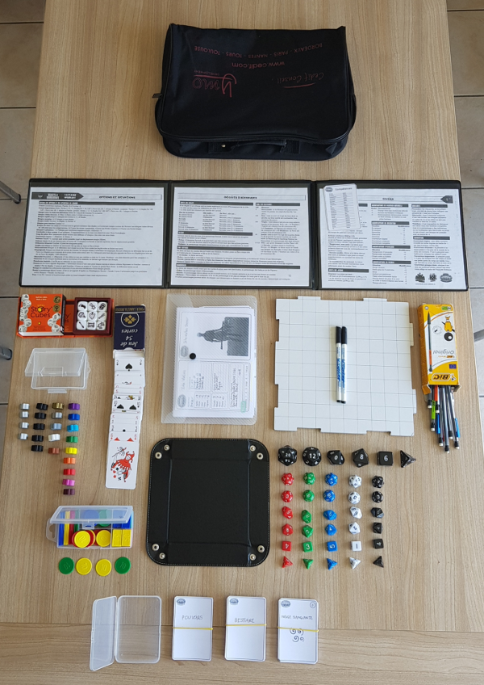
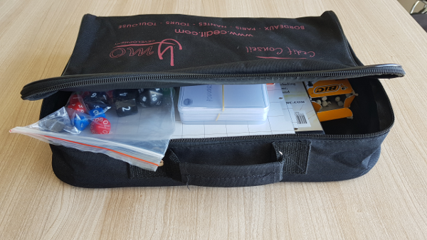

Pour qu'une partie de Savage Worlds se déroule dans de bonnes conditions, mieux vaut que le maître de jeu prévoie le matériel pour sa partie bien en amont. Dans cet article, je détaille la liste de matériel que j'amène à chaque partie.

<!--more-->

## L'écran du maître de jeu

C'est plus une tradition qu'une réelle nécessité, mais il s'avère parfois bien pratique (par exemple pour y [exposer les feuilles des adversaires](http://www.black-book-editions.fr/forums.php?topic_id=9762&tid=211418#msg211418)). Pour ma part, j'ai acheté [l'écran générique de Savage Worlds](https://www.peginc.com/store/savage-worlds-customizable-gm-screen/) qui est d'une qualité de fabrication invraisemblable.

J'y ai glissé des copies des tables de [l'écran de Beasts & Barbarians](http://www.black-book-editions.fr/produit.php?id=4204) qui comprend les plus utiles en cours de partie. L'intérêt de l'écran générique est que l'on peut glisser des notes supplémentaires (comme la liste des compétences sur la photo).

Bien entendu, les écrans livrés avec les settings, comme celui de Beasts & Barbarians, Lankhmar ou The Lats Parsec feront aussi l'affaire.

## Les dés

Savage Worlds utilise tous les dés classiques de jeux de rôle, excepté le dé des dizaines. Tout set de dé (avec d4, d6, d8, d10, d12 et d20) peut donc faire l'affaire.

J'amène toujours des sets de dés complets de couleurs assorties de manière à ce que chaque joueur aie ses dés. Ceci est particulièrement utile avec des joueurs débutants qui n'ont pas leurs propres dés. On peut trouver sur internet des [lots de dés de couleurs assorties à très bon prix](https://www.amazon.fr/Kuuqa-Pieces-poly%C3%A9driques-couleurs-Playing/dp/B01MF5G9DY/ref=sr_1_13).

Je jette toujours les dés pour les jets des adversaires devant les joueurs (de manière à ce qu'ils sachent que je ne triche pas sur les jets et qu'ils aient donc toujours le sens du danger). Pour que ces jets soient plus lisibles, je me suis procuré un set de dés de grande taille.

## Story Cubes

Ce sont [des dés particuliers](https://www.amazon.fr/Asmodee-STO1AS-6-Story-Cubes-Original/dp/B003NFJMBM/ref=sr_1_1) qui permettent de trouver l'inspiration rapidement en cours de partie. On jette les dés et on interprète les dessins sur les faces. Il en existe avec différents thèmes (comme mystery, action ou fantasia) mais en ce qui me concerne, la boîte de base me suffit amplement.

## Piste à dés

Ce n'est pas indispensable, mais ça délimite clairement la zone de jet et évite des discussions pour savoir si un jet sur un part de pizza compte. J'ai trouvé un [modèle pliable bien pratique pour quelques euros](https://www.ebay.com/itm/Dice-Tray-PU-Tabletop-RPG-Foldable-Dice-Holder-Storage-Box-For-DnD-Board-Games/401722489742).

## Jetons

Ces jetons sont traditionnellement des jetons de poker (car le premier setting Savage Worlds est [Deadlands Reloaded](http://www.black-book-editions.fr/catalogue.php?id=33) qui se déroule dans un Far West alternatif). On trouve [des lots à bon prix](https://www.amazon.fr/Cartamundi-108033321-Soci%C3%A9t%C3%A9-Rouleau-Professionnelle/dp/B005ILKABA/ref=sr_1_49), mais ils sont assez lourds et donc peu pratiques à transporter.

Pour ma part, j'ai opté pour des [jetons traditionnels beaucoup plus légers](https://www.amazon.fr/JeuJura-soci%C3%A9t%C3%A9-Bo%C3%AEte-jetons-plastique/dp/B000XPGJ7K/ref=sr_1_18). De plus il y a différentes formes, ce qui permet de les utiliser pour représenter des obstacles ou véhicules sur la carte. On peut aussi les utiliser comme marqueurs de blessure ou fatigue sur les feuilles de personnage.

## Cartes

Les cartes sont utilisées pour déterminer l'initiative lors des combats. Ce doit être un paquet de 54 cartes et pour ma part j'ai acheté un paquet tout ce qu'il y a de plus banal dans une gare... Si l'on souhaite se procurer de jolies cartes (avec des matières ou des thèmes particuliers) [Bycicle Cards](https://bicyclecards.com/) propose des jeux très jolis.

Tout paquet convient mais il existe des cartes (appelées cartes d'action) pour différents settings : [Deadlands Reloaded](http://www.black-book-editions.fr/produit.php?id=3005) ou [Interface Zero 2.0](http://www.black-book-editions.fr/produit.php?id=5673). C'est une simple question d'esthétique. On ne confondra pas avec les cartes d'aventure que j'évoque ci-dessous.

## Cartes d'aventure

Ces cartes permettent d'ajouter [un peu de piment en cours de partie](http://www.black-book-editions.fr/forums.php?topic_id=13396&tid=311517#msg311517). Chaque joueur en reçoit une en début de séance et peut la jouer au cours de la partie. Il en existe en français pour [Deadlands Reloaded](http://www.black-book-editions.fr/produit.php?id=3003). A part quelques cartes spécifiques à Deadlands, elles sont utilisables dans toute partie de Savage Worlds.

## Surface de jeu effaçable

Dans les règles de Savage Worlds il est recommandé de jouer avec figurines sur une surface de jeu représentant une carte du lieu de l'action. Ce n'est pas indispensable mais de mon expérience cela aide beaucoup les joueurs à se représenter la scène.

J'utilise [une surface de jeu effaçable découpée en tuiles](http://www.black-book-editions.fr/produit.php?id=6988) qui peuvent s'emboîter pour former une surface de la taille voulue. C'est assez solide pour ne pas onduler et ça tient dans mon sac de MJ. On peut aussi trouver des [surfaces de jeu pliables](http://www.black-book-editions.fr/produit.php?id=3412) mais elles ne sont pas planes et ce n'est pas pratique en cours de partie.

On peut aussi trouver [des plans pour certains lieux](https://www.peginc.com/?post_type=product&s=combat+map) (auberge, donjon, vaisseau spatial, etc), mais le prix devient vite prohibitif si l'on joue régulièrement.

## Marqueur effaçable à sec

Indispensable pour dessiner les plans sur la surface de jeu. On en trouve partout à des prix dérisoires. J'ai acheté une boite avec différentes couleurs, mais au final, dans le feu de l'action des combats, je n'utilise que le noir.

## Criteriums avec gomme

Les joueurs ont rarement de quoi écrire sur leur feuille de personnage. Je prévois donc toujours une boîte de critériums munis d'une gomme. On en trouve [des boîtes pour un prix raisonnable](https://www.amazon.fr/BIC-Matic-Original-Porte-mines-0-7mm/dp/B000SHP5P0/ref=sr_1_2).

## Figurines

Pour représenter les personnages et les adversaires sur la carte lors des combats, on peut utiliser des figurines. Il existe des figurines en plomb ou en plastique, mais elles reviennent cher et sont peu pratiques à transporter. Des joueurs jouant un même personnage pendant toute une campagne pourra se faire plaisir en achetant une figurine pour le représenter.

Pour le maître de jeu, une solution commode est d'utiliser des figurines en carton. Elles sont beaucoup moins chères et faciles à transporter. On en trouve des boîtes entières pour certains univers (comme la [fantasy par exemple](http://www.black-book-editions.fr/produit.php?id=1762)).

Il est aussi possible de trouver [des planches à imprimer soi-même](https://www.peginc.com/?post_type=product&s=figures+flat). Peginc en propose pour certains de ses settings, pour les personnages prétirés et les adversaires. C'est relativement économique mais demande un peu de préparation : il faut imprimer et coller sur du carton. Il faut aussi disposer de pieds sur lesquels les poser.

En ce qui me concerne, j'ai commençé comme beaucoup avec des figurines en plomb, puis je suis passé aux figurines en carton pour des questions pratiques. Maintenant je préfère utiliser des Meeples : ce sont des pions de forme humaine du jeu Carcassonne.

On en trouve des [lots de toutes les couleurs](https://www.ebay.com/itm/100-Multi-Color-Wooden-Meeples-Standard-Size-16Mm-FREE-SHIPPING/173920419328). Je demande à chaque joueur de choisir une couleur en début de partie et je réserve le gris et le noir pour les adversaires et l'or pour le boss. D'autre part, la manière dont on pose un Meeple permet représenter son état (couché pour Secoué par exemple). Attention, les meeples existent en deux tailles (12 et 16 mm) on prendra garde de prendre la plus grande.

## Feuilles de personnages

Je range les feuilles de personnages (vierges, pour les prétirés ou les joueurs qui préfèrent me les confier) dans une [pochette à pression au format A5](https://www.amazon.fr/gp/product/B019LZWS5E/ref=ppx_yo_dt_b_asin_title_o06_s00). C'est la pochette qu'il ne faut **jamais** sortir du sac sous peine de jouer sans les feuilles de personnage à la prochaine séance.

## Scénario

J'imprime mes scénarios sous forme de planches de cartes que je range dans des boites en plastique. Pour plus d'information sur ces cartes, voir mon précédent article sur les [Cartes pour Savage Worlds](/article/sawo-cards.html).

## Livres des règles

Il ne faudra pas oublier le [livre de base de Savage Worlds](http://www.black-book-editions.fr/produit.php?id=5721) et le livre de votre setting. Pour ma part, j'ai acheté un exemplaire du livre de base supplémentaire pour mes joueurs. Je le laisse de leur côté de la table pour qu'ils puissent y consulter les Atouts et Handicaps, les pouvoirs et autres lors de la création des personnages et en cours de partie.

## Sac de rangement

Tout ce matériel tient dans un sac (du type promotionnel, que l'on récupère sur les stands dans les salons). Ce sac et toujours prêt en cas d'urgence :o)

## Conclusion

Si le matériel ne fera pas de vous le meilleur maître de jeu, le manque de préparation peut saboter une partie. Si vous souhaitez vous équiper, prévoyez bien à l'avance car la livraison de certains articles (en particulier s'ils viennent de Chine) peut prendre un bon mois.

Si vous pensez à du matériel que je n'ai pas évoqué dans cet article merci de le partager avec les autres lecteurs dans les commentaires.

**Note** : les liens de l'article vers des sites marchands ne sont fournis que pour vous faciliter la vie. Ils n'ont pas la prétention d'être les meilleurs ou les moins chers. D'autre part, je ne suis lié d'aucune manière avec ces sites et ne touche aucune commission.

**Bonnes parties !**
