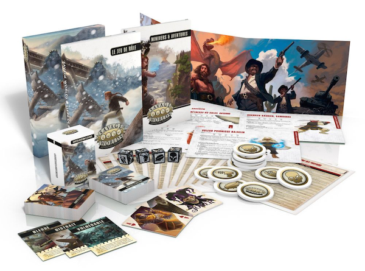

Savage Worlds est un système générique de jeu de rôle qui motorise pas moins de 147 univers ([d'après cette liste](https://savagepedia.wiki/wiki/List_of_Savage_Worlds_univers)). C'est probablement le système générique qui a connu le plus grand succès et cet article se propose de tenter d'expliquer les raisons de cet engouement.

<!--more-->



## Une brève histoire de Savage Worlds

Savage Worlds a été créé en 2003 par [Shane Lacy Hensley](https://en.wikipedia.org/wiki/Shane_Lacy_Hensley) et publié par [Pinnacle Entertainment Group](https://en.wikipedia.org/wiki/Pinnacle_Entertainment_Group). Il est issu de l'adaptation d'un système de jeu de figurines [The Great Rail Wars](https://boardgamegeek.com/boardgame/12957/deadlands-great-rail-wars) qui permettait de gérer simplement et rapidement des combats de masse.

Le premier univers a avoir été publié pour ce système est [Evernight](http://www.legrog.org/jeux/savage-worlds/evernight/evernight-en) mais le plus icônique est probablement [Deadlands Reloaded](http://www.legrog.org/jeux/deadlands-reloaded). S'en sont suivis de très nombreux univers, publiés par Pinnacle Entertainment Group mais aussi par d'autres éditeurs tiers.

## Fast Fun and Furious

La devise de Savage Worlds est Fast Fun and Furious. L'idée de base du système est d'accélérer la résolution des actions des personnages et de simplifier la vie du MJ en simplifiant sa gestion de la partie.

### Résolution d'actions

Prenons un cas concret tiré d'un exemple de résolution d'une action du livre de base de la dernière édition de Rêve de Dragon :

*Nitouche tente de sauter par-dessus une haie. Le gardien des rêves estime la difficulté malaisée (-2). L’action requiert la caractéristique Mêlée et la compétence Saut. Nitouche a 10 en Mêlée et -2 en Saut. On calcule donc ainsi son ajustement final : (-2) + (-2) = -4. Dans la colonne -8, on repère sa caractéristique de Mêlée (10) ; tout en haut de la table, en horizontal, on repère l’ajustement final (-4) ; et l’on voit que la croisée des deux donne 30. Cela signifie que Nitouche a 30% de chances de sauter correctement. On joue un jet de pourcentage, et si le résultat est égal ou inférieur à 30, l'action réussit ; dans le cas contraire, elle échoue.*

Voyons maintenant ce que cela donnerait avec le système Savage Worlds :

*Nitouche tente de sauter par dessus une haie. Le MJ estime que cette action est difficile et décide d'un malus de -2. L'action dépend de la compétence Athlétisme pour laquelle Nitouche a d6. Elle lance 1d6 (et un autre d6 car c'est un PJ), soustrait 2 et doit faire 4 ou plus pour réussir.*

Avec le système de Rêve de Dragon, nous avons dû suivre les étapes suivantes :

- Déterminer la difficulté et en déduire le malus
- Déterminer la caractéristique concernée par l'action
- Déterminer la compétence dont dépend l'action
- Croiser la caractéristique avec la difficulté dans un tableau pour déterminer les seuils de réussite, de réussite critique et d'échec critique
- Faire un jet de pourcentage et comparer avec les seuil de la table

Avec le système Savage Worlds, les étapes sont les suivantes :

- Déterminer la difficulté de l'action et en déduire le malus
- Déterminer la compétence dont dépend l'action
- Faire le jet dé

On comprend bien que l'action est beaucoup plus fluide dans le deuxième cas. Mais surtout les joueurs n'ont pas à consulter de tables pour déterminer les résultat : un 4 est toujours un succès (sauf dans certains cas particuliers) et un double 1 est toujours un échec critique.

Le plus étonnant dans cet exemple est que les probabilités sont quasiment identiques :

- Dans le cas de RdD, nous avons 30% de réussite, 6% de chance de réussite critique et 7% d'échec critique.
- Dans le cas de SW, nous avons 31% de réussite, 16% de chance de réussite critique et 3% d'échec critique.

Donc pour un résultat similaire, nous avons une mécanique beaucoup plus fluide.

### Initiative

Un autre exemple de la fluidité des règles et le système d'initiative :

A RdD, on calcule l'initiative en faisant la somme :

- Du facteur d'initiative + 1d6
- Le facteur d'initiative doit être calculé pour chaque arme et c'est la somme de :
    - La demi-caractéristique pour cette arme
    - Le niveau de compétence pour cette arme

Tous les joueurs doivent faire ce jet et le MJ doit le faire pour chacun des adversaires du combat. Il faut ensuite trier les résultats pour déterminer l'ordre de l'initiative.

A Savage Worlds, le MJ distribue une carte (d'un jeu standard de 54 cartes) à chaque joueur et pour chacun des groupes d'adversaires. Les cartes sont posées sur la table devant chaque joueur et l'ordre de l'initiative est celui des cartes (joker, ace, roi, dame, etc). Certains Atouts permettent d'avoir une meilleure initiative (en retirant une carte de 5 ou moins par exemple).

On comprend bien que dans ce cas encore la partie sera beaucoup plus fluide avec Savage Worlds.

### Fast pourquoi faire ?

À ce stade on peut légitimement se poser la question de la pertinence de jouer rapidement. Après tout une partie de jeu de rôle n'est pas une course de vitesse !

La première réponse est : quel joueur a envie de jouer un combat qui durera 4 heures ? Les combats interminables contre des sacs à PV que des personnages besogneux vont piocher comme des mineurs pendant des heures n'amusent plus personne.

L'autre aspect à considérer est la charge mentale du MJ : moins il passe de temps à s'occuper de la résolution des actions ou de l'initiative, plus il en a pour divertir les joueurs.

## Un système générique

La question qui fait débat lorsqu'on évoque Savage Worlds est celle de la pertinence d'un système générique. Certains pensent que le système fait le sel d'un jeu. À cela je répondrai en points.

### Le système c'est important

Disposer d'un système éprouvé qui tourne comme une horloge est fondamental. Un système spécifique est souvent moins testé qu'un système éprouvé sur des milliers de parties dans des dizaines de univers depuis des années. On a tous en tête des jeux dont les univers sont unanimement salués mais plombés par un système boiteux. Je citerai en vrac :

- Rêve de Dragon
- Méga
- Empire Galactique

Les systèmes de ces jeux se voulaient tous très simulationnistes mais sont au final très lourds car leur mécanique est guidée par des principes généraux qui se traduisent par des mécaniques complexes.

D'autre part, est-il pertinent de vouloir du réalisme dans les jeux de rôle ? Les créateurs de jeux vidéo savent depuis longtemps qu'il ne faut pas singer la réalité (qui est souvent ennuyeuse) mais plutôt faire vraisemblable et amusant.

Pour prendre un cas concret, l'association d'une caractéristique et d'une compétence peut sembler intéressante à RdD, mais concrètement, à quelles autres caractéristiques peut-on associer la compétence saut ? Il est en fait assez rare d'exploiter la richesse potentielle et de ce système, par contre on en paye le prix à chaque jet.

### Le système ce n'est pas l'essentiel

Le sel des jeux que nous avons aimé ne vient probablement pas de leur système de jeu mais plutôt de l'univers ou de concepts originaux. Par exemple, ce que les joueurs retiennent de l'Appel de Cthulhu c'est son univers années 30 si particulier. Et ce n'est pas son système particulier de Santé Mentale mais le concept de santé mentale qui baisse plus on connaît le Mythe. On peut tout à fait jouer un scénario de l'Appel de Cthulhu avec un autre système et en garder toute la saveur.

J'ai pour ma part fait jouer La Maison Corbitt avec deux systèmes (Chaosium et Savage Worlds) et cela n'a fait aucune différence. Que les joueurs lancent un d100 ou deux d6, cela ne change rien. Par contre, j'ai dû recréer un système pour gérer la santé mentale lorsque j'ai joué en Savage Worlds pour préserver la saveur Cthulhu.

En ce sens je pense que le système n'est pas essentiel pour créer l'atmosphère d'un jeu.

## Un système flexible

Savage Worlds est un système modulaire, ce qui permet un apprentissage en douceur mais aussi de l'adapter à nombre d'univers.

### Commencer en douceur

On peut considérer qu'une bonne moitié des règles (à partir de la section *Outils pour l'aventure* de l'édition SWADE) sont des règles optionnelles. Un MJ débutant peut commencer avec le coeur des règles puis en appliquer de nouvelles au fur et à mesure, dans l'ordre suivant :

- Commencer par le coeur (jusqu'à la page 97 de la dernière édition)
- Ajouter ensuite la prise en charge des pouvoirs
- Puis ajouter des règles de situation au compte goutte (pages 97 à 111)
- Puis ajouter au besoin des règles de la boîte à outils (pages 111 et suivantes)

Si on souhaite commencer plus simplement encore, on peut se contenter dans un premier temps des [règles d'essai](http://savage.torgan.net/regles-d-essai-v6-0). C'est suffisant pour un scénario contemporain comme La Maison Corbitt par exemple.

### Secouer le Pulp

Savage Worlds a la réputation d'être un système adapté aux univers Pulp. En effet, les personnages peuvent entreprendre des actions héroïques avec des chances de succès raisonnables. Cela est dû entre autre aux jetons dont disposent les joueurs et qui leur permettent de relancer les dés pour obtenir un meilleur résultat, mais aussi absorber les blessures, etc.

Si l'on souhaite adapter Savage Worlds à des univers plus sombres et réalistes, on peut :

- Appliquer certaines règles d'univers pour rendre le jeu plus mortel (comme Dégâts Handicapants par exemple)
- Ne pas distribuer de jetons aux joueurs
- Ne pas accorder de dé joker aux joueurs

Par exemple, pour jouer des scénarios de l'Appel de Cthulhu, j'ai appliqué les règles suivantes :

- Dégâts handicapants
- Pas de jetons en début de partie
- Pour avoir l'effet d'un jeton, les joueurs gagnent un point de Stress
- Chaque point de Stress est un malus pour les jets de Terreur

### Pas d'effet d'horizon

Il est des systèmes où certaines actions sont juste impossibles. Par exemple, un paladin niveau 20 pourra se promener dans un village de gobelins sans être inquiété : ils ne peuvent tout simplement pas le toucher. C'est ce que j'appelle l'effet d'horizon.

Cet effet n'existe pas à Savage Worlds : un gobelin unijambiste et borgne aura toujours un chance tuer votre personnage d'un coup de couteau. Ceci est dû au fait que les dés explosent. Même avec 1d4-2 de compétence à la dague le gobelin peut toucher. Le couteau du gobelin (qui doit faire quelque chose comme 2d4 de dégâts) peut aussi traverser l'armure.

Cette simple mécanique permet d'éviter des situations absurdes en jeu.

## Parlons univers

Les règles c'est bien beau, mais qu'en est-il des univers ?

### Un grande diversité

En français, les univers suivants sont disponibles :

- Beasts & Barbarians : du Sword & Sorcery à la Conan
- Lankhmar : adapté de la Saga des Épées de Fritz Leiber
- Deadlands Reloaded : du western étrange avec morts vivants et machines infernales
- Achtung! Cthulhu : de la secondes guerre mondiale avec du Cthulhu dedans
- Interface Zero 2.0 : du cyberpunk avec un gros background

Il y a donc de quoi faire ! Sans compter que le site des fans francophones de Savage Worlds, <http://savage.torgan.net/> publie de nombreux articles, dont des scénarios à foison.

En anglais le choix est pléthorique : j'ai compté près de 150 univers sur la page de Savagepedia qui les recense. Cela inclut les univers officiels, mais aussi des amateurs, dont certains d'une grande qualité (comme [Saga of the Goblin Horde](https://www.drivethrurpg.com/product/225745/Saga-of-the-Goblin-Horde-Savage-Worlds) par exemple).

### Une licence ouverte

Le nombre important de univers est dû en grande partie à la politique de licence ouverte de Pinnacle Entertainment. Ils gardent les droits sur le système de jeu mais accordent une licence pour les univers avec une simple validation du contenu et sans avoir à reverser des droits à Pinnacle : voir la licence ici <https://www.peginc.com/licensing/>.

Il existe aussi la possibilité de produire du contenu non commercial pour Savage Worlds avec la licence Fans Product. Il faut simplement apposer le logo officiel et respecter les termes de la licence.

## Tant d'univers à explorer !

```
J'ai vu tant de choses que vous, adeptes du d20, ne pourriez imaginer...
Des navires de guerre en feu, surgissant de l'épaule d'Orion...
J'ai vu des rayons C briller dans l'obscurité, près de la Porte de Tannhäuser...
Tous ces moments je les ai vécus grâce à Savage Worlds !
```

Après avoir commencé ma carrière, avoir élevé mes enfants, il ne me restait très peu de temps pour le jeu de rôle. Les journées n'ont que 24 heures et pendant longtemps je n'ai plus trouvé le temps de jouer. J'arrivais péniblement à faire deux parties par an. Un an après avoir commencé à pratiquer Savage Worlds, début 2019, j'avais joué (en tant que joueur un MJ) plus de 100 parties !

Ce système générique, combiné à une méthode de préparation des parties efficace, comme [Lazy Dungeon Master](https://slyflourish.com/lazydm/), m'a permis de jouer régulièrement sans avoir à y passer trop de temps en préparation.

## Disclaimer

Cet article n'a pas pour objectif de décrier les autres systèmes de jeu. En particulier, j'ai le plus grand respect pour Rêve de Dragon que je cite dans mes exemples. Si ces autres systèmes vont conviennent, cela est pour le mieux dans le meilleur des mondes ! La diversité est une richesse et je la respecte. Cet article n'a qu'un but : partager avec d'autres joueurs de JdR mes réflexions sur un système qui m'a permis de pratiquer le jeu de rôle avec un confort et une efficacité que je n'avais jamais connus auparavant.

Puisse les dés vous être favorables !
