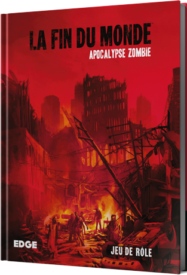

Par le plus grand des hasards, je suis tombé sur la critique du jeu [Fin du Monde - Apocalypse Zombie](https://www.youtube.com/watch?v=BE71xrgDKok) et le pitch m'a emballé. J'ai donc décidé de l'adapter à Savage Worlds !

<!--more-->

**Si vous êtes joueur et pensez jouer un jour à ce jeu, n'allez pas plus loin, vous gâcheriez votre plaisir de jouer !**

[Fin du Monde - Apocalypse Zombie](http://www.edgeent.fr/jeux/article/la_fin_du_monde/apocalypse_zombie) est un jeu de rôle d'origine Espagnole qui fait partie de la série *Fin du Monde* qui explore trois fins du monde différentes (Apocalypse Zombie, Invasion Extraterrestre et Colère des Dieux). On peut acheter l'ouvrage en ligne ou dans sa boutique favorite pour 40 € environ. On peut aussi acheter le PDF en ligne [sur le site fliphtml5.com en français pour 15 €](http://fliphtml5.com/bookcase/pneds) ou [sur drivethrurpg en anglais pour 20 $ environ](https://www.drivethrurpg.com/product/141786/The-End-Of-The-World-Zombie-Apocalypse). Sur les deux sites on peut télécharger les ouvrages au format PDF sans DRM.

Le principe du jeu est que les joueurs se jouent eux même lors de l'apocalypse zombie. Il faut donc commencer par créer son personnage avec les règles de Savage Worlds, ce qui est assez amusant comme début de partie. Je conseille d'appliquer la règle d'univers *La Naissance d'un Héros* de manière à ce que les joueurs puissent appliquer tous les Atouts à partir du moment où c'est justifié par leur propre histoire. D'autre part, pour rendre l'univers plus réaliste, j'applique la règle *Dégâts Handicapants*.

Lorsque les joueurs ont terminé leur personnage, la partie la plus délicate du jeu commence : faire la transition vers le monde qui bascule dans l'apocalypse zombie. Pour ma part, j'avais préparé les joueurs avant la partie : *Vous avez entendu aux infos : les urgences de Bordeaux Nord sont en grève, un type a agressé et mordu le personnel de l'hôpital*. Cela fait écho a [des faits réels](https://www.paris-normandie.fr/dieppe/a-dieppe-le-personnel-des-urgences-de-l-hopital-en-a-ras-le-bol-DG15027127) dont ils ont peut être entendu parler.

Le reste de la partie consiste a faire jouer aux joueurs leur propre rôle dans une apocalypse zombie qui se déroule dans leur environnement. La partie fait donc une large part à l'improvisation, mais il est préférable de préparer quelques PNJs typiques, comme un policier, un soldat, un médecin, etc. On devra aussi préparer les zombies.

L'ouvrage propose 5 types de zombies différents, avec une cause différente pour l'infection à chaque fois. Un virus pour les infectés, qui sont rapides et agiles, des parasites, des sorciers Vaudou, etc... Pour chaque type, on a un scénario pour le début de l'apocalypse et un autre post apocalypse ainsi qu'une chronologie des événements. Les scénarios sont constitués de lieux et de pistes d'histoires. L'ouvrage fait 150 pages environ et seules 24 pages sont consacrées aux règles. L'essentiel est donc utile pour un usage avec Savage Worlds.

Au final mes joueurs ont apprécié leur séance de jeu et je compte les faire rejouer pour des parties one-shot, lorsque des joueurs sont absents lors d'une campagne par exemple. C'est pratique comme bouche trou car la préparation est minimaliste, le setting est très vite expliqué et des joueurs peuvent être ajoutés ou sortis en cours de campagne sans problème.

Voici [une planche de cartes de personnages](sawo-zombie-apocalypse-persos.png) que j'ai préparés pour ma partie. Ce sont des PNJs classiques (citoyen, médecin, policier et militaire) ainsi que des zombies en mode infecté, qui sont des personnes infectées par un virus qui les rend fou furieux et les pousse à mordre, comme le fait le virus de la rage pour les animaux. Ils doivent avoir réussi une attaque par griffure avec relance, et ainsi avoir saisi leur victime, pour pouvoir mordre au tour suivant. Le zombie ultime est une version plus puissante qui a le pouvoir de cracher des jets de bile et est encore un souvenir de ses capacités humaines.

**Attention !** Ce setting peut être dérangeant pour certaines personnes et certains joueurs pourraient ne pas être à l'aise avec le fait de se jouer eux même. Pour ma part, je prends soin de ne jamais faire intervenir des personnes réelles qui ne seraient pas autour de la table. D'autre part, ce n'est probablement pas un bon setting pour commencer le jeu de rôle dans le mesure où le fait de se jouer soi même n'est pas représentatif des jeux de rôle en général.

*Enjoy!*
