Le solitaire est un jeu à la fois familier et méconnu. Familier parceque
tout le monde en a un au fond d'un placard, mais aussi méconnu car rares
sont ceux qui ont eu la patience d'en venir à bout. Quelques parties
suffisent pour s'apercevoir que ce jeu n'est pas simple !

Il aurait, dit la légende, été inventé par un prisonnier emprisonné à la
Bastille pendant la seconde moitié du XVIIe siècle. La première trace
écrite du jeu date de 1710 et est due à Leibniz qui s'est intéressé de
très près à ce jeu.

<!--more-->

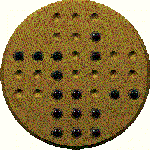

Applet Java
-----------

<applet code="Solitaire.class" codebase="../java/solitaire" width="290" height="330">

Si vous voyez ce texte, c'est que votre navigateur n'est 
pas compatible Java ou n'a pas été correctement configuré.

</applet>

### Utilisation de cette applet

Pour **déplacer une bille**, rien de plus simple : cliquez dessus, et en
maintenant enfoncé le bouton de la souris, déplacez la bille sur le trou
désiré, relacher alors le bouton de la souris pour lacher la bille dans
ce trou. Si ce mouvement est légal, alors il est exécuté. Dans le cas
contraire c'est que le mouvement est impossible.

Pour **recommencer la partie**, il suffit de cliquer sur le bouton en
dessous du plateau.

Pour **revenir en arrière ou en avant**, vous disposez de deux boutons
**[\<]** et **[\>]**. Le premier permet de revenir aux coups précédents,
et le second de revenir aux derniers coups joués après avoir utilisé le
bouton **[\<]**. Si vous jouez un coup, tous les coups que vous auriez
pu jouer après la position où vous vous trouviez seront effacés. Un
compteur indique le numéro d'ordre du coup affiché ainsi que le nombre
total de coups joués.

Pour éditer la position cliquer sur le bouton **[éditer]**. Une fenêtre
d'édition s'ouvre alors, elle vous permet de :

- **Choisir le type de plateau :** solitaire anglais ou français. Le
  solitaire anglais comporte 33 trous et le français 37. Le plateau
  est automatiquement rempli lorsqu'on change son type.
- **Ajouter ou enlever des billes :** il suffit de cliquer sur un
  trou, il change alors d'état : s'il était rempli, il se vide, et
  inversement. Cette fonction est très utile pour entrer des positions
  de départ de problèmes.
- **Remplir le plateau :** tous les trous sont alors munis d'une
  bille.
- **Vider le plateau :** toutes les cases sont alors vidées.
- Pour sortir de la fenêtre, il existe 2 possiblités : si vous cliquez
  sur **[OK]**, la position éditée est prise en compte et devient la
  nouvelle position de départ : lorsque vous cliquerez sur
  **[Recommencer]**, c'est cette position qui sera alors affichée
  (c'est très utile pour les problèmes, pour lesquels les positions de
  départ ne sont pas standards). D'autre part, tous les mouvements
  entrés précédemment sont effacés, on ne peut donc plus revenir en
  arrière (puisque la nouvelle position est celle de départ !). La
  deuxième possibilité est de cliquer sur **[Annuler]**, on revient
  alors à la position avant édition sans changements.

Règles du jeu
-------------

Le plateau du jeu de solitaire est constitué d'une planchette creusée de
trous pouvant recevoir des billes. Le plateau est percé de 37 trous pour
le solitaire Français et de 33 pour l'Anglais. Les trous sont garnis de
billes au début du jeu. La disposition et le nombre de ces billes varie
suivant le problème envisagé. Attention ! Il n'est pas possible de
gagner avec toutes les positions de départ. Pour voir les positions de
départ possibles, se reporter à la section problèmes.

### Le but du jeu

Le but du jeu est d'arriver à une disposition des billes déterminée à
l'avance. Encore une fois, il n'est pas toujours possible de résoudre le
problème.

Le problème le plus classique consiste à partir d'un plateau dont tous
les trous sont garnis, sauf un, et d'arriver à un plateau ne comptant
plus qu'une bille. Cela est toujours possible au solitaire Anglais, mais
pas au solitaire Français, pour lequel certaines positions de départ
sont impossibles. En particulier, vous n'arriverez pas à terminer la
partie en vidant le trou central.

### Déplacement des billes

On ne peut déplacer une bille que si l'on effectue de cette manière une
prise, très semblable à celle des Dames. En effet, pour prendre une
bille, on doit sauter par dessus avec une autre bille, vers une case
vide du plateau. La prise en diagonale est interdite.

### Exemple

La bille cerclée saute vers la croix, et prend la bille se trouvant
entre le cercle et la croix.

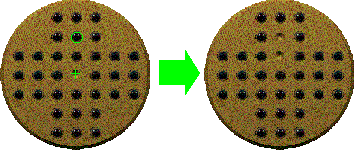

### Conseil

Pour ne laisser qu'une seule et unique bille, il faut procéder
méthodiquement et vider le plateau par secteur. En effet, si on laisse
une bille isolée, il sera par la suite très difficile de revenir la
chercher.

Vous en savez maintenant assez pour jouer au Solitaire avec l'applet
(cliquer sur le lien ci-dessous).

BONNE CHANCE ...

Problèmes
---------

Pour réaliser ces problèmes avec l'applet, il faut commencer par entrer
la position de départ. Pour cela, cliquer sur le bouton **[éditer]**:
apparait alors la fenêtre d'édition. Choisir le plateau approprié et
entrer la position de départ. Cliquer ensuite sur **[OK]**, il ne reste
plus qu'à jouer ! Remarque : si vous cliquez sur **[Recommencer]**, le
plateau sera remis dans la configuration que vous avez entrée.

J'ai divisé les problèmes en 2 catégories : pour le solitaire Anglais et
pour le Français. Pour certains problèmes, j'indique un nombre de coups.
En fait, on entend par là qu'une bille ne fait qu'un coup si elle prend
plusieurs autres billes d'affilé (comme une prise multiple aux dames).

### Solitaire Anglais

#### Le classique

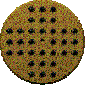

Le plateau est complétement rempli à l'exception d'un trou vide. Ce trou
peut être vidé n'importe où, le problème a toujours une solution.

#### L'abat-jour

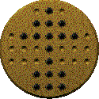

On doit arriver à une seule bille au centre. Il existe une solution en
10 coups.

#### Le pentagone

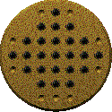

A réduire à une seule bille au centre. Il existe une solution en 15
coups, dont un prend 9 billes d'un coup !

#### Le carré oblique

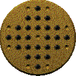

A réduire à une seule bille au centre. Huit coups, dont un prend 11
billes d'un coup, sont nécessaires.

#### Entrée au centre

Peut être réalisé en 18 mouvements, dont 7 sauts en chaine.

#### Saut de Davis

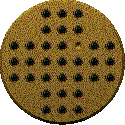

La dernière bille doit retourner à la case vide, en 15 coups, dont 6 en
chaine.

#### La croix Suisse

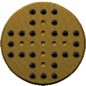

In ne doit en rester qu'une (problème soumis par **Jerems**).

### Solitaire Français

#### Le classique

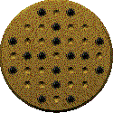

Attention ! Contrairement au solitaire Anglais, le Français ne
s'accomode pas de toutes les positions de départ. La bille retirée ne
peut l'être qu'aux positions marquées d'une bille dans la figure
ci-contre.

#### La croix grecque

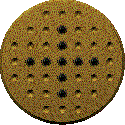

Doit être réduite à une seule bille au centre.

#### Kehphren

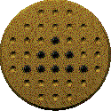

Doit être réduite à une seule bille.

#### Khéops

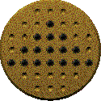

Idem.

#### Le calvaire

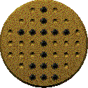

Idem.

#### Le cristal

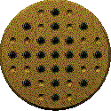

Idem.

#### Le lecteur et son auditoire

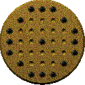

Cette fois, on part du plateau complètement rempli, sauf la bille du
centre, et on doit arriver à la configuration ci-contre.

N'hésitez pas à m'envoyer vos problèmes de solitaire. Je les incluerai
dans cette page dans la mesure du possible.

BON COURAGE !!!

Solution
--------

Ceux et celles qui ont un peu sué sur le problème classique du Solitaire
Anglais méritent bien la solution (pour les autres, je leur conseille
d'essayer !) :

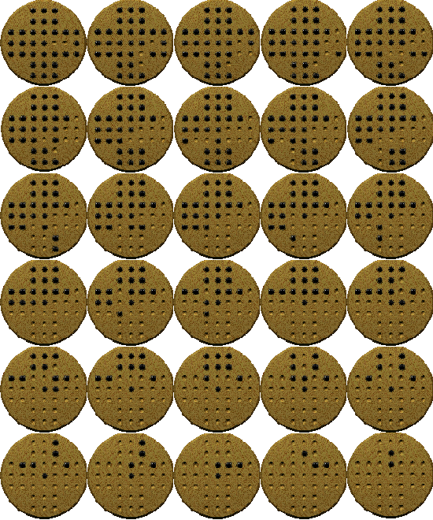

Félicitations si vous avez trouvé !
