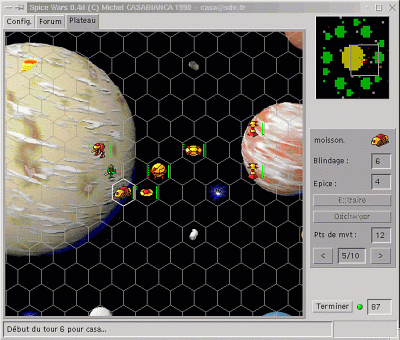

Spice Wars est un jeu de statégie en réseau pour 3 à 6 joueurs.

<!--more-->

SpiceWars a remporté la première place à la [Java Cup 1998](http://www.jcup.com) dans la catégorie *jeux*.

[Cliquer ici](http://sweetohm.net/arc/spicewars-0.4.zip) pour télécharger la dernière version de SpiceWars. L'archive contient la documentation et la licence du programme.
