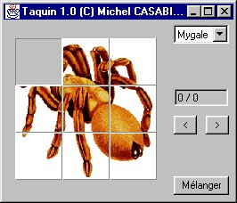

Le taquin est apparu aux états unis vers la fin des années 1870. La
légende veut qu'il ait été inventé par un sourd muet qui voulait ranger
ses cubes dans la boite sans les en sortir. Il est plus probable que ce
jeu soit dû au célèbre problèmiste Américain Sam Loyd. Il s'est
rapidement répendu aux états unis puis en Europe où il a connu un succès
comparable au Rubik's cube en son temps...

Applet Java
-----------

<applet code="Taquin.class" codebase="../java/taquin" width="600" height="400">

Si vous voyez ce texte, c'est que votre navigateur n'est 
pas compatible Java ou n'a pas été correctement configuré.

<param name="fichier" value="problemes.txt"/>
</applet>

Le principe du jeu
------------------

Il est très simple : par des déplacements successifs, il faut ramener
les pièces du Taquin à leur position de départ, indiquée au chargement
du problème, comme dans la figure ci-dessous :

Avant de jouer, il faut commencer par mélanger la grille. Pour ce faire,
cliquer sur le bouton **[Mélanger]**. Pour déplacer une tuile, il suffit
de cliquer dessus, elle se déplace alors automatiquement sur la place
libre. On peut déplacer plusieurs tuiles horizontalement ou
verticalement si la tuile sur laquelle on clique n'est pas immédiatement
adjacente au trou. Il est possible de revenir en arrière en cliquant sur
le bouton **[\<]** et en avant en cliquant sur **[\>]**. Si on effectue
alors un mouvement, les coups suivants sont perdus (on ne peut plus
avancer dans les coups, le coup entré devient le dernier coup de
l'historique). En cliquant sur **[Mélanger]**, on mélange le puzzle pour
refaire une partie. On sélectionne le problème avec la liste déroulante
en haut à droite de l'applet.
