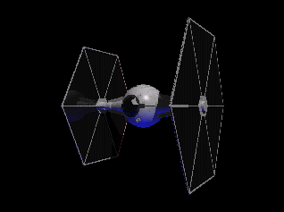

En visitant le site de Moonlight (excellent modeleur pour Linux), je me
suis rappelé des heures glorieuses où l'on éditait fébrilement nos
scripts pour POV sur des 386 poussifs (qui mettaient des heures pour
calculer des images que nous n'oserions plus montrer maintenant).

<!--more-->

Dans mes archives, j'ai toutefois déniché un script qui peut encore être
intéressant : un chasseur TIE !

Je me suis dit comme ça que cela pourrait encore servir à quelqu'un, je
le propose donc à qui veut l'utiliser. L'image ci-dessus est extraite
d'une animation réalisée à partir de ce script. En suivant [ce
lien](../arc/tie.zip), pour pouvez télécharger une archive contenant le
script et la vidéo au format AVI (environ 1 Mo).
