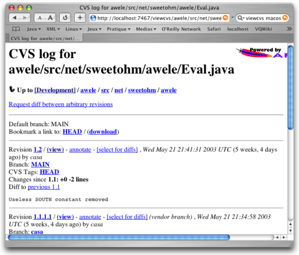
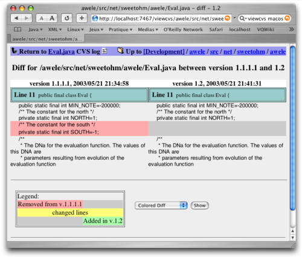

ViewCVS est un outil offrant une vue d'un entrepôt CVS au travers d'une
interface Web. Cet article décrit une installation simple et rapide de
cet outil sous MacOSX.

<!--more-->

Présentation de ViewCVS
-----------------------

CVS est devenu un standard dans le monde des outils de gestion de
configuration. C'est en particulier l'outil par défaut de
l'environnement de développement chez Apple (il est livré en standard
avec les outils de développement). ViewCVS offre une vue synthétique de
votre entrepôt CVS au travers d'une interface web.

Il permet en particulier de visualiser l'historique d'un fichier :



Mais aussi de visualiser graphiquement les différences entre deux
versions d'un même fichier :



ViewCVS offre nombre d'autres fonctionnalités qui deviennent vite
indispensables lorsqu'on y a goûté. La suite de cet article indique la
marche à suivre pour installer cet outil sous MacOSX.

Installer ViewCVS
-----------------

Commencer par télécharger l'archive à l'adresse
<http://viewcvs.sourceforge.net/>. Dézipper l'archive et l'installer
dans le répertoire de votre choix (sous le compte *root*) à l'aide des
commandes suivantes dans un terminal (on se placera dans le répertoire
où l'archive a été téléchargée) :

```bash
$ unzip viewcvs-0.9.2.zip
$ mv viewcvs-0.9.2 /opt/
```

Vous pouvez bien sûr l'installer où vous souhaitez, pour ma part,
j'installe mes applications Unix sous le répertoire */opt* de manière à
ne pas interagir avec l'arborescence des fichiers de MacOSX.

ViewCVS est un programme Python qui peut être lancé seul (il lance alors
son propre serveur HTTP pour répondre aux requêtes) ou bien en tant que
CGI derrière Apache par exemple. Pour ma part, j'ai choisi de le lancer
en standalone de manière à ne pas polluer mon installation Apache
d'origine (et m'épargner d'avoir à le configurer :o)

Pour lancer ViewCVS en standalone, il faut commencer par le configurer
en se plaçant dans le répertoire d'installation et en lançant la
commande :

```bash
$ ./viewcvs-install
```

On peut alors le lancer en tapant la commande suivante :

```bash
$ ./standalone.py -r /mon/repository/cvs
```

On peut alors visualiser son entrepôt en visitant l'adresse
<http://localhost:7467/> avec son navigateur préféré. Voilà, c'est aussi
simple que cela !

Pour simplifier le lancement de ViewCVS de la ligne de commande, j'ai
écrit le petit script Shell ci-dessous :

```bash
#!/bin/sh
CVSROOT=/mon/repository/cvs
VIEWCVS_HOME=/opt/viewcvs-0.9.2
cd $VIEWCVS_HOME
exec /sw/bin/python ./standalone.py -r $CVSROOT
```

On notera qu je donne explicitement le chemin de l'interpréteur Python
suite à une incompatibilité entre celui livré avec MacOS (une version
2.3) et la version installée avec Fink (une 2.3.3).

Pour faciliter le lancement depuis la ligne de commande, j'ai tiré un
lien vers le répertoire */opt/bin* qui se trouve dans mon `PATH`. On
notera que ViewCVS ne propose pas de commande pour l'arrêter proprement,
il faut donc l'interrompre par un kill (mais cela n'a jamais tué
personne :o)

Lancer ViewCVS au démarrage de MacOSX
-------------------------------------

Lancer l'outil dans un terminal après chaque démarrage devient vite
pénible. Le plus simple est de l'installer en tant que service à lancer
au démarrage de la machine. Pour ce faire, il faut (sous le compte
*root*) créer un répertoire *ViewCVS* dans le répertoire
*/Library/StartupItems*.

Dans ce répertoire, on placera le script suivant (qui doit être
exécutable), appelé *ViewCVS* :

```bash
#!/bin/sh
#
# ViewCVS
#

. /etc/rc.common

##
# Start up ViewCVS
##

if [ "${VIEWCVS:=-YES-}" = "-YES-" ]; then

    ConsoleMessage "Starting ViewCVS"

    nohup /opt/bin/viewcvs > /var/log/viewcvs.log 2>&1 &
    /bin/chmod 664 /var/log/viewcvs.log
    /usr/bin/chgrp admin /var/log/viewcvs.log
fi
```

Ce fichier lance l'application après s'être assuré que le service doit
être lancé au démarrage (la ligne `VIEWCVS=-YES-` doit être présente
dans le fichier */etc/hostconfig*).

On doit aussi y placer le fichier de paramètres suivant (appelé
judicieusement *StartupParameters.plist*) :

```bash
//
// ViewCVS
//
{
  Description     = "ViewCVS";
  Provides        = ("ViewCVS");
  Requires        = ("Network");
  OrderPreference = "Late";
  Messages =
  {
    start = "Starting ViewCVS";
    stop  = "Stopping ViewCVS";
  };
}
```

Le service est maintenant lancé au démarrage de MacOS. Pour le
désactiver, éditer le fichier */etc/hostconfig* et remplacer la ligne
`VIEWCVS=-YES-` par `VIEWCVS=-NO-`.

Les scripts de démarrage comportent en général une fonction pour arrêter
le service, mais n'ayant pas trouvé dans le documentation de ViewCVS de
moyen d'arrêter le serveur standalone, il faudra se contenter d'un kill
sur le process (c'est un peu vulgaire mais on n'en meurt pas :o)

Enjoy!
