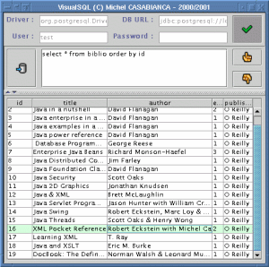
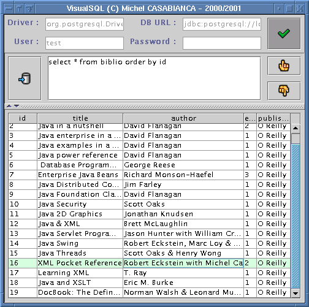

VisualSQL is a JDBC client for databases. You can send SQL queries and
see the result in a table. It is released under GPL thus, the sources
are available.

<!--more-->

Auto installer [vsql-0.5.jar](../arc/vsql-0.5.jar)

Installing VisualSQL
--------------------

To install VisualSQL, you must first :

1. Install a Database (you can use
   [PostgreSQL](http://www.postgresql.org) which is an Open Source
   Relational Database).
2. Install a 1.2 or 1.3 Java Virtual Machine. You can download one for
   free on [Sun's web site](http://java.sun.com/j2se).
3. Download a JDBC driver for your Database (you will find some for
   PostgreSQL on [this site](http://jdbc.postgresql.org)).

To install VisualSQL, type `java -jar vsql-.jar` in the directory of the
archive. This will launch the auto installer. You must then drop the
JDBC driver for your database in the *lib* directory of VisualSQL.
Windows users must edit the *bin\\vsql.bat* file to add the driver jar
file in the CLASSPATH. If your driver's archive is a zip file, simply
rename it to make a .jar file.

The latest version of VisualSQL is on [my web page](http://sweetohm.net/article/vsql.en.html).

Building VisualSQL
------------------

To build VisualSQL, you will need Ant version 1.3, you will find it on
[Apache web site](http://jakarta.apache.org/ant). Go to the `prj`
directory and type `ant all` to rebuild from sources.

To generate the doc, you will need SAT, my set of Ant tools. You can
find it on my [web page](http://sweetohm.net/article/sat.en.html). To
generate the installer, you will need FiJI, my installer generator. You
may find it on my [web site](http://sweetohm.net/article/fiji.en.html).

Using VisualSQL
---------------

Type `vsql` on the command line to launch VisualSQL. The application
will look like :

First, you must connect to the database:

1. Type in the name of your JDBC driver class. This should be included
   in your driver's documentation. For PostgreSQL 7.0, the driver class
   is *org.postgresql.Driver*.
2. Enter your database URL. This depends on your database and your
   driver's documentation should document this. For PostgreSQL, this is
   something like *jdbc:postgresql://localhost:5432/myDB*.
3. Type in user name and password (if any).

Then click on the button to connect. If connection fails, a dialog box
should detail the error. When connected (no error message), you can send
SQL queries to the database by typing them in the text area and clicking
on the query button. The result is shown on the lower pane. You can
display previous queries with arrows (up for previous and down for next
ones).

You disconnect from the database when quitting or by clicking on the
disconnect button. When quitting, your configuration is saved in a
configuration file (*\~/.vsql.properties* on Unix or
*\<VSQL\_HOME\>\\vsql.properties* on Windows). The query history (last
100 queries) is saved in a file (*\~/.vsql.history* on Unix or
*\<VSQL\_HOME\>\\vsql.history* on Windows).

Key bindings are the following:

- **Ctrl+Space**: Connect/disconnect from the database.
- **Ctrl+Enter**: Execute Query.
- **Ctrl+Up**: Previous Query in the History.
- **Ctrl+Down**: Next Query in the History.

Configuration file
------------------

The database connection properties are saved when you quit the
application in the following properties:

- **jdbc.driver**: the JDBC driver to use.
- **jdbc.url**: the database URL.
- **jdbc.user**: the user name.
- **jdbc.password**: the password for the user.

There are other properties you can change by editing the properties
file:

- **debug**: to run the program in debug mode. The stack traces are
  printed on the console. Copy those stack traces to send a bug
  report. May have the values *true* or *false*.
- **swing.icons**: this is the set of icons to use in the interface.
  May have the values *swing* or *jlobby*. The Java Lobby icons are
  Copyright(C) 1998 by [Dean S. Jones](mailto:dean@gallant.com) and
  may be downloaded at
  [www.gallant.com/icons.htm](http://www.gallant.com/icons.htm).
- **swing.primaryX** and **swing.secondaryY**: change those values to
  customize you interface. Those values may be decimal, hexadecimal
  (starting with *0x*) or octal (starting with *O*) values.

License
-------

This software is free and released under the
[GPL](http://www.gnu.org/copyleft/gpl.html). You can find a copy of this
license in the file *LICENSE* in the installation directory.

History
-------

### Version 0.5 (2001-10-15)

Bug correction (query related key bindings were active even when not
connected to the database).

Disconnection from the database on VM shutdown (using finalizer
execution request on 1.2 VMs and a shutdown hook on 1.3).

### Version 0.4 (2001-10-10)

The program has been completely rewritten using a (supposed) clean
object design.

### Version 0.3 (2001-08-22)

Bug corrections (the program didn't started if no history file was found
in the user's home) and enhancements (tool tips on the column headers).
Thanks to [Laurent ROMEO](mailto:vixxes@noos.fr) for his contribution.

Documentation updates.

### Version 0.2 (2000-08-31)

Directory tree changed, Hot Keys and theme added.

### Version 0.1 (2000-08-30)

Minor bug fix (related to the Connect button) and an enhancement
(related to the History list).

### Version 0.0 (2000-06-07)

First release.

*Enjoy !*
