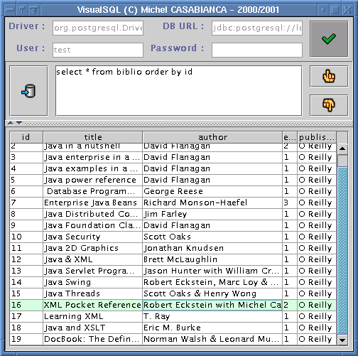

VisualSQL est un client JDBC pour bases de données. Il permet de leur
envoyer des requêtes et de visualiser le résultat (éventuel) sous forme
d'une table. Il est distribué sous license GPL et les sources en sont
donc disponibles.

<!--more-->

Auto installeur [vsql-0.5.jar](../arc/vsql-0.5.jar)

Installation de VisualSQL
-------------------------

Pour utiliser VisualSQL, il faut auparavant:

1. Installer une base de données (vous pouvez utiliser
   [PostgreSQL](http://www.postgresql.org) qui est une base de données
   relationnelle libre.
2. Installer une machine virtuelle Java 1.2 or 1.3. On peut en
   télécharger gratuitement une sur [le site de
   Sun](http://java.sun.com/j2se).
3. Télécharger un pilote JDBC pour votre base de données (on peut en
   trouver un pour PostgreSQL sur [Ce
   site](http://jdbc.postgresql.org)).

Pour installer VisualSQL, taper `java -jar vsql-0.5.jar` sur la ligne de
commande dans le répertoire de l'archive. Cela va lancer
l'auto-installeur. Vous devez copier la pilote JDBC de votre base dans
le répertoire *lib* de VisualSQL. Les utilisateurs de Windows doivent
ensuite éditer le fichier *bin\\vsql.bat* pour y ajouter ce fichier jar
dans la CLASSPATH. Si votre pilote est une archive zip, il faut en
changer l'extension pour .jar.

On peut trouver la dernière version de VisualSQL sur [ma page personnelle](http://sweetohm.net/article/vsql.html).

Compiler VisualSQL
------------------

Pour compiler VisualSQL, il vous faut installer Ant en version 1.3. On
peut le télécharger sur [le site de
Apache](http://jakarta.apache.org/ant). Se placer dans le répertoire
`prj` et taper `ant all` pour reconstruire le tout.

Pour générer la documentation, vous devez télécharger et installer SAT
(un jeu de tâches Ant) que l'on peut trouver sur [ma page personnelle](http://sweetohm.net/article/sat.html). Pour générer
l'installeur, il vous faudra aussi FiJI, un générateur d'installeur que
l'on peut télécharger sur [ma page personnelle](http://sweetohm.net/article/fiji.html).

Utiliser VisualSQL
------------------

Taper `vsql` sur la ligne de commande pour lancer le programme.
L'application a l'allure suivante:

Vous devez commencer par vous connecter à la base de données:

1. Entrer le nom de la classe de votre pilote JDBC. Elle devrait être
   indiquée dans la documentation de votre pilote. Pour PostgreSQL 7.0,
   c'est *org.postgresql.Driver*.
2. Saisissez ensuite l'URL de votre base de données. Elle dépend de
   votre pilote et devrait être indiquée dans la documentation de votre
   pilote. Pour PostgreSQL, c'est de la forme
   *jdbc:postgresql://localhost:5432/myDB*.
3. Entrer ensuite l'utilisateur et son mot de passe.

Cliquer ensuite sur le bouton pour vous connecter. En cas de problème,
une boite de dialogue devrait détailler l'erreur. Lorsque vous êtes
connecté (pas de message d'erreur), vous pouvez saisir des requêtes SQL
dans la zone de texte et les envoyer à la base en cliquant sur le
bouton. Le résultat (s'il y en a un) est affiché dans la table en
dessous. Vous pouvez afficher des requêtes de l'historique en cliquant
sur les flèches (vers le haut pour les requêtes précédentes et vers le
bas pour les suivantes).

On est déconnecté de la base lorsque l'on quitte l'application ou
lorsque l'on clique sur le bouton de déconnexion. Lorsque l'on quitte,
la configuration est enregistrée dans un fichier de propriétés
(*\~/.vsql.properties* sous Unix ou *\<VSQL\_HOME\>\\vsql.properties*
sous Windows). L'historique des requêtes (les 100 dernières requêtes
saisies) est enregistré dans un fichier XML (*\~/.vsql.history* sous
Unix ou *\<VSQL\_HOME\>\\vsql.history* sous Windows).

Les raccourcis clavier sont les suivants:

- **Ctrl+Espace**: Connexion/Déconnexion de la base.
- **Ctrl+Entrée**: Exécution de la requête.
- **Ctrl+Haut**: Requête précédente dans l'historique.
- **Ctrl+Bas**: Requête suivante dans l'historique.

Fichier de configuration
------------------------

Les propriétés de la connexion à la base sont enregistrées dans le
fichier de propriétés ayant les entrées suivantes:

- **jdbc.driver**: la classe du pilote JDBC.
- **jdbc.url**: l'URL de la base de données.
- **jdbc.user**: le nom de l'utilisateur.
- **jdbc.password**: son mot de passe.

D'autres propriétés peuvent être modifiées dans ce fichier:

- **debug**: pour lancer le programme en mode débuggage. Les stack
  traces sont alors affichées sur la console. Copier ces stack traces
  pour envoyer un rapport de bug. Cette propriété peut prendre les
  valeurs *true* ou *false*.
- **swing.icons**: c'est le nom du jeu d'icônes à utiliser dans
  l'interface. Peut avoir les valeurs *swing* ou *jlobby*. Les icônes
  Java Lobby sont Copyright(C) 1998 par [Dean S.
  Jones](mailto:dean@gallant.com) et peuvent être téléchargées à
  l'adresse
  [www.gallant.com/icons.htm](http://www.gallant.com/icons.htm).
- **swing.primaryX** et **swing.secondaryY**: changer ces valeurs pour
  personnaliser votre interface. Ces valeurs peuvent être décimales,
  hexadécimales (si elles commencent par *0x*) ou octales octales (si
  elles commencent par *O*).

Licence
-------

Ce programme est un logiciel libre sous licence
[GPL](http://www.gnu.org/copyleft/gpl.html). Vous pouvez trouver une
copie de cette licence dans le fichier *LICENSE* du répertoire
d'installation.

Historique
----------

### Version 0.5 (2001-10-15)

Correction de bug (les raccourcis claviers concernant les requêtes
étaient actifs même hors connexion à la base).

Déconnexion à la base lors de la sortie de la VM (par une requête
d'exécution des finalizers pour les VMs 1.2 et shutdown hook pour les
1.3).

### Version 0.4 (2001-10-10)

Le programme a été entièrement réécrit avec un modèle objet qui tient la
route (je l'espère).

### Version 0.3 (2001-08-22)

Correction de bugs (le programme ne démarrait pas sans fichier
d'historique) et améliorations (étiquettes dans les en tête de
colonnes). Merci à [Laurent ROMEO](mailto:vixxes@noos.fr) pour sa
contribution.

Mise à jour de la documentation.

### Version 0.2 (2000-08-31)

Changement de la structure des répertoires. Ajout des raccourcis clavier
et des thèmes.

### Version 0.1 (2000-08-30)

Correction de bugs mineurs (relatifs à la connexion) et améliorations
(relatives à l'historique).

### Version 0.0 (2000-06-07)

Première version distribuée.

*Enjoy!*
