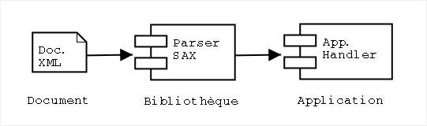
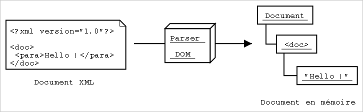
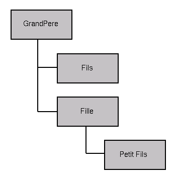
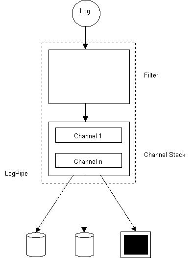
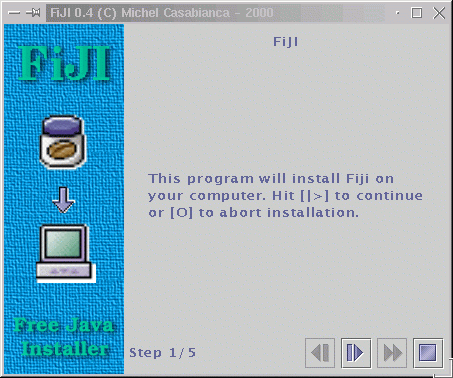
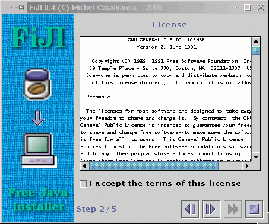

Ce tutoriel est le dernier d'une série de trois (après une présentation
générale de XML et une introduction à XSLT). Il traite du développement
d'applications XML en Java.

<!--more-->

Introduction
------------

### Pourquoi utiliser XML dans une application ?

XML est utile en de nombreuses occasions, en particulier:

- Pour construire des fichiers de configuration évolués (voir par
  exemple les fichiers de configuration de Tomcat).
- Pour faire communiquer de programmes entre plates-formes hétérogènes
  (en terme d'OS et/ou de langage de programmation).
- Comme format de sortie d'un programme lorsque celui-ci doit être
  traité automatiquement (comme des fichiers de log par exemple).

### Les outils pour travailler avec XML

L'outil pour travailler avec XML s'appelle un *parser*. Il lit le
fichier XML et le rend disponible à un programme. Il peut le faire de
deux manières différentes:

- En appelant des méthodes du code Java lorsqu'il se produit des
  évènements donnés (comme l'ouverture ou la fermeture d'un élément
  par exemple). C'est le principe des parsers SAX (pour *Simple API
  for XML Parsing*).
- En construisant une représentation du document en mémoire, sous
  forme d'un arbre. Cet arbre est envoyé au programme à l'issue du
  parsing. C'est ainsi que fonctionnent les parsers DOM (pour
  *Document Object Model*) ou JDOM (qui n'est pas un acronyme
  officiellement).

Il aussi parfois utile de disposer d'un processeur XSLT pour transformer
des documents avec de simples feuilles de style (ce qui est souvent
beaucoup plus simple que de le transformer dans un programme).

Il peut être utile aussi de disposer d'un bon éditeur XML (comme Emacs
et PSGML) pour éditer les documents XML dans de bonnes conditions (avec
colorisation, indentation et aide à l'utilisateur par utilisation de la
DTD du document).

API de parsing
--------------

Comme nous l'avons vu, il existe principalement deux types de parsers.
Chacun de ces familles correspond à une API de parsing :

### API SAX

Cette API a été définie sur la liste *xml-dev* hébergée par
[xml.org](http://www.xml.org). Elle a été la première API XML largement
utilisée et était à l'origine dédiée au langage Java. Il existe
maintenant nombre d'implémentations pour d'autres langages de
programmation (dont C, C++, Perl, Python ou Lisp). Cette API est devenue
un standard *de facto* largement adopté.

Les spécifications SAX sont dans le domaine public et l'on peut les
télécharger à l'adresse <http://www.saxproject.org/>. Ces spécifications
en sont à la version 2 qui est maintenant implémentée par les principaux
parsers XML.

#### Principes généraux

Cette API est essentiellement *event driven*. Un parser SAX ne construit
pas d'arbre du document en mémoire mais appelle (*callbacks*) les
méthodes d'un *handler* lorsqu'il rencontre des évènements particuliers
(comme l'ouverture ou la fermeture d'un élément). On peut comparer la
programmation d'un tel parser à du développement d'interfaces graphiques
où l'on gère des évènements générés par l'utilisateur.

L'architecture d'une application SAX est présentée dans la figure
ci-dessous.



#### Exemple d'application SAX

Soit un document simple, comme celui du source ci-dessous :

```xml
<?xml version="1.0"?>
<doc>
 <para>Hello, world!</para>
</doc>
```

Lors du parsing SAX de ce document, il sera envoyé à l'application les
événements suivants:

```bash
start document
start element: doc
start element: para
characters: Hello, world!
end element: para
end element: doc
end document
```

Le source d'un *handler* pour écrire la trace ci-dessus pourrait être le
suivant (modulo quelques méthodes qui ne sont pas intéressantes dans le
cadre de ce tutoriel) :

```java
public void startDocument() {
    System.out.println("start document");
}

public void endDocument() {
    System.out.println("end document");
}

public void startElement(String nameSpace,String name,
                         String qname,Attributes atts) {
    System.out.println("start element: "+name);
}

public void endElement(String nameSpace,String name,String qname) {
    System.out.println("end element: "+name);
}

public void characters(char[] ch,int start,int length) {
    String string=(new String(ch,start,length)).trim();
    if(string.length()>0)
        System.out.println("characters: "+string);
}
```

Lors du parsing de ce document, le parser SAX appelle les méthodes du
*ContentHandler* qui affiche les événements sur la sortie standard.

#### Survol de l'API SAX

Après cette brève présentation de SAX, nous allons nous pencher en
détail sur l'API SAX 2.0 :

##### `XMLReader`

Cette interface est implémentée par les parsers. Elle comporte en
particulier une méthode pour parser un document, activer ou désactiver
des features (comme la validation par exemple) ou des propriétés ainsi
que des méthodes pour indiquer au parser les *handlers* (pour gérer le
contenu du document, les erreurs ,etc.).

Les principales méthodes sont résumées ci-dessous :

  Méthode                                       | Description
  :-------------------------------------------- | :------------------------------------------------------------------------------------------------------------------------------------------------------------------------------------------------------------------------------------------------------------------------------------------------------------------------------------------------
  `parse(String file)`                          | Parse le fichier passé en paramètre.
  `setFeature(String name,boolean flag)`        | Active ou désactive (suivant la valeur du flag) une feature du parser. Les features du parser permettent de choisir si le document parsé sera validé (c'est à dire vérifié s'il est conforme à sa DTD) par exemple. Une liste des features standards se trouve à l'adresse <http://www.saxproject.org/apidoc/org/xml/sax/package-summary.html>.
  `setContentHandler(ContentHandler handler)`   | Indique au parser quelle classe appeler lorsqu'il rencontre des événements à notifier.
  `setErrorHandler(ErrorHandler handler)`       | Indique au parser quelle classe appeler pour la gestion des erreurs.

Le `ContentHandler` étant une interface, on ne peut bien sur
l'instancier et l'on doit faire appel à une *factory* qui se trouve dans
le package `org.xml.sax.helper`. Le nom de la classe du parser SAX
utilisée doit être indiqué dans la propriété système
`org.xml.sax.driver`.

Par exemple, le code suivant instancie un parser Xerces:

```java
if(System.getProperty("org.xml.sax.driver")==null)
    System.setProperty("org.xml.sax.driver",
        "org.apache.xerces.parsers.SAXParser");
parser=XMLReaderFactory.createXMLReader();
```

Il est important de tester la propriété système avant de l'assigner de
manière à ce qu'il soit possible de changer de parser en renseignant la
propriété sur la ligne de commande qui lance l'application. On pourra le
faire avec la ligne suivante :

```bash
java -Dorg.xml.sax.parser=mon.parser.xml MonAppli
```

Le choix d'un parser est alors une simple question de configuration (il
suffit de modifier le script de lancement de l'application et de mettre
le fichier jar de la bibliothèque dans le `CLASSPATH`). On pourra ainsi
changer de parser facilement pour choisir le plus adapté à ses besoins.

##### `ContentHandler`

Cette interface doit être implémentée par la classe qui doit être
notifiée des événements rencontrés lors du parsing. Comme nous l'avons
vu ci-dessus, elle implémente des méthodes appelées lorsque le parser
ouvre ou ferme le document ou un élément :

Méthode                                                                       | Description
:---------------------------------------------------------------------------- | :---------------------------------------------------------------------------------------------------------------------------------------------------------------------------------
`startDocument()`                                                             | Début du document.
`endDocument()`                                                               | Fin du document.
`startElement(String nsURI,String name,String       qName,Attributes atts)`   | Élément ouvrant. `nsURI` est l'URI de l'espace de nommage de l'élément, `name` son nom, `qName` son nom avec le préfixe de l'espace de nommage et `atts` la liste des attributs.
`endElement(String nsURI,String name,String       qName)`                     | Élément fermant. Les attributs ont la même signification que pour l'élément ouvrant.
`characters(char[] ch,int start,int       length)`                            | Texte passé sous forme d'un tableau de caractère, un indexe de début et la longueur du texte.

On prendra garde à **épurer** le texte envoyé par le parser. En effet,
celui comporte souvent des blancs sans signification (de simples retours
de ligne par exemple). Pour ce faire, on pourra faire le test suivant à
l'entrée de la méthode `characters()` :

```java
String text=(new String(ch,start,end)).trim();
if(text.length()==0) return;
```

Il est souvent intéressant d'étendre `DefaultHandler` (du package
`org.xml.sax.helpers`) plutôt que d'implémenter l'interface
`ContentHandler`. En effet, cette classe abstraite implémente les
interfaces `EntityResolver`, `DTDHandler`, `ContentHandler` et
`ErrorHandler` avec des méthodes qui ont un comportement raisonnable. Il
n'est plus alors nécessaire d'implémenter toutes les méthodes, mais
seulement celles qui nous intéressent (par exemple `startElement()`).

##### `ErrorHandler`

Cette interface doit être implémentée par les *handlers* de gestion des
erreurs de parsing. Elle définit les méthodes suivantes :

Méthode                                     | Description
:------------------------------------------ | :-------------------------------------------------------------------------------------------------------------------------------------------------------------------------------------------------------------------------------------------------------------------------
`warning(SAXParseException exception)`      | Cette méthode est appelée lorsqu'un warning est levé. On peut parfois ignorer de tels warnings et continuer le parsing.
`error(SAXParseException exception)`        | Cette méthode est appelée en cas d'erreur de parsing.
`fatalError(SAXParseException exception)`   | Cette méthode est appelée en cas d'erreur fatale. De telles erreurs ne doivent être ignorées dans la mesure où le parsing ne peut plus se dérouler correctement. Quoi qu'il en soit, même si l'on ignore ces erreurs, le parsing est interrompu après une erreur fatale.

En implémentant ces méthodes, on contrôle finement la gestion des
erreurs. Il est ainsi possible d'ignorer les warnings et de continuer le
parsing. Si l'on souhaite continuer le parsing, il suffit de ne pas
lancer d'exception, dans le cas contraire, on relancera l'exception
passée en paramètre. Il est cependant peu courant d'avoir à implémenter
son propre `ErrorHandler` (on se contentera alors du comportement par
défaut).

Il peut être utile d'écrire sa propre implémentation pour un validateur
de document XML. Avec l'`ErrorHandler` suivant :

```java
List errors=new ArrayList();

public void warning(SAXParseException exception) {
    errors.add(exception);
}

public void error(SAXParseException exception) {
    errors.add(exception);
}

public void fatalError(SAXParseException exception) {
    errors.add(exception);
    throw exception;
}
```

On empile les erreurs de parsing permettant ainsi de lister toutes les
erreurs de syntaxe d'un document (par défaut, toute erreur interrompt le
parsing).

##### `EntityResolver`

Ce *handler* permet une gestion fine des entités externes. Cette
interface ne définit qu'une seule méthode :

Méthode                                                              | Description
:------------------------------------------------------------------- | :---------------------------------------------------------------------------------------------------------------------------------------------------
`InputSource resolveEntity(String publicId,String       systemId)`   | Cette méthode renvoie une `IputSource` à partir d'un identifiant *public* (nom symbolique désignant une ressource) ou *system* (URI d'un fichier).

On peut alors définir la localisation d'un fichier dans un catalogue. Il
existe plusieurs standards de catalogues XML, comme [le standard
OASIS](http://www.oasis-open.org/committees/entity/spec-2001-08-06.html)
ou [le standard XML
Catalog](http://home.ccil.org/~cowan/XML/XCatalog.html).

#### Gestion des exceptions

La gestion des exceptions par un parser SAX est assez particulières.
L'API SAX définit deux exceptions importantes :

Exception             | Description
:-------------------- | :--------------------------------------------------------------------------------------------------------------------------------------------------------------------------------------------------------------------------------------------------------------------------------------------------------------------------------------------------------------------
`SAXException`        | Cette exception est lancée lorsqu'une erreur interne se produit dans le parser (y compris dans une méthode d'un *handler*). Elle contient une méthode `getException()` qui permet de récupérer l'exception à l'origine de cette erreur.
`SAXParseException`   | Cette exception, qui étend `SAXException`, est lancée lorsque le document est *mal formé* ou *invalide*. Elle comporte les méthodes `getLineNumber()` (pour récupérer le numéro de ligne où se trouve l'erreur) et `getPublicId()` (pour récupérer le nom du fichier où se trouve l'erreur) qui permettent d'afficher un message clair pour les erreurs de parsing.

Pour afficher correctement les `Exceptions` lancée par la méthode
`parse()` du parser, on pourra s'inspirer du source suivant :

```java
try {saxParse.parse(args);}
catch(SAXParseException e) {
    System.out.println("Erreur de syntaxe dans le fichier XML:");
    String message=e.getSystemId()+":"+e.getLineNumber()+": "+
    e.getMessage();
    System.out.println(message);
}
catch(SAXException e) {
    System.out.println("Erreur interne du parser:");
    e.printStackTrace();
} 
catch(Exception e) {
    System.out.println("Erreur inconnue:");
    e.printStackTrace();
}
```

Il est essentiel d'afficher clairement les erreurs de parsing sans quoi
l'utilisateur sera incapable de corriger l'erreur dans le fichier XML
(surtout si celui-ci est très long).

### API DOM

#### Principes généraux

Cette API (dont le nom est l'acronyme de Document Object Model) a une
approche radicalement différente de SAX : un parser DOM charge en
mémoire **tout** le document et en fait une représentation sous forme
d'un arbre d'objets. On pourrait donc schématiser le fonctionnement d'un
parser DOM par la figure suivante :



Le document étant entièrement en mémoire, il est possible de le
parcourir (en parcourant l'arbre) et de le manipuler (en déplaçant, en
créant ou en supprimant des noeuds).

#### Exemple d'application DOM

Nous allons maintenant voir un exemple d'application DOM simple pour
parcourir le document et écrire sa structure sur la sortie standard
(donc l'équivalent en DOM de l'exemple SAX).

Pour commencer, il nous faut récupérer une instance du parser DOM (dans
le cas ci-dessous, le parser DOM de Xerces). Nous devons ensuite
récupérer le document (c'est à dire une référence vers un objet
`org.w3.dom.Document`). Nous pouvons le faire de la manière suivante :

```java
DOMParser parser=new DOMParser();
parser.setFeature("http://xml.org/sax/features/validation",true);
parser.parse("monDocument.xml");
Document doc=parser.getDocument();
```

Nous pouvons noter que :

- Le code est étroitement lié au parser utilisé (si l'on change de
  parser, il nous faudra modifier le code), aussi bien pour
  l'instanciation du parser que pour la récupération du document. Pour
  une solution à ce problème, voir la section JAXP.
- Il existe pour ce parser un système de paramétrage par *feature*,
  comme pour les parsers SAX. C'est logique dans la mesure où la
  plupart des parsers SAX reposent sur un parser SAX pour le parsing
  du document.

Nous devons ensuite écrire récursivement l'arbre du document sur la
sortie standard :

```java
void write(Node node,int depth) {
    // test for null nodes
    if (node==null) return;
    // get the type of the node
    switch (node.getNodeType()) {
        // The node is a document
        case Node.DOCUMENT_NODE: {
            writeTree(depth);
            System.out.println("Document");
            break;
        }
        // The node is an element
        case Node.ELEMENT_NODE: {
            Element element=(Element) node;
            writeTree(depth);
            System.out.println("Element: "+element.getTagName());
            NamedNodeMap atts=element.getAttributes();
            for(int i=0;i<atts.getLength();i++)
                write(atts.item(i),depth+1);
            break;
        }
        // The node is an attribute
        case Node.ATTRIBUTE_NODE: {
            Attr att=(Attr) node;
            writeTree(depth);
            System.out.println("Attribute: "+
                               att.getName()+"="+att.getValue());
            break;
        }
        // The node is text
        case Node.TEXT_NODE: {
            Text text=(Text) node;
            writeTree(depth);
            System.out.println("Text: "+text.getData().trim());
            break;
        }
        // The node is a comment
        case Node.COMMENT_NODE: {
            Comment comment=(Comment) node;
            writeTree(depth);
            System.out.println("Comment: "+
                               normalizeText(comment.getData().trim()));
            break;
        }
    }
    // write the child nodes (except for attributes)
    if(node.getNodeType()!=Node.ATTRIBUTE_NODE) {
        NodeList children=node.getChildNodes();
        sibling[depth+1]=children.getLength()>0;
        for(int i=0;i<children.getLength();i++) {
            if(i==children.getLength()-1) sibling[depth+1]=false;
            write(children.item(i),depth+1);
        }
    }
}
```

Cette méthode parse récursivement l'arbre du document et affiche la
nature des noeuds de ce dernier. On notera au passage qu'il existe une
interface `Node` qui est implémentée par les interfaces `Element`,
`Attr` (pour Attribute), `Comment` ou `Text` (entre autres). Ces
interfaces sont implémentées par des classes concrètes qui dépendent de
l'implémentation. Ce design implique une gymnastique pour créer de
nouveaux noeuds (en passant par des *factories* du document). Par
exemple, pour créer un nouvel élément `Foo` et l'ajouter à `bar`, on
écrira :

```java
Node foo=doc.createElement("Foo");
bar.appendChild(foo);
```

Il existe des méthodes (dans l'interface `Node`) pour ajouter, supprimer
ou déplacer des noeuds d'un document. C'est une fonctionnalité
intéressante des parsers DOM : ils permettent la **manipulation** des
documents (ce qui est très difficile de faire avec SAX).

D'autre part, cette API est générique (liée à aucun langage) et ne peut
donc se reposer sur des APIs particulières (comme les collections du
package `java.util` de Java) et doit fournir ses propres collections.
C'est pourquoi, lorsqu'on demande la liste des attributs, ils ne sont
pas renvoyés sous forme d'une collection Java (une `HashMap` par
exemple), mais sous forme d'une `NamedNodeMap`.

### API JDOM

#### Principe général

Cette API repose sur les mêmes principes que DOM, mais elle se veut
beaucoup plus simple que cette dernière car dédiée au langage Java. Par
exemple, une liste d'éléments fils est renvoyée sous forme de `List`
Java, ce qui est la forme la plus naturelle pour ce langage.

De plus, les classes de mapping aux éléments, attributs et autres
entités XML sont des classes concrètes et non des interfaces, ce qui
évite d'avoir à recourir à des `Factory` comme c'est le cas avec DOM.

Cette API n'est pas issue d'un organisme officiel comme le W3, mais est
une initiative personnelle d'un développeur lassé de la complexité
superflue de DOM. Cependant, JDOM a été accepté par Sun en tant que JSR
102, ce qui devrait en faire une API standard d'ici peu.

#### Exemple d'application JDOM

Avec cette API, nous récupérons le parser et chargeons le document avec
le code qui suit (qui utilise le parser Xerces) :

```java
SAXBuilder builder=new SAXBuilder("org.apache.xerces.parsers.SAXParser");
Document doc=builder.build("monDocument.xml");
```

Nous pouvons noter que le nom de la classe du parser SAX utilisé est un
simple paramètre (on peut donc en changer simplement).

Nous pouvons implémenter l'exemple donné dans la section DOM comme
suit :

```java
void write(Object node,int depth) {
    // the node is a document
    if(node instanceof Document) {
        Document doc=(Document) node;
        writeTree(depth);
        System.out.println("Document");
        List content=doc.getContent();
        sibling[depth+1]=content.size()>0;
        for(int i=0;i<content.size();i++) {
            if(i==content.size()-1) sibling[depth+1]=false;
            write(content.get(i),depth+1);
        }
    }
    // the node is an element
    else if(node instanceof Element) {
        // write element
        Element element=(Element) node;
        List attributes=element.getAttributes();
        List content=element.getContent();
        sibling[depth+1]=content.size()>0;
        writeTree(depth);
        System.out.println("Element: "+element.getName());
        // write attributes
        for(int i=0;i<attributes.size();i++) 
            write(attributes.get(i),depth+1);
        // write content
        for(int i=0;i<content.size();i++) {
            if(i==content.size()-1) sibling[depth+1]=false;
            write(content.get(i),depth+1);
        }
    }
    // the node is an attribute
    else if(node instanceof Attribute) {
        writeTree(depth);
        Attribute attribute=(Attribute) node;
        System.out.println("Attribute: "+attribute.getName()+"="+
                           normalizeText(attribute.getValue()));
    }
    // the node is a Text section
    else if(node instanceof Text) {
        String text=normalizeText(((Text) node).getText());
        writeTree(depth);
        System.out.println("Text: "+text);
    }
    // the node is comment
    else if(node instanceof Comment) {
        writeTree(depth);
        Comment comment=(Comment) node;
        System.out.println("Comment: "+normalizeText(comment.getText()));
    }
}
```

Pour ma part, je ne regrette qu'une interface `Node` qui serait
implémentée par les noeuds et qui déclarerait les méthodes de navigation
communes à tous les noeuds.

### API JAXP

#### Principe général

L'API JAXP (pour Java API for XML Parsing) est une initiative de Sun
pour uniformiser les APIs de parsing des différents parsers XML et
processeurs XSLT Java. On peut alors écrire du code complètement
indépendant du parser utilisé (il suffit souvent de changer le nom de la
classe du parser dans un fichier de configuration).

Cette API est particulièrement intéressante pour les parsers DOM et les
processeurs XSLT. En effet, DOM définit l'interface des méthodes pour
**manipuler** les documents, mais rien en ce qui concerne
l'instanciation du parser ou la récupération du document. Pour ce qui
est des processeurs XSLT, il n'existe pas (à part JAXP) d'API standard
pour les utiliser dans du code Java. Par contre, l'API SAX définit une
API indépendante du parser et l'on pourra sans regrets se passer de
l'API de Sun.

Cette API est donc une surcouche aux parsers et elle est très légère
(elle ne comporte en tout et pour tout que 7 classes ou interfaces).

#### Exemple de code JAXP

Du fait de sa nature, il n'est pas intéressant de présenter une
application JAXP (qui serait pour l'essentiel conforme aux APIs SAX ou
DOM). Je me contenterai donc ici de présenter des bouts de code pour
instancier les parsers et processeurs.

Pour instancier un parser SAX, on pourra écrire :

```java
SAXParserFactory spf=SAXParserFactory.newInstance();
spf.setValidating(true);
XMLReader xmlReader=spf.newSAXParser().getXMLReader();
```

À partir de ce moment, le reste du code doit se conformer à l'API SAX.
On notera, comme indiqué plus haut, que l'on peut aussi écrire du code
paramétrable avec l'API SAX.

Pour instancier un parser DOM et récupérer un document, on pourra
écrire :

```java
DocumentBuilderFactory dbf=
    DocumentBuilderFactory.newInstance();
dbf.setValidating(true);
DocumentBuilder db=dbf.newDocumentBuilder();
Document doc=db.parse(new File(filename));
```

On pourra ensuite manipuler le document récupéré avec l'API DOM.

Pour finir, pour transformer un document XML en utilisant un processeur
XSLT, on écrira :

```java
TransformerFactory tf=TransformerFactory.newInstance();
Transformer transformer=tf.newTransformer(new 
    StreamSource(new File("style.xsl")));
transformer.transform(new StreamSource(new File("source.xml")),
                      new StreamResult(new File("dest.html")));
```

Cette API est appelée TRAX (pour Transformation API for XML). C'est la
seule API répandue pour la transformation XSLT et elle est implémentée
par le processeur XSLT Apache (Xalan).

### Conclusion : choix d'une API

Il n'est bien sûr aucune API meilleure que les autres, tout est question
de besoins. Pour résumer, on peut dire que :

- SAX est facile à programmer, rapide et peu gourmand en ressources
  (CPU et mémoire). Il ne permet cependant pas de manipuler la
  **structure** du document.
- DOM est complexe à mettre en oeuvre et gourmand en ressources mais
  permet la manipulation de la structure du document.
- JDOM est plus facile à mettre en oeuvre que DOM, mais n'est pas
  encore un standard et est encore en phase de développement.
- JAXP est très utile pour encapsuler l'instanciation d'un parser DOM,
  mais on peut s'en passer pour les parsers SAX.

Exemples d'applications XML en Java
-----------------------------------

Java est probablement le langage qui a le plus rapidement intégré XML
(les premiers parsers XML et processeurs XSLT ont été implémentés en
Java). On peut l'expliquer par une convergence des problématiques des
deux langages : tous deux sont indépendants de la plateforme, tous deux
ont été conçus avec un soucis de simplicité. Il est donc aisé de trouver
de très nombreux exemples de mise en oeuvre de XML en Java. Je
présenterai ici des applications qui m'ont semblé exploiter au mieux les
capacités des deux langages.

### Lecture de fichiers de configuration structurés

Les fichiers de configuration XML ont l'avantage (par rapport à des
fichiers de propriétés par exemple) d'être structurés. La lecture de ces
fichiers peut être réalisée avec tout parser, mais JDOM est
particulièrement adapté à cette tâche.

Supposons que nous ayons le fichier de configuration suivant :

```xml
<?xml version="1.0" encoding="iso-8859-1"?>

<root>
 <foo att="val">
  <bar>Texte de configuration</bar>
 </foo>
</root>
```

Pour accéder au contenu de l'élément `bar`, on peut écrire le bout de
code suivant (qui présuppose que le document a été chargé en mémoire
dans la champ `doc`) :

```java
String bar=doc.getRootElement().getChild("foo").getChildText("bar");
```

Ce genre d'expressions simple permet de naviguer dans l'arborescence du
document XML pour en extraire les informations de configuration. Il est
bien sûr possible de faire le même code avec DOM ou SAX, mais c'est plus
long à mettre en oeuvre.

### Programmation d'applications modulaires

L'idée de cette approche de la programmation est de charger un arbre de
Beans à partir d'un fichier de configuration XML. on peut en effet assez
facilement définir une syntaxe pour "mapper" des beans sur des éléments
XML:

- Lorsque le parser rencontre un élément `Foo`, il instancie (en
  utilisant l'API d'introspection) un objet de la classe `Foo`.
- Le parser appelle ensuite les méthodes `setBar()` sur l'objet
  instancié pour tout attribut `Bar`.
- Tout objet instancié est ajouté à son parent (l'élément qui le
  contient) avec la méthode `add()`.

Par exemple, le fichier XML suivant:

```xml
<?xml version="1.0"?>

<GrandPere Nom="Emile">
  <Fils Nom="Bernard"/>
  <Fille Nom="Louise">
    <PetitFils Nom="Marc" Age="10"/>
  </Fille>
</GrandPere>
```

Lors du parsing de ce fichier, le parser va réaliser les actions
suivantes:

- Instanciation d'un objet `GrandPere`
- Appel de la méthode `setNom("Emile")`
- Instanciation d'un objet `Fils`
- Appel de la méthode `setNom("Bernard")`
- Appel de la méthode `add(Fils)` sur l'objet `GrandPere`
- etc...

On obtient en mémoire une structure du type:



Cette approche est très utile dans la mesure où ce système permet une
configuration simple du programme (il suffit de modifier le fichier XML,
avec un simple éditeur ou un outil graphique dédié). D'autre part, il
est très extensible: pour utiliser un nouveau type de bean, il suffit de
le placer dans le `CLASSPATH` du programme, de placer son élément
associé dans le fichier de configuration et le tour est joué !

Cette approche commence à prendre une grande importance en programmation
Java et il me semble que c'est maintenant un paradigme incontournable
utilisé dans un nombre croissant d'applications récentes.

Nous allons maintenant voir un certain nombre d'exemples de mise en
oeuvre de cette approche:

#### Système de Log de GameZilla

Les logs sont envoyés (par RMI) au serveur de log qui les empile (pour
rendre la main immédiatement au client). Les logs sont dépilés par un
*Consumer* qui les envoie aux *tuyaux* pour filtrage et sérialisation.
L'architecture d'un tuyau de log est la suivante:



Le filtre permet de sélectionner les logs à sérialiser dans ce canal de
log. Les logs passent ensuite par les channels qui définissent un moyen
de persistance (dans des fichiers, dans une BD, par mail ou sur la
console).

Pour configurer ce système, nous avons mis en oeuvre la technique de
mapping XML/Beans exposée ci-dessus. Voici un exemple de fichier de
configuration d'un tuyau de logs:

```xml
<pipe name="ExenInfos">

 <filter>
  <and>
   <source name="ExenTFTPServerV1.0"/>
   <priority min="0" max="1"/>
   <not>
    <or>
     <type name="Request"/>
     <type name="TransferComplete"/>
    </or>
   </not>
  </and>
 </filter>

 <channels>
  <file name="/home/casa/tmp/exen-infos.xml" formatter="XmlFormatter"/>
 </channels>

</pipe>
```

Ce fichier de configuration indique que:

- On applique un filtre sélectionnant les logs dont la source est
  *ExenTFTPServerV1.0*, dont le priorité est comprise entre 0 et 1 et
  dont le type n'est ni *Request*, ni *TransferComplete*.
- Ils sont envoyés dans un fichier *exen-infos.xml* après avoir été
  formatés en XML.

L'arbre d'objets associés à un tuyau est construit à partir du fichier
de configuration puis les logs y sont envoyés lors du fonctionnement du
serveur. L'avantage de cette solution est que sa mise en oeuvre est
relativement simple et il n'est pas nécessaire de développer un outil
graphique dans la phase de développement.

Pour la configuration à chaud, les fichiers sont envoyés à l'interface
d'administration par RMI. Le serveur stoppe les threads de consommation
de la pile de logs, construit l'arbre des tuyaux puis relance les
threads.

D'autre part, le système est facilement extensible car il suffit, pour
ajouter un channel (SMS par exemple), de développer le bean
correspondant (en implémentant une interface propre aux channels) , de
le placer dans le `CLASSPATH` puis de changer le fichier de
configuration.

#### Free Java Installer

- <http://sweetohm.net/article/fiji.html>
- Licence [GPL](http://www.gnu.org/copyleft/gpl.html)

Ce programme est un auto-installeur Java sous licence GPL. Il permet de
construire un jar qui est un programme d'installation. Examinons un
exemple de fichier de configuration:

```xml
<?xml version="1.0" encoding="iso-8859-1"?>

<install jar="/tmp/fiji-0.4.jar"
         logo="lib/logo.gif">

    <text title="FiJI"
          text="This program will install Fiji on\
                your computer. Hit [|>] to continue\
                or [O] to abort installation."/>
    <license file="lib/LICENSE"/>
    <copy dir="tmp"
          property="fiji.home"
          defaults="Windows=c:\Fiji,Unix=/usr/local/fiji">
          <filter file="bin/fiji" from="@HOME@" to="${fiji.home}"/>
          <filter file="bin/fiji.bat" from="@HOME@" to="${fiji.home}"/>
    </copy>
    <link from="${fiji.home}/bin/fiji"
          to="/usr/local/bin"
          mandatory="no"/>
    <append file="c:\autoexec.bat"
            line="set PATH=%PATH%;${fiji.home}\bin"
            os="Windows"
            mandatory="no"/>
    <text title="Congratulation !"
          text="FiJI have been installed succesfully.\
                Hit [O] to terminate this program."/>
</install>
```

Chacun des éléments de ce fichier correspond à une étape de cette
installeur (une tâche):



Cet écran correspond à l'élément XML suivant:

```xml
<text title="FiJI"
      text="This program will install Fiji on\
            your computer. Hit [|>] to continue\
            or [O] to abort installation."/>
```



Celui-ci correspond au suivant:

```xml
<license file="lib/LICENSE"/>
```

Lors de la construction de l'installeur, le fichier XML de configuration
est parsé et l'arbre de beans (qui étendent la classe `Task`) construit.
Cet arbre est ensuite sérialisé dans le fichier jar qui constitue
l'installeur.

Lorsque l'installeur est lancé, il désérialise l'arbre des tâches et
appelle la méthode `process` sur le bean racine. Le fichier XML de
configuration n'est plus nécessaire et n'est donc pas embarqué dans le
fichier jar.

Cette approche permet de rendre le programme extensible du fait que l'on
peut programmer d'autres tâches. Pour les utiliser, il suffit de les
placer dans le `CLASSPATH` et de les invoquer dans le fichier de
configuration.

Cette technique qui me semble extrèmement prometteuse est de plus en
plus utilisée en programmation Java. On pourra en particulier étudier le
fonctionnement du programme [Ant](http://jakarta.apache.org/ant) qui
repose sur le même principe.

Resources
---------

Les principaux parsers Java sont les suivants :

- Xerces : Parser SAX et DOM, compatible JAXP. Téléchargeable à
  l'adresse <http://xml.apache.org>.
- Crimson : Parser SAX et DOM, compatible JAXP. Téléchargeable à
  l'adresse <http://java.sun.com/xml>.
