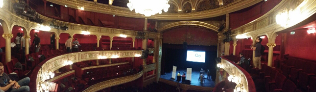

Le 10 octobre était le jour des Gophers d'Europe qui se sont réunis pour la [dotGo 2014](http://dotgo.eu), la première conférence Go d'Europe, et j'y étais !

Nous avons eu quatre séances d'une heure et demi chacune. Le niveau des conférenciers était plutôt impressionnant ; des membres de la Go Team et des acteurs connus de la communauté. Les conférences n'étaient pas très techniques mais il faut dire que les lignes de code passent mal sur des slides, hein Jacques-Antoine. On peut trouver un récapitulatif des interventions à cette adresse : <http://dotgo.sourcegraph.com>.

Le buzzword de cette année était l'**interface**. Les Gophers, il faut utiliser les interfaces ! Elles sont très pratiques en Go car implicites, c'est à dire que si j'ai des trucs qui implémentent la méthode :

```go
func (t Truc) String() string {
    ...
}
```

Je peux déclarer après-coup l'interface :

```go
type Stringer interface {
    func String() string
}
```

Et tous les trucs qui déclarent la methode `String()` sont des `̀Stringers`, et ça, c'est vraiment cool parceque nous n'avons plus besoin d'anticiper, il nous suffit d'observer l'émergence d'interfaces utiles.

Autre supjet brûlant, les **dépendances**. La Team Go elle même semble reconnaître que la gestion actuelle des dépendances n'est pas satisfaisante mais :

- Ils ne sont pas concernés car chez Google ils ont leur propre gestion des dépendances (et ils ne souhaitent à personne de l'utiliser ;o)
- Ils préfèrent attendre qu'une solution fasse l'unanimité dans la communauté avant d'envisager de l'inclure dans la distribution de Go.

Pour finir, j'ai l'impression que les intervenants nous conseillaient tous, à nous autres jeunes Gophers, de commencer par faire comme la communauté Go avant d'envisager d'utiliser notre petit bidule fétiche hérité de notre langage favori.

Une bonne conférence donc qui m'a permis de prendre la température de la communauté Go que j'ai trouvé moins bouillante que la communauté Java des débuts. Mais il faut dire que les temps ont changé : aux débuts de la communauté Java, c'était les prémisses du boom de l'internet et Java en était le langage.

Pour que le Go soit aussi chaud, il faudrait qu'il se trouve un écosystème à sa mesure. Le cloud ?
