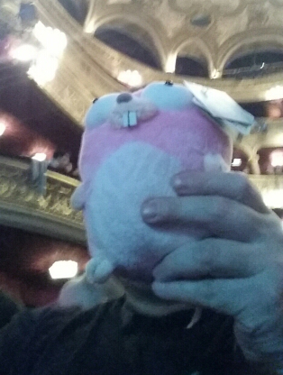

Samedi matin, j'ai participé à un atelier qui faisait suite à la dotGo 2014, animé par Jeremy Saenz sur le thème *Building Web Apps with the CodeGangsta*. La connexion internet était dans les choux et il était donc compliqué de déployer sur Heroku.

Mis à part ces ennuis techniques, l'atelier était intéressant, même si je continue à me demander si l'API du Go n'est pas suffisante pour développer des applis web : il y a tout ce qu'il nous faut, y compris du templating. La seule valeur ajoutée que j'ai vu dans *negroni*, le framework présenté par Jeremy, est la présence de *middlewares*, des fonctions qui peuvent interceptées les requêtes.

On peut ainsi facilement logger, authentifier, intercepter les *panics*, etc... Ces *middlewares* étaient déjà présents dans *Django* et étaient bien utiles. l'avenir nous dira si cette feature est siffisante pour nous décider à utiliser un framework...

