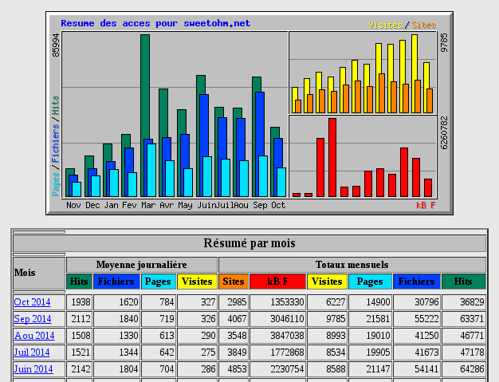

Mon site web (que vous lisez en ce moment même) étant hébergé sur mon Raspberry Pi, je me suis posé la question de la génération de statistiques à propos des fichiers servis par Apache. J'ai commençé par essayer *awstats*, mais ses performances ne permettent pas de l'utiliser dans de bonnes conditions sur un Raspberry Pi.

J'ai donc décidé d'installer *Webalizer* sur mon Raspberry Pi. Voici les étapes à suivre (tous les scripts présentés peuvent être téléchargés [dans cette archive](http://sweetohm.net/arc/webalizer.zip)):

Installer webalizer
-------------------

```sh
sudo apt-get install webalizer
```

Configurer webalizer
--------------------

Corriger le nom des fichiers de log Apache dans la configuration webalizer. Éditer le fichier */etc/webalizer/webamizer.conf* pour corriger la ligne suivante comme suit :

```
LogFile /var/log/apache2/access.log
```

Corriger la configuration webalizer pour la localisation des IPs en changeant comme suit les lignes suivantes (qui ne sont pas consécutives dans le fichier) :

```
GeoIP           yes
GeoIPDatabase   /usr/share/GeoIP/GeoIP.dat
```

Il faut ensuite changer le mode de webalizer en incrémental car les logs d'Apache sont répartis dans plusieurs fichiers du fait de leur rotation.

```
Incremental     yes
```

Pour finir, on peut configurer le nom du site pour lequel on calcule des statistiques :

```
HostName        sweetohm.net
```

Générer les statistiques
------------------------

On peut maintenant lancer la génération de statistiques avec la commande suivante :

```sh
sudo webalizer
```

Cependant, ces statistiques sont générées en ne parsant que le fichier de logs */var/log/apache2/access.log*, comme configuré dans la configuration de webalizer. Pour parser aussi les archives des logs (les fichiers */var/log/apache2/access.log.X.gz*), il faut appeler webalizer en itérant sur ces fichiers. C'est ce que fait le script suivant :

```sh
#!/bin/sh

for file in `ls -tr /var/log/apache2/access.log*`
do
    echo "## $file ###########################################"
    sudo webalizer $file
done
```

Cette opération va remplir le répertoire */var/www/webalizer/* avec les données statistiques de webalizer. Reste à les servir avec Apache.

Configurer Apache
-----------------

On placera la configuration Apache suivante dans le fichier */etc/apache2/sites-available/webalizer* :

```
# Apache configuration file for webalizer. Put this file in directory:
# /etc/apache2/sites-available. To enable this site, type :
# 
#   sudo a2ensite webalizer
# 
# To disable it:
# 
#   sudo a2dissite webalizer

Alias /webalizer/ /var/www/webalizer/
<Directory /var/www/webalizer/>
    Options +Indexes
</Directory>
```

Pour activer le site, taper :

```sh
sudo a2ensite webalizer
```

Pour qu'Apache recharge sa configuration et active le site, on tapera ensuite :

```sh
sudo service apache2 reload
```

Il ne reste plus maintenant qu'à ouvrir l'URL <http://localhost/webalizer/> pour consulter vos statistiques.

Automatisation du calcul
------------------------

Pour terminer, il nous faut automatiser le calcul des statistiques avec *cron*. Pour ce faire, on placera le fichier *webalizer* suivant dans le répertoire */etc/cron.d/* :

```
# /etc/cron.d/pypi_stats
# cron configuration to update webalizer stats

SHELL=/bin/sh
PATH=/sbin:/bin:/usr/sbin:/usr/bin

# update webalizer statistics every quarter
*/15 * * * *    root    webalizer
```

Il peut sembler excessif de mettre à jour les statistiques tous mes quarts d'heure, mais :

- Ce calcul ne prend qu'une seconde sur mon Raspberry Pi !
- Lors de la rotation des logs, on perd les logs qui n'ont pas été parsés par webalizer. 

En effectuant le calcul tous les quarts d'heure et avec une rotation des logs tous les 10 jours environ, on perd en moyenne *0,05 %* des logs, ce qui semble très acceptable.

Si l'on souhaite corriger des statistiques (parceque le cron n'a pas tourné un certain temps ou parce que l'on a changé la configuration), il suffit d'effacer les statistiques (dans le répertoire */var/www/webalizer/*) et de relancer le script shell  de rattrapage décrit ci-dessus.



Enjoy!
