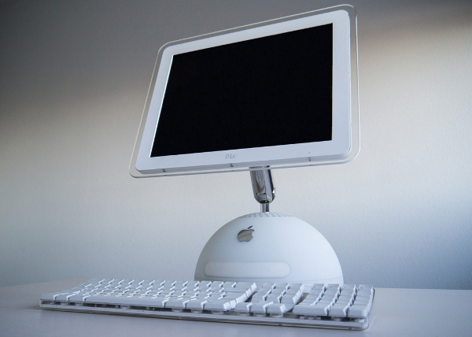
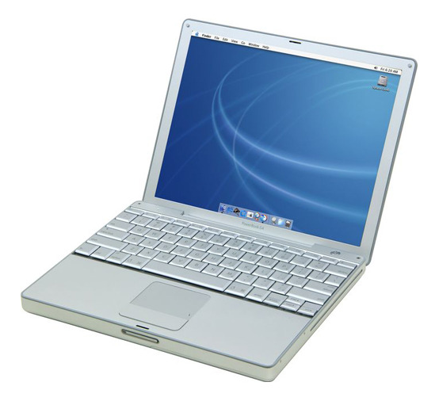

Cela fait maintenant plusieurs mois que je me suis débarrassé de mon dernier produit Apple, un MacBook Pro de 2007. C'est sans regrets, mais avec un peu de nostalgie, que je me souviens de mes années Apple...

Tout a commençé pour moi en décembre 2002, [j'ai acheté un iMac G4 17"](4.html) :

C'était une machine extraordinaire ! Son design était très réussi : une demi-sphère surmontée d'un écran orientable en tous sens (grâce à un lest d'une masse hallucinate dans le pied), d'où sortait le lecteur DVD, comme une langue. L'écran plat de 17" était un luxe inouï pour l'époque et la connexion entre la machine et l'écran était entièrement numérique (une première à l'époque).

Les enceintes étaient d'une qualité incroyable, à des années lumières des enceintes bas de gamme qui équipent la plupart des PCs. Sur le clavier, il y avait deux connecteurs USB, bien pratiques pour brancher une souris ou une clef USB. Le tout était en plastique blanc laiteux et transparent vraiment classe. La qualité du tout était juste impossible à approcher avec un PC, quelqu'en soit le prix.

Niveau logiciel, le système MacOSX est basé sur un micro kernel Mach et des commandes BSD. Sur cette base solide ils ont eu la bonne idée de coller une interface graphique, Quartz, très en avance sur son temps : les fenêtres et tout le bureau sont gérées par la carte 3D. D'autre part, Apple fournissait une suite de logiciels pour faire de cette machine un hub numérique : iPhoto (pour organiser sa photothèque), iTunes (pour gérer sa musique). 

Avec une telle machine de bureau, on voit d'un autre oeil son portable PC moche. J'ai vite craqué pour un 

http://www.maximeraphael.fr/hi-tech/imac-g4-tournesol/
