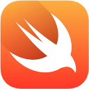

Swift est maintenant Open Source et on peut trouver des binaires pour Linux sur le site [Swift.org](https://swift.org). J'attendais avec impatiente de pouvoir tester une version Linux depuis l'annonce du passage de Swift en Open Source.

<!--more-->

Après avoir parcouru quelques sources glanés ici ou là, j'ai bien l'impression que ce langage se rapproche de mon langage idéal : syntaxe très propre et soucis de simplicité, Les [nouveautés de la version 2](https://developer.apple.com/swift/blog/?id=29) améliorent encore les choses.

La progression de Swift a été foudroyante et cette évolution a marche forcée du langage pourrait laisser penser qu'Apple veut le pousser comme langage de développement pour les applications mobiles. Peut être cela motivera-t-il Google à réellement pousser Go sur Anroïd...

