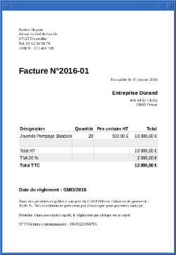

Ayant produit ma première facture, j'ai dû me pencher sur sa réalisation avec Open Office ([depuis que je suis repassé sous Linux](/article/no-apple.html), je ne peux plus [utiliser Numbers](/blog/32.html)). J'ai donc mis à jour [mon modèle de facture](/blog/32.html) pour Open Office.

<!--more-->

Vous pouvez [le télécharger ici](/blog/facture-open-office.zip).

*Enjoy!*
