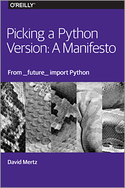

Le fameux éditeur de livres informatiques met à disposition des livres informatiques gratuits. Ce sont en fait plus de courtes études sur des sujets d'actualité. Très bien pour s'intéresser rapidement (dans les transports en commun) sur tout un tas de sujets. Cela se passe à cette adresse : <http://www.oreilly.com/programming/free/>.

<!--more-->

