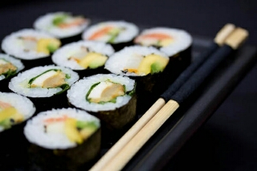

Voici ma recette pour préparer des makis, avec des indications pour les sushis et les California rolls.

<!--more-->

Ingrédients pour 2 personnes :

- 200 g de riz
- 200 ml d'eau
- 1 c. à café de saké
- 4 c. à café de vinaigre de riz
- 4 c. à café de sucre
- 1 c. à café de sel
- 1 feuille de nori
- garniture :
    - concombre
    - surimi
    - avocat
    - mayonnaise
    - selon envies...

Préparation du riz
------------------

Il faut acheter du riz gluant japonais spécial. Ça ne marche pas avec celui de l'oncle Benz !

Laver le riz à l'eau claire jusqu'à ce que l'eau ne soit plus trouble.

Mettre le riz dans le récipient de cuisson avec l'eau et le saké et laisser reposer 30 minutes.

Cuire le riz avec l'autocuiseur ou bien avec une simple casserole :

- Faire chauffer jusqu'à ébullition avec un couvercle.
- Lorsque ça bout, baisser le feu et laisser cuire 10 minutes environ, jusqu'à évaporation de toute l'eau.

Il faut ensuite refroidir le riz. Le mieux est de l'étaler dans un grand plat et de le ventiler avec un éventail.

Sauce du riz
------------

On prépare ensuite la sauce pour le riz :

- Verser le vinaigre de riz dans un bol.
- Y ajouter le sucre et le sel.
- Bien mélanger jusqu'à ce que le sucre et le sel soient totalement dissout.

Verser la sauce sur le riz et bien mélanger. Goûter le riz : s'il est raté, il vaut mieux recommencer. On ne peut faire de bons makis si le riz est raté !

Préparation des makis
---------------------

Pendant que le riz repose 30 minutes, on a le temps de préparer la garniture.

- Couper les feuilles de nori (algue verte) en deux.
- Couper le concombre, les avocats et le surimi est batonets d'un demi centimètre de section.

Lorsque le riz est prêt, on roule les makis :

- Mettre la nate de bambou sur la planche à découper.
- Mettre la feuille de nori dessus.
- Y mettre une mince couche de riz (on a souvent tendance à mettre trop de riz au début).
- Y mettre ensuite la garniture (avocat, concombre, surimi).
- Ajouter la mayonnaise.
- Rouler comme une cigarette.

Mettre les rouleaux préparés sur une assiette et la mettre au frigo 15 minutes.

Découpage des makis
-------------------

Lorsque les rouleaux sont froids, les sortir du frigo. On préparera un récipient avec de l'eau froide pour nettoyer le couteau.

Couper les rouleaux et bien nettoyer le couteau à l'eau froide afin que le riz n'y colle pas trop.

Il est important que le couteau coupe bien, sinon les rouleaux seront écrasés.

Voilà, c'est prêt !

Les sushis
----------

Les sushis sont constitués d'une tranche de poisson cru sur une boulette de riz. Le riz est le même que pour les makis.

Les sushis peuvent paraître plus simples à préparer, mais il n'en est rien :

- Le découpage de la tranche de poisson est délicat : il faut la couper dans le bon sens. Elle ne doit pas être trop épaisse.
- Faire une belle boulette n'est pas facile !

Il vaut mieux donc commencer par les makis.

Les California rolls
--------------------

C'est le même principe que les makis sauf, que de l'intérieur vers l'extérieur, on trouve :

- La garniture
- La feuille de nori
- Des graines de sésame
- Le riz

L'astuce est d'utiliser du film alimentaire étirable autour du riz pour le tenir. On l'enlèvera avant le découpage.

On commence par rouler la garniture dans la feuille de nori. Puis, sur la natte, on pose d'abord la film étirable, puis le riz, puis les graine de sésame et enfin la garniture. Enfin on roule.

C'est plus compliqué que le maki, mais plus simple que le sushi.
