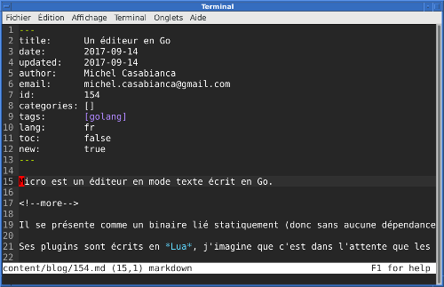

[Micro](https://github.com/zyedidia/micro) est un éditeur en mode texte écrit en Go.

<!--more-->

Il se présente comme un binaire lié statiquement (donc sans aucune dépendance). Il suffit donc de télécharger le binaire, de le lâcher dans un répertoire du *PATH* et le tour est joué.

Ses plugins sont écrits en *Lua*, j'imagine que c'est dans l'attente que les plugins Go soient disponibles sur les autres plateformes que Linux...

Inutile de dire que cette news a été écrite avec µ !

